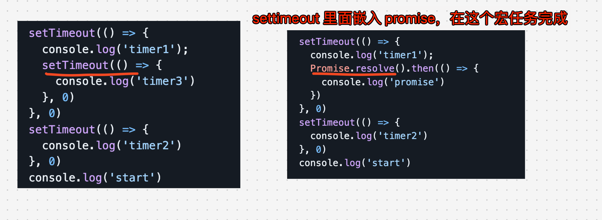

# JavaScript 异步编程


## 目录
<!-- toc -->
 ## 请简述 JavaScript 异步编程 

JavaScript 异步编程是一种处理非阻塞操作的编程方式，允许程序在等待某些操作完成时继续执行其他代码。这对于处理如**网络请求、文件操作**等可能耗时的任务特别重要。以下是 JavaScript 异步编程的主要方法和概念：

1. 回调函数 (Callbacks)
	- 最基本的异步编程方式
	- 将一个函数作为参数传递给另一个函数，在操作完成时调用
	- 容易导致"回调地狱"，使代码难以维护
2. Promise
	- ES6 引入的异步编程解决方案
	- 代表一个异步操作的最终完成或失败
	- 使用 .then() 和 .catch() 方法处理结果和错误
	- 可以链式调用，避免回调地狱
3. Async/Await
	- 基于 Promise 的语法糖，使异步代码更易读
	- async 关键字用于声明异步函数
	- await 关键字用于等待 Promise 解决
	- 使异步代码**看起来像同步代码**
4. 事件循环 (Event Loop)
	- JavaScript 运行时的核心机制
	- 管理异步操作的执行顺序
	- 包括宏任务队列和微任务队列
5. 定时器函数
	- setTimeout() 和 setInterval() 用于延迟执行或定期执行代码
6. 事件监听器
	- 用于响应用户交互或其他事件
7. Fetch API
	- 用于进行网络请求的现代接口
	- 返回 Promise，便于处理响应
8. Web Workers
	- 允许在后台线程中运行脚本，不影响主线程性能

## Promise 专题


### 要点总结

1. `Promise`的状态一经改变就不能再改变
2. `.then`和`.catch`都会返回一个新的`Promise`
3. `catch`不管被连接到哪里，都能捕获上层的错误。
4. 在`Promise`中，返回任意一个非 `promise` 的值都会被包裹成 `promise` 对象，例如`return 2`会被包装为`return Promise.resolve(2)`。
5. `Promise` 的 `.then` 或者 `.catch` 可以被调用多次, 当如果`Promise`内部的状态一经改变，并且有了一个值，那么后续每次调用`.then`或者`.catch`的时候都会直接拿到该值
6. `.then` 或者 `.catch` 中 `return` 一个 `error` 对象并不会抛出错误，所以不会被后续的 `.catch` 捕获 
7. `.then` 或 `.catch` 返回的值不能是 promise 本身，否则会造成死循环
8. `.then` 或者 `.catch` 的参数期望是函数，传入非函数则会发生**值透传**。
9. `.then`方法是能接收两个参数的，第一个是处理成功的函数，第二个是处理失败的函数，再某些时候你可以认为`catch`是`.then`第二个参数的简便写法。
10. `.finally`方法也是返回一个`Promise`，他在`Promise`结束的时候，无论结果为`resolved`还是`rejected`，都会执行里面的回调函数。


### 打印 new Promise 的效果

```javascript
Promise { <fulfilled>: value }   // 注意：不是 Promise { <resolved> } 
Promise { <pending> }
Promise { <rejected>: reason }  
```

### 没有 resolve不会执行 then

```javascript hl:14
const promise = new Promise((resolve, reject) => {
  console.log(1);
  console.log(2);
});
promise.then(() => {
  console.log(3);
});
console.log(4);

//**************************************
// output:
// 1 2 4
//
// 3 不会被输出，因为 Promise里面没有 resolve
//**************************************

```

### 注意 resolve 后会执行 then

```javascript hl:16
const promise1 = new Promise((resolve, reject) => {
  console.log("promise1");
  resolve("resolve1");
});
const promise2 = promise1.then((res) => {
  console.log(res);
});
console.log("1", promise1);
console.log("2", promise2);

//**************************************
// output: 下面序号表示每次打印的顺序
// ① promise1
// ② 1 Promise { <resolved> }  // 因为 promise1 是 resolved 状态
// ③ 2 Promise { <pending> }   // 因为 promise2 是 pending 状态
// ④ resolve1  // 因为 promise1 是 resolved 状态，所以 promise2 的 then 方法会执行
//**************************************

```

###  `setTimeout` 里面嵌入 `Promise` 的场景




打印效果：

``` hl:4
'start'
'timer1'
'timer2'
'timer3'  // 这个还是最后执行，setTimeout 里面嵌入 setTimeout
```

```
'start'
'timer1'
'promise'
'timer2'
```

### `catch`不管被连接到哪里，都能捕获上层的错误，并且`catch()`也会返回一个`Promise`

```javascript
const promise = new Promise((resolve, reject) => {
  reject("error");
  resolve("success2");
});
promise
  .then((res) => {
    console.log("then1: ", res);
  })
  .then((res) => {
    console.log("then2: ", res);
  })
  .catch((err) => {
    console.log("catch: ", err);
  })
  .then((res) => {
    console.log("then3: ", res);
  });

// Output:
// catch:  error
// then3:  undefined
```

###  `return 2` 会被包装成`resolve(2)`

```javascript
Promise.resolve(1)
  .then((res) => {
    console.log(res);
    return 2; // 等价于 resolve(2)
  })
  .catch((err) => {
    return 3;
  })
  .then((res) => {
    console.log(res);
  });

// output: 1 2

```

### resolve 后每个 then 和 catch 能被调用多次

`Promise` 的 `.then` 或者 `.catch` 可以被调用多次，但这里 `Promise` 构造函数只执行一次。或者说 `promise` 内部状态一经改变，并且有了一个值，那么后续每次调用 `.then` 或者 `.catch` 都会直接拿到该值。

```javascript
const promise = new Promise((resolve, reject) => {
  setTimeout(() => {
    console.log("timer");
    resolve("success");
  }, 1000);
});
const start = Date.now();
promise.then((res) => {
  console.log(res, Date.now() - start);
});
promise.then((res) => {
  console.log(res, Date.now() - start);
});

// Output:
// timer
// success 1003
// success 1003 or success 1004

```

### `return new Error('error!!!')` 不走 `reject`

```javascript
Promise.resolve()
  .then(() => {
    return new Error("error!!!");
  })
  .then((res) => {
    console.log("then: ", res);
  })
  .catch((err) => {
    console.log("catch: ", err);
  });

// Output:
// then:  Error: error!!!
```

### 走 catch 的场景

```javascript hl:3,5
Promise.resolve()
  .then(() => {
    return Promise.reject(new Error("error!!!"));
    // or
    throw new Error("error!!!");
  })
  .then((res) => {
    console.log("then: ", res);
  })
  .catch((err) => {
    console.log("catch: ", err);
  });

// Output:
// catch:  Error: error!!!
```


