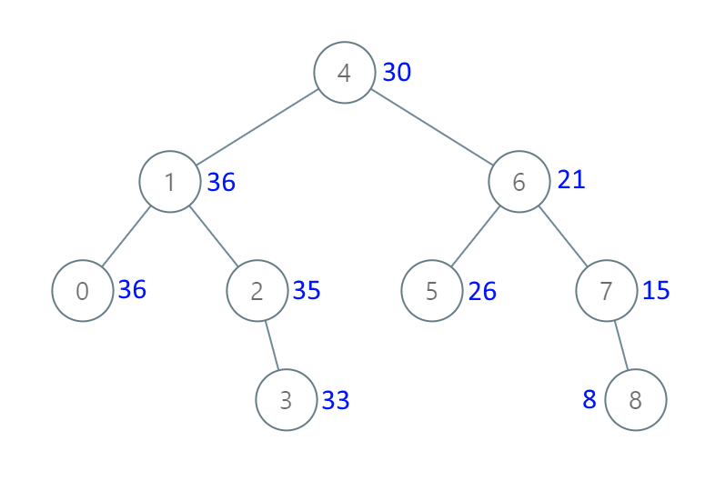
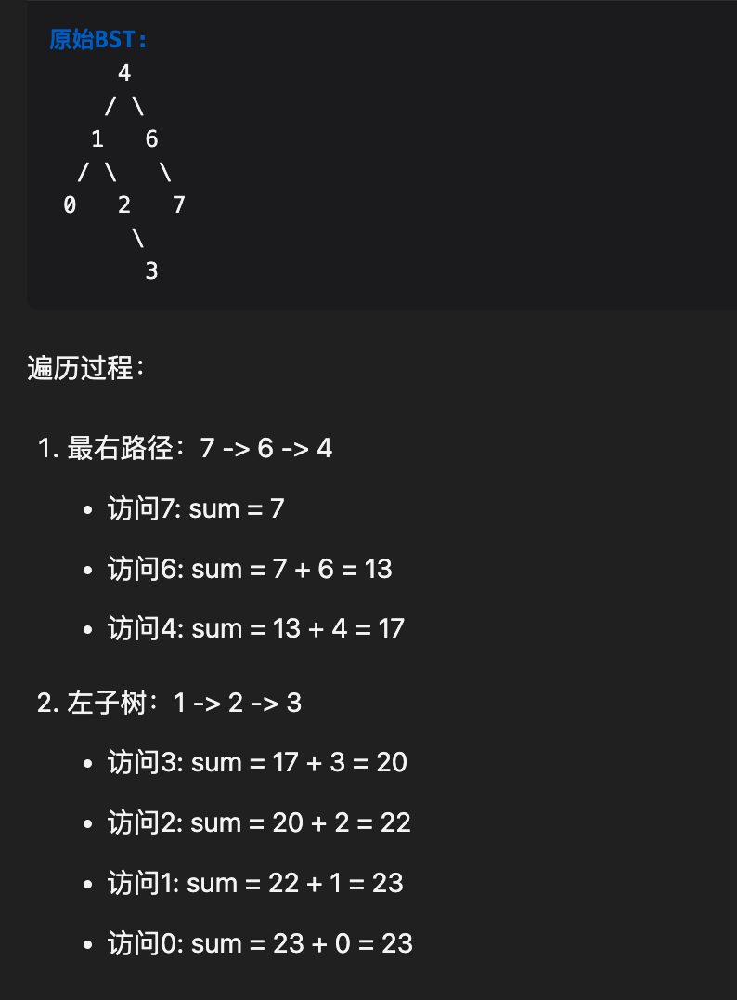

# 从二叉搜索树到更大和树：BST 转化累加树


`#算法/BST` 

> [1038. 从二叉搜索树到更大和树](https://leetcode.cn/problems/binary-search-tree-to-greater-sum-tree/)

>  另外可见 [538. 把二叉搜索树转换为累加树：每个节点变成 `>=` 该节点的所有节点之和](/post/yU28jbZo.html)




## 目录
<!-- toc -->
 ## 思路 

- 思路：
	- 先定义一个变量 `sum = 0`
	- 右 → 左：
		- ==先遍历右节点，再遍历左节点==
	- 为什么不需要 `sum -= root.val;`
		- 每个节点的新值就是要等于所有大于等于它的节点值之和
		- sum 在遍历过程中自然累加了所有较大的值
			- 如下图：
				- 

## 代码

```javascript hl:5
var bstToGst = function (root) {
  let sum = 0;
  function traverse(root) {
    if (!root) return;
    // 先把右节点遍历完
    traverse(root.right);
    sum += root.val;
    root.val = sum;
    traverse(root.left);
  }
  traverse(root);
  return root;
};

```

## 相关题目

[538. 把二叉搜索树转换为累加树：每个节点变成 `>=` 该节点的所有节点之和](/post/yU28jbZo.html)

- 同：[538. 把二叉搜索树转换为累加树](https://leetcode.cn/problems/convert-bst-to-greater-tree/)
