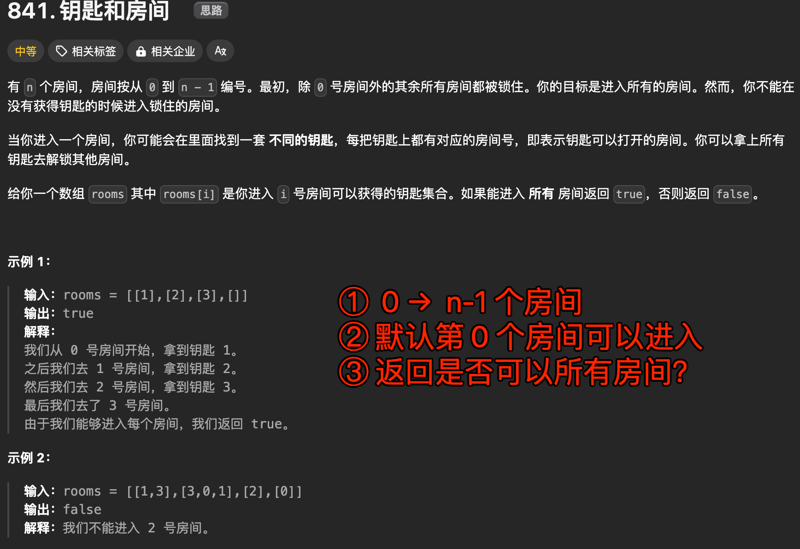

# 钥匙和房间


`#2024/09/11` `#图` `#算法/图` 


## 目录
<!-- toc -->
 ## 1. 题目及题意 

> https://leetcode.cn/problems/keys-and-rooms/description/



## 2. 思路

- 看**示例 1** ，这不就是一个图吗，root 是`房间1` ，然后`房间1` 里的`钥匙`决定了指向哪几个房间
- 题设中的 `rooms` 就是一个**邻接表表示的图**

所以，我们先来看**图的遍历框架**

```javascript
/**
 * @description 图的遍历框架
 * @param {*} rooms 代表房间的二维数组，邻接表
 * @param {*} room  代表当前房间的编号
 * @param {*} visited  代表当前房间是否已经访问过
 * @returns
 */
function dfs(rooms, room, visited) {
  if (visited[room]) {
    return;
  }
  // 前序位置，标记房间已访问
  visited[room] = true;

  for (var nextRoom of rooms[room]) {
    dfs(rooms, nextRoom, visited);
  }
}
```

## 3. 最终代码

```javascript
/**
 * @description 图的遍历框架
 * @param {*} rooms 代表房间的二维数组，邻接表
 * @param {*} room  代表当前房间的编号
 * @param {*} visited  代表当前房间是否已经访问过
 * @returns
 */
function dfs(rooms, room, visited) {
  if (visited[room]) {
    return;
  }
  // 前序位置，标记房间已访问
  visited[room] = true;

  for (var nextRoom of rooms[room]) {
    dfs(rooms, nextRoom, visited);
  }
}

function canVisitAllRooms(rooms) {
  var len = rooms.length;
  // 记录每个房间是否已经访问，使用数组来表示
  var visited = new Array(len).fill(false);
  // 房间号从 0 开始
  var rootNum = 0;
  // 广度优先遍历，遍历完后，visited 中所有的值都应该为 true，否则返回 false
  dfs(rooms, 0, visited);

  for (var v of visited) {
    if (!v) {
      return false;
    }
  }
  return true;
}

```


## 4. 复杂度分析

这个算法使用深度优先搜索（DFS）来判断是否可以访问所有的房间。我们来分析一下它的时间复杂度和空间复杂度。

### 4.1. 时间复杂度

1. **DFS 遍历的复杂度**：
   - 每个房间只会被访问一次，因为在访问一个房间时，都会将其标记为已访问。
   - 对于每个房间，遍历其所有邻接房间（即钥匙所指向的房间）。
   - 因此，遍历的总操作数与房间的总数量 \( n \) 和钥匙的总数量（即边的总数 \( E \)）成正比。

综上所述，时间复杂度为 \( O(n + E) \)，其中 \( n \) 是房间的数量，\( E \) 是钥匙的数量。

### 4.2. 空间复杂度

1. **递归栈空间**：
   - DFS 使用递归实现，递归的深度最坏情况下为房间的数量 \( n \)，因此递归栈的空间复杂度为 \( O(n) \)。
2. **visited 数组**：
   - 需要一个大小为 \( n \) 的数组来记录每个房间是否被访问过，空间复杂度为 \( O(n) \)。

因此，总的空间复杂度为 \( O(n) \)。

### 4.3. 总结

- **时间复杂度**: \( O(n + E) \)
- **空间复杂度**: \( O(n) \)

这个算法在处理稀疏图（即钥匙数量较少）时表现良好，因为时间复杂度主要受房间和钥匙的数量影响。


