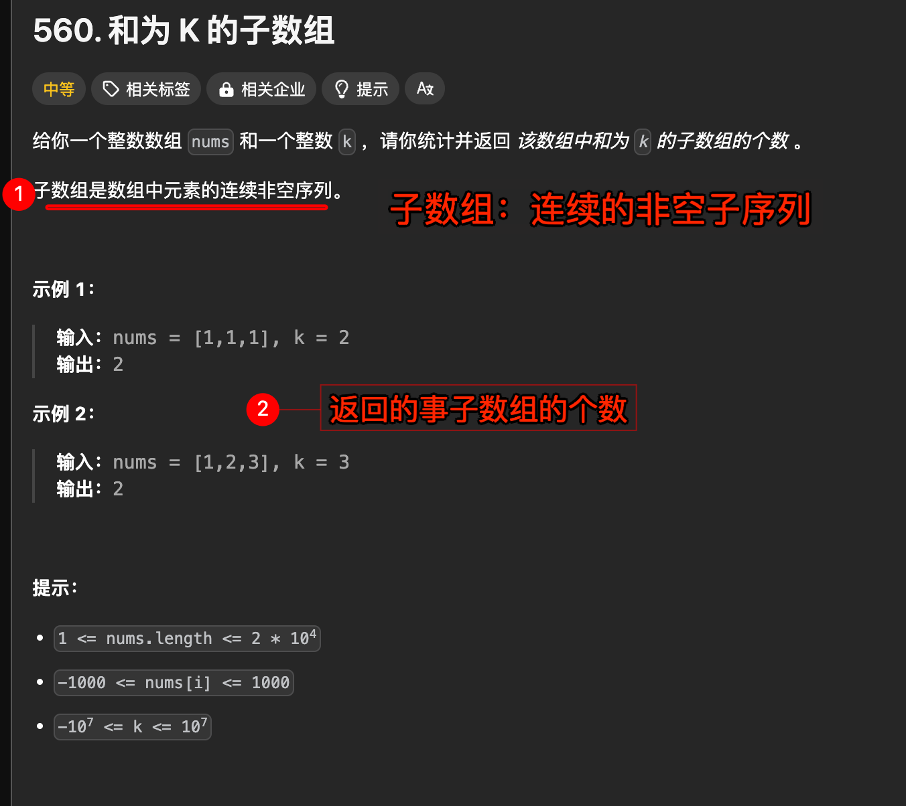

# 和为 K 的子数组


#leetcode   #2024/08/10  #算法/前缀和 

## 题目及理解



> [!danger]
>  **返回的是和位 k 的子数组的个数，而不是某个子数组的元素个数（长度）**

## 解题思路

### 思路一

关键思想：
- 通过**前缀和**，我们将"寻找和为 k 的子数组"转化为"寻找两个前缀和之差为 k"。
- 使用**哈希表**存储前缀和的出现次数，使得我们可以在 O(1) 时间内查找是否存在满足条件的前缀和。

下面是详细介绍：

- 通过**前缀和**，我们将 "**寻找和为 k 的子数组**"  转化为 "**寻找两个前缀和之差为 k**"
	- 即 遍历一遍数组，计算前缀和的时候，随便看看已经遍历生成的前缀和中，是否存在两个前缀和之差为 `k`
- 寻找两个前缀和之差为 k，为了方便查找
	- 使用**哈希**
 
#### 代码实现

```javascript
/**
 * @param {number[]} nums
 * @param {number} k
 * @return {number}
 */
var subarraySum = function (nums, k) {
  // 前缀和,注意前缀和的长度是 nums.length + 1
  // preSum[i] 表示 nums[0] 到 nums[i - 1] 的和
  const preSum = new Array(nums.length + 1).fill(0);
  // 返回值
  let res = 0;
  // countMap 存储每个前缀和出现的次数
  const countMap = new Map();
  // 前缀和 的第一个元素 0 出现了一次
  countMap.set(0, 1);

  // 边遍历，边计算前缀和
  for (let i = 1; i <= nums.length; i++) {
    // 计算前缀和
    preSum[i] = preSum[i - 1] + nums[i - 1];
    
    ////////******** 然后看看：是否存在两个前缀和之差为 k ********
    
    // 如果 preSum[i] - k 在 countMap 中
    // 说明存在 preSum[j] = preSum[i] - k 即 nums[j] 到 nums[i-1] 的和为 k
    const target = preSum[i] - k;
    // 前缀和中有 target
    if (countMap.has(target)) {
      res += countMap.get(target);
    }
    // 更新 countMap
    countMap.set(preSum[i], (countMap.get(preSum[i]) || 0) + 1);
  }

  return res;
};

```

#### 复杂度分析

当然，我很乐意为你分析这个算法的复杂度。

- 时间复杂度：`O(n)`
	- 主循环：
	   - 算法只有一个主循环，遍历整个数组一次。
	   - 循环次数为 n+1（其中 n 是数组 nums 的长度）。
	- 循环内的操作：
	   - 前缀和计算：O(1)
	   - 哈希表查找（countMap.has 和 countMap.get）：平均 O(1)
	   - 哈希表更新（countMap.set）：平均 O(1)
	- 总体：
	   - 由于循环执行 n+1 次，每次循环内的操作都是 O(1)，因此总的时间复杂度是 O(n)。
- 空间复杂度：`O(n)`
	- 前缀和数组 preSum：
	   - 大小为 n+1，占用 O(n) 空间。
	- 哈希表 countMap：
	   - 在最坏情况下，可能需要存储所有不同的前缀和。
	   - 理论上最多可能有 n+1 个不同的前缀和。
	   - 因此，countMap 占用 O(n) 空间。
	- 其他变量（res, target 等）：
	   - 占用常数空间，O(1)。
	- 总体：
	   - 空间复杂度主要由 `preSum 数组` 和 `countMap` 决定，因此为 `O(n)`

## 错误记录

遍历时，需要遍历 `n+1` ，即 `i<=nums.length` ，如下：

```javascript
for (let i = 1; i <= nums.length; i++) {
```

