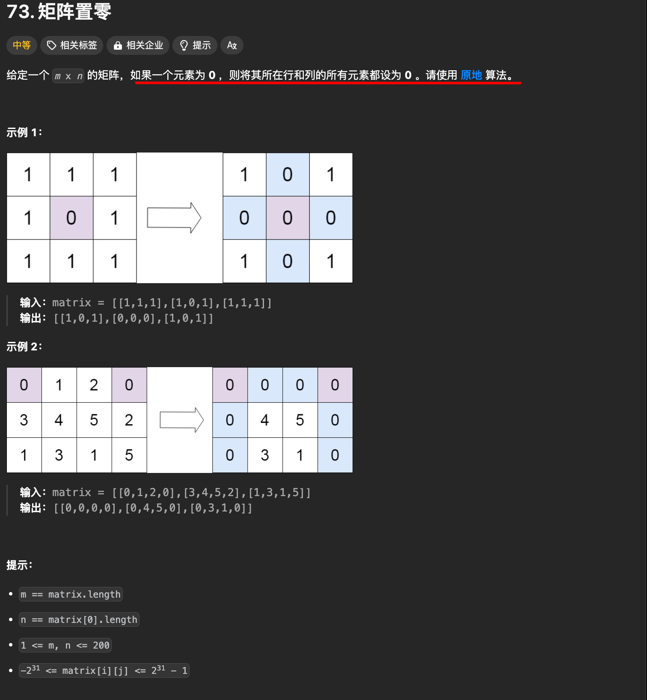

# 矩阵置零


`#leetcode`   `#2024/08/26`  `#算法`  `#算法/矩阵` 


## 目录
<!-- toc -->
 ## 题目及理解 

> 原题： https://leetcode.cn/problems/set-matrix-zeroes/



题意好理解，读一遍就知道了

## 解题思路

使用原矩阵的第一行和第一列来记录是否需要置为 0，具体思路如下：
1. **标记第一行和第一列**
    - 首先检查第一行和第一列是否有零，并用两个布尔变量 `firstRowZero` 和 `firstColZero` 记录下来。
2. **使用第一行和第一列作为标记**
    - 从**第二行**和**第二列**开始遍历矩阵
        - 如果遇到零，就在对应的**第一行**和**第一列**的位置上标记为零
3. **根据标记置零**
    - 再次遍历矩阵（从第二行和第二列开始）
    - 根据第一行和第一列的标记，如果是 0，则将对应的元素置零
4. **处理第一行和第一列**
    - 根据 `firstRowZero` 和 `firstColZero` 的值，决定是否将第一行和第一列置零。

这种方法通过在原矩阵中利用第一行和第一列记录状态，避免了额外的空间消耗，符合题目要求的**原地**修改。

## 代码实现

```javascript
/**  
 * @param {number[][]} matrix  
 * @return {void} Do not return anything, modify matrix in-place instead.  
 */var setZeroes = function(matrix) {  
    const m = matrix.length;  
    const n = matrix[0].length;  
    let firstRowHasZero = false;  
    let firstColHasZero = false;  
    /*************************************************  
     * ::::① 首先检查第一行和第一列是否有零，
     * 并用两个布尔变量`firstRowZero`和`firstColZero`记录下来  
     ************************************************/  
    // 检测第一行是否有 0 ，记得 break    for (let j = 0; j < n; j++) {  
        if (matrix[0][j] === 0) {  
            firstRowHasZero = true;  
            break;  
        }  
    }  
    // 检测第一列是否有 0 ，记得 break    for (let i = 0; i < m; i++) {  
        if (matrix[i][0] === 0) {  
            firstColHasZero = true;  
            break;  
        }  
    }  
    /*************************************************  
     * :::::② 遍历除第一行和第一列以外的所有元素，
     * 如果有零则将对应的第一行和第一列的元素置零  
     ************************************************/  
    for (let i = 1; i < m; i++) {  
        for (let j = 1; j < n; j++) {  
            if (matrix[i][j] === 0) {  
            // 将第一行和第一列作为标志位, 标记该行或该列是否需要清零  
            // 如果 matrix[i][j] === 0, 则将 matrix[i][0] 和 matrix[0][j] 置为 0               // 即将该行和该列的第一个元素置为 0，标记该行和该列需要清零  
                matrix[i][0] = matrix[0][j] = 0;  
            }  
        }  
    }  
    /*************************************************  
     * ::::::③ 根据第一行和第一列的标志位对矩阵的其余元素进行清零  
     ************************************************/  
    // 从第二行第二列开始遍历，如果 matrix[i][0] === 0 或 matrix[0][j] === 0，  
    // 则将 matrix[i][j] 置为 0    
    for (let i = 1; i < m; i++) {  
        for (let j = 1; j < n; j++) {  
            if (matrix[i][0] === 0 || matrix[0][j] === 0) {  
                matrix[i][j] = 0;  
            }  
        }  
    }  
    /*************************************************  
     * ::::::④ 根据第一个元素标记的第一行和第一列是否需要清零  
     ************************************************/  
    // 如果第一行需要清零  
    if (firstRowHasZero) {  
        for (let j = 0; j < n; j++) {  
            matrix[0][j] = 0;  
        }  
    }  
    // 如果第一列需要清零  
    if (firstColHasZero) {  
        for (let i = 0; i < m; i++) {  
            matrix[i][0] = 0;  
        }  
    }  
};
```

## 复杂度分析

- 时间复杂度是 `O(m*n)`，
- 空间复杂度是 `O(1)`，符合题目要求的**原地算法**

## 问题记录

### 使用原矩阵的第一行和第一列来记录状态不会污染原有数据吗？

使用原矩阵的第一行和第一列来记录状态不会污染原有数据，因为：
1. **提前记录状态**：在标记之前，先用两个布尔变量 `firstRowZero` 和 `firstColZero` 记录第一行和第一列是否有零。
2. **从第二行和第二列开始标记**
	- 只从第二行和第二列开始使用标记，避免影响第一行和第一列的原始状态。
	- 虽然标记的是第一行或第一列，但是如果这一行或者这一列已经有 0，那么最终第一行（或列）最终还得是 0
3. **最后处理第一行和第一列**：根据之前记录的布尔变量，最后再决定是否将第一行和第一列置零。

这样可以安全地使用第一行和第一列来存储标记信息，而不影响最终结果。

