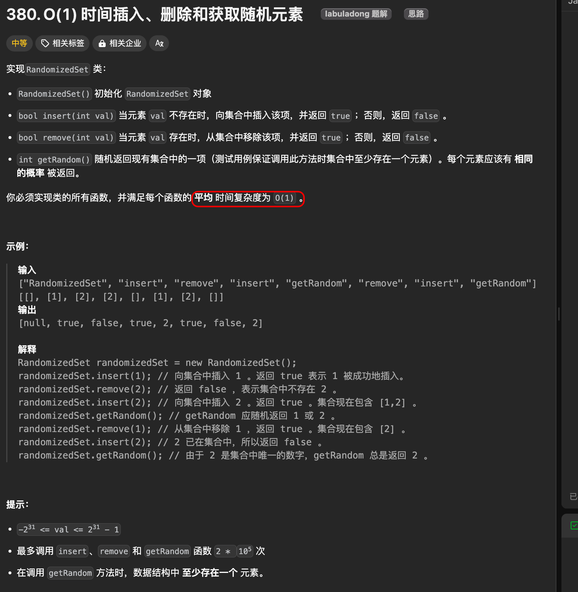
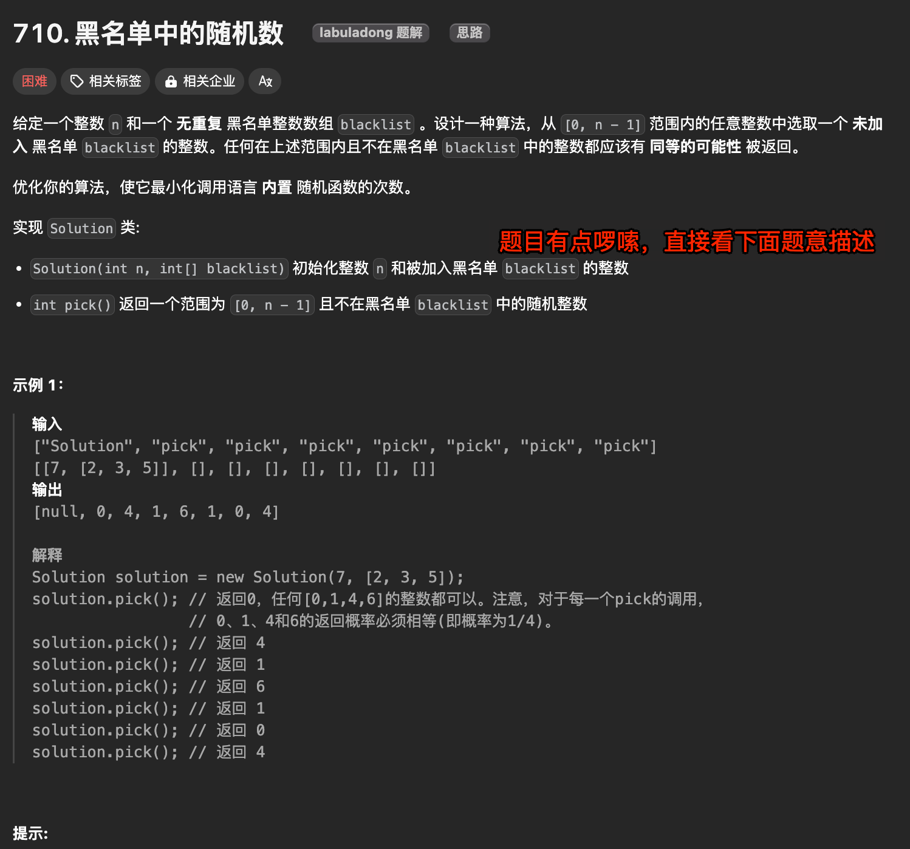
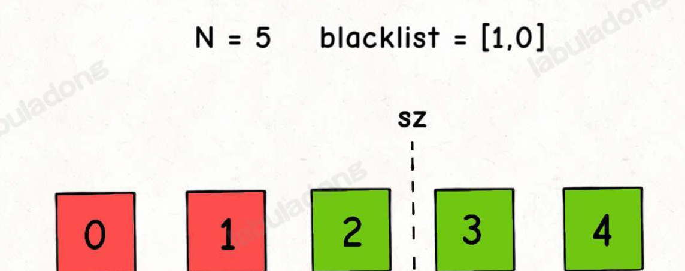
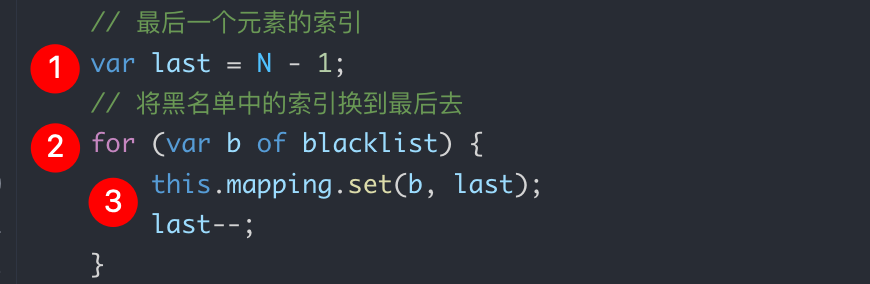
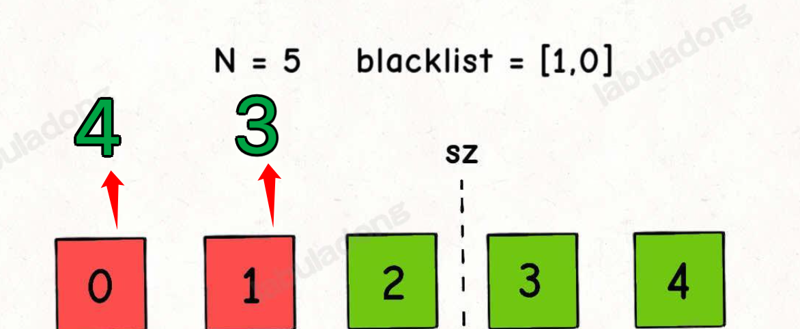
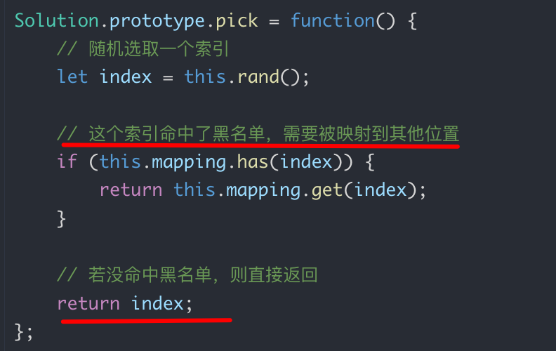
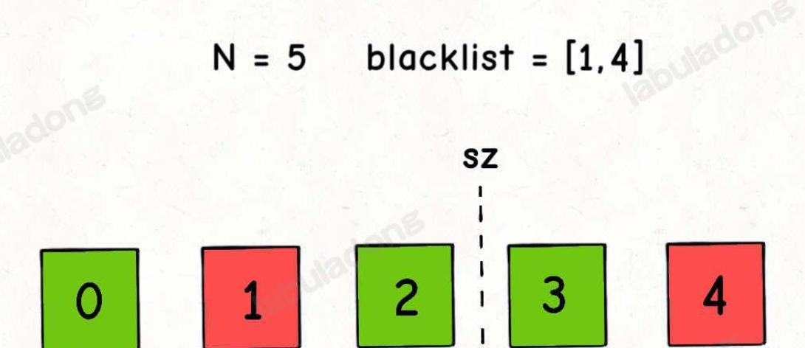
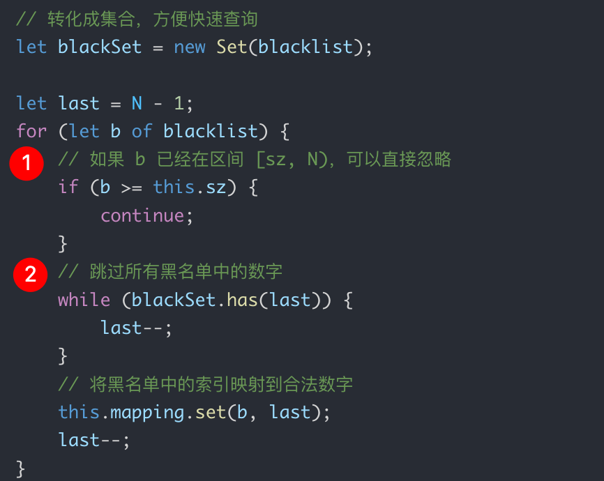
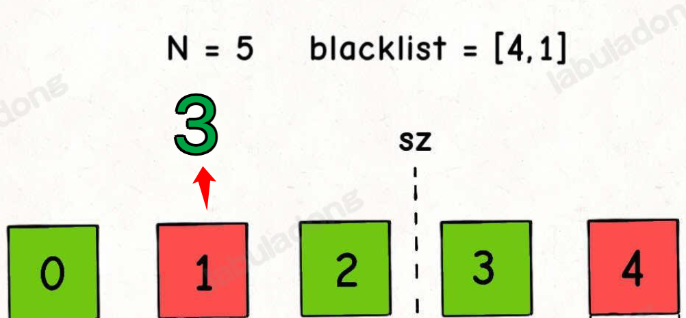

# 常数时间删除、查找数组中的任意元素


`#算法` `#2024/08/19`  `#算法/数组`  `#算法/哈希`  


## 目录
<!-- toc -->
 ## 总结 

如何结合哈希表和数组，使得数组的删除操作时间复杂度也变成 `O(1)` ，

1. 如果想高效地，等概率地随机获取元素，就要使用数组作为底层容器。
2. 如果要保持数组元素的**紧凑性**，可以把待删除元素换到最后，然后 `pop` 掉末尾的元素，这样时间复杂度就是 `O(1)` 了。当然，我们需要**额外的哈希表**记录值到索引的映射。
3. 对于第二题，数组中含有「空洞」（黑名单数字），也可以利用哈希表巧妙处理**哈希映射关系**，让数组在**逻辑上是紧凑的**，方便随机取元素。

下面将从两个 leetcode 示例来说明

## 示例一：O(1) 时间插入、删除和获取随机元素
### 题目

> [https://leetcode.cn/problems/insert-delete-getrandom-o1/description](https://leetcode.cn/problems/insert-delete-getrandom-o1/description)



> 注意：这是一个**集合**

### 分析：两个难点

**1、插入，删除，获取随机元素这三个操作的时间复杂度必须都是 O(1)**。

**2、`getRandom` 方法返回的元素必须等概率返回随机元素**，也就是说，如果集合里面有 `n` 个元素，每个元素被返回的概率必须是 `1/n`。

### 解决思路

如果我们想在 `O(1)` 的时间删除数组中的某一个元素 `val`
- 可以先把这个元素交换到数组的尾部
	- 所需要需要使用哈希表 `valToIndex` 存储每个值对应的索引
- 然后再 `pop` 掉

- ① 定义两个**属性**：
	- 使用数组 `nums` 存储所有元素
	- 使用哈希表 `valToIndex` 存储每个值对应的索引
- ② 定义方法：random 返回 0 - length 之间的随机数
- ③ insert(val)
	- 根据哈希表判断是否存在插入的元素 `val`
		- 存在，直接返回 `false`
		- 不存在
			- `nums.push`
			- 更新 `valToIndex`
			- 返回 `true`
- ④ remove(val)
	- 如果 val 不存在，则返回 false
		- 存在
			- 根据 `valToIndex` 拿到当前元素所在的 `index`
			- 把最后一个元素放到 index
			- nums.pop
			- delete `valToIndex[val]`
			- 返回 true
- ⑤ getRandom()

### 代码

```javascript
var RandomizedSet = function () {
  // 存储所有的元素,使用数组来模拟集合
  this.nums = [];
  // key 是 val，value 是 val 在 nums 数组中的索引
  this.valToIndex = {};

  this.random = function () {
    return Math.floor(Math.random() * this.nums.length);
  };
};

/**
 * @param {number} val
 * @return {boolean}
 */
RandomizedSet.prototype.insert = function (val) {
  // 如果 val 已经存在，则返回 false
  if (this.valToIndex.hasOwnProperty(val)) {
    return false;
  }
  // 否则，将 val 放入 nums 数组中
  this.nums.push(val);
  // 并且更新 valToIndex 对象
  this.valToIndex[val] = this.nums.length - 1;
  return true;
};

/**
 * @param {number} val
 * @return {boolean}
 */
RandomizedSet.prototype.remove = function (val) {
  // 如果 val 不存在，则返回 false
  if (!this.valToIndex.hasOwnProperty(val)) {
    return false;
  }
  // 否则，将 val 从 nums 数组中删除
  // ① 获取 val 在 nums 数组中的索引
  let index = this.valToIndex[val];
  // ② 将 nums 数组中最后一个元素放到 index 位置
  this.nums[index] = this.nums[this.nums.length - 1];
  // ③ 更新 valToIndex 对象
  this.valToIndex[this.nums[index]] = index;
  // ④ 删除 nums 数组中的最后一个元素
  this.nums.pop();
  // ⑤ 再删除 valToIndex 对象中的 val
  delete this.valToIndex[val];
  return true;
};

/**
 * @return {number}
 */
RandomizedSet.prototype.getRandom = function () {
  return this.nums[this.random()];
};

/**
 * Your RandomizedSet object will be instantiated and called as such:
 * var obj = new RandomizedSet()
 * var param_1 = obj.insert(val)
 * var param_2 = obj.remove(val)
 * var param_3 = obj.getRandom()
 */

```

### 注意点

- 手写随机数
- 记得更新 `valToIndex`

## 示例二：[黑名单中的随机数](https://leetcode.cn/problems/random-pick-with-blacklist)

### 题目



### 题意解读

- 给你输入一个正整数 `N`，代表左闭右开区间 `[0,N)`
- 再给你输入一个**黑名单数组** `blacklist`，且 `blacklist` 中的数字都是区间 `[0,N)` 中的数字
- 要求：在区间 `[0,N)` 中「等概率随机」返回一个「不在 `blacklist` 中」的整数

```javascript
// 构造函数，输入参数
var Solution = function(N, blacklist) {
    this.N = N;
    this.blacklist = blacklist;
};

// 在区间 [0,N) 中等概率随机选取一个元素并返回
// 这个元素不能是 blacklist 中的元素
Solution.prototype.pick = function() {

};
```

> [!danger]
> `pick 方法`应该尽量少调用**随机数生成函数**

### 解题思路

- 我们可以将区间 `[0,N)` 看做一个**数组**
- 然后将 `blacklist` 中的元素移到**数组的最末尾**
	- 同时用一个**哈希表 mapping**进行映射，借助哈希表操作来模拟**把黑名单数字移到数组末尾**的效果
		- `key` 为 黑名单中的一个元素
		- `value` 为 黑名单元素在区间 `[0,N)`的索引

#### 场景一：黑名单都在左边

分割线：`sz = N - blanklist.length = 3`





- ① 从尾部开始计数
- ② 遍历黑名单数组
- ③ 两个操作
	- 更新哈希表
		- key 为 黑名单的 item
		- value 为 尾部索引
	- 计数 `last--`

- 最终  mapping ，如下图
	-  0  -> 4
	-  1  -> 3 



所以这时候就相等于从`sz`的左边，取随机值，即 `random( 0, 1,  2)`
- 为 0 时，返回 4 ，不返回 0 ，因为 0 -> 4
- 为 1 时，返回 3 ，不返回 1 ，因为  1 -> 3
- 为 2 时，返回 2 

代码如下：



#### 场景二：黑名单在 `sz` 两边都有



如下代码：



- 上面代码解释如下：
	- ①  如果 `blacklist` 中的黑名单数字本身就存在区间 `[sz, N)` 中，那么就没必要在 `mapping` 中建立映射
		- 比如上图中，`4` 就没必要建立索引
	- ②  在对 `mapping[b]` 赋值时，要保证 `last` 一定不在 `blacklist` 中
		- 比如上面，`4` 在黑名单中，last--，这时候 b 为 1 ，  last 为 3
			- 所有 1 -> 3 



- 最终，如上图，mapping 为
	-  1 ->  3

所以这时候就相等于从`sz`的左边，取随机值，即 `random( 0, 1,  2)`
- 为 0 时，返回 0
- **为 1 时，返回  3** ，不返回 1，因为 1 -> 3
- 为 2 时，返回 2 

### 最终代码

```javascript
/**  
 * @description 黑名单中的随机数  
 * @param {number} n  
 * @param {number[]} blacklist  
 */  
var Solution = function (N, blacklist) {  
    // 最终数组中的元素个数  
    this.sz = N - blacklist.length;  
    // 黑名单中的索引  
    this.blackIndexMap = new Map();  
    // 转化成集合，方便快速查询  
    let blackSet = new Set(blacklist);  
    // 最后一个元素的索引  
    let last = N - 1;  
    // 将黑名单中的索引换到最后去  
    for (let b of blacklist) {  
        // 场景 ①：如果 b 已经在区间 [sz, N) 中，则直接跳过  
        if(b >= this.sz) {  
            continue;  
        }  
        // 跳过所有黑名单中的数字  
        // while (blacklist.includes(last)) {  
        while (blackSet.has(last)) {  
            last--;  
        }  
        this.blackIndexMap.set(b, last);  
        last--;  
    }  
};  
  
// 后文实现  
Solution.prototype.pick = function () {  
    let index = Math.floor(Math.random() * this.sz);  
    // 如果 index 在黑名单中，则返回黑名单中的索引  
    if (this.blackIndexMap.has(index)) {  
        return this.blackIndexMap.get(index);  
    }  
    // 如果 index 不在黑名单中，则直接返回  
    return index;  
};
```

## 参考

- https://labuladong.online/algo/data-structure/random-set/

