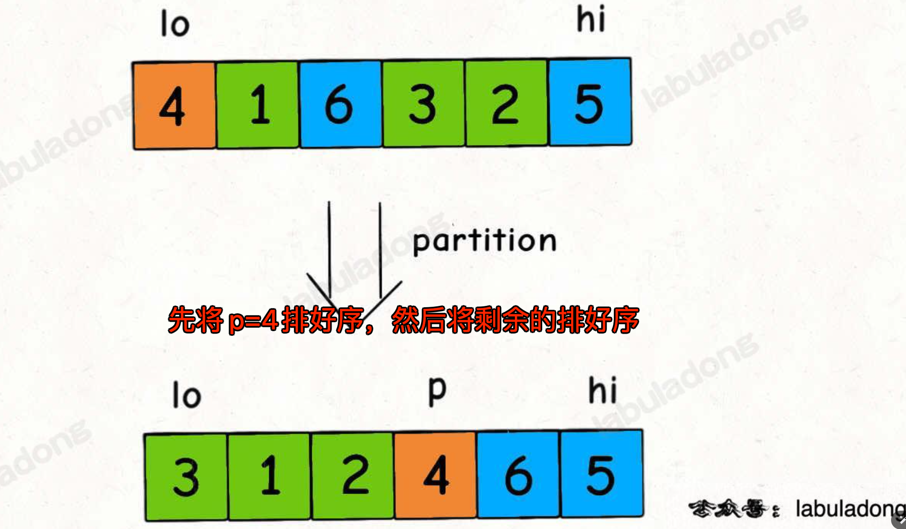
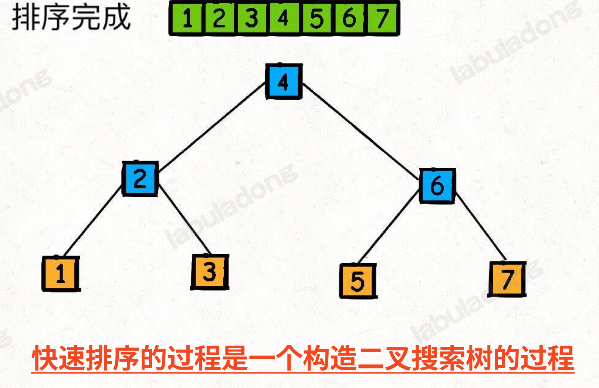
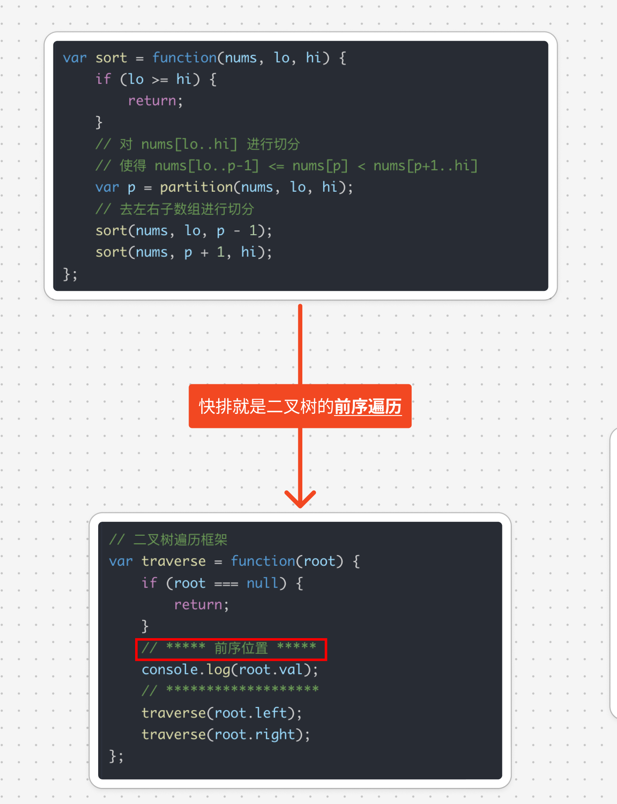

# 快速排序算法的原理及运用

`#算法/快排` `#2024/09/16`  `#算法/排序`

## 目录
<!-- toc -->
 ## 一句话总结快排算法 

快速排序是**先将**一个元素排好序，然后再将**剩下的元素**排好序

## 快排就是构造 BST 的过程

## 快排与二叉树的遍历的关系

## 相关题目

|LeetCode|力扣|难度|
|---|---|---|
|[215. Kth Largest Element in an Array](https://leetcode.com/problems/kth-largest-element-in-an-array/)|[215. 数组中的第K个最大元素](https://leetcode.cn/problems/kth-largest-element-in-an-array/)|🟠|
|[912. Sort an Array](https://leetcode.com/problems/sort-an-array/)|[912. 排序数组](https://leetcode.cn/problems/sort-an-array/)|🟠|
|-|[剑指 Offer II 076. 数组中的第 k 大的数字](https://leetcode.cn/problems/xx4gT2/)|🟠|

## 参考

https://labuladong.online/algo/practice-in-action/quick-sort/