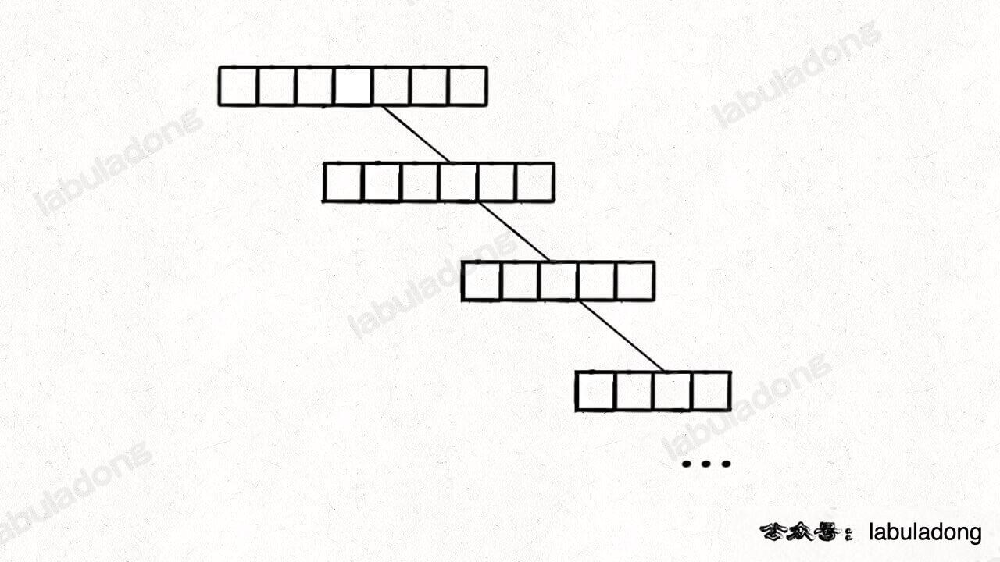
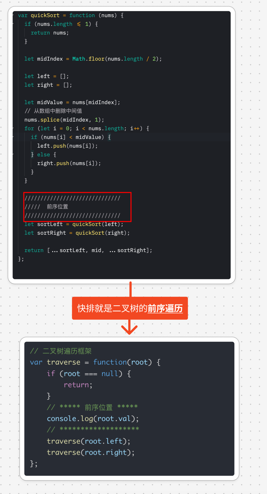

# 快速排序算法的原理及运用

`#算法/快排` `#2024/09/16`  `#算法/排序`


## 目录
<!-- toc -->
 ## 1. 快排算法 
### 1.1. 一句话总结快排算法

快速排序是**先将**一个元素排好序，然后再将**剩下的元素**排好序


> 这就像是在整理一大堆杂乱的物品，我们先选一个标准，把物品分成两堆，然后再分别整理这两堆，如此反复，最终就能得到一个井然有序的结果。
### 1.2. 快排就是构造 BST 的过程


--- 

一种极端场景：你不可能每次都选中了**合适的切分点**吧，比如上图中的 `4` ，所以如果有一边的元素特别少的话，会导致二叉树生长不平衡，如下图：



所以需要**随机性**，两种方法
- 洗牌数组
- 随机选中**切分点**

> 经过随机化的 `partition` 函数很难出现极端情况

### 1.3. 快排与二叉树的遍历的关系



### 1.4. 代码实现一：简单实现

```javascript
var quickSort = function (nums) {
  if (nums.length <= 1) {
    return nums;
  }

  let midIndex = Math.floor(nums.length / 2);

  let left = [];
  let right = [];
  let mid = [];

  let midValue = nums[midIndex];
  // 从数组中删除中间值
  nums.splice(midIndex, 1);
  for (let i = 0; i < nums.length; i++) {
    if (nums[i] < midValue) {
      left.push(nums[i]);
    } else if (nums[i] > midValue) {
      right.push(nums[i]);
    } else {
      mid.push(nums[i]);
    }
  }

  //////////////////////////////
  /////  前序位置
  //////////////////////////////
  let sortLeft = quickSort(left);
  let sortRight = quickSort(right);

  return [...sortLeft, ...mid, ...sortRight];
};

/**
 * @param {number[]} nums
 * @param {number} k
 * @return {number}
 */
var findKthLargest = function (nums, k) {
  let sorted = quickSort(nums);
  return sorted[sorted.length - k];
};

```

#### 1.4.1. 复杂度分析

1. 时间复杂度：
	- 快速排序的平均时间复杂度是 O(n log n)，其中 n 是数组的长度。
	- 最坏情况下（当数组已经排序或者接近排序时），时间复杂度可能退化到 O(n^2)。
	- 最坏情况时间复杂度：O(n^2)
	- 总的平均时间复杂度：O(n log n)
2. 空间复杂度：
   - 快速排序的空间复杂度主要来自**递归调用栈**和创建的新数组。
   - 平均情况下，递归深度为 O(log n)。
   - 每次递归都创建了新的 left、right 和 mid 数组，最坏情况下可能需要 `O(n)` 的额外空间。
   - 总的空间复杂度：O(n log n)
   - 最坏情况空间复杂度：O(n^2)
3. 额外说明：
   - 这个实现使用了额外的数组空间，而**不是原地排序**，这增加了空间复杂度。
   - 对于找第k大元素的问题，其实不需要完全排序数组，可以使用快速选择算法（QuickSelect）来优化，使平均时间复杂度降低到 O(n)。
4. 优化建议：
   - 可以考虑使用原地快速排序来减少空间使用。

### 1.5. 代码实现二：原地排序

> [!danger]
> 说实话，完全写出来还是挺难的，掌握原理就行了，能够写出来成本收益又如何呢？

```javascript
var quickSort = function (nums) {
  // 为了避免出现耗时的极端情况，先随机打乱
  shuffle(nums);
  // 排序整个数组（原地修改）
  sort(nums, 0, nums.length - 1);
};

// 洗牌算法，将输入的数组随机打乱
var shuffle = function (nums) {
  for (let i = nums.length - 1; i > 0; i--) {
    const j = Math.floor(Math.random() * (i + 1));
    // ES6 的解构赋值
    [nums[i], nums[j]] = [nums[j], nums[i]];
  }
};

var sort = function (nums, lo, hi) {
  // 递归的终止条件, lo >= hi 时返回
  if (lo >= hi) {
    return;
  }
  // 对 nums[lo..hi] 进行切分
  // 使得 nums[lo..p-1] <= nums[p] < nums[p+1..hi]
  var p = partition(nums, lo, hi);
  sort(nums, lo, p - 1);
  sort(nums, p + 1, hi);
};

/**
 *@description 对数组 nums 的子区间 [lo, hi] 进行切分操作
 *   从[lo,hi]中x选择 pivot = nums[lo] 作为切分点
 *      将小于 pivot 的元素放在左侧，大于 pivot 的元素放在右侧
 *@param {number[]} nums 待切分的数组
 *@param {number} lo 切分的左边界
 *@param {number} hi 切分的右边界
 *@return {number} 返回 p, 使得 nums[lo..p-1] <= nums[p] < nums[p+1..hi]
 */
var partition = function (nums, lo, hi) {
  var pivot = nums[lo];
  var i = lo + 1, // i 从 lo + 1 开始，逐渐向右逼近
    j = hi; // j 从 hi 开始,逐渐向左逼近
  // 当 i > j 时结束循环，以保证区间 [lo, hi] 都被覆盖
  while (i <= j) {
    while (i < hi && nums[i] <= pivot) {
      i++;
      // 此 while 结束时恰好 nums[i] > pivot
    }
    while (j > lo && nums[j] > pivot) {
      j--;
      // 此 while 结束时恰好 nums[j] <= pivot
    }

    // 这个时候可以自己跳出循环了
    if (i >= j) {
      break;
    }
    // 此时 [lo, i) <= pivot && (j, hi] > pivot
    // 交换 nums[j] 和 nums[i]
    [nums[i], nums[j]] = [nums[j], nums[i]];
    // 此时 [lo, i] <= pivot && [j, hi] > pivot
  }
  // 最后将 pivot 放到合适的位置，即 pivot 左边元素较小，右边元素较大
  [nums[lo], nums[j]] = [nums[j], nums[lo]];

  return j;
};

```

## 2. 快速选择算法

快速选择算法是一种用于**找到数组中第k小（或第k大）元素**的高效算法。它的思想源自于快速排序算法，但通常比完整的排序更快，因为它只需要部分排序数组。

让我们深入了解快速选择算法：

1. 算法概述：
   快速选择的主要思想是使用类似快速排序的分区策略，但只递归地搜索包含第k小元素的那一部分。
2. 算法步骤：
   a. 选择一个基准元素（pivot）
   b. 将数组分区，使得小于基准的元素在左边，大于基准的元素在右边
   c. 根据分区位置和k的关系，决定是返回结果，还是继续在左边或右边递归查找
3. JavaScript 实现：

```javascript
function quickSelect(arr, k) {
    // k应该在1到arr.length之间
    if (k < 1 || k > arr.length) {
        return null;
    }
    return select(arr, 0, arr.length - 1, k);
}

function select(arr, left, right, k) {
    // 如果左右指针相遇，说明找到了第k小的元素
    if (left === right) {
        return arr[left];
    }
    
    // 选择基准并分区
    let pivotIndex = partition(arr, left, right);
    
    // 计算基准的秩（即它是第几小的元素）
    let rank = pivotIndex - left + 1;
    
    if (k === rank) {
        // 如果基准的秩正好是k，那么它就是第k小的元素
        return arr[pivotIndex];
    } else if (k < rank) {
        // 如果k小于rank，在左半部分继续查找
        return select(arr, left, pivotIndex - 1, k);
    } else {
        // 如果k大于rank，在右半部分继续查找
        return select(arr, pivotIndex + 1, right, k - rank);
    }
}

function partition(arr, left, right) {
    let pivot = arr[right]; // 选择最右边的元素作为基准
    let i = left - 1;
    
    for (let j = left; j < right; j++) {
        if (arr[j] <= pivot) {
            i++;
            [arr[i], arr[j]] = [arr[j], arr[i]]; // 交换元素
        }
    }
    
    [arr[i + 1], arr[right]] = [arr[right], arr[i + 1]]; // 将基准放到正确的位置
    return i + 1;
}

// 使用示例
let arr = [3, 2, 1, 5, 6, 4];
console.log(quickSelect(arr, 2)); // 输出：2（第2小的元素）
console.log(quickSelect(arr, 4)); // 输出：4（第4小的元素）
```

4. 算法分析：
   - 时间复杂度：
     * 平均情况：O(n)
     * 最坏情况：O(n²)（但这种情况很少发生，尤其是如果我们随机选择基准）
   - 空间复杂度：O(1)，因为它是原地操作的
5. 优点：
   - 在平均情况下，它比排序整个数组然后选择第k个元素要快得多
   - 它是一个原地算法，不需要额外的空间
   - 对于大型数据集寻找中位数或者其他百分位数非常有效
6. 应用场景：
   - 寻找数组中的中位数
   - 寻找第k大（或第k小）的元素
   - 解决 Top K 问题
   - 在某些数据流算法中用于维护运行时的统计信息
7. 优化：
   - 使用随机选择基准可以进一步改善最坏情况的性能
   - 对于小规模子数组，可以切换到插入排序等简单算法来提高效率

快速选择算法是一个强大而优雅的算法，它展示了如何通过只解决问题的一部分来高效地得到答案。理解和掌握这个算法不仅能帮助解决特定的问题，还能提供一种解决更广泛问题的思路。

## 3. 相关题目

|LeetCode|力扣|难度|
|---|---|---|
|[215. Kth Largest Element in an Array](https://leetcode.com/problems/kth-largest-element-in-an-array/)|[215. 数组中的第K个最大元素](https://leetcode.cn/problems/kth-largest-element-in-an-array/)|🟠|
|[912. Sort an Array](https://leetcode.com/problems/sort-an-array/)|[912. 排序数组](https://leetcode.cn/problems/sort-an-array/)|🟠|
|-|[剑指 Offer II 076. 数组中的第 k 大的数字](https://leetcode.cn/problems/xx4gT2/)|🟠|

## 4. 参考

https://labuladong.online/algo/practice-in-action/quick-sort/