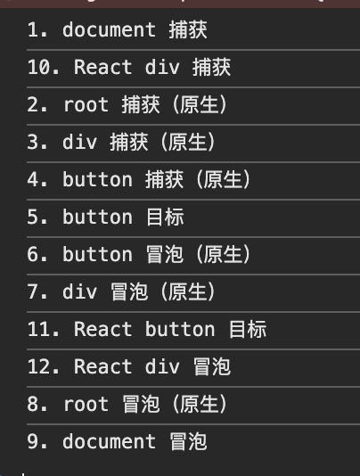
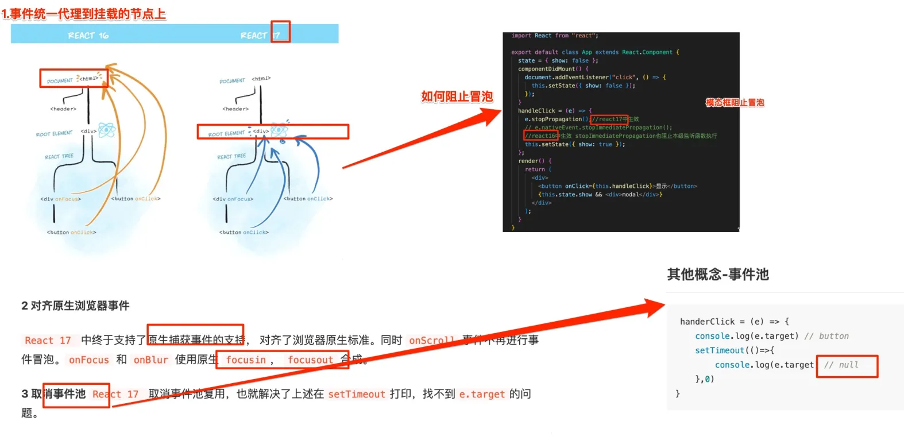
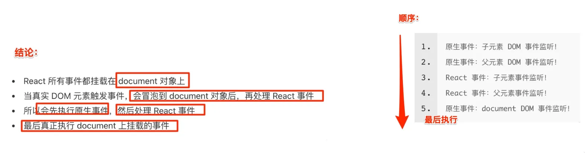

# React 事件系统

`#react` 


## 目录
<!-- toc -->
 ## 1. 总结 

- React 实现了一个==合成事件层== ，将浏览器原生事件统一封装为==合成事件==
- React 利用==事件委托机制==将大多数事件都==委托到 document 节点上==
	- React 17 之后改为 `root 节点`
- React 在内部维护一个==事件对象池==
	- 复用事件对象以减少内存分配和垃圾回收，React 17 完全移除了事件池机制
	- 所以 无需调用 `e.persist()`
- 类组件中使用箭头函数自动绑定 this
	- 否则需要使用 `.bind` 
- 函数组件中使用 `useCallback` 优化事件处理函数
- 使用防抖或节流优化性能，及时清理不需要的事件监听器
- React 事件和原生事件的执行顺序，==比想象中更复杂些，见下面示例==
- 事件命名规范
	- ==原生事件全小写==：`onclick`、`onblur`
	- React 事件采用驼峰：`onClick`、`onBlur`
- 阻止默认行为
	- e.preventDefault()
	- ==不是 不是 return false==
- 阻止事件冒泡
	- ==原生事件==使用 `e.stopPropagation()`
	- ==React 事件==使用 `e.nativeEvent.stopPropagation()`
- 处理文档级事件、自定义事件等特殊场景
- 利用开发环境调试工具检查事件绑定情况，了解事件触发顺序
- 合理使用==事件委托==，缓存事件处理函数以提高性能

## 2. 执行顺序：==重点==

```jsx
function EventOrderExample() {
  useEffect(() => {
    // document 事件
    document.addEventListener('click', () => {
      console.log('1. document 捕获');
    }, true);
    
    document.addEventListener('click', () => {
      console.log('9. document 冒泡');
    });

    // root 容器事件
    const root = document.getElementById('root');
    root.addEventListener('click', () => {
      console.log('2. root 捕获（原生）');
    }, true);
    
    root.addEventListener('click', () => {
      console.log('8. root 冒泡（原生）');
    });

    // div 元素事件
    const div = document.querySelector('.container');
    div.addEventListener('click', () => {
      console.log('3. div 捕获（原生）');
    }, true);
    
    div.addEventListener('click', () => {
      console.log('7. div 冒泡（原生）');
    });

    // button 元素事件
    const button = document.querySelector('button');
    button.addEventListener('click', () => {
      console.log('4. button 捕获（原生）');
    }, true);
    
    button.addEventListener('click', () => {
      console.log('5. button 目标');
    });
    
    button.addEventListener('click', () => {
      console.log('6. button 冒泡（原生）');
    });

    // 清理函数
    return () => {
      // ... 清理所有事件监听
    };
  }, []);

  // React 事件处理
  const handleDivCapture = () => {
    console.log('10. React div 捕获');
  };

  const handleButtonClick = () => {
    console.log('11. React button 目标');
  };

  const handleDivBubble = () => {
    console.log('12. React div 冒泡');
  };

  return (
    <div 
      className="container" 
      onClick={handleDivBubble} 
      onClickCapture={handleDivCapture}
    >
      <button onClick={handleButtonClick}>
        点击测试事件顺序
      </button>
    </div>
  );
}
```

> [!danger]
> ==和自己想象中的顺序不一样==




## 3. React 事件系统的设计理念

### 3.1. 合成事件（SyntheticEvent）

- React 实现了一个合成事件层，将浏览器原生事件统一封装为`合成事件`
- 抹平差异，确保事件在不同浏览器中的行为一致
- 优化性能，通过`事件委托`和`对象池`来管理事件对象

### 3.2. 事件委托（Event Delegation）

- React 将大多数事件都委托到 document 节点上（在 React 17 之后改为 root 节点）
	- React 17 之前，事件都委托到 `document` 上
	- React 17 之后，事件委托到 `root 元素`上
- 减少内存消耗，提高性能
- 动态绑定，支持组件动态加载



## 4. 事件系统实现原理

### 4.1. 事件注册

渲染后的真实`DOM`绑定的事件函数都被换成了`空函数`

```jsx
// React 事件注册
<button onClick={handleClick}>
  Click me
</button>

// 实际转换为
document.addEventListener('click', dispatchEvent, false);
```

```javascript hl:18,6,4
// 类组件中的事件处理
class Component extends React.Component {
  handleClick = (e) => {
    // e 是合成事件对象
    e.preventDefault();
    // 阻止事件冒泡
    e.stopPropagation();
  }
  
  render() {
    return <button onClick={this.handleClick}>Click</button>
  }
}

// 函数组件中的事件处理
function Component() {
  const handleClick = (e) => {
    // 访问原生事件
    console.log(e.nativeEvent); 
  }
  
  return <button onClick={handleClick}>Click</button>
}

```

### 4.2. 事件池

### 4.3. React 16 及之前版本

核心思想是：**React 会在内部维护一个事件对象池，当事件被触发时，React 会从池子中复用事件对象，而不是每次都创建新的事件对象**。在事件处理完成后，这个事件对象会被清空并放回池子中供下次使用。

```jsx
// 问题示例
class Component extends React.Component {
  handleChange = (e) => {
    // ❌ 错误的使用方式
    setTimeout(() => {
      console.log(e.target.value); // 无法访问，因为事件对象已被清空
    }, 0);
    
    // ✅ 正确的使用方式 - 方法1：调用 persist()
    e.persist();
    setTimeout(() => {
      console.log(e.target.value); // 现在可以正常访问了
    }, 0);
    
    // ✅ 正确的使用方式 - 方法2：提前保存需要的值
    const value = e.target.value;
    setTimeout(() => {
      console.log(value);
    }, 0);
  }

  render() {
    return <input onChange={this.handleChange} />;
  }
}

```

#### 4.3.1. React 17

React 17 **完全移除了事件池机制**，原因是：
- 现代浏览器性能提升，`对象创建的开销`不再是主要问题
- 事件池机制经常导致困惑和 bug
- 代码维护性提升更重要

```javascript hl:4
// React 17+ 的事件处理
function Component() {
  const handleClick = (e) => {
    // 无需调用 e.persist()
    setTimeout(() => {
      console.log(e.type); // 正常工作
      console.log(e.target); // 正常工作
    }, 0);
  };
  return <button onClick={handleClick}>Click</button>;
}
```

#### 4.3.2. 总结

- 事件池是 React 16 及之前版本的一个性能优化机制
- 它通过复用事件对象来减少内存分配和垃圾回收
- 在 React 17 中被完全移除，使得事件处理更直观和可预测
	- 移除事件池后，不再需要调用 `e.persist()`
- 虽然没有了事件池，但在处理大量事件时仍需注意性能优化

## 5. 常用的事件处理方式

### 5.1. 类组件中的事件处理

```jsx hl:3
class MyComponent extends React.Component {
    handleClick = (e) => {
        // 使用箭头函数自动绑定this
        this.setState({ clicked: true });
    }
    render() {
        return <button onClick={this.handleClick}>Click</button>;
    }
}
```

### 5.2. 函数组件中的事件处理

```jsx
function MyComponent() {
    const handleClick = useCallback((e) => {
        // 使用 useCallback 优化性能
        console.log('clicked');
    }, []);

    return <button onClick={handleClick}>Click</button>;
}
```

## 6. 事件处理最佳实践

### 6.1. 性能优化

```jsx
// 使用防抖或节流
import { debounce } from 'lodash';

function SearchComponent() {
    const handleSearch = debounce((value) => {
        // 执行搜索
    }, 300);

    return <input onChange={(e) => handleSearch(e.target.value)} />;
}
```

### 6.2. 事件解绑

```jsx
function Component() {
    useEffect(() => {
        const handleScroll = () => {
            console.log('scrolling');
        };
        window.addEventListener('scroll', handleScroll);
        
        // 清理函数
        return () => {
            window.removeEventListener('scroll', handleScroll);
        };
    }, []);
}
```

## 7. 注意事项和常见问题

### 7.1. React事件和原生事件执行顺序



### 7.2. 事件命名

- React 事件采用驼峰命名（onClick, onSubmit）
- 原生事件全小写（onclick, onsubmit）

### 7.3. 阻止默认行为

```jsx hl:3
// React中阻止默认行为
function handleSubmit(e) {
    e.preventDefault(); // 使用合成事件对象的方法
    // 而不是 return false
}
```

### 7.4. 事件传参

```jsx
// 推荐方式
<button onClick={(e) => handleClick(id, e)}>Click</button>

// 或使用 bind
<button onClick={handleClick.bind(this, id)}>Click</button>
```

## 8. 特殊场景处理

### 8.1. 处理文档级事件

```jsx
useEffect(() => {
    const handleClickOutside = (event) => {
        if (ref.current && !ref.current.contains(event.target)) {
            onClickOutside();
        }
    };

    document.addEventListener('mousedown', handleClickOutside);
    return () => {
        document.removeEventListener('mousedown', handleClickOutside);
    };
}, [onClickOutside]);
```

### 8.2. 自定义事件

```jsx
const customEvent = new CustomEvent('myEvent', {
    detail: { data: 'some data' }
});
element.dispatchEvent(customEvent);
```

## 9. 调试技巧

### 9.1. 事件监听器检查

```jsx
// 开发环境下检查事件绑定
useEffect(() => {
    console.log('Event listeners:', getEventListeners(document));
}, []);
```

### 9.2. 事件触发顺序

```jsx
<div onClick={() => console.log('div')}> // 第三个触发
    <span onClick={() => console.log('span')}> // 第二个触发
        <button onClick={() => console.log('button')}>Click</button> // 第一个触发
    </span>
</div>
```

## 10. 性能考虑

- 使用 useCallback 缓存事件处理函数
- 避免在渲染方法中==创建新的函数==
- 合理使用事件委托
- 及时清理不需要的事件监听器
