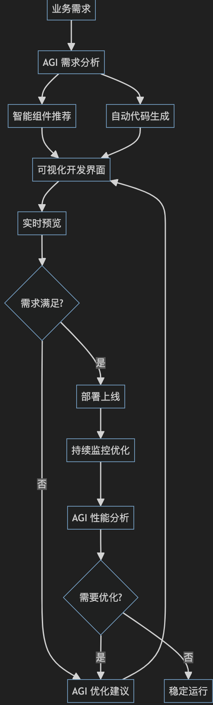

# 前端工程师在 AI 时代的机会与挑战

## 目录
<!-- toc -->
 ## 1. 新的机会 

### 1.1. AI 辅助开发

- 积极 拥抱 AI 工具，提升个人开发效率
	- Code Copilot
	- Code Agent

### 1.2. 新的技术方向

前端关注 AI 工具开发，后面互联网的所有生态系统都会经历AI 的改造，那么前端也会有相应的改造，比如AGI 驱动的低代码

## 2. 面临的挑战

### 2.1. 技术挑战

- 持续学习
	- AI 相关知识
	- 关注新框架和新工具的 AI 部分能力
	- 最佳AI 实践方法
- 工作方式转变
	- 善用 AI ，让 AI 协作开发

### 2.2. 职业挑战

- 角色转变
	- 从编码到架构
	- 更注重业务理解
	- AI 工具专家
	- 跨领域整合
- 竞争加剧
	- 入门门槛降低
	- 效率要求提高
	- 专业度要求提升
	- 创新能力要求

## 3. 核心建议

- 拥抱 AI 工具，提升开发效率
- 培养跨领域整合能力

## 4. 风险防范

- 不过度依赖 AI 工具

