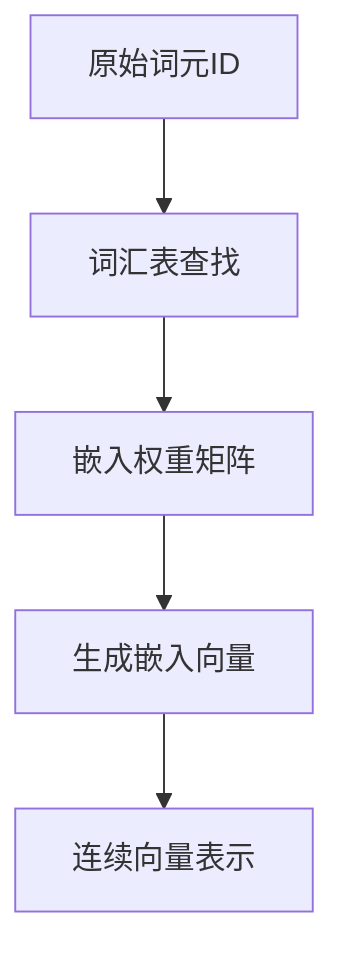

# 创建词元嵌入：将离散词元转换为连续向量表示

`#2026/01/01` `#ai` 


## 目录
<!-- toc -->
 ## 1. 词元嵌入的本质 

词元嵌入是将`离散的词元ID`映射到连续向量空间的过程，是大语言模型处理文本数据的关键技术。

本质上是将每个词元转换为一个高维向量，使神经网络能够处理和学习文本数据

## 2. 流程图：词元嵌入的转换过程



## 3. 关键概念解析

- **词元 ID**：
	- 每个唯一词元的整数标识
	- 每个 `词元` 的 `身份证号`
- **嵌入向量**：
	- 将`词元 ID` 映射到的`连续向量`
		- 这个`词元` 对应的`不同维度的值`
- **嵌入维度**：
	- 向量的长度，通常在256-12288之间
		- 每个`item`代表一个维度
- **嵌入层**：
	- 执行词元ID到向量的映射转换

## 4. 代码实现

### 4.1 导入与配置

```python
import torch  

# 1. 定义词元嵌入的关键参数  
vocab_size = 50257  # GPT-2词汇表大小  
embedding_dim = 256  # 嵌入向量维度  

# 2. 创建嵌入层  
# torch.nn.Embedding(词汇表大小, 嵌入向量维度)  
token_embedding_layer = torch.nn.Embedding(vocab_size, embedding_dim)  

# 3. 设置随机种子，确保结果可复现  
torch.manual_seed(123)  
```

### 4.2 查看嵌入权重矩阵

```python
# 打印嵌入权重矩阵的基本信息  
print("嵌入权重矩阵形状:", token_embedding_layer.weight.shape)  
print("\n嵌入权重矩阵的前5行:")  
print(token_embedding_layer.weight[:5])  
```

#### 代码执行结果

```bash
嵌入权重矩阵形状: torch.Size([50257, 256])  

嵌入权重矩阵的前5行:  
tensor([[ 0.0194, -0.0271,  0.0097, ..., -0.0465, -0.0063,  0.0243],  
        [ 0.0076,  0.0139, -0.0046, ..., -0.0131, -0.0457,  0.0261],  
        [ 0.0354, -0.0343, -0.0033, ..., -0.0145, -0.0098,  0.0197],  
        [ 0.0149, -0.0256, -0.0138, ..., -0.0234, -0.0353,  0.0359],  
        [ 0.0229, -0.0437, -0.0427, ..., -0.0286, -0.0147, -0.0131]],  
       requires_grad=True)  
```

### 4.3 词元ID转换为嵌入向量

```python
# 假设我们有一批词元ID  
input_ids = torch.tensor([2, 3, 5, 1])  

# 将词元ID转换为嵌入向量  
token_embeddings = token_embedding_layer(input_ids)  

print("\n词元ID:", input_ids)  
print("\n对应的嵌入向量形状:", token_embeddings.shape)  
print("\n嵌入向量:\n", token_embeddings)  
```

#### 代码执行结果

```bash
词元ID: tensor([2, 3, 5, 1])  

对应的嵌入向量形状: torch.Size([4, 256])  

嵌入向量:  
 tensor([[ 0.0354, -0.0343, -0.0033, ..., -0.0145, -0.0098,  0.0197],  
         [ 0.0149, -0.0256, -0.0138, ..., -0.0234, -0.0353,  0.0359],  
         [ 0.0229, -0.0437, -0.0427, ..., -0.0286, -0.0147, -0.0131],  
         [ 0.0076,  0.0139, -0.0046, ..., -0.0131, -0.0457,  0.0261]],  
        grad_fn=<EmbeddingBackward0>)  
```

## 5. 高级应用：位置嵌入

```python
# 创建位置嵌入层  
context_length = 4  
pos_embedding_layer = torch.nn.Embedding(context_length, embedding_dim)  

# 生成位置索引  
pos_indices = torch.arange(context_length)  
pos_embeddings = pos_embedding_layer(pos_indices)  

# 将词元嵌入和位置嵌入相加  
input_embeddings = token_embeddings + pos_embeddings  

print("\n最终输入嵌入形状:", input_embeddings.shape)  
```

## 6. 关键特点总结

1. `每个词元ID`映射到一个256维的向量
2. `权重矩阵`可以通过`反向传播进行训练`
3. 提供了一种高效的查找和表示方法
4. 可以与位置嵌入结合，提供更丰富的语义信息

## 7. 实践建议

- `嵌入维度`是一个重要的超参数，需要根据具体任务和计算资源进行调整
- 实际训练中，嵌入层是模型的重要组成部分，可以通过预训练进行优化
- 可以考虑使用预训练的词嵌入作为初始化，或者从头开始训练

## 结语

词元嵌入是大语言模型中将离散词元转换为连续向量表示的关键技术，它为神经网络提供了可学习的输入表示，并帮助模型捕捉词元之间的语义关系。
