# 好文：阿里低代码引擎和生态建设实战及思考

`#lowcode` 

> 参考: [阿里低代码引擎和生态建设实战及思考](https://mp.weixin.qq.com/s/MI6MrUKKydtnSdO4xq6jwA)


## 目录
<!-- toc -->
 ## 1. 一个梗 

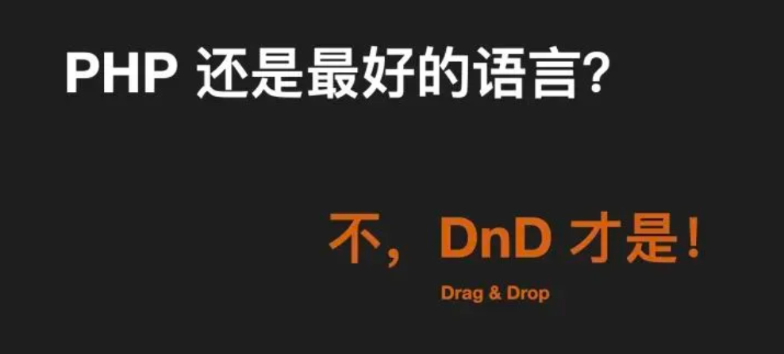

> 这就是为什么咨询公司喜欢低代码了，降本增效嘛

## 2. 低代码体系的架构设计思考

### 2.1. 为什么我们需要低代码？

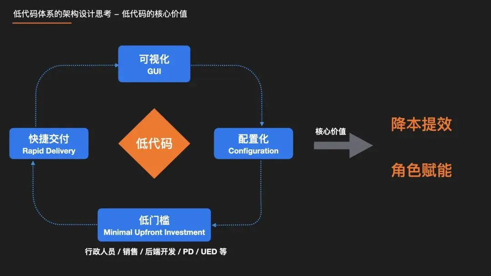

**通过可视化界面来配置完成传统的应用程序开发 & 交付过程**
- 让办公室行政人员、营销人员等**非技术人员**轻松完成「研发」工作
- 让**开发人员**更快地研发。

低代码的**核心价值是**
- 「降本提效」
- 「角色赋能」

### 2.2. 现状：烟囱架构 → 各个平台的共性？

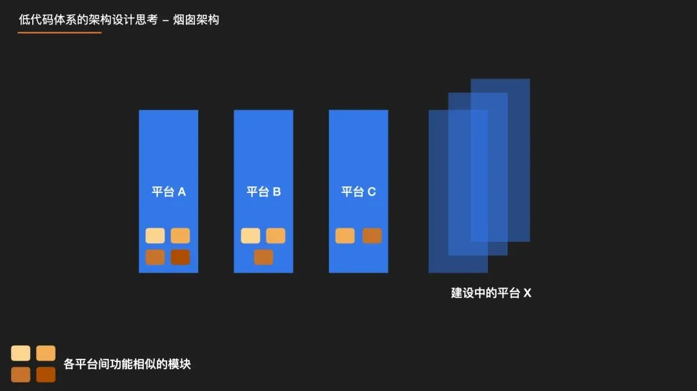

现状就是：
- 不同的技术栈
- 不同的业务场景
	- toB、toC、企业智能、数据类产品等等

> 注意上图的颜色

### 2.3. 如何找到平台的共同点？以及支撑平台差异点？ 

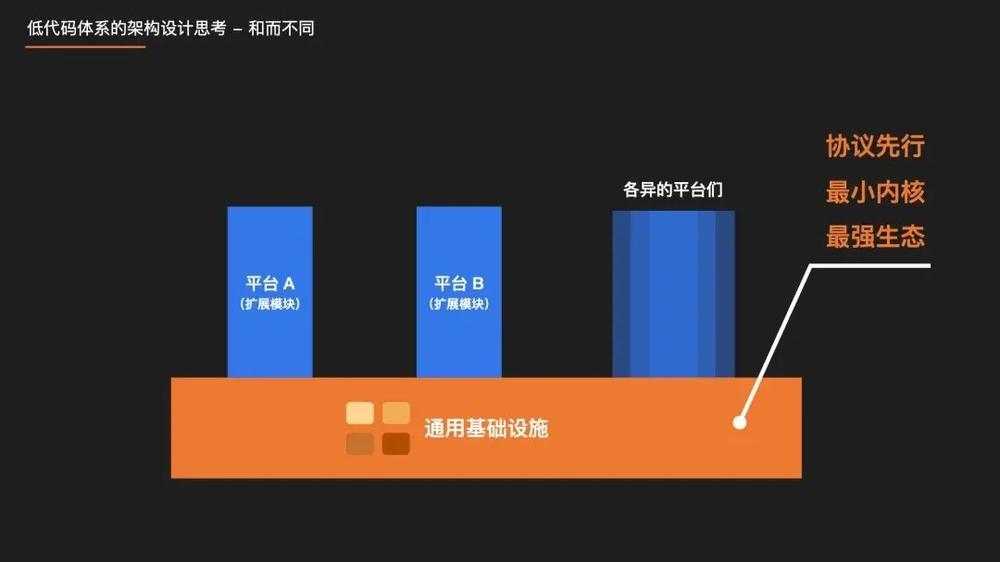

### 2.4. 分层架构：协议 → 引擎 → 生态 → 平台

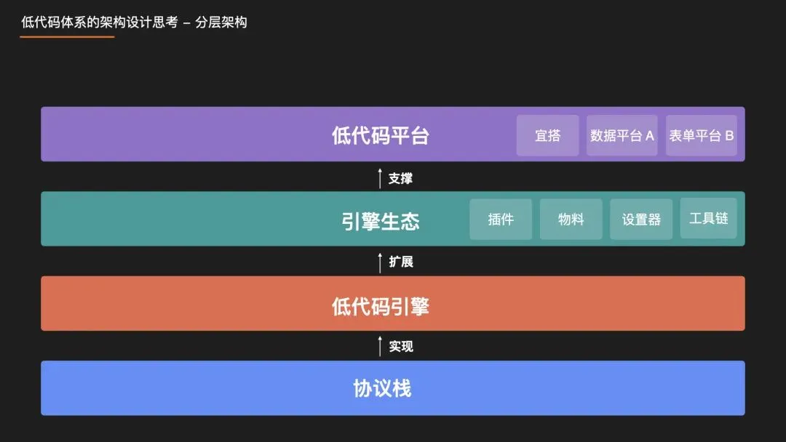

- 底层协议栈：
	- 定义的是标准，**标准的统一让上层产物的互通成为可能**
- 引擎
	- 是**对协议的实现**，同时通过能力的输出，向上支撑生态开放体系，提供各种生态扩展能力
- 生态
	- 是基于引擎核心能力上扩展出来的，比如 物料、设置器、插件等，还有工具链支撑开发体系
- 低代码平台
	- 各个平台基于引擎内核以及生态中的**产品组合**、衔接形成满足其需求的低代码平台。

- 每一层都明确自身的定位，各司其职
	- 协议不会去思考引擎如何实现
	- 引擎也不会实现具体上层平台功能
	- 上层平台的定制化均通过==插件==来实现

下面分开展开这四层：

## 3. 底层：协议栈

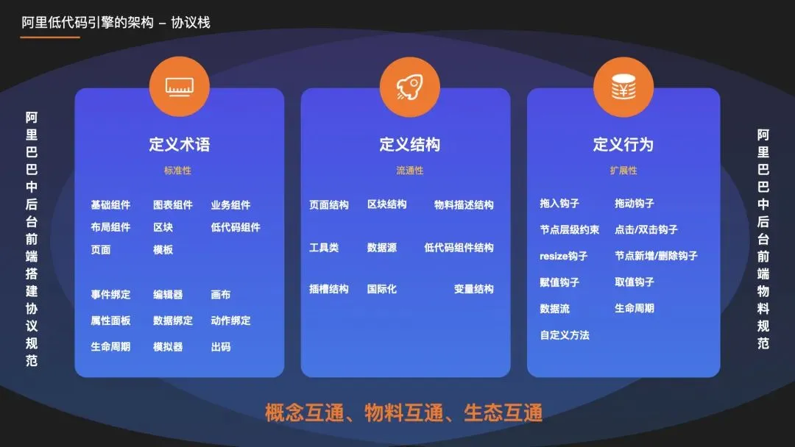

- 术语：
	- 我们沟通的基础，概念相通，方便高效沟通
- 结构：
	- 包括**页面或者应用**描述的结构，如何定义**页面组件树、数据源、生命周期、页面状态**等
- 行为
	- 不同的业务场景，我们对物料的配置、约束、扩展各不相同
	- 所以我们在物料描述中有各种各样的钩子来支持自定制

> 更多可参考《阿里巴巴中后台前端搭建协议规范》和《阿里巴巴中后台前端物料规范》

## 4. 低代码引擎

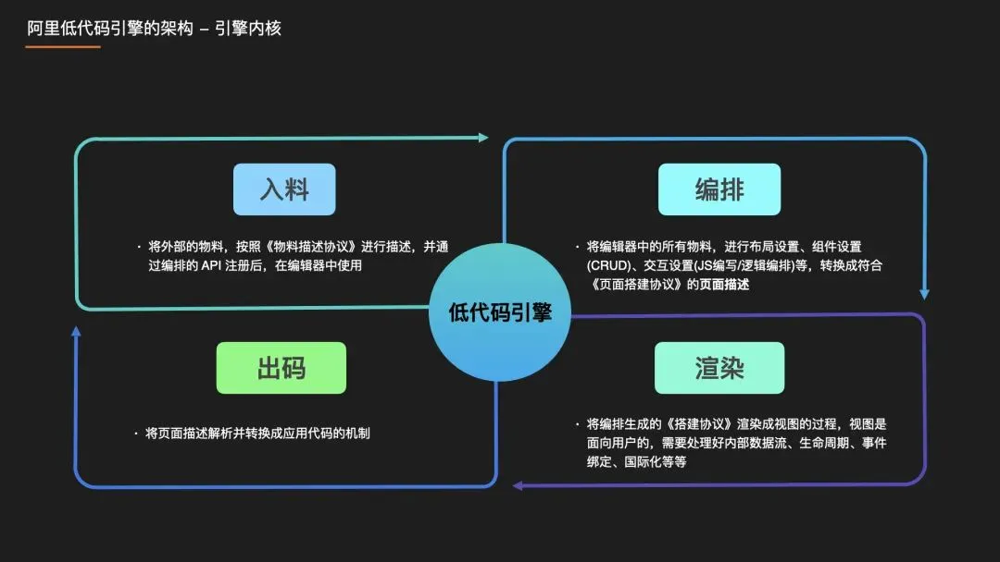

代码引擎分为 4 大模块，入料、编排、渲染、出码，下面展开聊聊

### 4.1. 入料模块：

- 就是将外部的物料导入
	- 比如海量的 npm 组件，按照《物料描述协议》进行描述，将描述后的数据通过引擎 API 注册后，在编辑器中使用
- 注意，**这里仅是增加描述，而非重写一套**
	- 这样我们能最大程度==复用 ProCode 体系已沉淀的组件==。

### 4.2. 编排模块

本质上来讲，就是
- **不断在生成符合《搭建协议》的页面描述，将编辑器中的所有物料，进行布局设置、组件 CRUD 操作、以及 JS/CSS编写/逻辑编排**
	- ==→== 最终转换成页面描述

#### 4.2.1. 工作台&编辑器骨架

首先我们得有一个**工作台**，我们叫**编辑器骨架**（如下图）分为
- 几个**默认可视的区域**
	- 一些可以展开的区域
	- 可以弹窗显示的区域
	- 中心区域
		- 是编排和渲染的画布


#### 4.2.2. 协议是**文本协议**，是一个 json 结构

==编排的本质==：
- 不断生成符合《搭建**协议**》的页面描述的过程
- 然后通过**渲染器**将页面描述渲染成真正的视图
	- 这些的协议是文本协议，是个 JSON ，**手写也是可以的** ，类似于 amis 
	- 渲染器：
		- 将 JSON 渲染真正视图

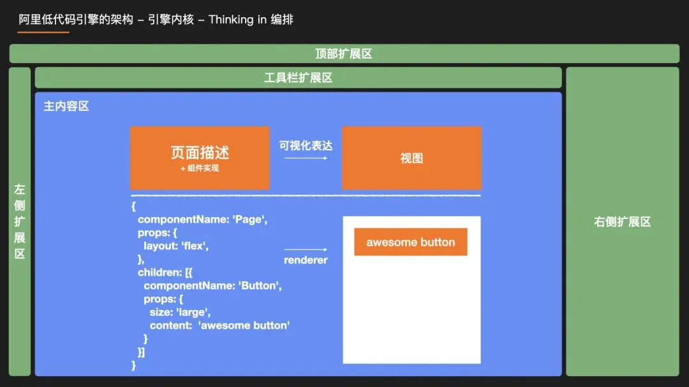

#### 4.2.3. 节点和模型属性（低代码的 DOM 结构）

- 协议是文本协议，是一个 json 结构，理论上手写也能完成
- 但是考虑到可编程性我们设计了一套**节点和属性模型**，**类似于 DOM**，
	- 项目模型 → 页面模型 → 节点模型 → 属性模型
- ==这样操作节点 + 配置属性就等价于在操作页面描述，也就是操作 json 结构了==。

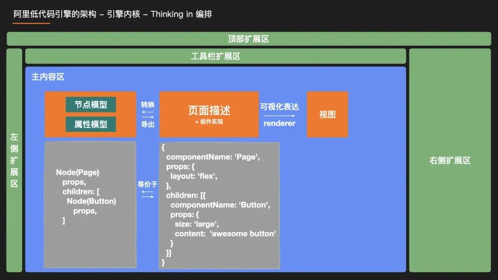

> [!success]
> 所以，我想表达的是，**低代码的实现原理，浏览器已经做过一遍了**

#### 4.2.4. 除了 Node 和 Attr，DOM 还有啥？

- 除了**节点模型和属性模型**之外，上层还有**文档&项目模型**
	- 对于物料的管理，有物料注册机制和**物料模型**
		- **类似于 DOM 的：Node 节点、Attr节点、Document 节点 等**
- 另外我们提供了通用的面板管理、拖拽引擎、resize引擎，设计器辅助层、原地编辑、快捷键等二十几个模块（如下图）
	- 而这所有的模块的能力，也就是 API，都通过**插件**进行调用，于是**插件成为了扩展编辑器的唯一载体**
		- 你可以定制你的面板
		- 可以操作节点树
		- 可以定制节点的扩展操作
		- 可以去操作物料模型
		- 可以去绑定快捷键
		- 可以设定画布大小
		- 可以定制拖拽行为

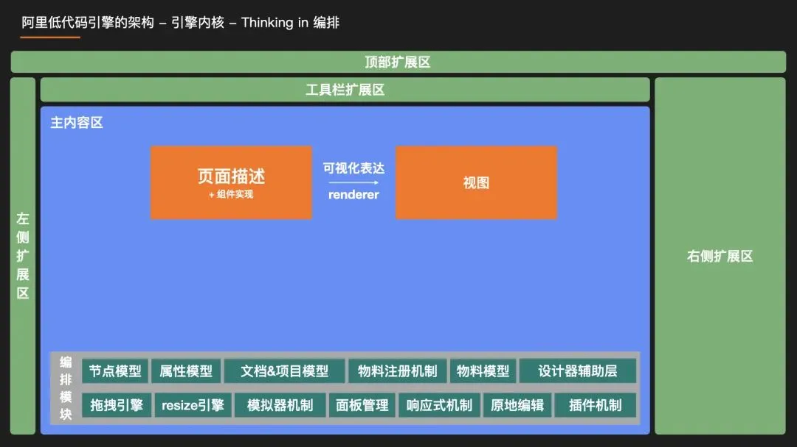

### 4.3. 渲染模块

- 渲染：
	- 即将编排生成的页面描述结构渲染成视图的过程
- 视图：是面向用户的，所以必须处理好
	- **内部数据流、生命周期、事件绑定、国际化**等。

### 4.4. 出码模块：DSL Schema 协议 → 编译 → 源码

- **将页面描述结构解析和转换成应用代码的机制**


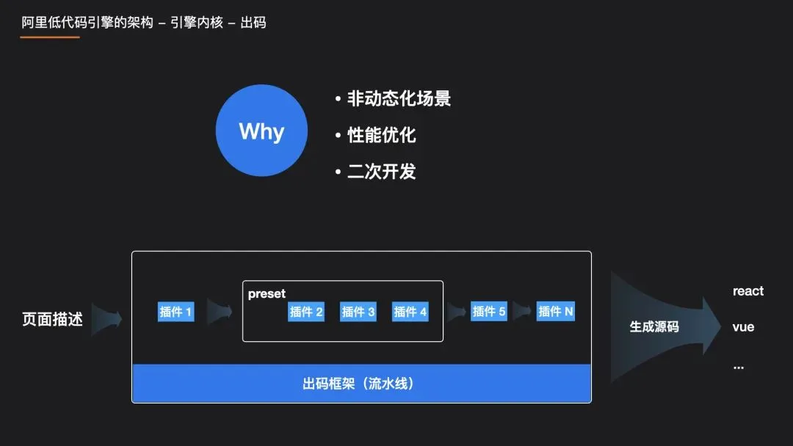

- 常规业务场景，直接由渲染模块渲染即可，也就是 ==Amis 做到的那一层==
- 但是考虑到一些特殊情况
	- **不支持动态化**的场景：==小程序==
	- 为了更好的性能：
		- 转码成 `ProCode` 打包部署
	- 需要==二次开发场景==
- 因此，我们设计了出码框架
	- 出码框架提供一套流水线式的处理流程
	- 类似 babel 的机制，通过一个个的`出码插件` / `preset` 来定制你的出码产物
	- 市面上的 react 框架、vue 框架、小程序框架都可以支持

> [!success]
>  个人理解：**本质是对 DSL 协议的编译过程，将 DSL 协议 → → Token → AST → JS AST → 源码 的过程**

## 5. 引擎生态

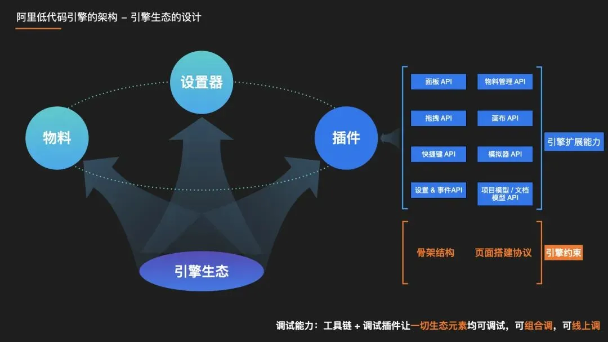


- **最小内核最强生态**是我们的设计原则
	- 因此如何定义什么是内核能力，什么是生态以及如何支撑生态，是我们整个体系设计的重中之重
- 经过我们支撑众多平台的经验，我们发现平台的差异性体现在这 3 点：**物料、设置器和插件**
	- **插件**是扩展的入口，包括**物料和设置器**也是通过插件才能注册到引擎
		- 我们定义了引擎的约束，这是唯一不可变的部分，以及引擎 API 的能力，包括面板、画布、物料管理、拖拽等所有能力，**都可以通过插件来使用**。
		- 同时，插件我们设计成高内聚、显性化配置、可流通的形态，这支撑了插件生态的形成，甚至更高层面，让自定义设计器也可以通过可视化配置实现。  
- 多说一嘴，因为生态体系如此重要，我们在生态元素**调试能力**上也下了一番功夫
	- 目前我们通过工具链 + 调试插件让一切生态元素均可调试，可相互组合调试，可线上调试。

### 5.1. 插件、设置器、物料

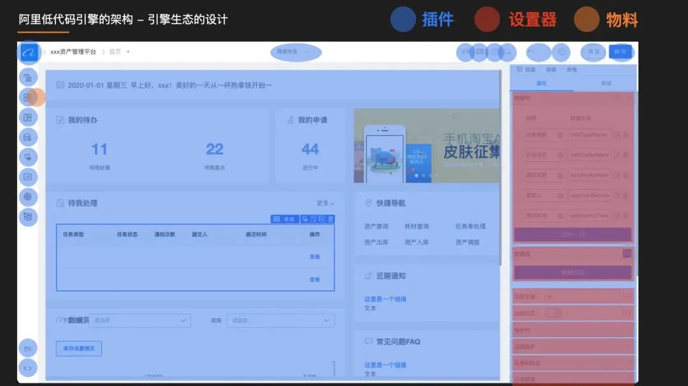

我们具象化一点来看引擎生态，这是一个标准的中后台设计器页面，如上图：
- 插件：
	- **蓝色**部分是**插件**，这些都是能被看到的**插件**，因为调用的是面板 API
		- ==某个组件的设计态本质也是一个插件，注册到低代码平台中的==
	- 还有一些不能被看到，比如调用了快捷键 API，拖拽 API、事件 API 等。
- 设置器：
	- **红色**部分就是**设置器**了，可以定制我们==如何给一个节点的属性赋值==。
- 物料：
	- **橙色**部分就是物料了，其实**物料本质上是一个模型**
	- 也是不可见的，不过这里通过物料面板调用了物料 API 来显性化展示了物料，再通过拖拽 API 和 节点 API 来拖拽并插入到画布中。

### 5.2. 设计器 = 引擎 + 选择物料 + 选择设置器 + 选择插件

- 丰富的生态，让快速、低成本打造低代码平台成为可能
- 我们有物料生态、设置器生态、插件生态
- 因此，我们推导出一个简单的公式：
	- **低代码的设计器等价于引擎 + 选择物料 + 选择设置器 + 选择插件**。

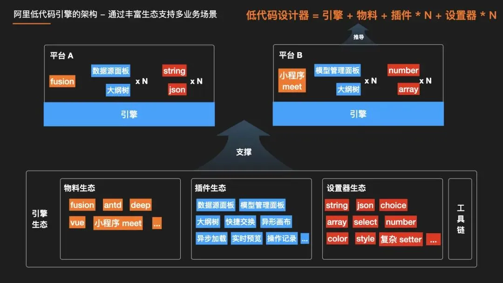

### 5.3. 协议来支持多技术栈

- 不管是《阿里巴巴中后台前端搭建协议规范》，还是《阿里巴巴中后台前端物料规范》，都是**与语言无关的**。
- 定义一套物料描述，而具体实现可以是 react / vue 或者任何技术栈
	- vue Renderer
	- React Renderer
	- ==Flutter Renderer，理论是也是可以的==
	- 小程序等等
- 对于搭建页面（设计态）
	- 你可以在设计态用 react 组件，渲染时也用 react 组件
	- 但注意，因为设计和渲染的中间产物页面描述也是语言无关的，所以渲染时可以是任意语言
		- 可以是 react，可以是 vue，当然也可以是小程序。
	- **理论是可以的：当然混搭的场景不是我臆想的哈，阿里内部有不少混搭的实践。**

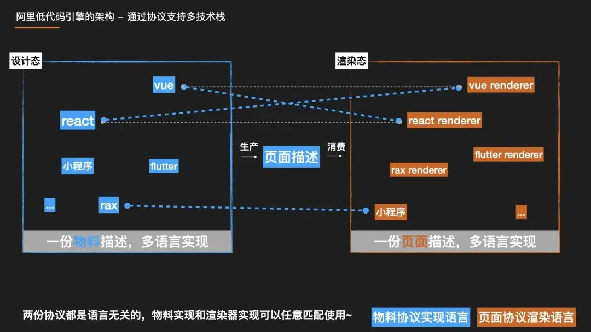

### 5.4. 模拟器实现

**编排和渲染的双层架构设计，通过这个架构，我们实现了绝对纯净的编辑态渲染，即模拟器实现**。

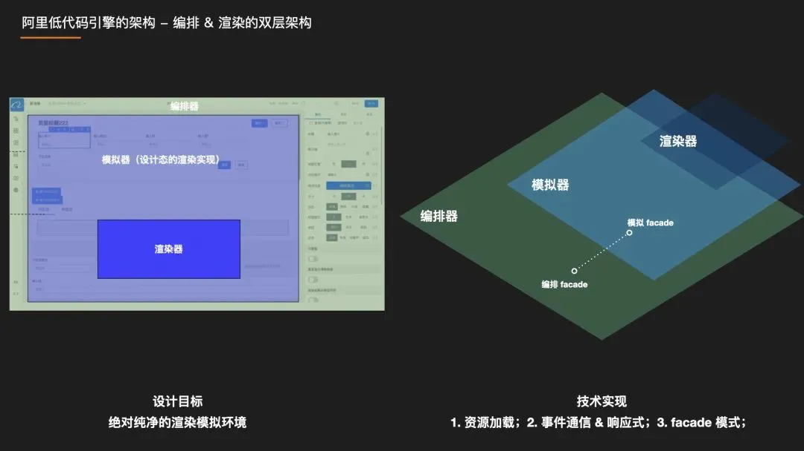

编辑器中内嵌一个所见即所得的**渲染模块**，但这会有一个问题，**css 污染的问题**
- 因为编辑器中各个模块，物料、设置器、插件都**来自不同的团队**，很容易产生 css 污染。
- 编辑器中的元素互相污染问题都不算太大，但是污染了渲染视图就很严重了，==大家可以思考下为什么？==

我们的解法是**将模拟器放入到一个新的 iframe 中运行**
- 通过编辑器将相关资源注入到模拟器，建立数据通道，使用 facade 模式
- 即在**编辑器和模拟器**中各有一个 `facade  对象`来负责对外的方法暴露和调用，避免深度耦合。

> 设计模式：外观模式，下文详细再介绍下
> 另外一种解法是：直接 iframe 嵌入就好了，或者更进一步，使用微前端的方案，这类隔离思路挺多


> 可参考：[8. 微前端原理（篇二：无界）](/post/3SBP1pr3.html)

#### 5.4.1. 附： Facade（外观）模式

- Facade 模式是一种结构型设计模式，它为复杂的子系统提供一个简单的统一接口。
- 这个模式的名字 "Facade"（外观）来自建筑学，就像建筑物的正面外观一样，它为背后复杂的结构提供了一个统一的外表。

 JavaScript 实现一个使用外观模式来处理低代码平台中编辑器和模拟器的样式和变量冲突问题的示例。

```javascript
// 子系统：样式隔离管理器
class StyleIsolationManager {
    constructor() {
        this.styleMap = new Map();
    }

    // 为特定组件创建样式作用域
    createScope(componentId, styles) {
        const scopedClassName = `scope-${componentId}`;
        const scopedStyles = this._scopeStyles(styles, scopedClassName);
        this.styleMap.set(componentId, {
            className: scopedClassName,
            styles: scopedStyles
        });
        return scopedClassName;
    }

    // 将样式转换为作用域样式
    _scopeStyles(styles, scopeName) {
        return styles.replace(/([^{]+){/g, (match) => {
            return `.${scopeName} ${match}`;
        });
    }

    // 应用样式到文档
    applyStyles(componentId) {
        const styleData = this.styleMap.get(componentId);
        if (!styleData) return;

        const styleElement = document.createElement('style');
        styleElement.textContent = styleData.styles;
        document.head.appendChild(styleElement);
        return styleElement;
    }
}

// 子系统：变量作用域管理器
class VariableScopeManager {
    constructor() {
        this.scopes = new Map();
    }

    // 创建变量作用域
    createScope(scopeId) {
        if (!this.scopes.has(scopeId)) {
            this.scopes.set(scopeId, new Map());
        }
        return scopeId;
    }

    // 在作用域中设置变量
    setVariable(scopeId, key, value) {
        const scope = this.scopes.get(scopeId);
        if (scope) {
            scope.set(key, value);
        }
    }

    // 从作用域中获取变量
    getVariable(scopeId, key) {
        const scope = this.scopes.get(scopeId);
        return scope ? scope.get(key) : undefined;
    }
}

// 子系统：沙箱环境管理器
class SandboxManager {
    constructor() {
        this.sandboxes = new Map();
    }

    // 创建沙箱环境
    createSandbox(sandboxId) {
        const iframe = document.createElement('iframe');
        iframe.style.display = 'none';
        document.body.appendChild(iframe);
        
        const sandboxContext = iframe.contentWindow;
        this.sandboxes.set(sandboxId, sandboxContext);
        
        return sandboxContext;
    }

    // 在沙箱中执行代码
    executeInSandbox(sandboxId, code) {
        const sandbox = this.sandboxes.get(sandboxId);
        if (sandbox) {
            try {
                return sandbox.eval(code);
            } catch (error) {
                console.error('Sandbox execution error:', error);
                throw error;
            }
        }
    }
}

// Facade：低代码平台环境管理器
class LowCodeEnvironmentFacade {
    constructor() {
        this.styleManager = new StyleIsolationManager();
        this.variableManager = new VariableScopeManager();
        this.sandboxManager = new SandboxManager();
    }

    // 初始化编辑器环境
    initializeEditor(editorId) {
        const editorScope = this.styleManager.createScope(editorId, `
            .editor-content { 
                background: `#fff;`
                padding: 20px;
            }
            .editor-toolbar {
                border-bottom: 1px solid `#eee;`
            }
        `);

        this.variableManager.createScope(`editor-${editorId}`);
        this.sandboxManager.createSandbox(`editor-${editorId}`);

        return {
            scopeClassName: editorScope,
            setVariable: (key, value) => {
                this.variableManager.setVariable(`editor-${editorId}`, key, value);
            },
            getVariable: (key) => {
                return this.variableManager.getVariable(`editor-${editorId}`, key);
            }
        };
    }

    // 初始化模拟器环境
    initializeSimulator(simulatorId) {
        const simulatorScope = this.styleManager.createScope(simulatorId, `
            .simulator-container {
                border: 1px solid `#ddd;`
                margin: 10px;
            }
            .simulator-content {
                min-height: 400px;
            }
        `);

        this.variableManager.createScope(`simulator-${simulatorId}`);
        const sandbox = this.sandboxManager.createSandbox(`simulator-${simulatorId}`);

        return {
            scopeClassName: simulatorScope,
            setVariable: (key, value) => {
                this.variableManager.setVariable(`simulator-${simulatorId}`, key, value);
            },
            getVariable: (key) => {
                return this.variableManager.getVariable(`simulator-${simulatorId}`, key);
            },
            executeCode: (code) => {
                return this.sandboxManager.executeInSandbox(`simulator-${simulatorId}`, code);
            }
        };
    }

    // 同步编辑器和模拟器的状态
    syncEnvironments(editorId, simulatorId) {
        const editorVars = Array.from(
            this.variableManager.scopes.get(`editor-${editorId}`).entries()
        );
        
        editorVars.forEach(([key, value]) => {
            this.variableManager.setVariable(`simulator-${simulatorId}`, key, value);
        });
    }
}


```

##### 5.4.1.1. 使用

```javascript hl:6,9
// 使用示例
function example() {
    // 创建低代码平台环境管理器
    const lowCodeEnv = new LowCodeEnvironmentFacade();

    // 初始化编辑器
    const editor = lowCodeEnv.initializeEditor('editor1');
    
    // 初始化模拟器
    const simulator = lowCodeEnv.initializeSimulator('simulator1');

    // 在编辑器中使用
    const editorContainer = document.createElement('div');
    editorContainer.className = editor.scopeClassName;
    editor.setVariable('theme', 'light');
    editor.setVariable('components', [{
        type: 'button',
        props: { text: 'Click me' }
    }]);

    // 在模拟器中使用
    const simulatorContainer = document.createElement('div');
    simulatorContainer.className = simulator.scopeClassName;
    
    // 同步编辑器和模拟器的状态
    lowCodeEnv.syncEnvironments('editor1', 'simulator1');
    
    // 在模拟器中执行代码
    simulator.executeCode(`
        const theme = '${simulator.getVariable('theme')}';
        const components = ${JSON.stringify(simulator.getVariable('components'))};
        console.log('Theme:', theme);
        console.log('Components:', components);
    `);
}

// 测试代码
example();
```

##### 5.4.1.2. 其他说明

- 样式隔离
	- 使用 `StyleIsolationManager` 为编辑器和模拟器创建独立的样式作用域
	- 通过自动添加作用域前缀来避免样式冲突
	- 支持动态创建和管理样式
- 变量作用域管理
	- 使用 `VariableScopeManager` 为不同环境维护独立的变量作用域
	- 防止编辑器和模拟器之间的变量污染
	- 提供变量的存取接口
- 沙箱环境
	- 使用 `SandboxManager` 创建独立的执行环境
	- 通过 iframe 实现代码隔离
	- 安全地执行模拟器中的代码
- 统一的接口
	- `LowCodeEnvironmentFacade` 提供了简单统一的接口
	- 隐藏了底层实现的复杂性
	- 提供了环境同步等高级功能

## 6. 低代码平台

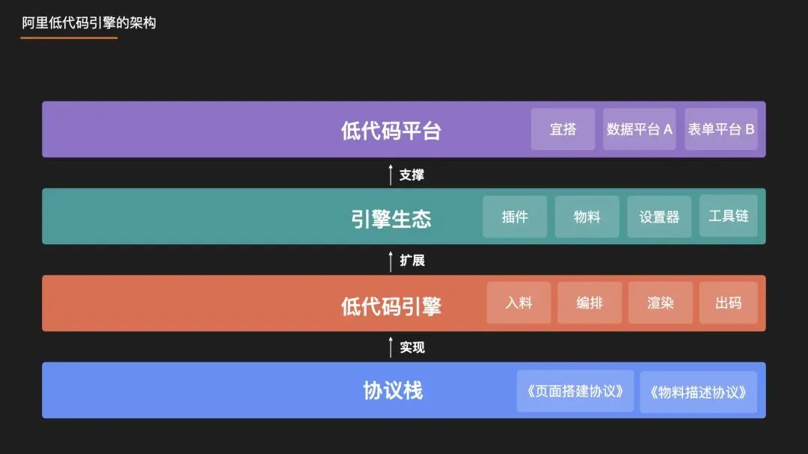

低代码引擎通过**协议先行，最小内核，最强生态**的理念，形成了 4 大模块以及生态扩展性的整体设计，在灵活性上足以支撑各种类型低代码平台。

但这引擎 + 生态的组合似乎还是**偏底层**，离一个**真正生产可用的低代码平台**有点距离。比如
1. 搭建出来的页面描述保存到哪里去 ？
2. 搭建完成后，**产物打包系统**哪家强 ？
3. 页面**多人编辑冲突**如何解决 ？
4. **研发流程**如何定义 ？
5. **版本管理**，多分支咋搞 ？
6. 页面区块 / 低代码组件怎么搭建 ？怎么使用 ？

### 6.1. UIPaaS


所以，我们在引擎之上再加上一层，形成一个**低代码平台的基座**，或者叫孵化器。
- 我们把这个低代码平台的孵化器叫做 UIPaaS
	- 在阿里内部，我们更多是基于 UIPaaS 来开始打造低代码平台，这样会更轻松一点。  
- 为什么要做 UIPaaS ？两点原因：
	- 解决产品能力的问题
		- 实现了==应用管理、研发流程、打包流程、发布流程==等一系列能力
	- 解决快速在找到**符合需求的生态元素组合**

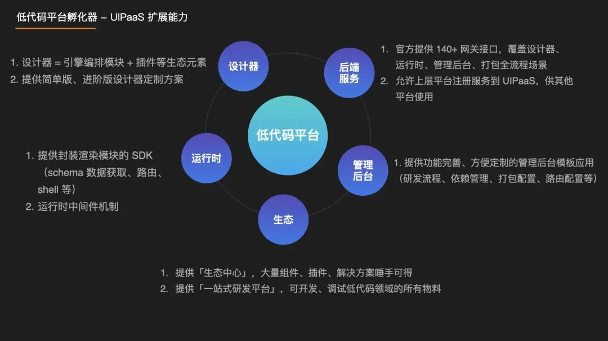

- 设计器：
	- 提供一个**开箱即用的标准版页面设计器**，
		- 开箱即用意味着整合了一批插件，**插件都已经跟后端服务**相绑定了；
	- 提供简单版、进阶版设计器定制方案。
- 运行时：
	- 提供稳定的，功能丰富的**运行时 SDK**，包括页面描述的获取、路由、layout，甚至还有一套**运行时中间件机制**
- 生态：
	- 提供「**生态中心**」
		- 大量组件、插件、解决方案唾手可得
	- 提供「**一站式研发平台**」
		- 可开发、调试低代码领域的所有物料
- 管理后台：
	- 提供功能完善、方便定制的**管理后台模板应用**，
		- 包括研发流程、应用依赖管理、打包配置、路由配置等
- 后端服务：
	- 官方提供 140+ 网关接口，覆盖设计器、运行时、管理后台等全流程；
	- 允许上==层平台注册服务到 UIPaaS==，供其他平台使用。

>  批注：其他系统的 API 可以注册到平台上，在该平台做编排，这也是做 API 管理平台的意义所在

- 我们**有各种业务场景，各种用户角色，各种技术栈**，因此产生形形色色的低代码平台几乎是个必然结果。
- 唯一的问题是如何低成本、快速地支撑各个平台的开发，在阿里，我们通过 **UIPaaS 孵化器**来支撑。

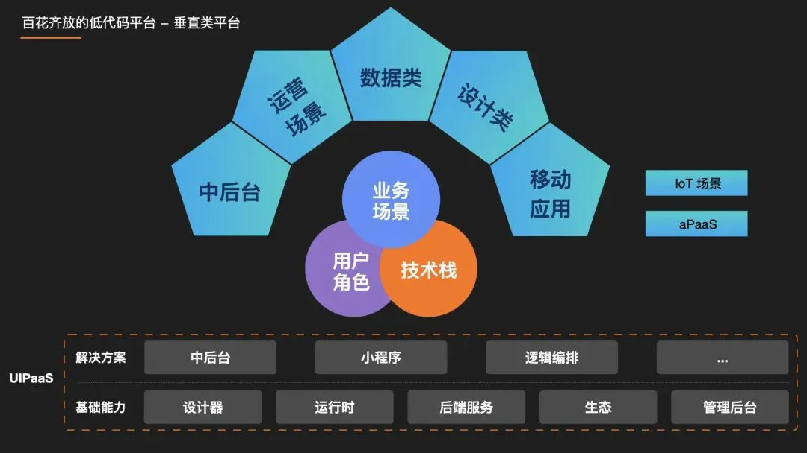

目前我们打造的**垂直类平台**
- 有耳熟能详的中后台，有运营场景，数据报表类场景
- 还有以设计类为代表的角色协同、产物互通的平台
- 还有移动应用、IoT、aPaaS 等类型

### 6.2. 中后台平台

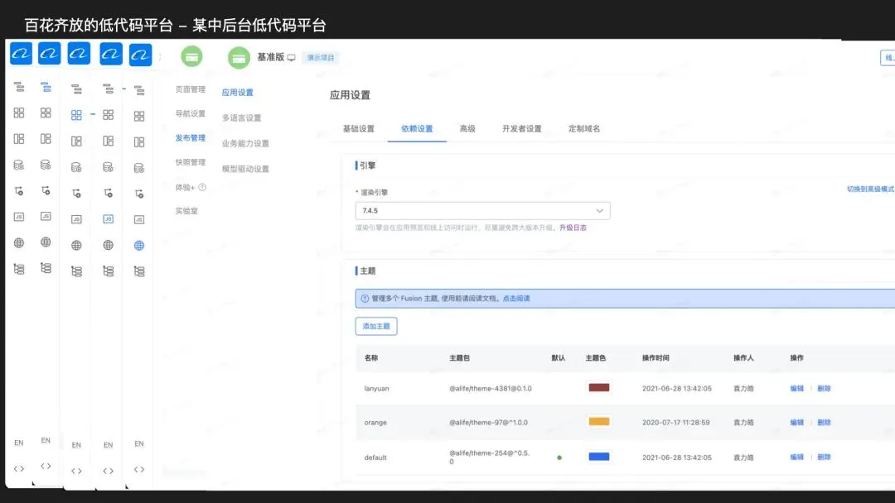

功能包含**页面大纲树、组件面板、源码面板、国际化、模型编排等核心能力，以及打包系统、研发管理**等模块

### 6.3. 数据报表类的平台

会对**图表库、数据模块、账号权限体系、设置器**等做深度定制，如下图：

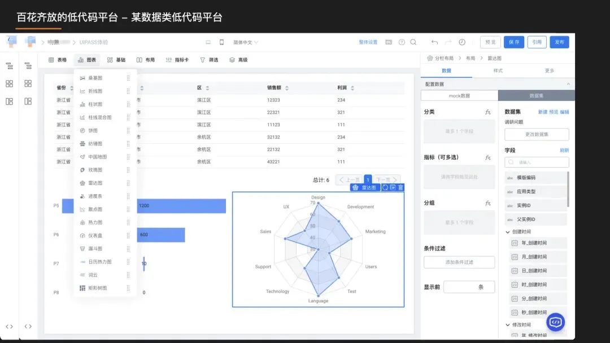

> 更多平台，如何集成数据团队的前端来该平台上贡献组件，开发插件等

### 6.4. 小程序编排平台

核心是接入一套小程序的组件，定制一些**小程序特有的配置**，以及对接各个**发布渠道**。

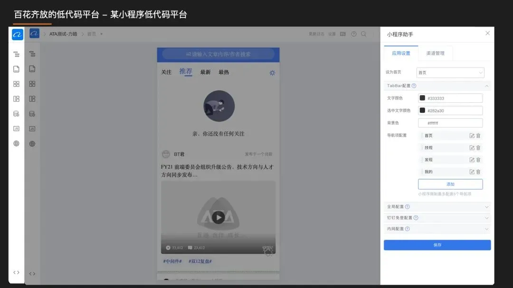

## 7. 最后

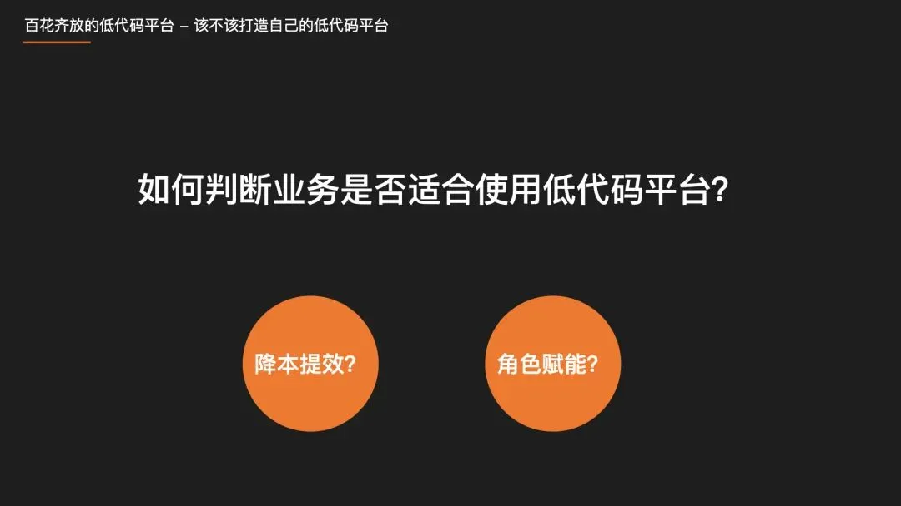


虽然提到了很多低代码平台，似乎让使用低代码开发成为了一种风潮。但是我建议不要盲目跟风
- **低代码研发也只是一种研发范式，跟以往任何一种研发范式相比，没有孰高孰低**。
- 适合的，才是最好的，评估标准只有两点：**是否能研发提效？以及是否能角色赋能？**