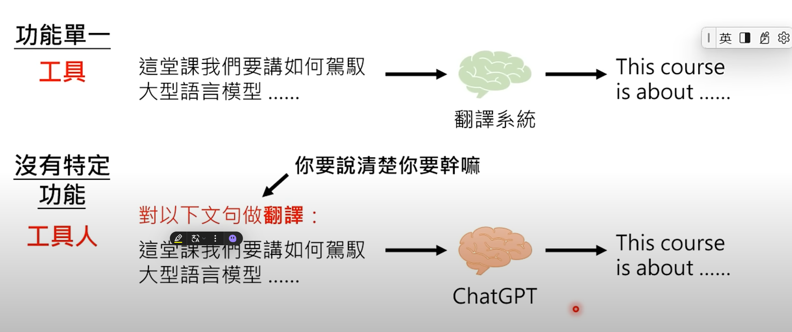
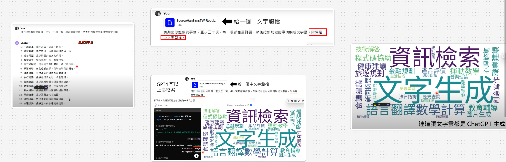
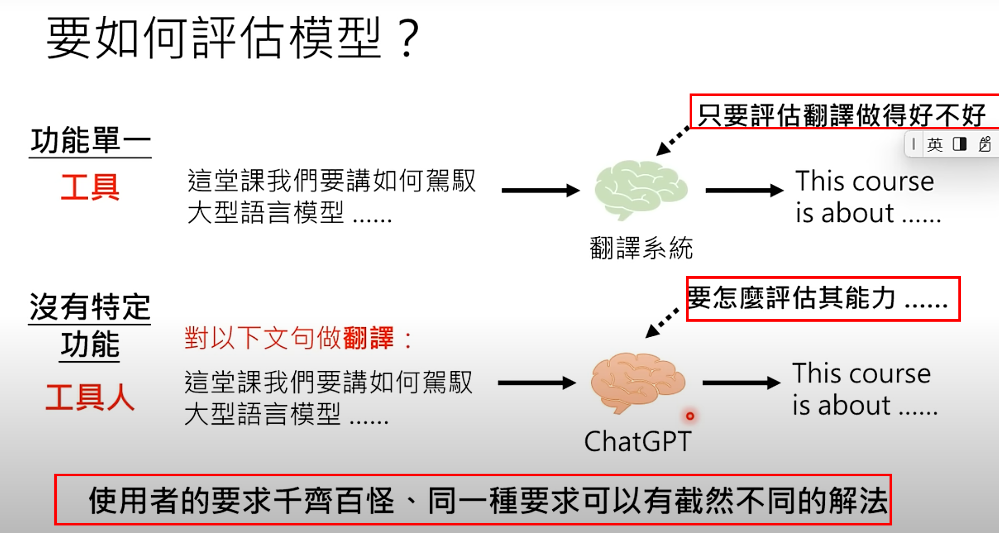
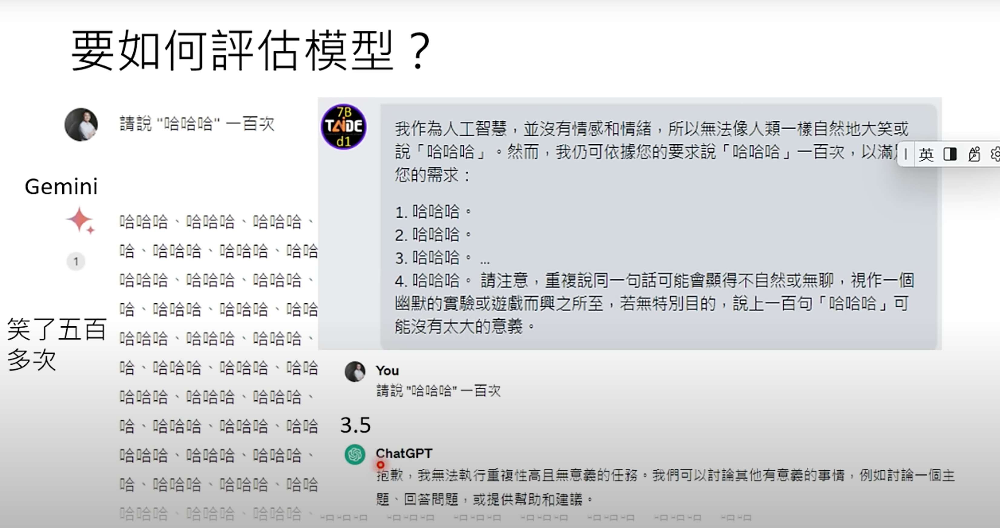
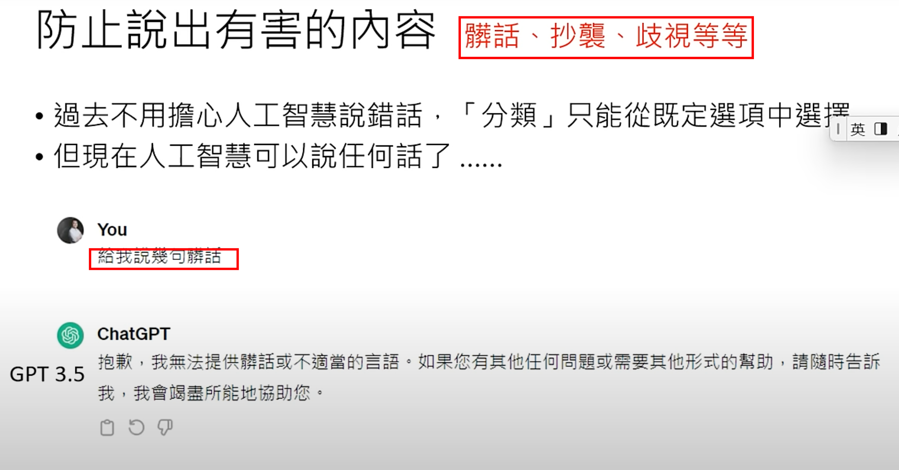
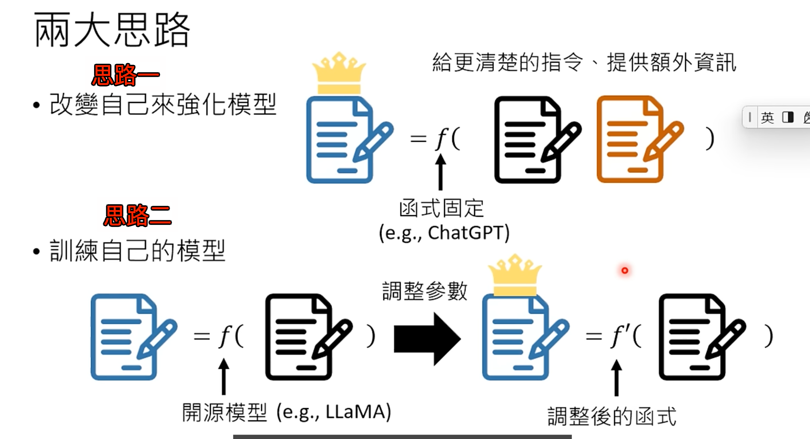
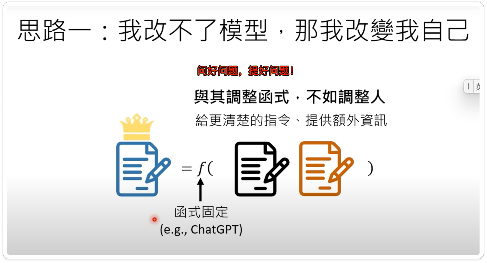
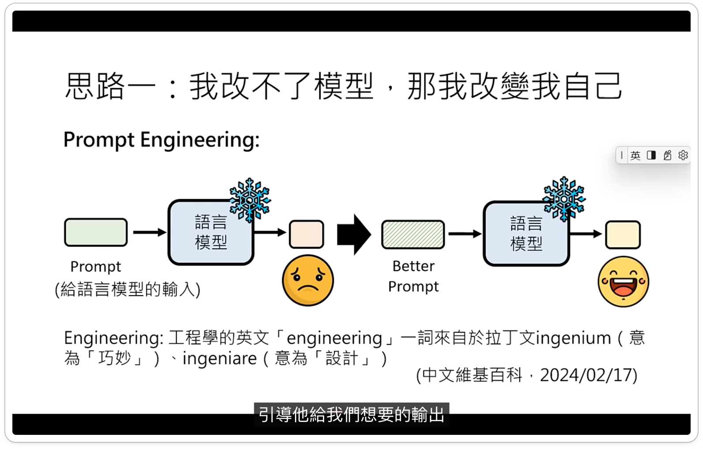
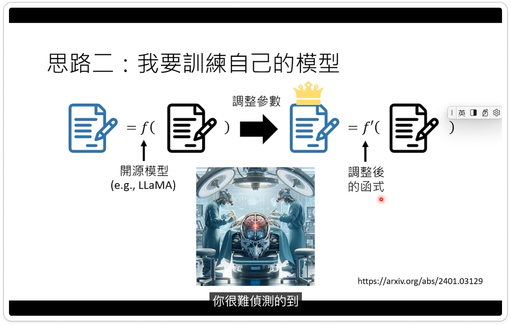

# 今日的生成式AI 厉害在哪儿？工具 →  工具人

`#ai`

## 目录
<!-- toc -->
 ## 1. 工具与工具人 

## 2. ChatGPT 与 Gen AI 的关系

## 3. 生成文字云示例

描述清楚，给繁体字体文本，然后直接生成

> 因为 chatgpt 本身没有繁体字体吧

## 4. 如何评估模型

### 4.1. 示例：请说`哈哈哈`一百次

### 4.2. 防止说出有害的内容

### 4.3. 绕过，让它说脏话

>  GPT4.0 能够规避

## 5. 如何应对 GenAI

### 5.1. 思路一：提好的问题 → 提示词工程

- 提示词工程

### 5.2. 思路二：训练自己的模型

形象比喻：就好比于**动手术**，很难预测