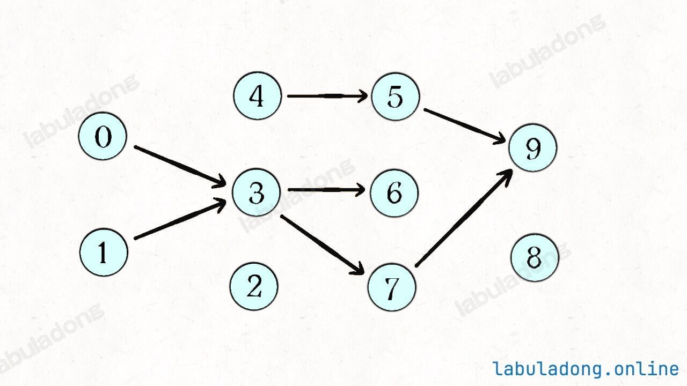

# 课程表：是否可能完成所有课程的学习


> [207. 课程表](https://leetcode.cn/problems/course-schedule/)


## 目录
<!-- toc -->
 ## DFS 思路 

- 如何遍历图中的所有路径
	- 图中并不是所有节点都相连，所以**要用一个 for 循环将所有节点都作为起点调用一次 DFS 搜索算法**。
- 冗余计算
	- 如果我们发现一个节点之前被遍历过，就可以直接跳过，不用再重复遍历了
	- 分析：
		- 以节点 `2` 为起点遍历所有可达的路径，最终发现没有环
		- 假设节点 `5` 有一条指向 `2` 的边，所以以 `5` 为起点遍历所有可达的路径时，肯定还会走到 `2`
		- 此时你是否还需要继续遍历 `2` 的所有可达路径呢 ？ 不需要了，所以 **使用 `visited` 避免重复计算**




- 构建图：邻接表
- 定义变量：`onPath` , `visited` 

```javascript hl:25,26,30
var canFinish = function (numCourses, prerequisites) {
    let n = numCourses;
    // 记录一次 traverse 递归经过的节点
    let onPath = new Array(n).fill(false);
    // 记录遍历过的节点
    let visited = new Array(n).fill(false);
    let hasCycle = false; // 是否有环
    let graph = buildGraph();

    // 遍历图中的所有节点
    for (let i = 0; i < n; i++) {
        traverse(graph, i);
    }
    return !hasCycle;

    function traverse(graph, s) {
        // 已经经历的节点,因为第一次为 false 嘛
        if (onPath[s]) {
            hasCycle = true;
        }
        // 如果已经找到了环 或者 该节点已经遍历过了
        if (hasCycle || visited[s]) {
            return;
        }
        visited[s] = true;
        onPath[s] = true;
        for (let node of graph[s]) {
            traverse(graph, node);
        }
        onPath[s] = false;
    }

    // 构建邻接表
    function buildGraph() {
        let graph = new Array(n).fill().map(() => []);
        for (let edge of prerequisites) {
            // [0, 1] 表示：想要学习课程 0 ，你需要先完成课程 1
            let from = edge[1];
            let to = edge[0];
            graph[from].push(to);
        }
        return graph;
    }
};
```

## BFS 思路：配合入度 

> [!danger]
> 了解即可，能写出 DFS 就可以了

- 入度为 0 时，即没有依赖的节点
	- 可以作为拓扑排序的起点，加入队列

### 思路

1、构建邻接表，和之前一样，边的方向表示「被依赖」关系。
2、构建一个 `indegree` 数组记录每个节点的入度，即 `indegree[i]` 记录节点 `i` 的入度。
3、对 BFS 队列进行初始化，将入度为 0 的节点首先装入队列。
4、开始执行 BFS 循环，不断弹出队列中的节点，减少相邻节点的入度，并将入度变为 0 的节点加入队列。
5、如果最终所有节点都被遍历过（`count` 等于节点数），则说明不存在环，反之则说明存在环。