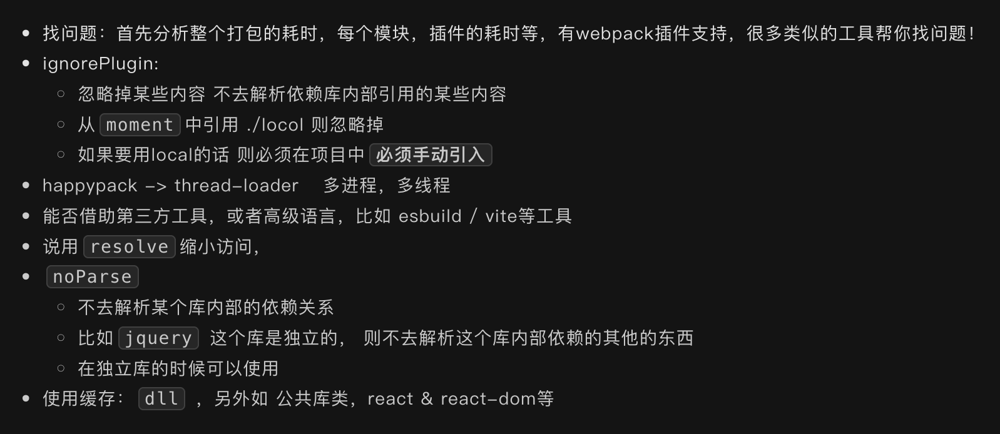

# webpack 性能优化的思路

`#webpack` 


## 目录
<!-- toc -->
 ## 1. 总结 

- 使用 `include/exclude` 缩小文件搜索范围
- 添加 `cache-loader`，将结果缓存到磁盘里
- 使用 `hard-source-webpack-plugin` 为模块提供**中间缓存**
- 使用 thread-loader 或 parallel-webpack 实现**多进程打包**
- 配置 `resolve.alias` 简化引用路径
- 使用 `resolve.modules` 指定模块搜索目录
- 使用 `noParse` 跳过对已知无依赖模块的解析
- 合理使用 `externals` ==外部化一些大型库==
- 优化打包体积
	- 代码分割 `splitChunks`
	- Tree Shaking
	- 压缩代码
- 优化运行时性能
	- 启用持久化缓存
	- 懒加载：动态 import
- 分析和监控
	- 分析工具
		- webpack-bundle-analyzer：可视化分析打包结果
	- 速度分析：
		- speed-measure-webpack-plugin：分析各个 loader 和 plugin 的执行时间
- DLL 动态链接库
- 合理使用 sourceMap
	- 开发环境使用 `eval-cheap-module-source-map`
	- 生产环境可以选择不使用或使用 `nosources-source-map`

---


> 更多可参考 [14.  前端构建提速的体系化思路](/post/7KNqNTFW.html)

## 2. 优化打包速度

### 2.1. 使用 `include/exclude` 缩小文件搜索范围

```javascript
module: {
  rules: [
    {
      test: /\.js$/,
      loader: 'babel-loader',
      include: path.resolve(__dirname, 'src'), // 只处理 src 目录
      exclude: /node_modules/  // 排除 node_modules
    }
  ]
}
```

### 2.2. 使用 cache-loader

- 在一些性能开销较大的 loader 之前添加 `cache-loader`，将结果缓存到磁盘里

```javascript
module: {
  rules: [
    {
      test: /\.js$/,
      use: ['cache-loader', 'babel-loader']
    }
  ]
}
```

### 2.3. 使用 `hard-source-webpack-plugin` 为模块提供**中间缓存**

### 2.4. 开启多进程打包

- 使用 thread-loader 或 parallel-webpack 实现**多进程打包**

```javascript
module: {
  rules: [
    {
      test: /\.js$/,
      use: ['thread-loader', 'babel-loader']
    }
  ]
}
```

### 2.5. 其他

- 配置 `resolve.alias` 简化引用路径
- 使用 `resolve.modules` 指定模块搜索目录
- 使用 `noParse` 跳过对已知无依赖模块的解析
- 合理使用 `externals` 外部化一些大型库



## 3. 优化打包体积

### 3.1. 代码分割（Code Splitting）

```javascript hl:2
optimization: {
  splitChunks: {
    chunks: 'all',
    minSize: 30000,
    minChunks: 1,
    cacheGroups: {
      vendors: {
        test: /[\\/]node_modules[\\/]/,
        priority: -10
      },
      default: {
        minChunks: 2,
        priority: -20,
        reuseExistingChunk: true
      }
    }
  }
}
```

#### 3.1.1. Tree Shaking

- 在 package.json 中设置 `"sideEffects": false`
- 使用 ES6 模块语法（import/export）
- 启用生产模式（production mode）

#### 3.1.2. 压缩代码

```javascript
optimization: {
  minimize: true,
  minimizer: [
    new TerserPlugin({
      parallel: true // 开启多进程压缩
    })
  ]
}
```

## 4. 优化运行时性能

### 4.1. 启用持久化缓存

```javascript
optimization: {
  runtimeChunk: 'single',
  moduleIds: 'deterministic'
}
```

### 4.2. 懒加载

```javascript
// 使用动态 import 实现懒加载
const Home = () => import('./pages/Home');
```

## 5. 分析和监控

### 5.1. 使用分析工具

- webpack-bundle-analyzer：可视化分析打包结果
```javascript
const BundleAnalyzerPlugin = require('webpack-bundle-analyzer').BundleAnalyzerPlugin;

module.exports = {
  plugins: [
    new BundleAnalyzerPlugin()
  ]
}
```

### 5.2. 速度分析

- speed-measure-webpack-plugin：分析各个 loader 和 plugin 的执行时间

## 6. DLL 动态链接库

```javascript
// webpack.dll.config.js
new webpack.DllPlugin({
  path: path.join(__dirname, 'dist', '[name]-manifest.json'),
  name: '[name]_library'
})

// webpack.config.js
new webpack.DllReferencePlugin({
  manifest: require('./dist/vendor-manifest.json')
})
```

## 7. 其他优化措施

### 7.1. 合理使用 sourceMap

- 开发环境使用 `eval-cheap-module-source-map`
- 生产环境可以选择不使用或使用 `nosources-source-map`

### 7.2. 优化解析配置

```javascript
resolve: {
  extensions: ['.js', '.jsx'], // 指定优先级
  alias: {
    '@': path.resolve(__dirname, 'src') // 设置别名
  }
}
```

