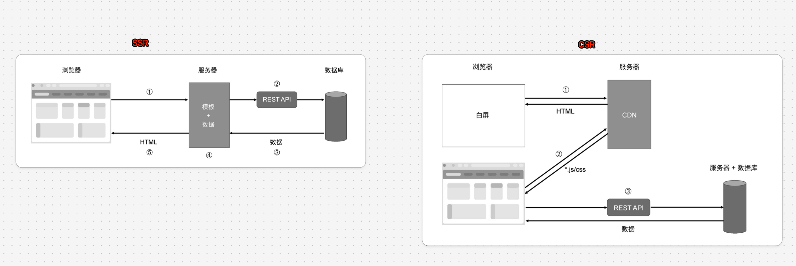
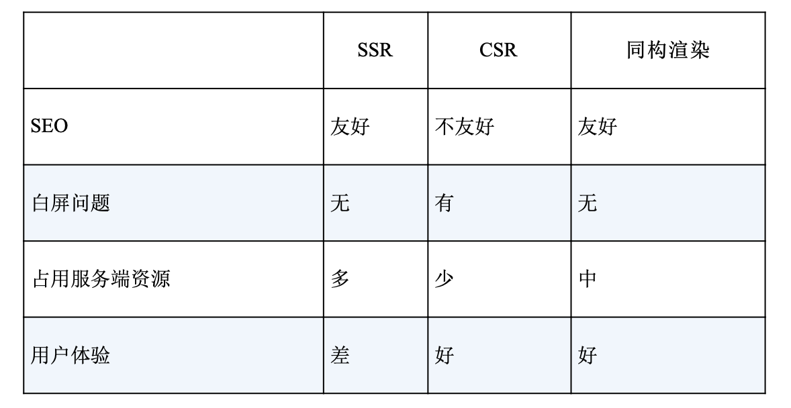
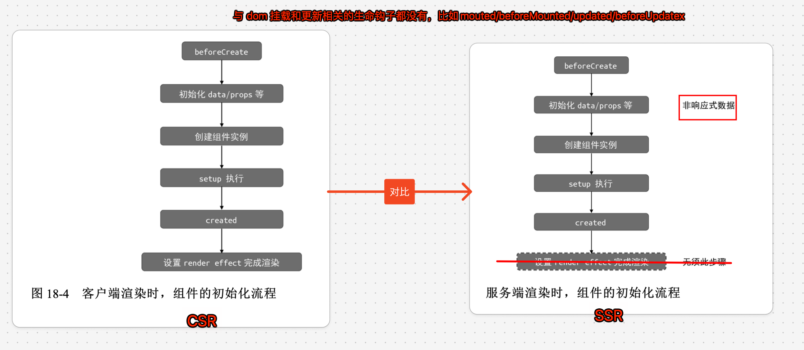
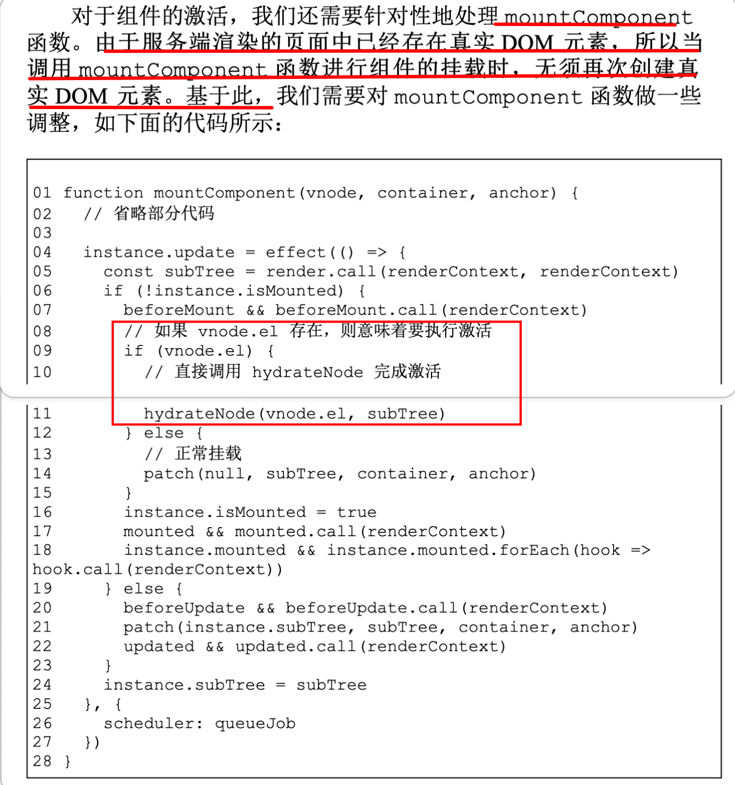
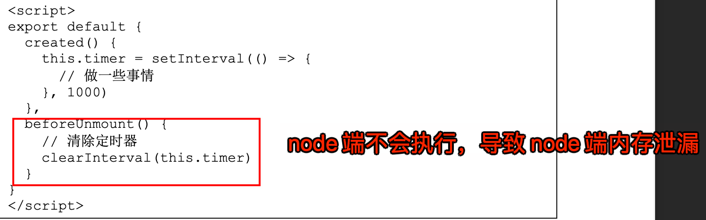
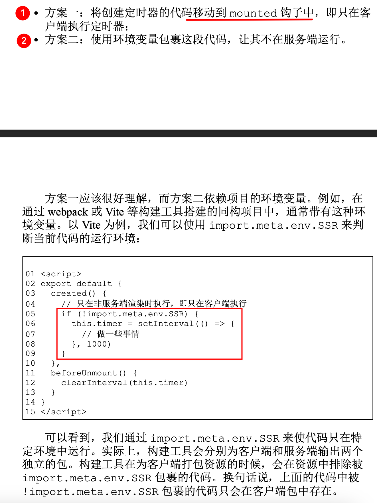
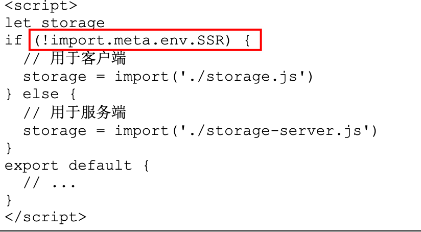
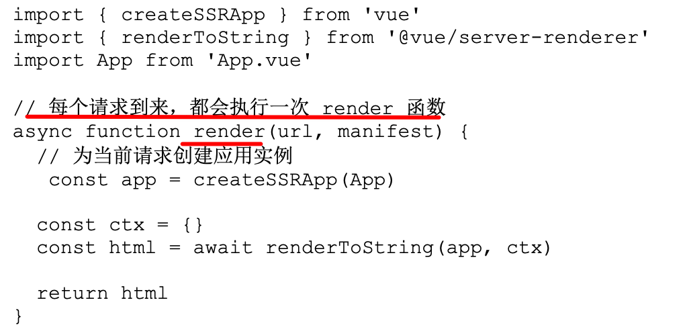

# Vue3 的服务端渲染（SSR）原理（同构原理）

`#vue3` 


## 目录
<!-- toc -->
 ## 1. CSR、SSR、同构 



- CSR 和 SSR 如上图
- 同构 
	- 首次渲染与 SSR 的工作流程是一致的
	-  激活完成后，整个应用程序已经完全被 Vue.js 接管为 CSR 应用程序了

### 1.1. 渲染对比



## 2. Vdom 渲染成 HTML 字符串

### 2.1. renderElementVNode：渲染标准的 DOM

```javascript hl:13
    // 自闭合标签
const VOID_TAGS =
	"area,base,br,col,embed,hr,img,input,link,meta,param,source,track,wbr".split(
		",",
	);
function renderElementVNode(vnode) {
	const { type: tag, props, children } = vnode;
	const isVoidElement = VOID_TAGS.includes(tag);
	// 开始标签
	let ret = `<${tag}`;
	// 属性,考虑属性名称是否合法，还要对属性值进行 HTML 转义
	if (props) {
		ret += renderAttrs(props);
	}
	// 结束标签
	ret += isVoidElement ? `/>` : `>`;

	// 如果是自闭合标签, 直接返回
	if (isVoidElement) return ret;

	// 子节点: 说明是文本节点，直接拼接
	if (typeof children === "string") {
		ret += children;
		// 子节点: 说明是数组，递归渲染 , 拼接
	} else {
		children.forEach((child) => {
			ret += renderElementVNode(child);
		});
	}

	// 走到这里说明是普通标签，需要闭合
	ret += `</${tag}>`;

	// 返回拼接好的字符串
	return ret;
}
```

### 2.2. renderAttrs

```javascript hl:16,48
const shouldIgnoreProp = ["key", "ref"];

// 渲染属性：属性名是否合法，是否是动态属性，属性值是否需要转义
function renderAttrs(props) {
	let ret = "";
	for (const key in props) {
		if (shouldIgnoreProp.includes(key) || /^on[^a-z]/.test(key)) {
			continue;
		}
		const value = props[key];
		if (key === "class") {
			// ret += ` class="${renderClass(value)}"`
		} else if (key === "style") {
			// ret += ` style="${renderStyle(value)}"`
		} else {
			ret += renderDynamicAttr(key, value);
		}
	}
	return ret;
}

function isRenderableValue(value) {
	if (value == null) {
		return false;
	}
	const type = typeof value;
	return type === "string" || type === "number" || type === "boolean";
}

const isBooleanAttr = (key) =>
	(
		`itemscope,allowfullscreen,formnovalidate,ismap,nomodule,novalidate,readonly` +
		`,async,autofocus,autoplay,controls,default,defer,disabled,hidden,` +
		`loop,open,required,reversed,scoped,seamless,` +
		`checked,muted,multiple,selected`
	)
		.split(",")
		.includes(key);
const isSSRSafeAttrName = (key) => true;

function renderDynamicAttr(key, value) {
	if (!isRenderableValue(value)) {
		return ``;
	}
	if (isBooleanAttr(key)) {
		return value === false ? `` : ` ${key}`;
	} else if (isSSRSafeAttrName(key)) {
		return value === "" ? ` ${key}` : ` ${key}="${escapeHtml(value)}"`;
	} else {
		console.warn(
			`[@vue/server-renderer] Skipped rendering unsafe attribute name: ${key}`,
		);
		return ``;
	}
}
```

### 2.3. escapeHtml

不展开了

## 3. Vue 组件渲染成 HTML 字符串

比如自定义组件 `MyComponent`，如下：

```javascript
const MyComponent = {
	name: "App",
	setup() {
		const str = ref("foo");

		return () => {
			return {
				type: "div",
				children: [
					{
						type: "span",
						children: str.value,
						props: {
							onClick: () => {
								str.value = "bar";
							},
						},
					},
					{ type: "span", children: "baz" },
				],
			};
		};
	},
};

const compVNode = {
	type: MyComponent,
};
```

详细代码

```javascript hl:26,24,107,116,118
function renderComponentVNode(vnode) {
	const isFunctional = typeof vnode.type === "function";
	let componentOptions = vnode.type;
	if (isFunctional) {
		componentOptions = {
			render: vnode.type,
			props: vnode.type.props,
		};
	}
	let {
		render,
		data,
		setup,
		beforeCreate,
		created,
		beforeMount,
		mounted,
		beforeUpdate,
		updated,
		props: propsOption,
	} = componentOptions;

	// 生命周期钩子
	beforeCreate && beforeCreate();

	// 不需要转成响应式数据，服务端渲染不需要
	const state = data ? data() : null;
	const [props, attrs] = resolveProps(propsOption, vnode.props);

	const slots = vnode.children || {};

	const instance = {
		state,
		props,
		isMounted: false,
		subTree: null,
		slots,
		mounted: [],
		keepAliveCtx: null,
	};

	function emit(event, ...payload) {
		const eventName = `on${event[0].toUpperCase() + event.slice(1)}`;
		const handler = instance.props[eventName];
		if (handler) {
			handler(...payload);
		} else {
			console.error("事件不存在");
		}
	}

	// setup
	let setupState = null;
	if (setup) {
		const setupContext = { attrs, emit, slots };
		const prevInstance = setCurrentInstance(instance);
		const setupResult = setup(
			shallowReadonly(instance.props),
			setupContext,
		);
		setCurrentInstance(prevInstance);
		if (typeof setupResult === "function") {
			if (render)
				console.error(
					"setup 函数返回渲染函数，render 选项将被忽略",
				);
			render = setupResult;
		} else {
			setupState = setupContext;
		}
	}

	vnode.component = instance;

	const renderContext = new Proxy(instance, {
		get(t, k, r) {
			const { state, props, slots } = t;

			if (k === "$slots") return slots;

			if (state && k in state) {
				return state[k];
			} else if (k in props) {
				return props[k];
			} else if (setupState && k in setupState) {
				return setupState[k];
			} else {
				console.error("不存在");
			}
		},
		set(t, k, v, r) {
			const { state, props } = t;
			if (state && k in state) {
				state[k] = v;
			} else if (k in props) {
				props[k] = v;
			} else if (setupState && k in setupState) {
				setupState[k] = v;
			} else {
				console.error("不存在");
			}
		},
	});

	// created
	created && created.call(renderContext);
	// 执行 render 得到 subTree，即组件要渲染的内容
	const subTree = render.call(renderContext, renderContext);

	return renderVNode(subTree);
}

function renderVNode(vnode) {
	const type = typeof vnode.type;
	if (type === "string") {
		return renderElementVNode(vnode);
	} else if (type === "object" || type === "function") {
		return renderComponentVNode(vnode);
	} else if (vnode.type === Text) {
		// 处理文本...
	} else if (vnode.type === Fragment) {
		// 处理片段...
	} else {
		// 其他 VNode 类型
	}
}
```

### 3.1. 两种渲染初始化的对比



## 4. 客户端激活的原理

- 在同构渲染过程中，组件的代码会分别在服务端和浏览器中执行一次。
	- 在服务端，组件会被渲染为静态的 HTML 字符串，并发送给浏览器。
	- 浏览器则会渲染由服务端返回的静态的 HTML 内容，并下载打包在静态资源中的组件代码。 当下载完毕后，浏览器会解释并执行该组件代码。
	- 当组件代码在客户端执行时，由于页面中已经存在对应的 DOM 元素，
		- 所以渲染器并不会执行创建 DOM 元素的逻辑，而是会执行`激活`操作。
- **激活操作可以总结为两个步骤**。
	- 在虚拟节点与真实DOM元素之间建立联系，即 `vnode.el = el`。这样才能保证后续更新程序正确运行。  
	- 为 DOM 元素添加事件绑定。

主要代码如下

```javascript hl:3,12,15,18,25,31
// 激活 客户端渲染，水合
function hydrate(vnode, container) {
	hydrateNode(container.firstChild, vnode);
}

function hydrateNode(node, vnode) {
	const { type } = vnode;
	vnode.el = node;

	// 如果是组件, 则调用 mountComponent 完成激活
	if (typeof type === "object") {
		mountComponent(vnode, container, null);
		// 如果是真实的 DOM 元素，需要和 vnode 进行水合
	} else if (typeof type === "string") {
		hydrateElement(node, vnode);
	}

	// 返回下一个节点, 用于下次激活操作
	return node.nextSibling;
}

function hydrateElement(el, vnode) {
	if (vnode.props) {
		for (const key in vnode.props) {
			// 只有事件属性才需要进行水合（激活）
			if (/^on/.test(key)) {
				patchProps(el, key, null, vnode.props[key]);
			}
		}
	}
	// 递归激活子节点
	if (Array.isArray(vnode.children)) {
		let nextNode = el.firstChild;
		const len = vnode.children.length;
		for (let i = 0; i < len; i++) {
			nextNode = hydrateNode(nextNode, vnode.children[i]);
		}
	}
}
```

`mountComponent` 需要特殊处理下，如下
 


## 5. 编写同构代码的注意事项

### 5.1. 生命周期

beforeUpdate、updated、 beforeMount、mounted、beforeUnmount、unmounted 等 生命周期钩子函数不会在服务端执行。  

比如下面的代码node 端会出内存泄漏问题



解决方案，两个，如下图



### 5.2. 使用跨平台的 API

- 由于组件的代码既要在浏览器中运行，也要在服务器中运行，所以编写组件代码时，要额外注意代码的跨平台性。
- 通常我们在选择第三方库的时候，会选择支持`跨平台的库`， 例如使用 `Axios` 作为网络请求库。

### 5.3. 只在某一端引入模块

特定端的实现。无论在客户端还是在服务端，都应该保证功能的一致性。

例如，组件需要读取 cookie 信息。
- 在客户端，我们可以 通过 document.cookie 来实现读取;
- 而在服务端，则需要根据请求头来实现读取。所以，很多功能模块需要我们为客户端和服务端分别实现。 

比如



### 5.4. 避免交叉请求引起的状态污染

状态污染既可以是应用级的，也可以是模块级的。
- 对于应用，我们应该为每一个请求创建一个独立的应用实例。
	- 
- 对于模块，我们应该避免使用模块级的全局变量。这是因为在不做特殊处理的情况下，多个请求会共用模块级的全局变量，造成请求间的交叉污染。因为服务器与用 户是一对多的关系，下图，造成了 `count` 的污染
	- 

### 5.5. ClientOnly

 仅在客户端渲染组件中的部分内容。这需要我们自行封装 `<ClientOnly>` 组件，被该组件包裹的内容仅在客户端才会被渲 染。
 
