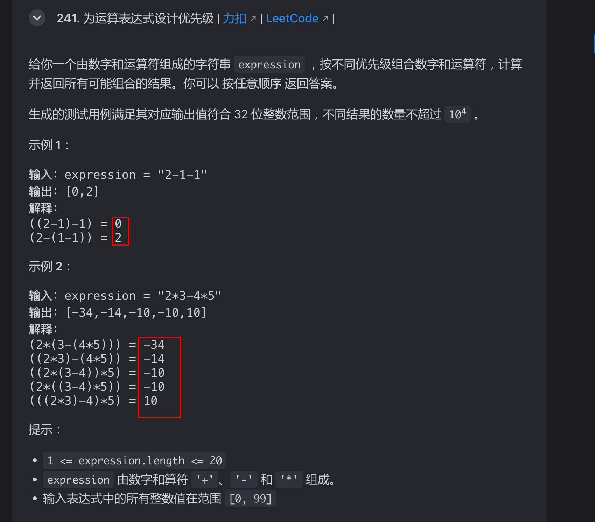

# 为运算表达式设计优先级


## 目录
<!-- toc -->
 ## 题目 

| LeetCode                                                                                                   | 力扣                                                                                  | 难度  |
| ---------------------------------------------------------------------------------------------------------- | ----------------------------------------------------------------------------------- | --- |
| [241. Different Ways to Add Parentheses](https://leetcode.com/problems/different-ways-to-add-parentheses/) | [241. 为运算表达式设计优先级](https://leetcode.cn/problems/different-ways-to-add-parentheses/) | 🟠  |




## 思路

就是使用递归，遍历除所有可能即可

## 代码


```javascript
var diffWaysToCompute = function(input) {
    let res = [];
    for (let i = 0; i < input.length; i++) {
        let c = input.charAt(i);
        // 扫描算式 input 中的运算符
        if (c == '-' || c == '*' || c == '+') {
            // ****** 分 ******
            // 以运算符为中心，分割成两个字符串，分别递归计算
            let left = diffWaysToCompute(input.substring(0, i));
            let right = diffWaysToCompute(input.substring(i + 1));
            // ****** 治 ******
            // 通过子问题的结果，合成原问题的结果
            for (let a of left)
                for (let b of right)
                    if (c == '+')
                        res.push(a + b);
                    else if (c == '-')
                        res.push(a - b);
                    else if (c == '*')
                        res.push(a * b);
        }
    }
    // base case
    // 如果 res 为空，说明算式是一个数字，没有运算符
    if (res.length == 0) {
        res.push(parseInt(input));
    }
    return res;
};
```

