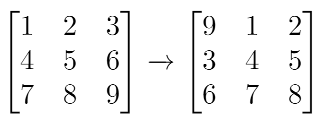

# 二维网格迁移

`#算法/二维数组` 

> [1260. 二维网格迁移](https://leetcode.cn/problems/shift-2d-grid/)


## 目录
<!-- toc -->
 ## 总结 

- 第一步：将二维网格展平为一维数组
- 第二步：分割并重组数组
- 第三步：将处理后的一维数组重新转换为二维网格

## 解释

想象你有一个多层的储物格，移动`1`次（k=1），就像是**把所有物品按顺序往后挪一格**

如下图：



## 思路

- 抽象成**一维数组**
- 将一维数组平移 `k` 位
	- 即 前 `m * n - k` 个元素的位置 和 后 `k` 个元素的位置**对调**
- 再将 一维数组 转成 二维数组

## 注意点

- 记得有 base case 
- 记得 取模
	- 当k大于总长度时，只需要移动 `k % len` 次

## 代码

```javascript
/**
 * 1260. 二维网格迁移
 * 将二维网格中的元素向右移动k次，超出边界的元素循环到下一行开头
 * 
 * @param {number[][]} grid - 输入的二维网格
 * @param {number} k - 需要移动的次数
 * @return {number[][]} - 移动后的二维网格
 */
var shiftGrid = function (grid, k) {
    // 如果不需要移动，直接返回原网格
    if (k === 0) {
        return grid;
    }
    // 获取网格的尺寸
    let m = grid.length;    // 行数
    let n = grid[0].length; // 列数
    let len = m * n;        // 网格总元素个数
    // 优化移动次数：当k大于总长度时，只需要移动 k % len 次
    k = k % len;
    // 用于存储展平后的一维数组
    let arr = [];
    
    // 第一步：将二维网格展平为一维数组
    for (let i = 0; i < m; i++) {
        // 使用展开运算符，将每一行的元素添加到arr中
        arr = [...arr, ...grid[i]];
    }
    
    // 第二步：分割并重组数组
    // a1: 数组前面的部分（需要向后移动的元素）
    // a2: 数组末尾的k个元素（需要移动到开头的元素）
    let a1 = arr.slice(0, len - k);
    let a2 = arr.slice(len - k);
    // 重组数组：末尾k个元素放到开头，其余元素接在后面
    arr = [...a2, ...a1];
    
    // 第三步：将处理后的一维数组重新转换为二维网格
    let idx = 0; // 用于遍历一维数组的索引
    for (let i = 0; i < m; i++) {
        for (let j = 0; j < n; j++) {
            grid[i][j] = arr[idx];
            idx++;
        }
    }
    
    return grid;
};

```