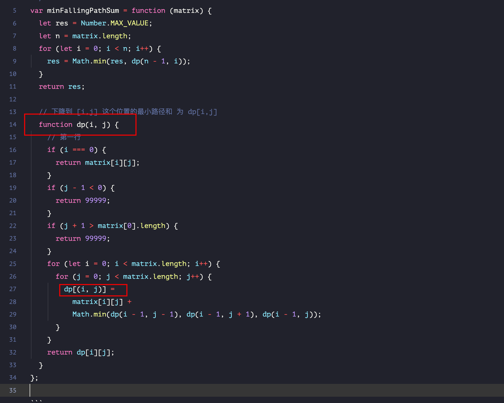

# base case 和备忘录的初始值怎么定：下降路径的最小和


`#算法/动态规划` 


## 目录
<!-- toc -->
 ## 1. 总结 

### 1.1. 递归解法

- 定义 `dp(i,j)` : 
	- 下降到 `[i,j]` 这个位置的最小路径和 
	- 
-  `Number.MAX_VALUE` 这个==好记一点==
	- 或者看题目设置为 `999999` y也行
- 别和 `dp[i][j]` 搞混了
- 是 `n * n`
- 下面写法不能通过用例，超时了，可以使用**备忘录优化**

```javascript
var minFallingPathSum = function (matrix) {
  let res = Number.MAX_VALUE;
  let n = matrix.length;
  for (let i = 0; i < n; i++) {
    res = Math.min(res, dp(n - 1, i));
  }
  return res;
  // 下降到 [i,j] 这个位置的最小路径和 为 dp[i,j]
  function dp(i, j) {
    if (j < 0) {
      return 99999;
    }
    if (j >= n) {
      return 99999;
    }
    // 第一行
    if (i === 0) {
      return matrix[i][j];
    }
    return (
      matrix[i][j] + Math.min(
	      dp(i - 1, j - 1),
	      dp(i - 1, j + 1),
	    dp(i - 1, j))
    );
  }
};
```

### 1.2. dp 数组解法

- 还是看这张图
	- 

```javascript hl:13,18,23
var minFallingPathSum = function (matrix) {
  let n = matrix.length;
  let dp = new Array(n).fill().map(() => {
    return new Array(n).fill(99999);
  });

  for (let j = 0; j < n; j++) {
    dp[0][j] = matrix[0][j];
  }
  console.log("dp:", dp);
  for (let i = 1; i < n; i++) {
    for (j = 0; j < n; j++) {
      if (j === 0) {
        dp[i][j] = matrix[i][j] + Math.min(
          dp[i - 1][j], 
          dp[i - 1][j + 1]
        );
      } else if (j === n - 1) {
        dp[i][j] = matrix[i][j] + Math.min(
          dp[i - 1][j - 1],
          dp[i - 1][j]
        );
      } else {
        dp[i][j] =
          matrix[i][j] +
          Math.min(
            dp[i - 1][j - 1], 
            dp[i - 1][j], 
            dp[i - 1][j + 1]
          );
      }
    }
  }

  let res = Number.MAX_VALUE;
  for (let j = 0; j < n; j++) {
    res = Math.min(res, dp[n - 1][j]);
  }
  return res;
};

```

### 1.3. 错误记录

- **混合了递归和 dp 数组的写法**，搞混了啊
	- 

## 2. 题解

- https://leetcode.cn/problems/minimum-falling-path-sum/

简单说就是，输入为一个 `n * n` 的二维数组 `matrix`
- 请你计算从`第一行`落到`最后一行`，经过的`路径和最小`为多少，如下图：


## 3. dp 函数定义

- 从第一行`matrix[0][?]`向下落，落到位置 `matrix[i][j]` 的最`小路径和`为 `dp(matrix, i, j)`
- 每次下降，可以`向下`、`向左下`、`向右下`三个方向移动一格。
	- 也就是说，可以从 `matrix[i][j]` 降到 `matrix[i+1][j]` 或 `matrix[i+1][j-1]` 或 `matrix[i+1][j+1]` 三个位置。
	- 如下图：`橘色的格子`只能从`三个蓝色的格子` 转移而来。如下图：


所以，只要知道到达 `dp(i-1, j)`, `dp(i-1, j-1)`, `dp(i-1, j+1)` 这三个位置的`最小路径和`，加上 `matrix[i][j]` 的值，就能够计算出来到达`位置 (i, j)` 的最小路径和：

## 4. 自顶向下的递归解法 - 暴力

> [!info]
> 1、以下解法，LeetCode 会超时
> 
> 2、注意下面的所有注释，记录得很详细了

```javascript
let minFallingPathSum = function (matrix) {
    let n = matrix.length;
    let res = Number.MAX_VALUE;
    // 终点可能在最后一行的任意一列
    for (let j = 0; j < n; j++) {
        // n-1 即最后一行，j 即最后一行的任意一列
        // 所以，只要【遍历】找出落到最后一行的最小路径和，就是最终结果
        res = Math.min(res, dp(matrix, n - 1, j));
    }
    return res;
};

// 从第一行 matrix[0][?]  向下落，
// 落到位置 matrix[i][j] 的最小路径和为 dp(matrix, i, j)
function dp(matrix, i, j) {
    // ::::非法索引，返回特殊值
    if (i < 0 || i >= matrix.length || j < 0 || j >= matrix.length) {
        return 99999;
    }
    // ::::base case 递归结束条件, 落到第一行的任意一列，返回该列的值
    // base: 倒着遍历的，i=0 意味着遍历结束了，触发  base case了
    if (i === 0) return matrix[i][j];

    // ::::状态转移方程
    // ::::从 matrix[i][j] 由三个值转移而来，
    //  即 matrix[i-1][j]、matrix[i-1][j-1]、matrix[i-1][j+1] 三个位置
    // :::: 注意：都是 i-1，即上一行, j-1、j, j+1 为上一行的左、中、右三个位置
    return matrix[i][j] + Math.min(
        dp(matrix, i - 1, j),
        dp(matrix, i - 1, j - 1),
        dp(matrix, i - 1, j + 1)
    )
}

const matrix1 = [2, 1, 3], [6, 5, 4], [7, 8, 9](/post/ifNuOQL4.html#2,-1,-3],-[6,-5,-4],-[7,-8,-9);
const matrix2 = [-19, 57], [-40, -5](/post/ifNuOQL4.html#-19,-57],-[-40,--5);

console.log(minFallingPathSum(matrix1)); // 13
console.log(minFallingPathSum(matrix2)); // -59

```

### 4.1. 问：为什么要处理`非法索引`，以及返回`特殊值`为什么是 `99999` ？ 

首先，递归过程中， `i-1` `j-1` `j+1` 这三种运算可能会导致越界，所以需要特殊处理

至于，为什么是 `99999` ，看题目，如下图：


所以，合法答案的区间是 `[-10000, 10000]`，`特殊值`只要保证是一个`永远不会被取到的最大值`即可（因为递归的过程中，会重复比较最小值），所以这里使用 `> 10001 的任意值`都行，当然也包括 `99999` 

### 4.2. base case 中，为什么是 `i===0` ?

`dp函数`定义所决定的，即 从`第一行`下落的任意位置下落到位置 `matrix[i][j]` 的最小路径和为 `dp(matrix, i, j)`

所以，`i === 0` 

## 5. 自顶向下的递归解法 - 备忘录优化

代码如下：

```javascript hl:29,25
/**
 * @param {number[][]} matrix
 * @return {number}
 */
let minFallingPathSum = function (matrix) {
    let n = matrix.length;
    let res = Number.MAX_VALUE;
    // ::::add 初始化备忘录
    let memo = new Array(n).fill([]);
    for (let i = 0; i < n; i++) {
        memo[i] = new Array(n).fill(66666);
    }
    // 终点可能在最后一行的任意一列
    for (let j = 0; j < n; j++) {
        // ::::n-1 即最后一行，j 即最后一行的任意一列
        // ::::所以，只要【遍历】找出落到最后一行的最小路径和，就是最终结果
        res = Math.min(res, dp(matrix, n - 1, j, memo));
    }
    return res;
};

// 从第一行 matrix[0][?]  向下落，落到位置 matrix[i][j] 的最小路径和为 dp(matrix, i, j)
function dp(matrix, i, j, memo) {
    // ::::1、非法索引，返回特殊值
    if (i < 0 || i >= matrix.length || j < 0 || j >= matrix.length) {
        return 99999;
    }
    // 2、base case 递归结束条件, 落到第一行的任意一列，返回该列的值
    // i = 0 代表落到第一列，是倒着遍历的，所以是  base case 了
    if (i === 0) return memo[i][j] = matrix[i][j];
    // ::::3、备忘录
    if (memo[i][j] !== 66666) return memo[i][j];
    // ::::状态转移方程
    // ::::从 matrix[i][j] 由三个值转移而来，
    //  即 matrix[i-1][j]、matrix[i-1][j-1]、matrix[i-1][j+1] 三个位置
    // :::: 注意：都是 i-1，即上一行, j-1、j, j+1 为上一行的左、中、右三个位置
    return memo[i][j] = matrix[i][j] + Math.min(
        dp(matrix, i - 1, j, memo),
        dp(matrix, i - 1, j - 1, memo),
        dp(matrix, i - 1, j + 1, memo)
    )
}

const matrix1 = [2, 1, 3], [6, 5, 4], [7, 8, 9](/post/ifNuOQL4.html#2,-1,-3],-[6,-5,-4],-[7,-8,-9);
const matrix2 = [-19, 57], [-40, -5](/post/ifNuOQL4.html#-19,-57],-[-40,--5);

console.log(minFallingPathSum(matrix1)); // 13
console.log(minFallingPathSum(matrix2)); // -59

```

### 5.1. 如何初始化一个`二维数组`，竟然搞不会了？

，假如设置一个 `m*n` 的二维数组
- 第一、设置`行`，初始化元素为空数组 `new Array(m).fill([])`
- 第二，设置`列`，根据列 `m` 遍历，设置每个元素的值为 `new Array(n).fill(666)`

```javascript
let m = 3;
let n = 4;

// :::: 首次，new Array(m).fill([])
let memo = new Array(m).fill([]);

// :::: 其次: 根据 n 遍历，并 fill(666)
for (let i = 0; i < m; i++) {
    memo[i] = new Array(n).fill(666);
}
console.log(memo);

// 输出如下，3 行 4 列
[
  [ 666, 666, 666, 666 ],
  [ 666, 666, 666, 666 ],
  [ 666, 666, 666, 666 ]
] 

```

> [!danger]
> 注意：每次都使用 `行数 m` 来遍历，最后才会使用 `列数 n`

### 5.2. 为什么 `memo` 的初始化值为 `66666` ？ 

同样，这个==问题==的 合法区域是 `[-10000, 10000]` ，所以，初始化值只要`避开这个区间`即可，当然，`66666` 就是在这个`区间外` 

## 6. 自低向上的 `dp数组` 解法

> 见上面总结部分

## 7. 参考

- https://labuladong.github.io/algo/di-er-zhan-a01c6/dong-tai-g-a223e/basecase-h-de925/
- https://leetcode.cn/problems/minimum-falling-path-sum/

