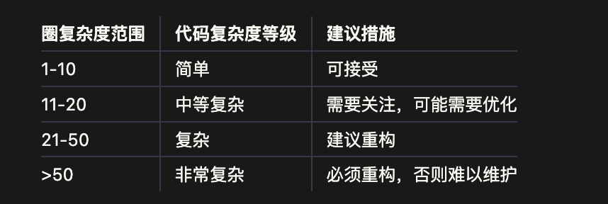

# 圈复杂度

`#前端工程化` 


## 目录
<!-- toc -->
 ## 总结 

- 定义：用于==度量代码复杂度==
- 计算公式
	1. 每个`if`、`else if`、`while`、`for`、`case`等语句，复杂度 ==+1==。
	2. 每个逻辑运算符（如`&&`、`||`）==增加 1==。
	3. 每个`catch`块==增加 1==。
	4. 总体起始值为 `1`
- 评估标准 : → ==10 以内，表示还可以==
	- 
- 如何降低？
	- 减少嵌套，比如提请 return
	- 复杂的函数拆分为多个小函数，每个函数只处理单一逻辑
	- 用**多态或策略模式**替代复杂的`if-else`或`switch-case`逻辑
	- 使用代码质量工具（如 `SonarQube`、ESLint）自动检测圈复杂度，及时优化

## 1. 圈复杂度（Cyclomatic Complexity）详解

- **圈复杂度**是代码质量的一个重要衡量指标，用于评估程序的逻辑复杂度。
- 它通过计算代码中的独立路径数量，来反映代码的复杂性和测试的难度。
- 圈复杂度越高，代码的复杂性越大，维护难度越高，同时需要更多的测试用例来覆盖所有逻辑路径。

---

## 2. 圈复杂度的定义

圈复杂度是根据程序的**控制流图（Control Flow Graph）**计算的，其中：
- **节点**表示程序中的代码块（如语句、条件等）。
- **边**表示代码块之间的控制流（如条件跳转、循环等）。

**公式**：
```
M = E - N + 2P
```

- **M**：圈复杂度
- **E**：图中的边数（Edges）
- **N**：图中的节点数（Nodes）
- **P**：程序的入口点数量（通常为1）

---

## 3. 圈复杂度的直观理解

圈复杂度可以简单地理解为代码中**独立路径的数量**，即程序从开始到结束的所有可能执行路径的数量。  
- **线性代码**（没有分支或循环）：圈复杂度为 1。
- **每增加一个条件分支**（如`if`、`for`、`while`等），圈复杂度增加 1。

---

## 4. 圈复杂度的计算规则

在实际中，我们可以通过以下规则快速估算圈复杂度：
1. 每个`if`、`else if`、`while`、`for`、`case`等语句，复杂度 +1。
2. 每个逻辑运算符（如`&&`、`||`）增加 1。
3. 每个`catch`块增加 1。
4. 总体起始值为 `1`

---

## 5. 圈复杂度的例子

### 5.1. 示例 1：简单代码

```javascript
function add(a, b) {
    return a + b;
}
```
- 圈复杂度：1（没有分支或循环）

### 5.2. 示例 2：带条件分支的代码

```javascript
function checkAge(age) {
    if (age < 18) {
        return 'Minor';
    } else if (age >= 18 && age < 60) {
        return 'Adult';
    } else {
        return 'Senior';
    }
}
```

- 圈复杂度：
	- 初始值为 1
	- 一个`if`语句 +1
	- 一个`else if`语句 +1
	- 一个逻辑运算符`&&` +1
	- 总复杂度：`1 + 1 + 1 + 1 = 4`

### 5.3. 示例 3：带循环的代码

```javascript
function sumArray(arr) {
    let sum = 0;
    for (let i = 0; i < arr.length; i++) {
        if (arr[i] > 0) {
            sum += arr[i];
        }
    }
    return sum;
}
```

- 圈复杂度：
	- 初始值为 1
	- 一个`for`循环 +1
	- 一个`if`条件 +1
	- 总复杂度：`1 + 1 + 1 = 3`

---

## 6. 圈复杂度的意义

### 6.1. **代码可维护性**

圈复杂度越高，代码越复杂，维护成本越高。过高的圈复杂度可能导致：
- 难以理解代码的逻辑。
- 修改代码时容易引入新的问题。

### 6.2. **单元测试**

圈复杂度直接影响测试用例的数量：
- 圈复杂度为 1：只需要一个测试用例。
- 圈复杂度为 N：至少需要 N 个测试用例才能覆盖所有逻辑路径。

### 6.3. **代码重构的参考**

当圈复杂度过高时，可能需要对代码进行重构。例如：
- 将复杂函数拆分为多个小函数。
- 简化条件分支或循环逻辑。

---

## 7. 圈复杂度的标准

以下是圈复杂度的常见评估标准：

| 圈复杂度范围 | 代码复杂度等级 | 建议措施                  |
|--------------|----------------|---------------------------|
| 1-10         | 简单           | 可接受                   |
| 11-20        | 中等复杂       | 需要关注，可能需要优化     |
| 21-50        | 复杂           | 建议重构                 |
| >50          | 非常复杂       | 必须重构，否则难以维护     |

---

## 8. 如何降低圈复杂度？

### 8.1. **减少嵌套**

- 避免过深的`if`、`else`嵌套，可以通过**提前返回**（early return）简化逻辑。
   ```javascript
   // 高复杂度
   function validate(input) {
       if (input) {
           if (input.length > 0) {
               if (input.isValid) {
                   return true;
               }
           }
       }
       return false;
   }

   // 优化后
   function validate(input) {
       if (!input || input.length === 0 || !input.isValid) {
           return false;
       }
       return true;
   }
   ```

### 8.2. **拆分函数**

   - 将复杂的函数拆分为多个小函数，每个函数只处理单一逻辑。
   ```javascript
   // 高复杂度
   function processOrder(order) {
       if (order.isValid) {
           if (order.isPaid) {
               // 处理已支付订单
           } else {
               // 处理未支付订单
           }
       }
   }

   // 优化后
   function validateOrder(order) { ... }
   function processPaidOrder(order) { ... }
   function processUnpaidOrder(order) { ... }
   ```

### 8.3. **使用多态或策略模式**

   - 用**多态或策略模式**替代复杂的`if-else`或`switch-case`逻辑。

### 8.4. **合理使用工具**

   - 使用代码质量工具（如 `SonarQube`、ESLint）自动检测圈复杂度，及时优化。

---

## 9. 总结

圈复杂度是衡量代码复杂性的重要指标，通过分析代码的逻辑路径数量，可以帮助开发者：
- 判断代码的可维护性。
- 评估测试用例的覆盖情况。
- 提示需要重构的复杂代码。

在实际开发中，保持圈复杂度在合理范围内（**通常不超过 10**）是提高代码质量的重要手段。