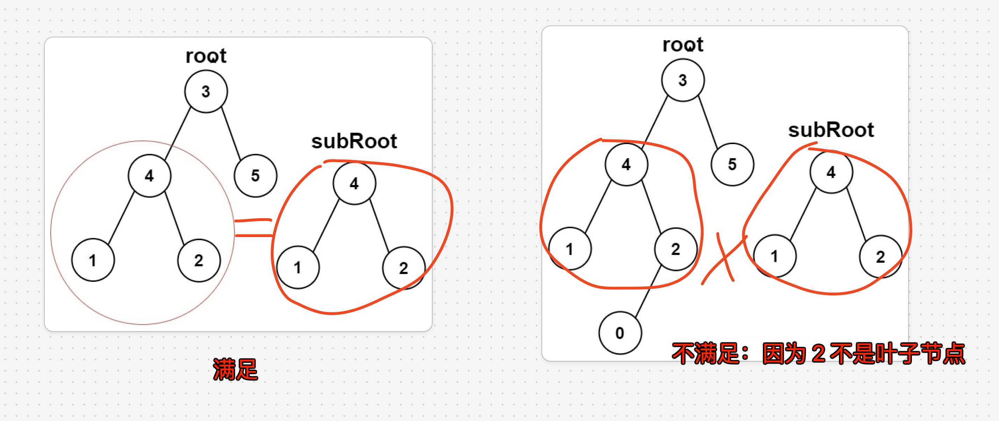

# 另一棵树的子树：root 是否包含 subRoot


> [572. 另一棵树的子树](https://leetcode.cn/problems/subtree-of-another-tree/)




思路：
- 遍历以 `root` 为根的这棵二叉树的所有节点
- 然后用 [302. 算法/65. 二叉树：分解问题的思路/100. 相同的树|100. 相同的树](/post/j5NNIJL0.html#302-算法/65-二叉树分解问题的思路/100-相同的树|100-相同的树) 中的 `isSame` 函数判断`以该节点为根的子树`是否和以 `subRoot` 为根的那棵树相同


```javascript
var isSubtree = function (root, subRoot) {
    if (root === null) return subRoot === null;
    if (isSameTree(root, subRoot)) return true;
    let left = isSubtree(root.left, subRoot);
    let right = isSubtree(root.right, subRoot);
    return left || right;
};

var isSameTree = function (p, q) {
    // 判断一对节点是否相同
    if (p == null && q == null) {
        return true;
    }
    if (p == null || q == null) {
        return false;
    }
    if (p.val != q.val) {
        return false;
    }
    // 判断其他节点是否相同
    return isSameTree(p.left, q.left) && isSameTree(p.right, q.right);
};
```
