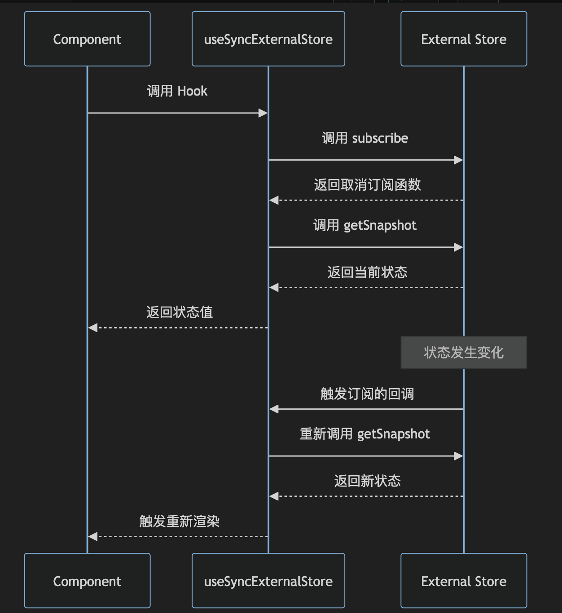

# 使用 useSyncExternalStore 来连接外部状态和 React 组件

`#react` 


## 目录
<!-- toc -->
 ## 1. 总结 

- useSyncExternalStore 是 React 18 引入的一个 Hook，它允许你**订阅外部数据源**，并确保在`并发渲染特性`下数据的**一致性**
	- 比如：
		- localStorage 同步
		- 监听窗口大小
		- 自定义存储等

## 2. 定义和基本概念

### 2.1. 背景

- 随着 React v18 引入并发模式，React 也支持了在处理多个任务时进行优先级调整，这意味着 React 可以“暂停”一个正在进行的渲染任务，切换到另一个更高优先级的任务，然后再回到原来的任务，这使得用户界面响应更快。
- 但也带来了新的挑战，尤其是在状态管理方面——状态管理库需要**确保它们提供的状态始终是最新的和同步的**。
- `useSyncExternalStore`就是为解决并发模式下的状态同步问题而推出的——它提供了一种方法，确保即使在并发更新的情况下，组件也可以同步地从外部存储中获取数据。
- useSyncExternalStore 是 React 18 引入的一个 Hook，它允许你**订阅外部数据源**，并确保在`并发渲染特性`下数据的一致性。
- 这个 Hook 主要用于连接外部状态 和 React 组件

### 2.2. 基本语法

```javascript
const snapshot = useSyncExternalStore(subscribe, getSnapshot, getServerSnapshot?)
```

### 2.3. 参数说明

useSyncExternalStore 实际上是一个用于安全地连接`外部数据源`和 `React组件`的桥，如下图



- subscribe：订阅函数，当**存储更改时**调用回调
	- 其作用是订阅外部存储的变化。当外部存储发生变化时，它应该调用传入的 `callback`
	- 这个函数应该`返回`一个取消订阅的函数。这样，当组件被卸载或订阅被重新创建时，我们可以确保没有内存泄漏或无效的回调调用
- getSnapshot：返回**存储**当前值的函数
	- 其作用是从外部存储中获取当前的数据快照
	- 每次组件渲染时，`useSyncExternalStore`都会调用此函数来读取当前的数据状态
- getServerSnapshot：（可选）返回服务器端初始值的函数
	- 与 `getSnapshot` 类似，但它是为服务端渲染（SSR）或 预渲染时使用的
	- 在客户端首次渲染或 hydrate 操作期间，React 会使用此函数而不是`getSnapshot`来读取数据的初始状态。这是为了确保在服务端渲染的内容与客户端的初始内容匹配，从而避免不必要的重新渲染和闪烁。
	- 如果你的应用不涉及服务端渲染，那么不需要这个参数。

## 3. 主要使用场景

1. 外部状态管理
   - 订阅浏览器 API（如 localStorage、window size）
   - 集成第三方状态管理库
   - 自定义状态管理系统
2. 并发渲染安全
   - 需要在并发特性下保持数据一致性
   - 处理外部数据源的订阅
   - 确保渲染期间数据不变 

## 4. 详细使用案例

### 4.1. 案例1：监听窗口大小

```javascript
function useWindowSize() {
  const getSnapshot = () => ({
    width: window.innerWidth,
    height: window.innerHeight
  });

  const subscribe = (callback) => {
    window.addEventListener('resize', callback);
    return () => window.removeEventListener('resize', callback);
  };

  return useSyncExternalStore(subscribe, getSnapshot);
}

// 使用示例
function WindowSizeComponent() {
  const size = useWindowSize();
  
  return (
    <div>
      Current window size: {size.width} x {size.height}
    </div>
  );
}
```

### 4.2. 案例2：自定义存储

```javascript
const createStore = (initialState) => {
  let state = initialState;
  const listeners = new Set();

  return {
    subscribe(listener) {
      listeners.add(listener);
      return () => listeners.delete(listener);
    },
    getSnapshot() {
      return state;
    },
    setState(newState) {
      state = typeof newState === 'function' ? newState(state) : newState;
      listeners.forEach(listener => listener());
    }
  };
};

const store = createStore({ count: 0 });

function Counter() {
  const state = useSyncExternalStore(
    store.subscribe,
    store.getSnapshot
  );

  return (
    <div>
      Count: {state.count}
      <button onClick={() => store.setState(s => ({ count: s.count + 1 }))}>
        Increment
      </button>
    </div>
  );
}
```

### 4.3. 案例3：localStorage 同步

```javascript
function useLocalStorage(key, initialValue) {
  const getSnapshot = () => {
    try {
      const item = window.localStorage.getItem(key);
      return item ? JSON.parse(item) : initialValue;
    } catch (error) {
      console.error(error);
      return initialValue;
    }
  };

  const subscribe = (callback) => {
    window.addEventListener('storage', callback);
    return () => window.removeEventListener('storage', callback);
  };

  const value = useSyncExternalStore(subscribe, getSnapshot);

  const setValue = (newValue) => {
    try {
      const valueToStore = newValue instanceof Function ? newValue(value) : newValue;
      window.localStorage.setItem(key, JSON.stringify(valueToStore));
      window.dispatchEvent(new Event('storage'));
    } catch (error) {
      console.error(error);
    }
  };

  return [value, setValue];
}
```

## 5. 注意事项和最佳实践

### 5.1. getSnapshot 应该返回不可变的值

`useSyncExternalStore`依赖`getSnapshot`函数返回的值来决定是否重新渲染

```javascript hl:2,10
function getSnapshot() {
  // 🔴 getSnapshot 不要总是返回不同的对象
  return {
    todos: myStore.todos
  };
}


function getSnapshot() {
  // ✅ 你可以返回不可变数据
  return myStore.todos;
}
```

### 5.2. 避免在每次渲染时创建新的订阅函数，所以 `subscribe`不要放在组件内定义

正确的做法是把 `subscribe` 函数移到组件外部，这样它在组件的整个生命周期中都保持不变；或者使用 `useCallback` 钩子来缓存 `subscribe` 函数。

### 5.3. 服务器端渲染

```javascript
const useStore = (store) => {
  return useSyncExternalStore(
    store.subscribe,
    store.getSnapshot,
    // 服务器端快照
    () => store.getServerSnapshot()
  );
};
```

### 5.4. 记得错误处理

```javascript
const getSnapshot = () => {
  try {
    return someExternalAPI.getValue();
  } catch (error) {
    console.error('Failed to get snapshot:', error);
    return defaultValue;
  }
};
```

## 6. 最后

虽然`useImperativeHandle`对于应用开发者来说不是必要的，但如果你想拓展对 React 生态圈的认识，依然有必要了解一下`useImperativeHandle`的用法和使用场景，因为它能帮助你未来更好地理解优秀的第三方库的设计。