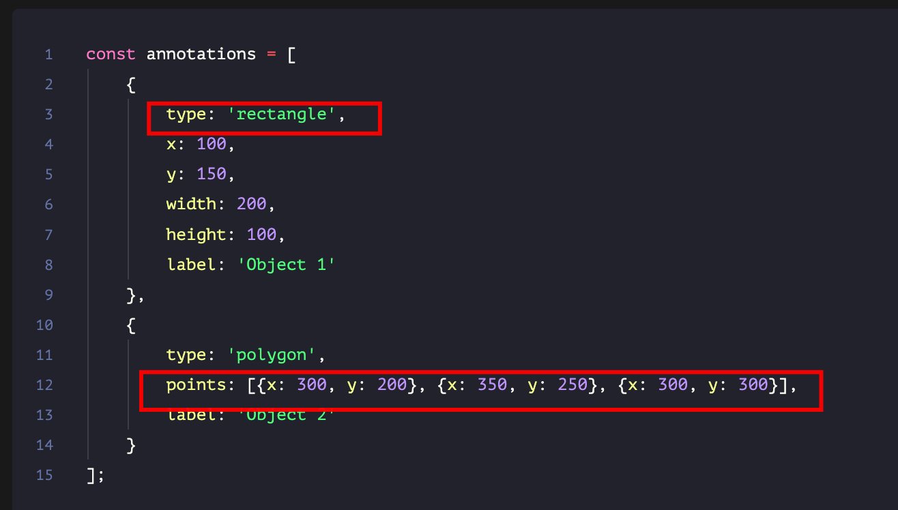

# UI 标记工具设计

`#系统设计` `#前端系统设计` 


## 目录
<!-- toc -->
 ## 1. 总结 

- 数据结构设计与存储
	- 标记数据结构
		- 
- 图像渲染和交互层
	- `canvas.addEventListener('mousedown、mouseup、wheel')` 等
- 绘制和编辑功能
	- Canvas API
- 坐标系统和缩放处理
- 数据导出和集成
	- 可导出 JSON 数据结构
- 更多特性
	- 如多种标注形状、标签管理、撤销/重做功能、缩放和平移等
- 建议使用专门的库（如 `Fabric.js` 或 Konva.js ）

## 2. 原理

从下面几个关键点来解释这些工具的工作原理：

1. 图像渲染和交互层
2. 数据结构和存储
3. 绘制和编辑功能
4. 坐标系统和缩放处理
5. 数据导出和集成

### 2.1. 图像渲染和交互层

```javascript hl:14
const canvas = document.createElement('canvas');
const ctx = canvas.getContext('2d');

// 加载图像
const image = new Image();
image.onload = () => {
    canvas.width = image.width;
    canvas.height = image.height;
    ctx.drawImage(image, 0, 0);
};
image.src = 'path/to/image.jpg';

// 添加交互层
canvas.addEventListener('mousedown', handleMouseDown);
canvas.addEventListener('mousemove', handleMouseMove);
canvas.addEventListener('mouseup', handleMouseUp);
```

这段代码展示了如何创建一个基本的画布并加载图像。

交互层通过`事件监听器`实现，允许用户与图像进行交互。

### 2.2. 数据结构和存储

对于**标记数据**，我们可以使用类似以下的数据结构：

```javascript
const annotations = [
    {
        type: 'rectangle',
        x: 100,
        y: 150,
        width: 200,
        height: 100,
        label: 'Object 1'
    },
    {
        type: 'polygon',
        points: [{x: 300, y: 200}, {x: 350, y: 250}, {x: 300, y: 300}],
        label: 'Object 2'
    }
];
```

这种结构可以轻松地序列化为JSON，方便存储和传输。

### 2.3. 绘制和编辑功能

绘制功能可以通过Canvas API实现：

```javascript
function drawAnnotations() {
    annotations.forEach(annotation => {
        ctx.beginPath();
        if (annotation.type === 'rectangle') {
            ctx.rect(annotation.x, annotation.y, annotation.width, annotation.height);
        } else if (annotation.type === 'polygon') {
            ctx.moveTo(annotation.points[0].x, annotation.points[0].y);
            annotation.points.slice(1).forEach(point => {
                ctx.lineTo(point.x, point.y);
            });
            ctx.closePath();
        }
        ctx.stroke();
    });
}
```

编辑功能可以通过检测鼠标位置是否在标注区域内来实现。

### 2.4. 坐标系统和缩放处理

处理缩放时，需要在原始坐标和显示坐标之间进行转换：

```javascript hl:19
let scale = 1;

function scaleCoordinates(x, y) {
    return {
        x: x / scale,
        y: y / scale
    };
}

function handleZoom(event) {
    const delta = event.deltaY;
    scale += delta > 0 ? -0.1 : 0.1;
    scale = Math.max(0.1, Math.min(scale, 5)); // 限制缩放范围

    // 重新绘制画布
    redrawCanvas();
}

canvas.addEventListener('wheel', handleZoom);
```

### 2.5. 数据导出和集成

数据导出可以简单地将annotations数组转换为JSON：

```javascript
function exportAnnotations() {
    return JSON.stringify(annotations);
}
```

## 3. React 简易实现

为了更好地理解这些原理，我们可以创建一个简单的UI标记工具的原型。这里我会使用 React 和 Canvas API 来实现一个基础版本：

```jsx
import React, { useRef, useEffect, useState } from 'react';

const AnnotationTool = () => {
    const canvasRef = useRef(null);
    const [annotations, setAnnotations] = useState([]);
    const [currentAnnotation, setCurrentAnnotation] = useState(null);
    const [isDrawing, setIsDrawing] = useState(false);

    useEffect(() => {
        const canvas = canvasRef.current;
        const ctx = canvas.getContext('2d');
        const image = new Image();
        image.onload = () => {
            canvas.width = image.width;
            canvas.height = image.height;
            ctx.drawImage(image, 0, 0);
            drawAnnotations();
        };
        image.src = 'path/to/your/image.jpg';
    }, []);

    const drawAnnotations = () => {
        const canvas = canvasRef.current;
        const ctx = canvas.getContext('2d');
        ctx.clearRect(0, 0, canvas.width, canvas.height);
        ctx.drawImage(image, 0, 0);

        annotations.forEach(ann => {
            ctx.beginPath();
            ctx.rect(ann.x, ann.y, ann.width, ann.height);
            ctx.stroke();
        });

        if (currentAnnotation) {
            ctx.beginPath();
            ctx.rect(
                currentAnnotation.x,
                currentAnnotation.y,
                currentAnnotation.width,
                currentAnnotation.height
            );
            ctx.stroke();
        }
    };

    const handleMouseDown = (e) => {
        const { offsetX, offsetY } = e.nativeEvent;
        setCurrentAnnotation({ x: offsetX, y: offsetY, width: 0, height: 0 });
        setIsDrawing(true);
    };

    const handleMouseMove = (e) => {
        if (!isDrawing) return;
        const { offsetX, offsetY } = e.nativeEvent;
        setCurrentAnnotation(prev => ({
            ...prev,
            width: offsetX - prev.x,
            height: offsetY - prev.y
        }));
        drawAnnotations();
    };

    const handleMouseUp = () => {
        setIsDrawing(false);
        if (currentAnnotation) {
            setAnnotations([...annotations, currentAnnotation]);
            setCurrentAnnotation(null);
        }
    };

    return (
        <div>
            <canvas
                ref={canvasRef}
                onMouseDown={handleMouseDown}
                onMouseMove={handleMouseMove}
                onMouseUp={handleMouseUp}
            />
            <button onClick={() => console.log(JSON.stringify(annotations))}>
                Export Annotations
            </button>
        </div>
    );
};

export default AnnotationTool;
```

## 4. 总结

- 实际的 UI标记工具会更复杂，可能包括更多的特性，如多种标注形状、标签管理、撤销/重做功能、缩放和平移等。
- 上面的例子展示了核心原理
- 在实际开发中，可能会使用专门的库（如 `Fabric.js` 或 Konva.js ）来处理更复杂的交互和渲染需求。
