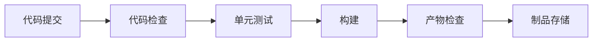

# 前端基础建设工作：CI&CD

`#devops` 

## 目录
<!-- toc -->
 ## 1. 前期调研与规划 

### 1.1. 现状评估

- 梳理现有前端项目情况
	- 技术栈分布
	- 构建工具使用情况
	- 收集团队成员的反馈和需求
	- 发布流程痛点
		- 当前构建部署流程的痛点
	- 开发效率瓶颈
- 团队成员**技术水平评估**
- **现有基础设施**情况摸底

### 1.2. 制定规划路线图（Roadmap）

- 设定短期和长期目标
- 制定技术路线图（`Roadmap`）
- 确定优先级和里程碑
- 评估所需资源和时间投入

1. 短期目标（0-3个月）
	- 解决最紧急的痛点问题
	- 建立基础规范
	- 完成核心工具选型

2. 中期目标（3-6个月）
	- 构建自动化流程
	- 完善工具链
	- 建立监控体系

3. 长期目标（6-12个月）
	- 打造完整的前端基础设施
	- 建立效率度量体系
	- 持续优化和迭代

## 2. 技术标准化建设

### 2.1. 代码规范

- **制定统一规范**
	- JavaScript/TypeScript 编码规范
	- CSS/SCSS 编写规范
	- Git commit 提交规范
	- 项目结构规范

- **工具支持**
	- ESLint 配置
	- Prettier 格式化
	- StyleLint 样式检查
	- Husky + lint-staged 提交检查

### 2.2. 项目模板标准化

- **统一脚手架**
	- 开发基础脚手架工具
	- 支持多框架模板
	- 集成常用工具和配置

- **组件库建设**
	- 设计规范
	- 基础组件开发
	- 文档建设
	- 版本管理

## 3. 构建系统优化

### 3.1. 构建工具链优化

1. **构建工具选型**
	- Webpack/Vite 等构建工具评估
	- 模块化策略
	- 构建性能优化

2. **构建配置标准化**
	- 统一构建配置
	- ==多环境==支持
	- 构建产物优化

### 3.2. 依赖管理

1. **包管理策略**
	- Monorepo 方案评估（如 pnpm workspace）
	- 依赖版本控制
	- 私有 npm 仓库建设

2. **依赖安全**
	- 依赖安全扫描
	- 版本更新策略
	- 漏洞修复流程

## 4. CI/CD 流程建设

### 4.1. 持续集成（CI）

#### 4.1.1. **自动化流程**

> 制片存储？

#### 4.1.2. **质量把控**

   - 自动化测试
	   - 自动化测试？
   - 代码质量检查
	   - sonar 
   - 构建产物分析
	   - 产物分析

### 4.2. 持续部署（CD）

1. **发布系统建设**
	- 环境管理
	- 灰度发布
	- 回滚机制
	- 发布审批流程

2. **部署策略**
	- 静态资源部署
	- CDN 分发
	- 缓存策略

## 5. 监控与运维

### 5.1. 性能监控

- **监控指标**
	- 页面加载性能
	- 运行时性能
	- 资源加载情况
	- 用户交互性能

>  可考虑部署 sentry 等工具，sentry 也内置了 rrweb 等

- **监控系统**
	- 错误监控
	- 性能监控
	- 用户行为分析

### 5.2. 运维支持

1. **日志系统**
	- 日志收集
	- 错误追踪
	- 问题定位

2. **告警机制**
	- 异常告警
	- 性能告警
	- 服务可用性监控

## 6. 效能提升与工具建设

### 6.1. 开发效率工具

1. **CLI 工具**
	- 项目创建
	- 开发辅助
	- 发布工具

2. **可视化平台**
	- 项目管理
	- 发布控制台
	- 监控面板

### 6.2. 文档与知识沉淀

1. **文档体系**
	- 技术文档
	- 最佳实践
	- 问题解决方案

2. **知识分享**
	- 技术分享会
	- 经验复盘
	- 新人培训

## 7. 持续优化

### 7.1. 定期评估

- 收集团队反馈
- 分析效率指标
- 识别优化机会

### 7.2. 技术演进

- 跟踪技术发展
- 评估新技术引入
- 制定技术升级计划

## 8. 实施要点

1. **循序渐进**
	- 从最急需的问题开始
	- 保证系统稳定性
	- 逐步推进改进

2. **团队协作**
	- 充分沟通
	- 收集反馈
	- 及时调整

3. **度量成效**
	- 建立度量指标
	- 定期复盘
	- 持续改进

4. **文化建设**
	- 推广**工程化理念**
	- 培养技术氛围
	- 鼓励创新

