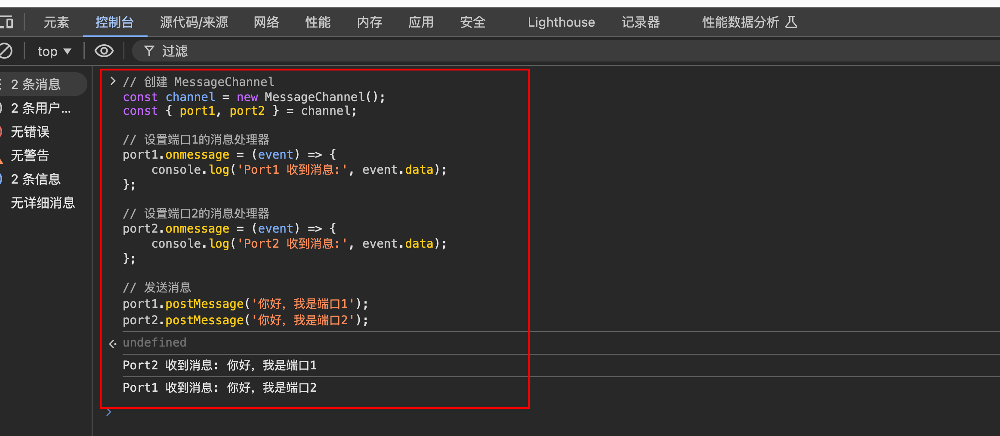

# MessageChannel

`#bom` 

MessageChannel 是 HTML5 中的一个 API
- 它提供了一种在**不同的浏览器上下文（如窗口、标签页、iframe）之间**建立双向通信通道的方法。
- 每个 MessageChannel 都有两个 **MessagePort 对象**，它们分别代表通道的**两个端点**。


## 目录
<!-- toc -->
 ## 1. MessageChannel 的基本结构 

```javascript hl:5
// 创建一个新的消息通道
const channel = new MessageChannel();

// channel.port1 和 channel.port2 是两个端口
const port1 = channel.port1;
const port2 = channel.port2;


const { port1, port2 } = channel;

// port1 和 port2 是唯一的两个端口
console.log(Object.keys(channel)); // ['port1', 'port2']
```

>  **如果需要多个端口通信，可以使用多个 MessageChannel**

## 2. 基本使用方式

```javascript
// 创建消息通道
const channel = new MessageChannel();

// 设置 port1 的消息处理程序
channel.port1.onmessage = (event) => {
    console.log('Port1 收到消息:', event.data);
};

// 通过 port2 发送消息
channel.port2.postMessage('你好，这是来自 Port2 的消息');
```

### 2.1. 简单示例：在控制台中直接可执行



```javascript
// 创建 MessageChannel
const channel = new MessageChannel();
const { port1, port2 } = channel;

// 设置端口1的消息处理器
port1.onmessage = (event) => {
    console.log('Port1 收到消息:', event.data);
};

// 设置端口2的消息处理器
port2.onmessage = (event) => {
    console.log('Port2 收到消息:', event.data);
};

// 发送消息
port1.postMessage('你好，我是端口1');
port2.postMessage('你好，我是端口2');

```

## 3. 主要使用场景

### 3.1. Web Worker 通信

#### 3.1.1. 主进程代码

```javascript
// 主线程
const worker = new Worker('worker.js');
const channel = new MessageChannel();

// 将 port2 传递给 Worker
worker.postMessage({ port: channel.port2 }, [channel.port2]);

// 监听 port1 的消息
channel.port1.onmessage = (event) => {
    console.log('从 Worker 收到消息:', event.data);
};


```

#### 3.1.2. worker.js 

```javascript
// worker.js 中的代码
self.onmessage = (event) => {
    const port = event.data.port;
    port.postMessage('Worker 发送的消息');
};
```

### 3.2. iframe 之间的通信

#### parent.html

```html
<!-- parent.html -->
<!DOCTYPE html>
<html>
<body>
    <iframe src="child.html" id="myIframe"></iframe>
    <button onclick="sendMessage()">发送消息到iframe</button>
    
    <script>
        const iframe = document.getElementById('myIframe');
        
        iframe.onload = () => {
            // 创建 MessageChannel
            const channel = new MessageChannel();
            
            // 监听来自iframe的消息
            channel.port1.onmessage = (event) => {
                console.log('主页面收到消息:', event.data);
            };
            
            // 将port2传递给iframe
            iframe.contentWindow.postMessage('端口传递', '*', [channel.port2]);
        };
        
        function sendMessage() {
            channel.port1.postMessage('来自主页面的消息');
        }
    </script>
</body>
</html>


```

#### child.html

```html
<!-- child.html -->
<!DOCTYPE html>
<html>
<body>
    <button onclick="sendToParent()">发送消息到父页面</button>
    <script>
        let port;
        // 接收来自父页面的端口
        window.onmessage = (event) => {
            if (event.ports && event.ports.length) {
                port = event.ports[0];
                // 设置消息处理器
                port.onmessage = (e) => {
                    console.log('iframe收到消息:', e.data);
                };
            }
        };
        function sendToParent() {
            port.postMessage('来自iframe的消息');
        }
    </script>
</body>
</html>
```

### 3.3. 微前端架构中的通信

```javascript hl:1,12
// 主应用
const channel = new MessageChannel();
const microApp = document.querySelector('#micro-app');

microApp.contentWindow.postMessage({ type: 'init', port: channel.port2 }, '*', [channel.port2]);

channel.port1.onmessage = (event) => {
    console.log('从微应用收到消息:', event.data);
};

// 微应用中
window.addEventListener('message', (event) => {
    if (event.data.type === 'init') {
        const port = event.ports[0];
        // 使用 port 进行通信
    }
});
```

### 3.4. 组件间隔离通信

```javascript hl:1,10
// 组件 A
const channelA = new MessageChannel();
const componentB = document.querySelector('#componentB');

componentB.port = channelA.port2;
channelA.port1.onmessage = (event) => {
    console.log('组件A收到消息:', event.data);
};

// 组件 B
const port = this.port; // 从组件属性中获取
port.postMessage('从组件B发送消息');
```

### 3.5. 广播通道

可以创建一个广播系统，where`多个窗口或标签页`可以订阅和接收消息

## 4. MessageChannel 的优势

1. 双向通信：两个端口都可以发送和接收消息
2. 安全性：比直接使用 postMessage 更安全，因为通信是**点对点**的
3. 隔离性：不同的通道之间互不干扰
4. 性能：适合频繁通信的场景，性能较好

## 5. 注意事项

### 5.1. 端口传输：端口在传输时需要使用可转移对象（Transferable Objects）

```javascript
// 正确的传输方式
postMessage({ port: port2 }, [port2]);
```

### 5.2. 端口关闭：不再需要时应该关闭端口

```javascript
port1.close();
port2.close();
```

### 5.3. 错误处理：应该添加错误处理机制

```javascript
channel.port1.onerror = (error) => {
    console.error('通信错误:', error);
};
```
