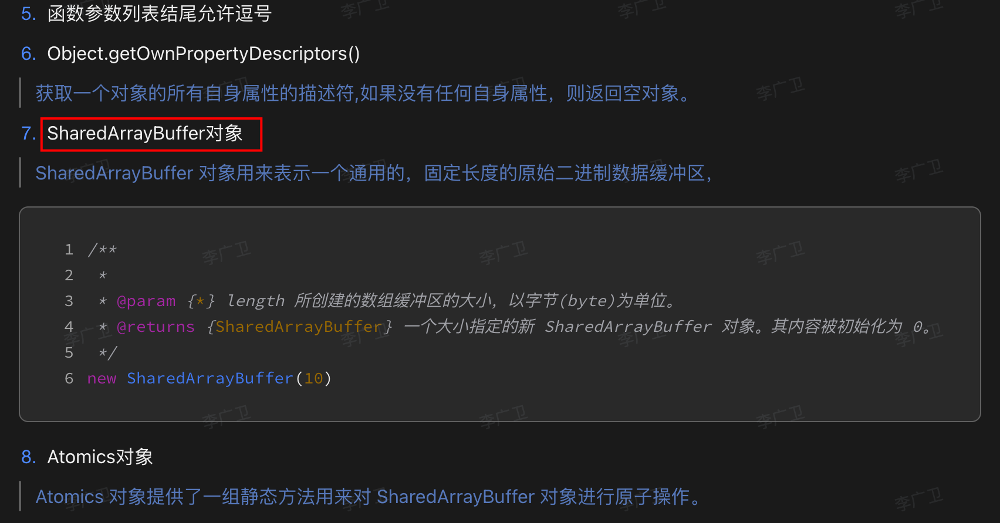
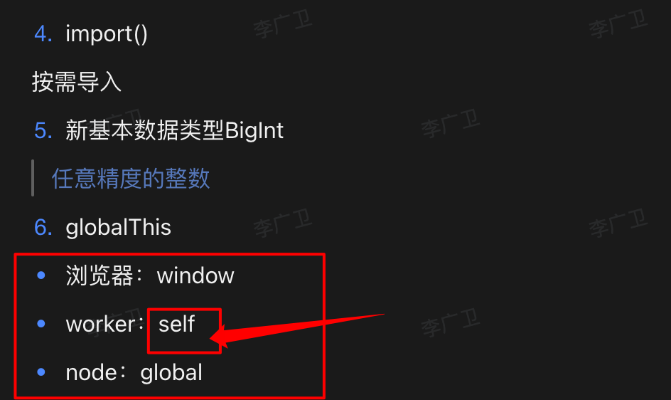
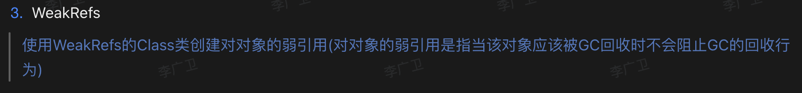
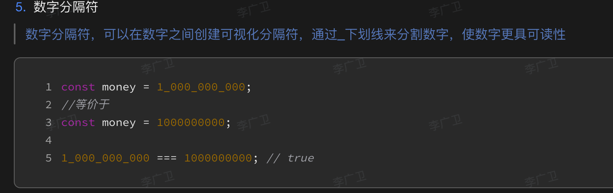

# ES6（ES2015） 到 ES2024 的主要特性

`#javascript` 


## 目录
<!-- toc -->
 ## ES6 (ES2015) - 最重要的版本 

```javascript
// 1. let 和 const
let x = 1;
const y = 2;

// 2. 箭头函数
const fn = () => {};

// 3. 解构赋值
const [a, b] = [1, 2];
const {name} = {name: 'test'};

// 4. 模板字符串
const str = `Hello ${name}`;

// 5. Class 语法
class Person {
    constructor() {}
}

// 6. Promise
new Promise((resolve, reject) => {});

// 7. 模块化
import/export

// 8. 默认参数
function fn(x = 1) {}

// 9. 展开运算符
[...array]
```

## ES2016

```javascript
// 1. 指数运算符
2 ** 3

// 2. Array.includes()
[1,2].includes(1)
```

## ES2017

```javascript
// 1. async/await
async function fn() {
    await promise;
}

// 2. Object.values/entries
Object.values({a: 1})
Object.entries({a: 1})

// 3. String padding
'1'.padStart(2, '0')
```



## ES2018

```javascript
// 1. Rest/Spread 属性
const {a, ...rest} = obj;

// 2. 异步迭代 for-of
for await (const x of array) {}

// 3. Promise.finally()
promise.finally()
```

## ES2019

```javascript hl:3
// 1. Array.flat/flatMap
[1, [2]].flat()
// 它结合了 `map()` 和 `flat()` 的功能，可以同时完成映射和扁平化操作
array.flatMap()  

// 2. Object.fromEntries
Object.fromEntries(['a', 1](/post/m0U6Vfdo.html#'a',-1))

// 3. String.trimStart/trimEnd
str.trimStart()
```

## ES2020

```javascript hl:5
// 1. 可选链操作符
obj?.prop

// 2. 空值合并操作符
null ?? 'default'

// 3. BigInt
const big = 9007199254740991n

// 4. Promise.allSettled
Promise.allSettled([p1, p2])
```

### globalThis



## ES2021

```javascript
// 1. 逻辑赋值运算符
x ||= y   => x = x||y
x &&= y   => x = x&&y
x ??= y   => x = x??y

// 2. String.replaceAll
'abc'.replaceAll('a', 'b')

// 3. Promise.any
Promise.any([p1, p2])
```





## ES2022

```javascript hl:4
// 1. Class 字段
class A {
    x = 1;
    `#private` = 2;
    static y = 3;
}

// 2. Top-level await
await promise;

// 3. Array.at()
array.at(-1) 
[1,2,3].at(0)  // 1
[1,2,3].at(1)  // 2
[1,2,3].at(2)  // 3
```

## ES2023

```javascript
// 1. Array 查找从后向前
array.findLast()
array.findLastIndex()

// 2. Hashbang Grammar
`#!/usr/bin/env` node

// 3. WeakMap 支持 Symbol 键
```

## ES2024 (提案阶段)

```javascript
// 1. Promise.withResolvers
const {promise, resolve, reject} = Promise.withResolvers()
// 更优雅的方式来处理 Promise 的创建和控制,不用包在 Promise 里面了
// 看起来更线性了


// 2. 新增 RegExp v flag
/foo/v.test('foo')

// 3. String.prototype.isWellFormed
str.isWellFormed()
str.toWellFormed()
```

## 重要性排序（TOP 10）

1. let/const
2. 箭头函数
3. async/await
4. 解构赋值
5. Promise
6. 模块化(import/export)
7. Class 语法
8. 可选链(`?.`)
9. 展开运算符(`...`)
10. 模板字符串
