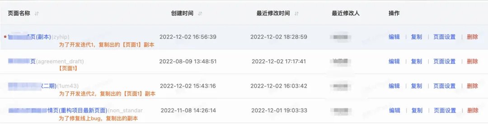
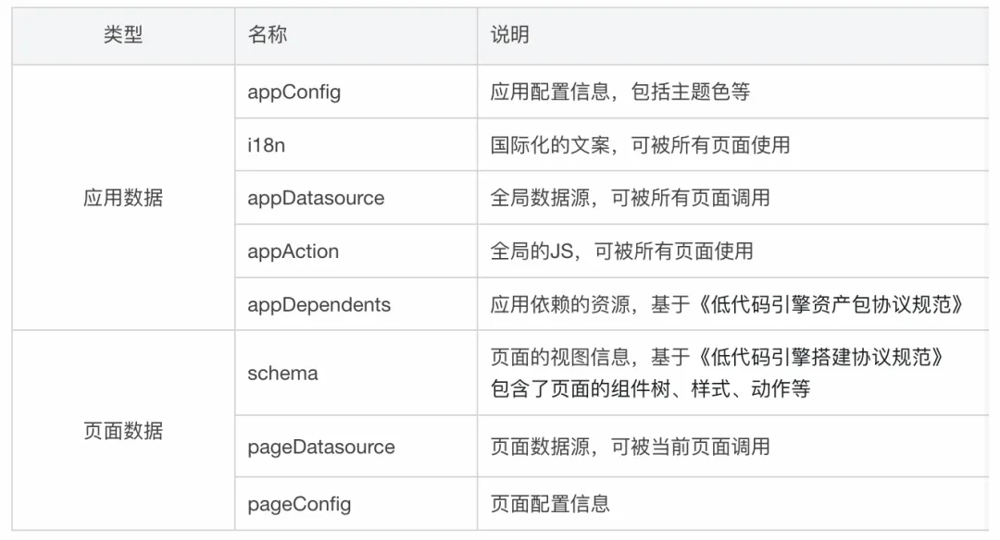
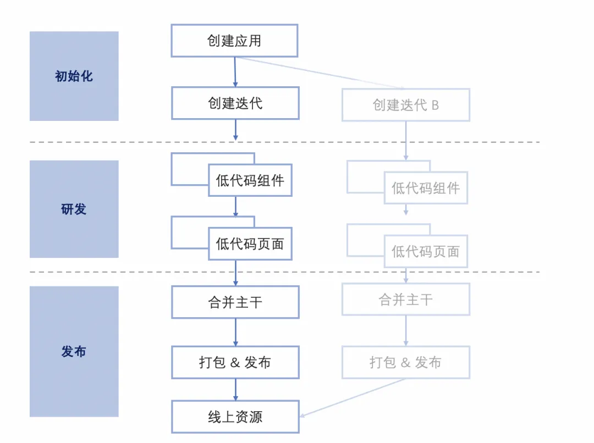
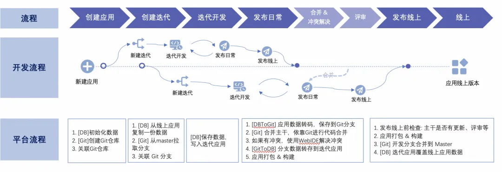
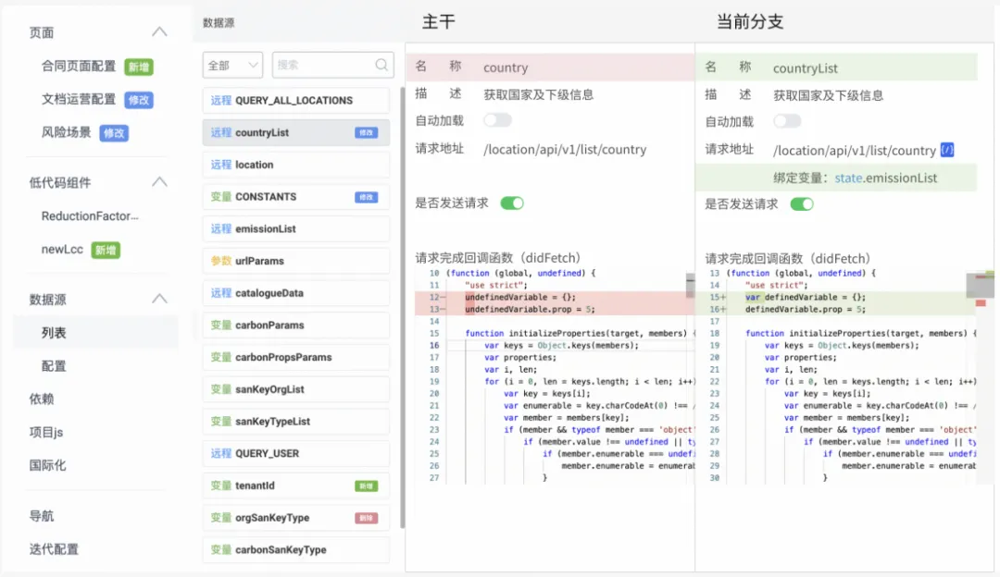

# 调研：低代码开发如何协同？

`#lowcode` 

## 目录
<!-- toc -->
 ## 1. 背景 

- 不支持**并行开发**
	- 导致开发人员的闲置，限制了开发时长和协同方式。
- **不支持迭代模式**。
	- 不具备隔离性，无法支持复杂应用生命周期的迭代需求，尤其对于快速迭代升级的业务，导致迭代成本非常高。
- **无法合并修改**。
	- 复杂、无规范的手动合并流程，只有对协议很熟悉的专业人士才能操作，导致合并和验证成本提高。
		- 比如，下面这个
			- 

## 2. 当下解法

- 约定：即通过适当的进行拆分解耦
	- page1 你来，page2 我来
- 锁定 🔒
	- 这个我正在配置，你别来

## 3. 好的解法

### 3.1. 首先使用标准数据存储，别直接保存大 JSON

- 应用的所有数据，都是以**结构化数据**的格式存储于**数据库**中。
- 数据包括了两种类型，每个应用都会有一份全局的**应用数据**，关联多个**页面数据**

### 3.2. 借鉴传统研发模式

## 4. 参考

- https://mp.weixin.qq.com/s/DmwxL67htHfTUP1U966N-Q