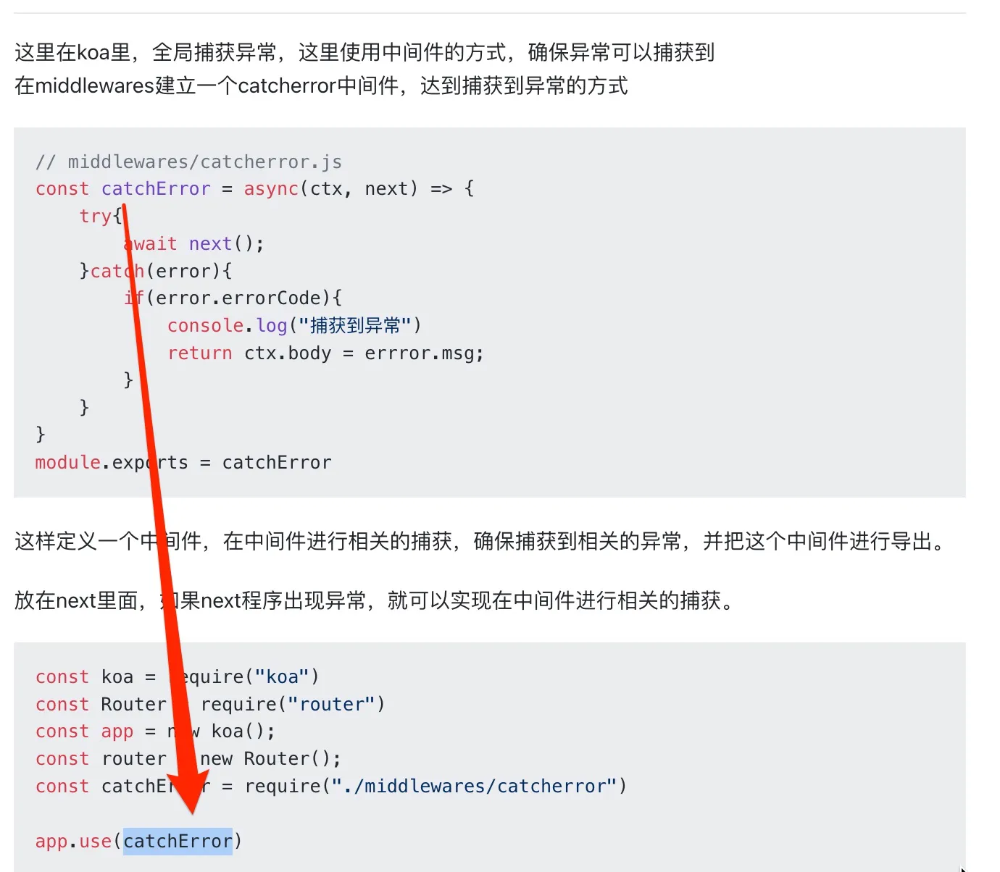

# Node.js 中异常捕获和容错的常见处理方式

`#nodejs` 

## 目录
<!-- toc -->
 ## 1. try-catch 捕获同步异常 

```javascript
// 基本的同步异常捕获
function syncOperation() {
    try {
        const result = JSON.parse('{"invalid": json}');
        return result;
    } catch (error) {
        console.error('同步错误:', {
            name: error.name,
            message: error.message,
            stack: error.stack
        });
        // 可以返回默认值或重新抛出错误
        return { error: true };
    }
}
```

## 2. Promise 异常处理

```javascript
// Promise 链式调用异常处理
async function asyncOperation() {
    try {
        const result = await fetch('https://api.example.com/data')
            .then(response => response.json())
            .catch(error => {
                console.error('Fetch 错误:', error);
                return null;
            });

        if (!result) {
            throw new Error('获取数据失败');
        }

        return result;
    } catch (error) {
        console.error('异步操作错误:', error);
        return null;
    }
}

// Promise.all 错误处理
async function multipleAsyncOperations() {
    try {
        const promises = [
            fetch('https://api1.example.com'),
            fetch('https://api2.example.com'),
            fetch('https://api3.example.com')
        ];

        const results = await Promise.all(
            promises.map(p => p.catch(error => {
                console.error('单个请求失败:', error);
                return null;
            }))
        );

        return results.filter(result => result !== null);
    } catch (error) {
        console.error('批量请求错误:', error);
        return [];
    }
}
```

## 3. 全局未捕获异常处理：process

```javascript hl:2,17,16
// 未捕获的异常处理
process.on('uncaughtException', (error) => {
    console.error('未捕获的异常:', {
        error: error,
        time: new Date().toISOString(),
        pid: process.pid
    });
    
    // 记录错误日志
    logError(error);
    
    // 优雅退出（建议在处理完关键操作后退出）
    process.exit(1);
});

// 未处理的 Promise 拒绝
process.on('unhandledRejection', (reason, promise) => {
    console.error('未处理的 Promise 拒绝:', {
        reason: reason,
        time: new Date().toISOString(),
        pid: process.pid
    });
    
    // 记录错误日志
    logError(reason);
});

// 自定义错误日志记录函数
function logError(error) {
    // 这里可以实现错误日志记录逻辑
    // 比如写入文件或发送到日志服务
}
```

## 4. Express 错误处理中间件

```javascript
const express = require('express');
const app = express();

// 自定义错误类
class AppError extends Error {
    constructor(statusCode, message) {
        super(message);
        this.statusCode = statusCode;
        this.status = `${statusCode}`.startsWith('4') ? 'fail' : 'error';
        this.isOperational = true;

        Error.captureStackTrace(this, this.constructor);
    }
}

// 异步函数错误捕获包装器
const catchAsync = fn => {
    return (req, res, next) => {
        fn(req, res, next).catch(next);
    };
};

// 路由处理
app.get('/api/data', catchAsync(async (req, res) => {
    const data = await fetchData();
    if (!data) {
        throw new AppError(404, '数据不存在');
    }
    res.json(data);
}));

// 404 错误处理
app.use((req, res, next) => {
    next(new AppError(404, '找不到请求的资源'));
});

// 全局错误处理中间件
app.use((error, req, res, next) => {
    error.statusCode = error.statusCode || 500;
    error.status = error.status || 'error';

    // 开发环境错误响应
    if (process.env.NODE_ENV === 'development') {
        res.status(error.statusCode).json({
            status: error.status,
            error: error,
            message: error.message,
            stack: error.stack
        });
    } 
    // 生产环境错误响应
    else {
        // 操作型错误：发送给客户端
        if (error.isOperational) {
            res.status(error.statusCode).json({
                status: error.status,
                message: error.message
            });
        } 
        // 程序型错误：不暴露详细信息
        else {
            console.error('ERROR 💥', error);
            res.status(500).json({
                status: 'error',
                message: '服务器内部错误'
            });
        }
    }
});
```

## 5. 数据库操作错误处理

```javascript
const mongoose = require('mongoose');

// MongoDB 连接错误处理
mongoose.connect('mongodb://localhost/myapp', {
    useNewUrlParser: true,
    useUnifiedTopology: true
})
.then(() => console.log('数据库连接成功'))
.catch(error => {
    console.error('数据库连接失败:', error);
    process.exit(1);
});

// 数据库操作错误处理
async function databaseOperation() {
    const session = await mongoose.startSession();
    try {
        session.startTransaction();

        // 执行数据库操作
        await Model.create([{ data: 'example' }], { session });

        await session.commitTransaction();
    } catch (error) {
        await session.abortTransaction();
        throw error;
    } finally {
        session.endSession();
    }
}
```

## 6. 事件触发器错误处理

```javascript hl:21
const EventEmitter = require('events');

class MyEmitter extends EventEmitter {
    execute() {
        try {
            this.emit('start');
            // 某些操作
            if (error) {
                this.emit('error', new Error('操作失败'));
            }
            this.emit('end');
        } catch (error) {
            this.emit('error', error);
        }
    }
}

const myEmitter = new MyEmitter();

// 错误事件监听
myEmitter.on('error', (error) => {
    console.error('事件错误:', error);
});

// 其他事件监听
myEmitter.on('start', () => console.log('开始执行'));
myEmitter.on('end', () => console.log('执行完成'));
```

## 7. 定时器错误处理

```javascript hl:1,10
class SafeInterval {
    constructor(callback, interval) {
        this.callback = callback;
        this.interval = interval;
        this.timer = null;
    }

    start() {
        this.timer = setInterval(() => {
            try {
                this.callback();
            } catch (error) {
                console.error('定时器执行错误:', error);
                this.stop(); // 发生错误时停止定时器
            }
        }, this.interval);
    }

    stop() {
        if (this.timer) {
            clearInterval(this.timer);
            this.timer = null;
        }
    }
}

// 使用示例
const safeTimer = new SafeInterval(() => {
    // 定时执行的操作
}, 1000);

safeTimer.start();
```

## 8. 错误监控和报警

```javascript hl:31,38
class ErrorMonitor {
    constructor() {
        this.errors = new Map();
        this.threshold = 10; // 错误阈值
        this.timeWindow = 60000; // 时间窗口（1分钟）
    }

    recordError(error) {
        const errorKey = error.message;
        const now = Date.now();
        
        if (!this.errors.has(errorKey)) {
            this.errors.set(errorKey, []);
        }
        
        const errorList = this.errors.get(errorKey);
        errorList.push(now);
        
        // 清理超出时间窗口的错误记录
        const validErrors = errorList.filter(time => 
            now - time < this.timeWindow
        );
        this.errors.set(errorKey, validErrors);

        // 检查是否需要报警
        if (validErrors.length >= this.threshold) {
            this.sendAlert(error, validErrors.length);
        }
    }

    sendAlert(error, count) {
        console.error(`警告: 错误 "${error.message}" 在最近1分钟内出现了 ${count} 次`);
        // 这里可以添加发送邮件或其他通知的逻辑
    }
}

// 使用示例
const errorMonitor = new ErrorMonitor();
process.on('uncaughtException', error => {
    errorMonitor.recordError(error);
});
```

## 9. 自己写一个koa中间件，用于捕获相关的异常



## 10. 总结

这些错误处理方式可以根据具体需求组合使用，构建一个健壮的错误处理系统。关键点是：
1. 合理区分开发环境和生产环境的错误处理
2. 确保错误被正确记录和监控
3. 实现优雅的错误恢复机制
4. 避免敏感信息泄露
5. 保持应用的稳定性

