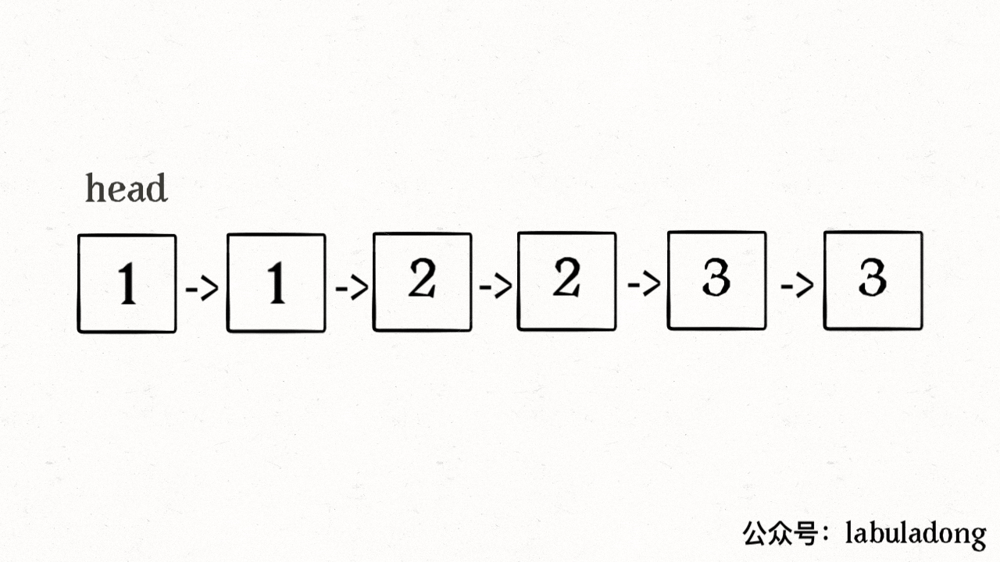

# 删除排序链表中的重复元素：去重


> [83. 删除排序链表中的重复元素](https://leetcode.cn/problems/remove-duplicates-from-sorted-list/)


## 目录
<!-- toc -->
 ## 总结 

- 删除==排序链表==中的重复项
	- `while(fast !==null)`
		- `if (fast.val !== slow.val) {`
	- 注意点
		- ==①== base case
		- ==②== 最后
			- `slow.next = null`断开与后面重复元素的连接
			- 最后 一定要 ` return head`
		- ==③== 前进：
			- slow = slow.next
			- fast = fast.next 
		- ④ 这题==不用虚拟节点==



- 不需要使用**虚拟头结点**

```javascript
/**
 * @param {ListNode} head
 * @return {ListNode}
 */
var deleteDuplicates = function (head) {
  if (!head) return null;
  let fast = head;
  let slow = head;
  while (fast) {
    if (fast.val !== slow.val) {
      slow.next = fast;
      slow = slow.next;
    }
    fast = fast.next;
  }
  slow.next = null;
  return head;
};
```


- 这题使用虚拟头结点后，更复杂了，导致都没写出来，其实使用`slow` 指针就好了
- **别以为懂了，自己再写一遍试试！！！**
- **关键的是，最终返回**


## 相关题目

- [82. 删除排序链表中的重复元素 II：删除所有重复的节点](/post/zUWtW0m6.html)