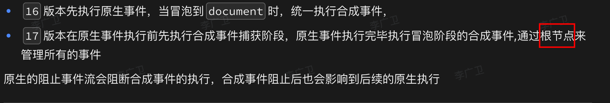

# React的合成事件(Synthetic Event)和原生事件(Native Event)的执行顺序


## 目录
<!-- toc -->
 ## 1. 事件执行顺序 

```javascript
function App() {
  const divRef = useRef(null);

  useEffect(() => {
    const div = divRef.current;
    
    // 添加原生事件监听器
    div.addEventListener('click', () => {
      console.log('原生事件：冒泡阶段');
    });

    div.addEventListener('click', () => {
      console.log('原生事件：捕获阶段');
    }, true);  // true表示捕获阶段

    return () => {
      // 清理事件监听
      div.removeEventListener('click');
    };
  }, []);

  return (
    <div 
      ref={divRef}
      onClick={() => console.log('React事件：冒泡阶段')}
      onClickCapture={() => console.log('React事件：捕获阶段')}
    >
      点击我
    </div>
  );
}
```

当点击div时，事件执行顺序为：

1. 原生事件（捕获阶段）
2. React事件（捕获阶段）
3. React事件（冒泡阶段）
4. 原生事件（冒泡阶段）

## 2. 更复杂的嵌套结构来展示事件传播

```javascript
function Parent() {
  useEffect(() => {
    document.addEventListener('click', () => {
      console.log('document 原生事件：捕获阶段');
    }, true);

    document.addEventListener('click', () => {
      console.log('document 原生事件：冒泡阶段');
    });
  }, []);

  return (
    <div 
      onClick={() => console.log('父元素 React事件：冒泡')}
      onClickCapture={() => console.log('父元素 React事件：捕获')}
    >
      <Child />
    </div>
  );
}

function Child() {
  const childRef = useRef(null);

  useEffect(() => {
    const child = childRef.current;
    child.addEventListener('click', () => {
      console.log('子元素 原生事件：冒泡阶段');
    });

    child.addEventListener('click', () => {
      console.log('子元素 原生事件：捕获阶段');
    }, true);
  }, []);

  return (
    <button 
      ref={childRef}
      onClick={() => console.log('子元素 React事件：冒泡')}
      onClickCapture={() => console.log('子元素 React事件：捕获')}
    >
      点击我
    </button>
  );
}
```

点击按钮时的执行顺序：

```
1. document 原生事件：捕获阶段
2. 子元素 原生事件：捕获阶段
3. 父元素 React事件：捕获
4. 子元素 React事件：捕获
5. 子元素 React事件：冒泡
6. 父元素 React事件：冒泡
7. 子元素 原生事件：冒泡阶段
8. document 原生事件：冒泡阶段
```

## 3. 主要区别

### 3.1. 事件委托机制

- React事件是委托到root节点统一管理
- 原生事件是直接绑定到DOM元素上

### 3.2. 事件对象

```javascript hl:4,3,6
function HandleEvent({ onClick }) {
  const handleClick = (e) => {
    console.log('React合成事件对象：', e); // SyntheticEvent
    console.log('原生事件对象：', e.nativeEvent); // 原生Event
    
    // React 17之后，e.persist()不再需要
    // 事件对象可以被异步访问
    setTimeout(() => {
      console.log('异步访问事件对象：', e);
    }, 0);
    
  };

  return <button onClick={handleClick}>点击</button>;
}
```

## 4. 阻止事件传播

```javascript hl:7,8
function StopPropagation() {
  const handleParentClick = (e) => {
    console.log('父元素被点击');
  };

  const handleChildClick = (e) => {
    e.stopPropagation(); // 阻止React事件传播
    e.nativeEvent.stopImmediatePropagation(); // 阻止原生事件传播
    console.log('子元素被点击');
  };

  return (
    <div onClick={handleParentClick}>
      <button onClick={handleChildClick}>点击我</button>
    </div>
  );
}
```

## 5. 实际应用场景

```javascript hl:3,4
function Modal({ onClose }) {
  const handleBackdropClick = (e) => {
    // 确保只有点击背景时才关闭
    if (e.target === e.currentTarget) {
      onClose();
    }
  };

  const handleContentClick = (e) => {
    // 阻止事件冒泡，避免触发背景点击
    e.stopPropagation();
  };

  return (
    <div className="backdrop" onClick={handleBackdropClick}>
      <div className="modal-content" onClick={handleContentClick}>
        模态框内容
      </div>
    </div>
  );
}
```

## 6. 注意事项

### 6.1. 在使用原生事件时，记得在组件卸载时清理

```javascript
useEffect(() => {
  const handler = () => console.log('原生事件');
  element.addEventListener('click', handler);
  return () => element.removeEventListener('click', handler);
}, []);
```

## 7. React 17 前后的事件委托变化

- 事件不再绑定到 `document`，而是绑定到`root节点`
- 这使得多个 React 版本共存成为可能



## 8. 性能考虑

- 优先使用React的合成事件系统
- 只在特殊情况下使用原生事件（如需要捕获特定的键盘事件）

