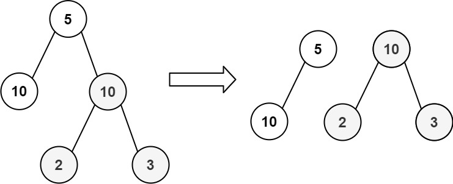

# 均匀树划分：能否分成两棵节点值之和相等的子树


>  [663. 均匀树划分](https://leetcode.cn/problems/equal-tree-partition/)





- 整棵树所有节点之和 `rootSum`
	- 那么如果存在一棵和为 `treeSum / 2` 的子树，就说明这棵二叉树是可以分解成两部分的
- 求 `rootSum` 时，别使用 ` sum(root)`
	- 而是用 `root.val + sum(root.left) + sum(root.right);`


```javascript hl:12
var checkEqualTree = function (root) {
    let mapping = {};

    function sum(root) {
        if (!root) return null;
        let left = sum(root.left);
        let right = sum(root.right);
        let res = left + right + root.val;
        mapping[res] = 1;
        return res;
    }
    // 不要 sum(root) mapping 中应该只存储子树的元素和
    let rootSum = root.val + sum(root.left) + sum(root.right);
    if (rootSum % 2 !== 0) return false; // 不能平分这不能均分
    // 是否有子树的和为 treeSum / 2
    return !!mapping[rootSum / 2];
};

```