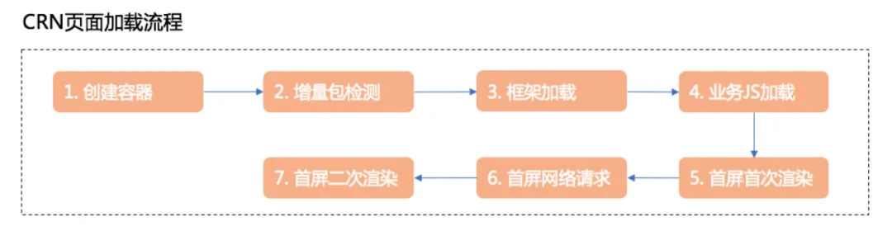
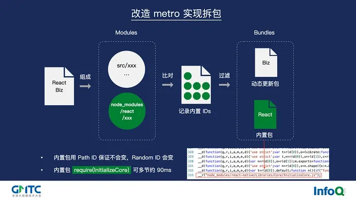

# 如何治理端侧性能


`#跨端` `#移动端` `#react-native` 


## 目录
<!-- toc -->
 ## 1. 总结 

- PRPL 模式
	- 预加载、预渲染、预缓存、懒加载
- 注意==找真实场景==
	- 比如特定网络环境、特定机型等
- React-native 拆包原理
	- 默认是打成一个包
	- 拆包：基于`路由`或者基于`功能模块`
- 常见的 js 引擎
	- v8：nodejs 、Chrome
		- 优先考虑执行速度
		- 占用更多内存
	- jscore → Safari
		- 优先考虑更快的启动时间
		- 内存占用较小
		- 适合==移动端场景==，因为
			- 需要快速启动的应用
			- 内存受限的环境 

## 2. PRPL 模式

- `Preload` 预加载**最重要**的资源
- `Render` **尽快**渲染初始内容
- `Pre-cache` **预缓存**其他资源
- `Lazy load` **懒加载**其他路由和非关键资源

>  它对做性能优化有指导意义
>  另外见 [6. RAIL  模型](/post/d9h3CBgh.html)

## 3. 端侧做性能优化时的注意点

- 需要找**真实场景**
- 低端机器
	- 比如 `webp ios14` 后也支持了

## 4. 如何减少布局偏移

- `骨架片`
- 为动态元素`预留静态`空间
- `图片宽高`尺寸固定

## 5. 性能监控体系

- 帧率监控
- 内存使用
- 等等

## 6. React-native 拆包原理

### 6.1. 基础概念

RN 的打包默认会将所有 JS 代码打包成一个 `bundle 文件`：

```
项目代码
   ↓
打包工具(Metro)
   ↓
单一 bundle.js
```

这种方式存在的问题：

- 首次加载时间长
- 资源利用效率低
- 更新成本高
- 内存占用大

### 6.2. 拆包核心原理

基本思路是将代码分成不同的包： `基础包` + `业务包A 、B、C...`

```
Common(基础包)
   ↓
业务包A  业务包B  业务包C
```

拆分策略：

```javascript
// 基础包（common.bundle）
- React Core
- React Native 框架代码
- 公共组件
- 工具函数

// 业务包（business.bundle）
- 业务逻辑代码
- 页面组件
- 业务相关资源
```

### 6.3. 实现方式

Metro 配置示例：
```javascript
// metro.config.js
module.exports = {
  transformer: {
    getTransformOptions: async () => ({
      transform: {
        experimentalImportSupport: false,
        inlineRequires: true,
      },
    }),
  },
  serializer: {
    createModuleIdFactory() {
      // 自定义模块 ID 生成
      return (path) => {
        // 根据路径生成唯一ID
      };
    },
    processModuleFilter(module) {
      // 模块过滤规则
      return true;
    },
  }
};
```

### 6.4. 拆包策略

#### 6.4.1. 基于路由拆分

```javascript
// 按路由加载不同的包
const loadBundle = async (bundleName) => {
  await RNBundleLoader.load(`${bundleName}.bundle`);
};

// 路由配置
const routes = {
  Home: {
    screen: HomeScreen,
    bundle: 'home'
  },
  Profile: {
    screen: ProfileScreen,
    bundle: 'profile'
  }
};
```

#### 6.4.2. 基于功能模块拆分

```javascript
// 功能模块拆分
- 核心模块（core.bundle）
- 支付模块（payment.bundle）
- 社交模块（social.bundle）
- 直播模块（live.bundle）
```

### 6.5. 加载机制

动态加载实现：

```javascript
// 动态加载bundle
async function loadBusinessBundle(bundleName) {
  try {
    // 检查是否已加载
    if (!isBundleLoaded(bundleName)) {
      // 加载bundle
      await globalLoader.loadBundle(`${bundleName}.bundle`);
      // 更新加载状态
      markBundleAsLoaded(bundleName);
    }
    // 执行业务代码
    return requireModule(bundleName);
  } catch (error) {
    console.error('Bundle load failed:', error);
  }
}
```

### 6.6. 优化策略

#### 6.6.1. 预加载优化

```javascript
// 预加载关键bundle
class BundlePreloader {
  static async preloadCriticalBundles() {
    const criticalBundles = ['home', 'feed'];
    return Promise.all(
      criticalBundles.map(bundle => loadBusinessBundle(bundle))
    );
  }
}
```

#### 6.6.2. 缓存策略

```javascript
// bundle缓存管理
class BundleCache {
  static async saveBundle(bundleName, content) {
    await AsyncStorage.setItem(`bundle_${bundleName}`, content);
  }

  static async loadFromCache(bundleName) {
    return await AsyncStorage.getItem(`bundle_${bundleName}`);
  }
}
```

### 6.7. 注意事项

版本管理：
```javascript
// bundle版本控制
const BUNDLE_VERSION = {
  common: '1.0.0',
  business: '1.0.0'
};

// 版本检查
async function checkBundleVersion() {
  const serverVersions = await fetchServerVersions();
  return compareBundleVersions(BUNDLE_VERSION, serverVersions);
}
```

依赖管理：
- 避免循环依赖
- 合理划分公共依赖
- 控制包大小

### 6.8. 性能优化

#### 6.8.1. 加载优化

```javascript
// 并行加载优化
async function parallelBundleLoad(bundles) {
  const loadTasks = bundles.map(bundle => ({
    name: bundle,
    task: loadBusinessBundle(bundle)
  }));
  
  return Promise.all(loadTasks.map(({ task }) => task));
}
```

内存优化：
- 及时释放不需要的 bundle
- 实现 bundle 卸载机制
- 监控内存使用情况

### 6.9. 调试与监控

监控系统：

```javascript
class BundleMonitor {
  static trackBundleLoad(bundleName, startTime) {
    const loadTime = Date.now() - startTime;
    // 上报加载时间
    Analytics.track('bundle_load', {
      bundle: bundleName,
      time: loadTime
    });
  }
}
```

## 7. CRN (Ctrip React Native) 方案

携程 React-native CRB 方案：





好的，简要总结携程 CRN (Ctrip React Native) 方案的核心特点：

### 7.1. 架构设计

```
App层
CRN Framework (统一接口层)
平台适配层 (Android/iOS)
原生平台
```

### 7.2. 核心特性

- 统一组件体系
- 自研==离线包方案==
- 动态化能力
- 多业务隔离

### 7.3. 性能优化

```javascript
// 核心优化点
- 预加载机制
- 首屏加载优化
- 离线包更新
- 增量热更新
```

### 7.4. 工程能力

- 统一==构建系统==
- 版本管理
- 灰度发布
- 监控体系

### 7.5. 业务支持

```javascript
// 统一路由
const routes = {
  'hotel_detail': {
    path: '/hotel/detail/:id',
    preload: true,
    offline: true
  }
}

// 业务隔离
class BusinessContainer {
  static load(bizId) {
    // 加载独立业务模块
  }
}
```

### 7.6. 主要优势

- 完整的工程化体系
- 强大的性能优化
- 良好的扩展性
- 企业级监控和容错
- 成熟的多业务支持

这是一个经过实战检验的企业级 RN 解决方案，对大型 App 的 RN 改造具有很好的参考价值。

## 8. 常见的 四个js渲染引擎


> 端侧性能优化一个思路是，直接基于 js 渲染引擎做定制

## 9. 对比一下 V8 和 JavaScriptCore (JSCore) 这两个主流的 JavaScript 引擎：

>  另外可参考 [12. JavaScript 引擎](/post/3dwdSsb6.html)

### 9.1. 基本背景

**V8:**
- 由 Google 开发
- 用于 Chrome 浏览器和 Node.js
- 使用 C++ 编写

**JavaScriptCore:**
- 由 Apple 开发
- 用于 Safari 浏览器和 WebKit
- 也被用于 React Native

### 9.2. 主要区别

#### 9.2.1. 架构差异

1. **编译策略**
   - V8: 使用 JIT (Just-In-Time) 编译，包含 TurboFan 优化编译器
   - JSCore: 使用多层编译策略，包括解释器（LLInt）、基线 JIT 和 DFG JIT

2. **内存管理**
   - V8: 使用分代垃圾回收
   - JSCore: 使用垃圾回收和引用计数的混合系统

#### 9.2.2. 性能特点

1. **启动时间**
   - JSCore: 优先考虑更快的启动时间
   - V8: 优先考虑执行速度

2. **运行性能**
   - V8: 长期运行的应用程序性能更好
   - JSCore: 在短期运行的脚本上表现更好

1. **内存占用**
   - JSCore: 
      - 通常内存占用较小
   - V8: 
      - 为了优化执行速度，可能占用更多内存

### 9.3. 使用场景

**V8 适合：**
- 服务器端应用 (Node.js)
- 长期运行的应用
- 计算密集型任务

**JSCore 适合：**
- 移动端应用
- 需要快速启动的应用
- 内存受限的环境 

### 9.4. 实际应用

1. **Web 开发**
   - Chrome/Node.js 使用 V8
   - Safari 使用 `JSCore`
   - React Native 在 iOS 上使用 `JSCore`

2. **移动开发**
   - React Native iOS: `JSCore`
   - Chrome Android: V8

1. **服务器端**
   - Node.js: V8
   - Bun: JSCore 

