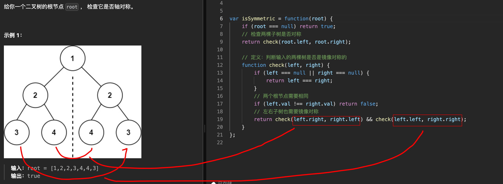

# 对称二叉树：判断树是否轴对称


> [101. 对称二叉树](https://leetcode.cn/problems/symmetric-tree/)


## 目录
<!-- toc -->
 ## 关键点： 

- 内部==再定义==一个函数：`check(left,right)`

## 1. 思路



## 2. 代码

```javascript
var isSymmetric = function (root) {
  if (root === null) return true;
  // 检查两棵子树是否对称
  return check(root.left, root.right);

  // 定义：判断输入的两棵树是否是镜像对称的
  function check(left, right) {
    if (left === null || right === null) {
      return left === right;
    }
    // 两个根节点需要相同
    if (left.val !== right.val) return false;
    // 左右子树也需要镜像对称
    return check(left.right, right.left) && check(left.left, right.right);
  }
};

```