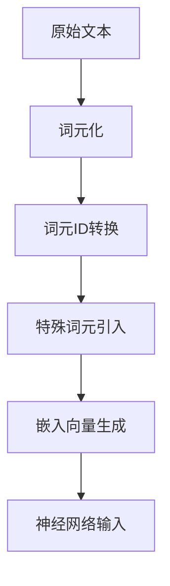

# 处理文本数据

`#2026/01/01` `#ai` 

> [!info]  
> **本章内容**
> - 为大语言模型训练准备文本
> - 将文本分割为单词词元和子词词元
> - 使用更高级的文本分词方法——字节对编码
> - 利用滑动窗口方法对训练样本进行采样
> - 将词元转换为输入到大语言模型中的向量


> 本章重点讨论第一阶段中的第 (1) 步：**实现数据采样流水线**

> 原书作者，有视频导读课程，相关的笔记可参考见 [0. 导读：文本预处理与数据管道](/post/s6k290745y.html)


## 目录
<!-- toc -->
 ## 1. 词嵌入 

> 详见 [1. 词嵌入：让计算机理解语言的神奇"翻译器"](/post/rljsnijqwg.html)

## 2. 文本分词

> 详见 [2. 文本分词：让计算机精准"切割"文本](/post/o1b4oah567.html)

## 3. 将词元转换为词元 ID

> 详见 [3. 词元转换为词元ID](/post/nrlobk0lv7.html)

## 4. 引入特殊上下文词元

### 4.1. 提示词

```javascript
重新讲述  "2.4　引入特殊上下文词元"
要求：
1. 请以更利于程序员的方式来表达
2. 所使用代码说明，代码多添加注释（如果注释是英文的，转成中文），也贷
3. 尽量多说人话，多举例，好理解些
4. 不要丢失原文信息
```

> 详见 [4. 引入特殊上下文词元](/post/jhz5h0xu7k.html)

## 5. BPE

提示词

```javascript
重新讲述："2.5　BPE"
要求：
1. 请以更利于程序员理解的方式来表达（比如更多的代码）
2. 所使用代码说明，代码中多添加注释（如果注释是英文的，转成中文）
3. 代码执行结果尽量完整打印出来，和源代码区分开
4. 尽量多说人话，多举例，好理解
5. 不要丢失原文信息1
6. 更简洁，更结构化的表达
```

>  详见 [5. BPE (字节对编码)：篇 1](/post/082h98rtqe.html)  
>  详见 [5. BPE (字节对编码)：篇 2](/post/iq3vq5v70m.html)

## 6. 使用滑动窗口进行数据采样

```javascript
重新讲述："2.6　使用滑动窗口进行数据采样"  
要求：
1. 请以更利于程序员理解的方式来表达
2. 所使用的代码说明，代码中多添加注释；如果注释是英文的，转成中文；代码执行结果尽量完整打印出来
3. 说人话，多举例
4. 不要丢失原文信息
5. 更结构化的表达（借助 markdown 中的标题层级、列表、代码块等表达形式）
6. 多画流程图或者架构图（使用 markdown 的代码块来画）
```

> 详见 [6. 使用滑动窗口进行数据采样](/post/qhp5rzts91.html)

## 7. 创建词元嵌入

```javascript
重新讲述："2.7　创建词元嵌入"  
要求：
1. 请以更利于程序员理解的方式来表达
2. 所使用的代码说明，代码中多添加注释；如果注释是英文的，转成中文；代码执行结果尽量完整打印出来
3. 说人话，多举例
4. 不要丢失原文信息
5. 更结构化的表达（借助 markdown 中的标题层级、列表、代码块等表达形式）
6. 多画流程图或者架构图（使用 markdown 的代码块来画）
```

> 详见 [7. 创建词元嵌入：将离散词元转换为连续向量表示](/post/gyv9ifqaad.html)

## 8. 编码单词位置信息

```javascript
重新讲述："2.8　编码单词位置信息"  
要求：
1. 请以更利于程序员理解的方式来表达（比如多用代码）
2. 代码中多添加注释；如果注释是英文的，转成中文；代码执行结果尽量完整打印出来
3. 说人话，多举例
4. 不要丢失原文信息
5. 更结构化的表达（借助 markdown 中的标题层级、列表、代码块等表达形式）
6. 多画流程图或者架构图（使用 markdown 的代码块来画）
```

>  详见 [8. 编码单词位置信息：为词元嵌入添加位置感知能力](/post/uz4877rghl.html)

## 9. 小结



### 9.1. 处理原理

#### 9.1.1. 为什么需要嵌入

- 大语言模型无法直接处理原始文本
- 需要将文本转换为数值向量
- 目的：
	- 将离散数据映射到连续向量空间，便于神经网络训练

#### 9.1.2. 词元处理基本流程

1. 文本分解
    - 拆分为词元（单词、子词或字符）
    - 处理标点符号和特殊字符
2. 词元ID转换
    - 将每个词元映射到唯一整数ID
    - 建立词汇表（vocabulary）
3. 特殊词元引入
    - 添加`<|unk|>`：处理未知词汇
    - 添加`<|endoftext|>`：标记文本结束

### 9.2. 关键技术

#### 9.2.1. 分词技术：BPE（字节对编码）

- 将未知词汇分解为子词单元或单个字符
- 适用于GPT-2、GPT-3等模型

#### 9.2.2. 嵌入层作用

- 查找操作：将词元ID转换为连续向量
- 为词元提供语义表示
- 增强模型对上下文的理解能力

#### 9.2.3. 位置嵌入策略

1. 绝对位置嵌入
    - 与序列特定位置直接关联
    - OpenAI GPT模型采用此方法
    - 在训练过程中优化
2. 相对位置嵌入
    - 关注词元间的相对位置和距离

### 9.3. 代码实现示例

```python
import torch  
import tiktoken  

# 1. 创建分词器  
tokenizer = tiktoken.get_encoding("gpt2")  

# 2. 文本分词  
text = "Hello, world! This is a test."  
tokens = tokenizer.encode(text)  

# 3. 特殊词元  
special_tokens = {  
    "unknown": tokenizer.encode("<|unk|>")[0],  
    "end_of_text": tokenizer.encode("<|endoftext|>")[0]  
}  

# 4. 嵌入层创建  
vocab_size = 50257  # GPT-2词汇表大小  
embedding_dim = 256  # 嵌入向量维度  
embedding_layer = torch.nn.Embedding(vocab_size, embedding_dim)  

# 5. 词元ID转换为嵌入向量  
sample_tokens = torch.tensor(tokens)  
embeddings = embedding_layer(sample_tokens)  
```

### 9.4. 实践建议

1. 选择合适的分词器（如GPT-2分词器）
2. 关注词汇表大小对模型性能的影响
3. 理解并选择合适的嵌入向量维度

### 9.5. 核心意义

通过精细的词元处理和嵌入技术，大语言模型能将非结构化文本转换为可学习的数值表示，为后续模型构建奠定基础。
