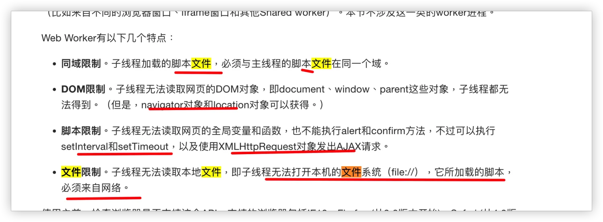

# 浏览器本地如何读取并处理本地大文件

`#bom` `#R1` 

几种在浏览器本地读取并处理大文件的主要方法，按照效率**从高到低排序**：


## 目录
<!-- toc -->
 ## 1. 使用 WebAssembly 来处理大文件 

下面是一个使用 Rust + WebAssembly 实现的例子：

### 1.1. 首先创建 Rust 项目

```bash
cargo new --lib wasm-file-processor
cd wasm-file-processor
```

### 1.2. 修改 `Cargo.toml`

````toml
[package]
name = "wasm-file-processor"
version = "0.1.0"
edition = "2021"

[lib]
crate-type = ["cdylib"]

[dependencies]
wasm-bindgen = "0.2"
js-sys = "0.3"
web-sys = { version = "0.3", features = ["console"] }
````

### 1.3. Rust 代码实现（`src/lib.rs`）

````rust
use wasm_bindgen::prelude::*;

`#[wasm_bindgen]`
pub struct FileProcessor {
    buffer: Vec<u8>,
    position: usize,
}

`#[wasm_bindgen]`
impl FileProcessor {
    `#[wasm_bindgen(constructor)]`
    pub fn new() -> FileProcessor {
        FileProcessor {
            buffer: Vec::new(),
            position: 0,
        }
    }

    pub fn process_chunk(&mut self, chunk: &[u8]) {
        self.buffer.extend_from_slice(chunk);
    }

    pub fn get_processed_data(&self) -> Vec<u8> {
        self.buffer.clone()
    }

    // 示例：计算文件中特定字节的出现次数
    pub fn count_byte(&self, target: u8) -> u32 {
        self.buffer.iter().filter(|&&b| b == target).count() as u32
    }
}
````

### 1.4. JavaScript 代码实现

````javascript hl:9,15
// 导入 WebAssembly 模块
import init, { FileProcessor } from './pkg/wasm_file_processor.js';

async function processLargeFile(file) {
    // 初始化 WebAssembly
    await init();
    
    const chunkSize = 1024 * 1024; // 1MB chunks
    const fileProcessor = new FileProcessor();
    let offset = 0;

    while (offset < file.size) {
        const chunk = await readChunk(file, offset, chunkSize);
        
        // 将 chunk 传递给 WebAssembly 处理
        fileProcessor.process_chunk(new Uint8Array(chunk));
        
        offset += chunkSize;
        // 更新进度
        const progress = Math.round((offset / file.size) * 100);
        console.log(`Processing: ${progress}%`);
    }

    return fileProcessor;
}

function readChunk(file, offset, size) {
    return new Promise((resolve, reject) => {
        const reader = new FileReader();
        reader.onload = () => resolve(reader.result);
        reader.onerror = reject;
        
        const slice = file.slice(offset, offset + size);
        reader.readAsArrayBuffer(slice);
    });
}

// 使用示例
document.querySelector('input').addEventListener('change', async (e) => {
    const file = e.target.files[0];
    try {
        const processor = await processLargeFile(file);
        
        // 示例：计算文件中字母 'a' 的出现次数
        const count = processor.count_byte(97); // 97 是字母 'a' 的 ASCII 码
        console.log(`Letter 'a' appears ${count} times`);
        
    } catch (error) {
        console.error('Error processing file:', error);
    }
});
````

### 1.5. 更复杂的处理示例（在 Rust 中添加更多功能）

省略

### 1.6. 在 JavaScript 中使用增强的功能

### 1.7. 总结

使用 WebAssembly 的优势：

1. **性能更好**：Rust 代码编译成 WebAssembly 后，**执行速度接近原生代码**
2. **内存安全**：Rust 的内存安全机制可以避免很多常见的内存问题
3. **并行处理**：可以配合 Web Workers 实现真正的并行处理
4. **类型安全**：Rust 的强类型系统可以在编译时捕获很多错误

注意事项：

1. 需要配置适当的构建工具链（wasm-pack）
2. 考虑浏览器对 WebAssembly 的支持情况
3. 大文件处理时仍需要考虑内存管理
4. 在开发时注意 Rust 和 JavaScript 之间的数据转换开销

这个实现可以根据具体需求进行扩展，比如**添加更多的文件处理功能、压缩解压缩、图像处理**等。

## 2. 使用 File System Access API

````javascript hl:4,8
async function processLargeFile() {
    try {
        // 打开文件
        const [fileHandle] = await window.showOpenFilePicker();
        const file = await fileHandle.getFile();
        
        // 创建文件流
        const stream = await file.stream();
        const reader = stream.getReader();
        
        // 处理数据
        while (true) {
            const { done, value } = await reader.read();
            if (done) break;
            
            // value 是 Uint8Array 类型
            processChunk(value);
        }
    } catch (err) {
        console.error('Error:', err);
    }
}

// 使用示例
button.onclick = processLargeFile;
````

## 3. 使用 Streams API

````javascript hl:6
async function processLargeFile(file) {
    const stream = file.stream();
    const reader = stream.getReader();

    // 创建转换流来处理数据
    const transform = new TransformStream({
        transform(chunk, controller) {
            // 在这里处理数据块
            const processed = processChunk(chunk);
            controller.enqueue(processed);
        }
    });

    // 读取并处理
    try {
        await reader
            .pipeThrough(transform)
            .pipeTo(new WritableStream({
                write(chunk) {
                    // 处理转换后的数据
                    console.log('Processed chunk:', chunk);
                }
            }));
    } catch (err) {
        console.error('Error:', err);
    }
}

// 使用示例
input.onchange = e => processLargeFile(e.target.files[0]);
````

## 4. 使用 Blob 切片 + Web Worker（适合需要大量计算的场景）

````javascript hl:1,14,37,44
// main.js
function processLargeFile(file) {
    const CHUNK_SIZE = 2 * 1024 * 1024; // 2MB chunks
    let offset = 0;
    
    // 创建 Worker
    const worker = new Worker('worker.js');
    
    function readNextChunk() {
        const slice = file.slice(offset, offset + CHUNK_SIZE);
        const reader = new FileReader();
        
        reader.onload = function(e) {
            worker.postMessage({
                chunk: e.target.result,
                offset: offset,
                done: offset >= file.size
            });
            
            offset += CHUNK_SIZE;
            if (offset < file.size) {
                readNextChunk();
            }
        };
        
        reader.readAsArrayBuffer(slice);
    }
    
    // 处理 Worker 返回的结果
    worker.onmessage = function(e) {
        console.log('Processed result:', e.data);
    };
    
    readNextChunk();
}

// worker.js
self.onmessage = function(e) {
    const { chunk, offset, done } = e.data;
    
    // 在 Worker 中处理数据
    const result = processChunk(chunk);
    
    self.postMessage({
        result,
        offset,
        done
    });
};
````

## 5. 使用 IndexedDB 存储和处理（适合需要持久化的场景）

````javascript
async function processWithIndexedDB(file) {
    const db = await openDB('FileDB', 1, {
        upgrade(db) {
            db.createObjectStore('chunks');
        }
    });

    // 分块存储
    const CHUNK_SIZE = 2 * 1024 * 1024;
    let offset = 0;
    
    while (offset < file.size) {
        const chunk = file.slice(offset, offset + CHUNK_SIZE);
        const buffer = await chunk.arrayBuffer();
        
        // 存储到 IndexedDB
        await db.put('chunks', buffer, offset);
        
        // 处理数据
        await processChunk(buffer);
        
        offset += CHUNK_SIZE;
    }
}

// 处理单个数据块
async function processChunk(buffer) {
    // 示例：计算数据块的哈希
    const hashBuffer = await crypto.subtle.digest('SHA-256', buffer);
    return new Uint8Array(hashBuffer);
}
````

## 6. 实际使用建议

- 如果需要实时处理：使用 Streams API
- 如果需要大量计算：使用 Web Worker
- 如果需要持久化：使用 IndexedDB
- 如果需要最新特性：使用 File System Access API

## 7. worker 中无法读取本地文件，限制如下

**所以需要主线程读完后交给 worker 来处理**



