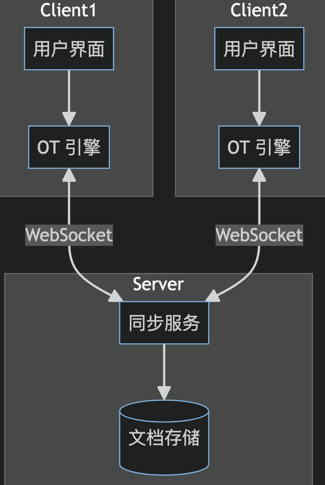

# 在线协作文档设计


## 目录
<!-- toc -->
 ## 1. 业务图 



## 2. 技术点

- websocket
- OT 引擎
- 富文本编辑器

## 3. OT (Operational Transformation) 引擎

- OT 引擎是实现实时协作编辑的`核心组件`
	- 它负责处理并解决多用户同时编辑时可能出现的`冲突`。
- OT 引擎的主要功能和原理如下：
	1. 操作转换
	2. 一致性维护
	3. 因果关系保持
	4. 收敛性保证

### 3.1. 操作转换

操作转换是 OT 引擎的核心功能。当两个用户同时对文档进行编辑时，OT 引擎需要转换这些操作，使它们能够正确应用，并保持所有用户看到的文档内容一致。

例如，考虑以下场景：
- 初始文档内容: "Hello"
- 用户A
	- 在位置5插入"!"
- 用户B
	- 在位置5插入" World"

没有 OT,这两个操作可能会导致不一致的结果。但通过 OT，我们可以转换这些操作,使得最终结果一致。

让我用一个图表来说明这个过程：

````mermaid
    sequenceDiagram
    participant A as 用户A
    participant Server
    participant B as 用户B
    
    Note over A,B: 初始文档: "Hello"
    A->>Server: 插入 "!" 在位置 5
    B->>Server: 插入 " World" 在位置 5
    Server->>Server: 转换操作
    Server->>A: 应用: 插入 " World" 在位置 5
    Server->>B: 应用: 插入 "!" 在位置 11
    Note over A,B: 最终文档: "Hello World!"
````

### 3.2. 一致性维护

OT 引擎需要确保所有客户端最终达到相同的文档状态。
这通常通过以下方式实现：
- 维护操作历史
- 使用版本向量或时间戳
- 定期同步完整文档状态

### 3.3. 因果关系保持

OT 引擎需要保证操作的因果关系
- 例如
	- 如果操作 A 在操作 B 之前发生，那么在所有客户端上，A 都应该在 B 之前应用。

### 3.4. 收敛性保证

无论操作以何种顺序到达，OT 引擎都需要确保所有客户端最终收敛到相同的文档状态。

下面是一个简化的 OT 引擎实现示例,展示了基本的操作转换逻辑：

````typescript
class OTEngine {
	private document: string = '';
	private version: number = 0;
	private history: Operation[] = [];

	// 操作转换函数
	transform(op1: Operation, op2: Operation): Operation {
		if (op1.type === 'insert' && op2.type === 'insert') {
			if (op1.position <= op2.position) {
				return {...op2, position: op2.position + 1};
			}
		} else if (op1.type === 'delete' && op2.type === 'insert') {
			if (op1.position < op2.position) {
				return {...op2, position: op2.position - 1};
			}
		} else if (op1.type === 'insert' && op2.type === 'delete') {
			if (op1.position <= op2.position) {
				return {...op2, position: op2.position + 1};
			}
		} else if (op1.type === 'delete' && op2.type === 'delete') {
			if (op1.position < op2.position) {
				return {...op2, position: op2.position - 1};
			}
		}
		return op2;
	}

	// 应用操作
	applyOperation(op: Operation): void {
		// 转换操作
		for (const historyOp of this.history) {
			op = this.transform(historyOp, op);
		}

		// 应用操作到文档
		if (op.type === 'insert') {
			this.document = this.document.slice(0, op.position) + 
							op.char + 
							this.document.slice(op.position);
		} else if (op.type === 'delete') {
			this.document = this.document.slice(0, op.position) + 
							this.document.slice(op.position + 1);
		}

		// 更新版本和历史
		this.version++;
		this.history.push(op);
	}

	getDocument(): string {
		return this.document;
	}

	getVersion(): number {
		return this.version;
	}
}

interface Operation {
	type: 'insert' | 'delete';
	position: number;
	char?: string;
}
````

## 4. 最后

- 在实际项目中,通常会**使用成熟的 OT 库或协作框架,如 ShareDB、Yjs 或 Automerge**，它们提供了更完善和经过实战测试的实现。
- 这些库不仅实现了 OT,有些还支持 CRDT (Conflict-free Replicated Data Types),为实时协作提供了更强大的支持。
