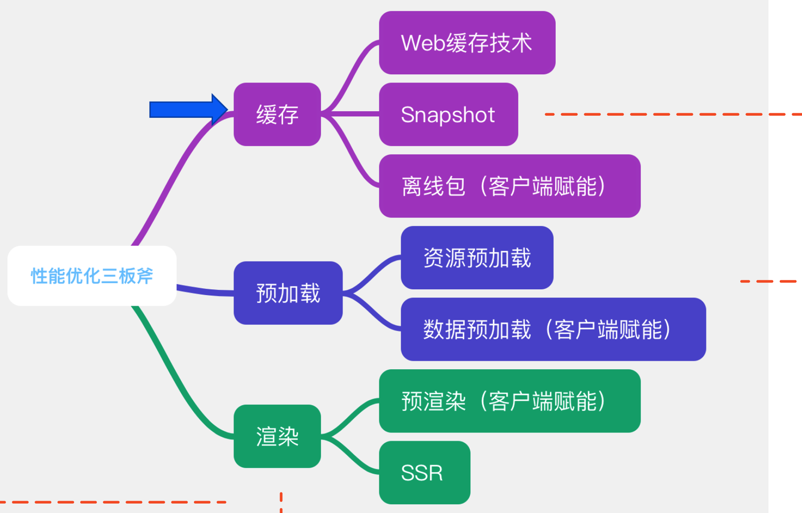
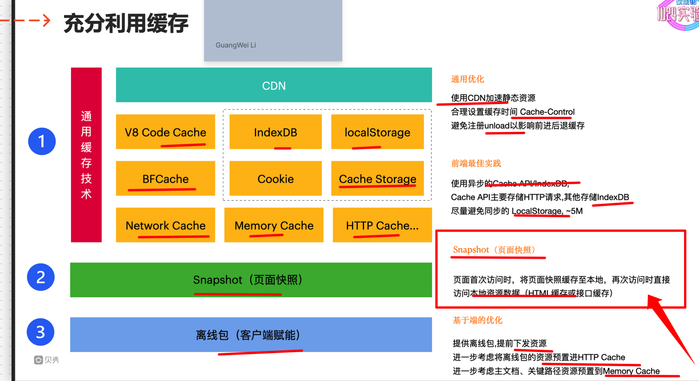
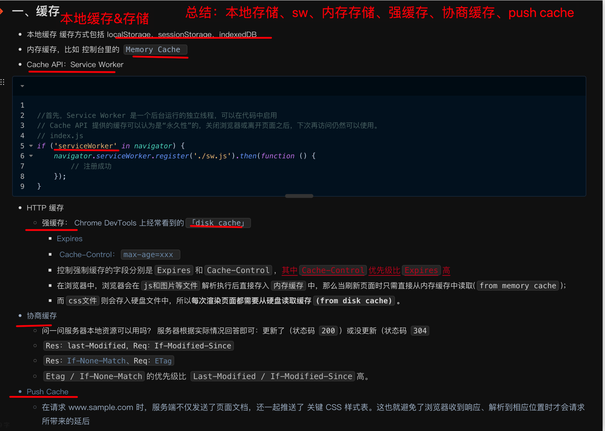
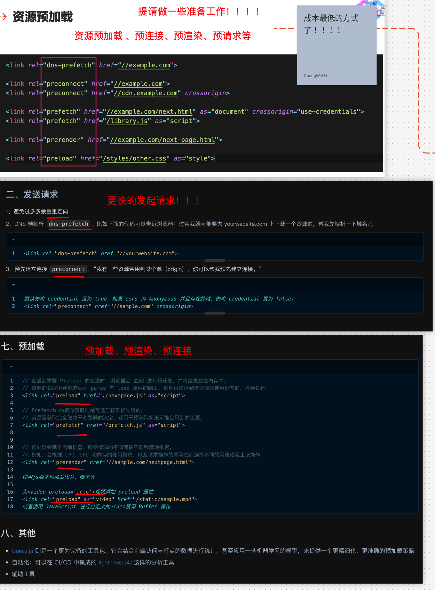
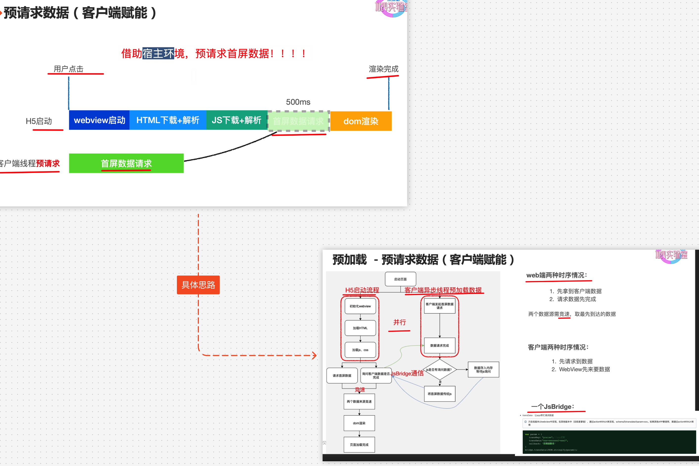
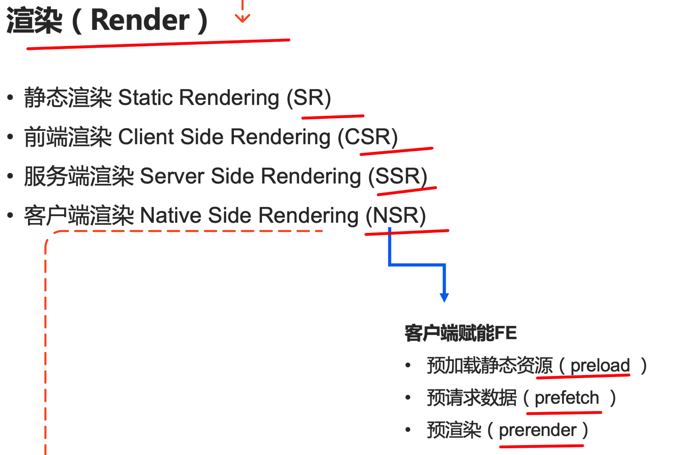
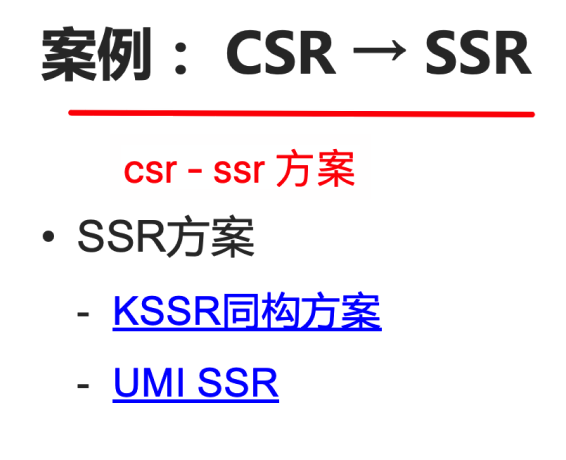
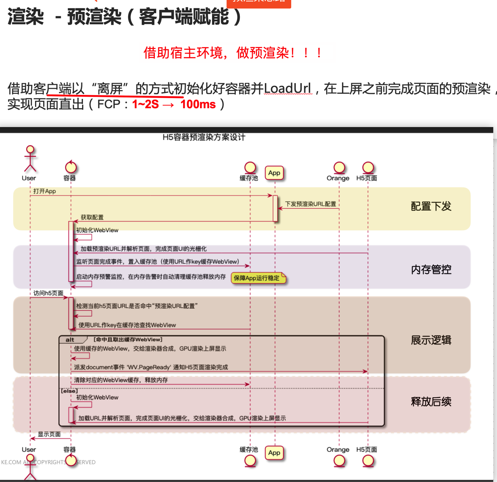

# 性能优化的思路

`#前端性能`  

> 源于个人某次分享

## 目录
<!-- toc -->
 ## 1. 性能优化三板斧 

## 2. 缓存

### 2.1. web 缓存技术

### 2.2. 常见的缓存技术

## 3. 预加载

### 3.1. 资源预加载

### 3.2. 数据预数据

## 4. 渲染

### 4.1. 渲染分类

### 4.2. csr → ssr

### 4.3. 预渲染的案例

### 4.4. 其他运行时优化思路

- 避免强制布局
- 批量化操作
- 长列表
- 任务拆解
- 并行：worker
- css 善用合成

## 5. 一些启发

