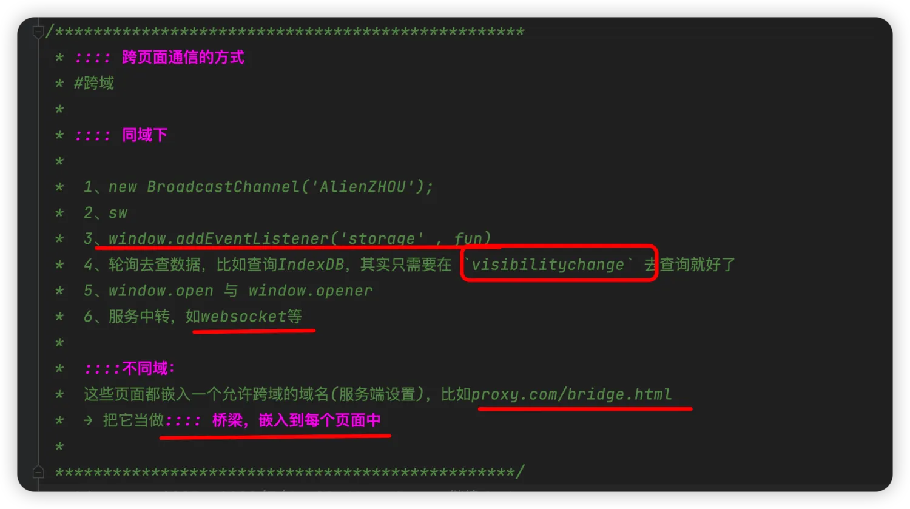
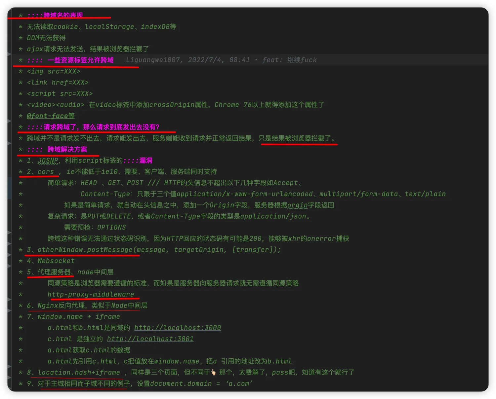
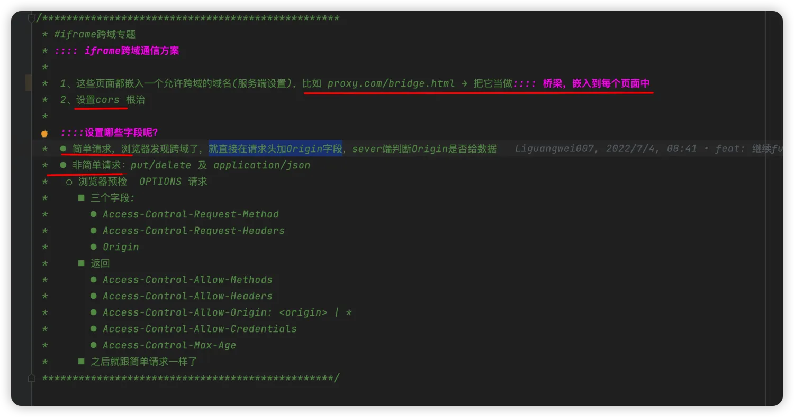
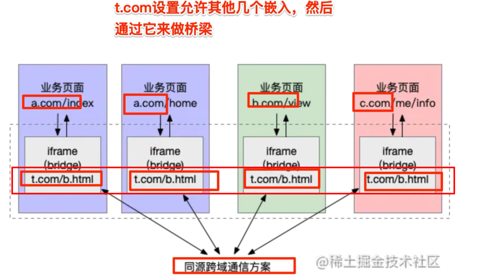
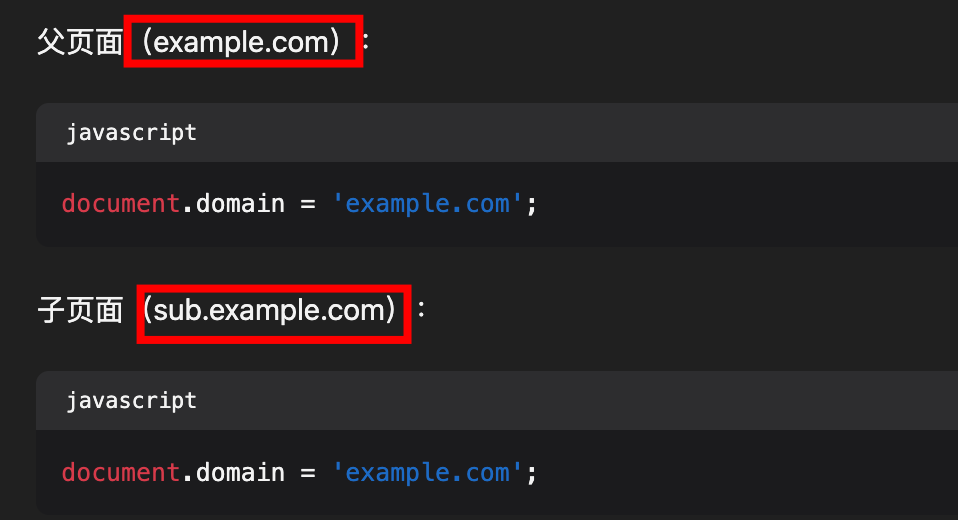
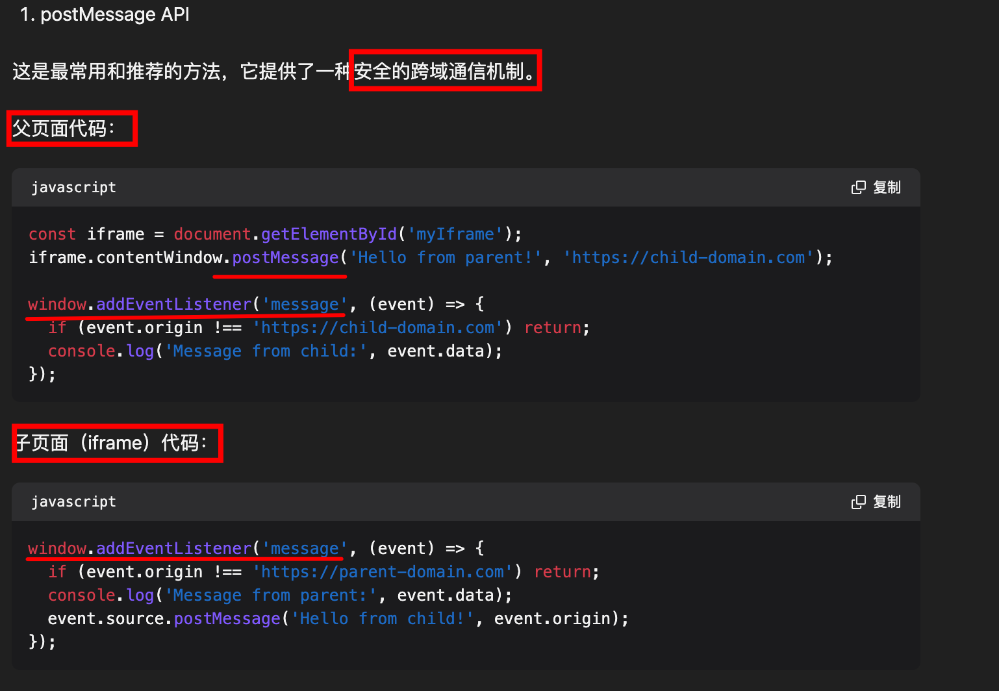
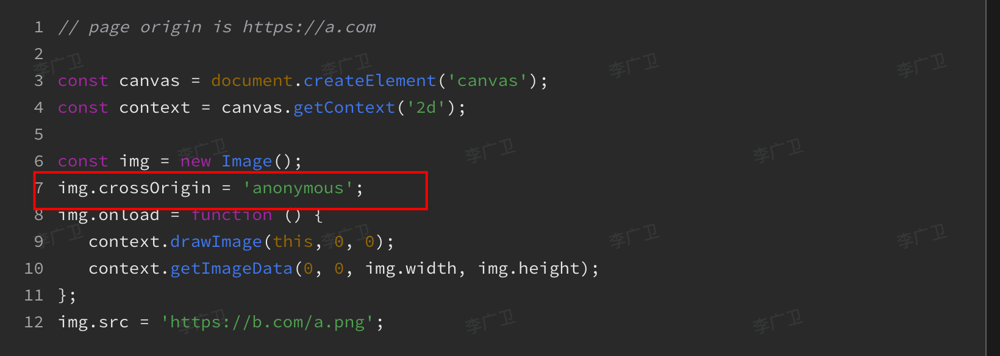
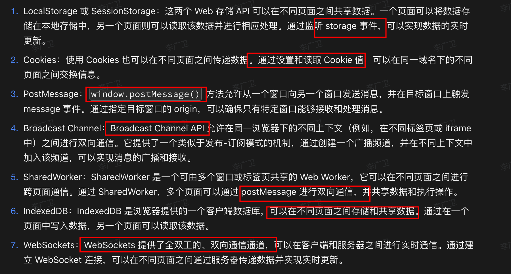
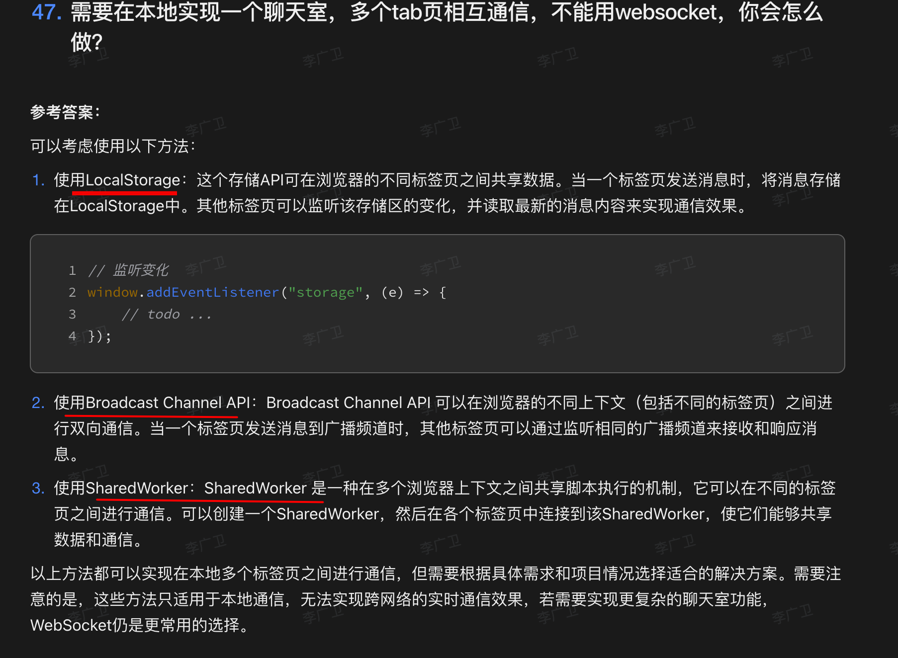

# 跨域与跨页面通讯问题汇总


## 目录
<!-- toc -->
 ## 1. 跨域问题 

### 1.1. 列举下跨页面通讯的方式


### 1.2. 跨域的表现、如何跨域？



- 简单请求，直接在 origin 中添加字段
- 非简单请求，需要预检



### 1.3. 关于跨域、为什么非简单请求不需要预检，而其他请求需要预检

让我详细解释一下跨域请求中的简单请求和预检请求的机制：

### 1.4. 简单请求的条件

一个请求必须**同时满足以下所有条件才是简单请求**：

- 请求方法仅限于：
	- GET
	- POST
	- HEAD
- 允许的请求头：
	- Accept
	- Accept-Language
	- Content-Language
	- Content-Type（仅限于以下三种）：
		 - text/plain
		 - multipart/form-data
		 - application/x-www-form-urlencoded
	- DPR
	- Downlink
	- Save-Data
	- Viewport-Width
	- Width
- 请求中没有自定义头部
- 请求中没有使用 `ReadableStream` 对象

### 1.5. 为什么需要预检请求？

**预检请求（Preflight）**  的主要目的是为了**保护服务器**。原因如下：

#### 1.5.1. **向后兼容**

```javascript
// 旧服务器只知道处理简单请求
// 如果直接发送复杂请求可能会导致意外行为
fetch('api.example.com/data', {
    method: 'DELETE',  // 非简单请求
    headers: {
        'Content-Type': 'application/json'  // 非简单请求的 Content-Type
    }
});
```

#### 1.5.2. **安全性考虑**

```javascript
// 预检请求可以让服务器事先检查：
// 1. 该源是否被允许
// 2. 该方法是否被允许
// 3. 该头部是否被允许
const headers = new Headers({
    'X-Custom-Header': 'value',  // 自定义头部需要预检
    'Content-Type': 'application/json'
});

fetch('api.example.com/data', {
    method: 'PUT',
    headers: headers,
    body: JSON.stringify({ key: 'value' })
});
```

#### 1.5.3. **避免服务器端的副作用**

```javascript
// DELETE 请求可能会删除数据
// PUT 请求可能会修改数据
// 预检请求可以在实际操作前验证权限
async function deleteResource() {
    // 会首先发送 OPTIONS 请求
    const response = await fetch('api.example.com/resource/123', {
        method: 'DELETE',
        headers: {
            'Authorization': 'Bearer token'
        }
    });
}
```

### 1.6. 预检请求的过程

#### 1.6.1. **OPTIONS 请求**

```http
OPTIONS /resource/123 HTTP/1.1
Host: api.example.com
Origin: https://example.com
Access-Control-Request-Method: DELETE
Access-Control-Request-Headers: Authorization
```

#### 1.6.2. **服务器响应**

```http
HTTP/1.1 200 OK
Access-Control-Allow-Origin: https://example.com
Access-Control-Allow-Methods: DELETE, PUT, POST, GET, OPTIONS
Access-Control-Allow-Headers: Authorization
Access-Control-Max-Age: 86400
```

#### 1.6.3. **实际请求**

```http
DELETE /resource/123 HTTP/1.1
Host: api.example.com
Origin: https://example.com
Authorization: Bearer token
```

### 1.7. 为什么简单请求不需要预检？

#### 1.7.1. **历史原因**

```html
<!-- 在 CORS 出现之前，这些操作就已经可以跨域了 -->
<form action="https://other-domain.com/form" method="POST">
    <input type="text" name="data">
    <button type="submit">Submit</button>
</form>


```

#### 1.7.2. **安全性考虑**

```javascript
// 简单请求的特点：
// 1. 不会改变服务器数据（GET）
// 2. 使用传统的数据格式（form-data）
// 3. 不包含自定义头部
fetch('api.example.com/data', {
    method: 'GET',
    headers: {
        'Accept': 'application/json'
    }
});
```

### 1.8. 最佳实践： **缓存预检请求**

```javascript
// 服务器端设置预检请求的缓存时间
app.options('/api', (req, res) => {
    res.header('Access-Control-Max-Age', '86400'); // 24小时
    res.header('Access-Control-Allow-Methods', 'GET, POST, PUT, DELETE');
    res.header('Access-Control-Allow-Headers', 'Content-Type, Authorization');
    res.send();
});
```

## 2. 跨页面通讯的方式都有哪些？

### 2.1. 同源

#### 2.1.1. BroadCast Channel

```javascript hl:1,3,9
const bc = new BroadcastChannel('AlienZHOU');
// 复制代码各个页面可以通过 onmessage 来监听被广播的消息：
bc.onmessage = function (e) {
    const data = e.data;
    const text = '[receive] ' + data.msg + ' —— tab ' + data.from;
    console.log('[BroadcastChannel] receive message:', text);
};
// 复制代码要发送消息时只需要调用实例上的postMessage方法即可：
bc.postMessage(mydata);
```

#### 2.1.2. `sw` ，也可以用来检测页面是否崩溃

```javascript hl:2,7,23
/* 页面逻辑 */
navigator.serviceWorker.register('../util.sw.js').then(function () {
    console.log('Service Worker 注册成功');
});

/* ../util.sw.js Service Worker 逻辑 */
self.addEventListener('message', function (e) {
    console.log('service worker receive message', e.data);
    e.waitUntil(
        self.clients.matchAll().then(function (clients) {
            if (!clients || clients.length === 0) {
                return;
            }
            // 通过调用每个 client（即页面）的 postMessage 方法，向页面发送消息。
            clients.forEach(function (client) {
                client.postMessage(e.data);
            });
        })
    );
});

/* 页面逻辑 */
navigator.serviceWorker.addEventListener('message', function (e) {
    const data = e.data;
    const text = '[receive] ' + data.msg + ' —— tab ' + data.from;
    console.log('[Service Worker] receive message:', text);
});
```

#### 2.1.3. storage事件

- localStorage → window.addEventListener('storage' , fun)
- “共享存储+长轮询” → 其实只用在 Tab A 中监听`visibilitychange`这样的事件，来做一次信息同步即可

#### 2.1.4. Shared Worker

Shared Worker 是 Web Workers API 的一种特殊类型，**它允许多个浏览器上下文（如窗口、标签页或 iframe）共享同一个 worker 实例**。这使得不同的页面可以通过这个共享的 worker 进行通信和数据共享

```javascript
// 在页面中创建 Shared Worker
const worker = new SharedWorker('sharedworker.js');

// 在 worker 中
self.onconnect = function(e) {
  const port = e.ports[0];
  port.onmessage = function(e) {
    // 处理消息
  }
};

```

- Shared Workers 遵循同源策略
- 不能访问 DOM

#### 2.1.5. window.open 与 window.opener 

- 当我们使用`window.open`打开页面时，方法会返回一个被打开页面`window`的引用。
- 而在未显示指定`noopener`时，被打开的页面可以通过`window.opener`获取到打开它的页面的引用

#### 2.1.6. 服务中转

如`websocket`等

#### 2.1.7. 轮询 + indexedDB

`IndexedDB`，消息发送方将消息存至 `IndexedDB` 中；接收方（例如所有页面）则通过**轮询**去获取最新的信息

### 2.2. 非同源



## 3. iframe 通讯的方法有哪些

- 1. **对于主域相同而子域不同的例子**，可以通过设置`document.domain`的办法来解决。
	- 
- 使用 window.postMessage，**不同域也可以**
	- `window.frames[0].postMessage('Hello from parent!', 'https://child-domain.com')`
	- 
- 利用 window.name 属性在**不同域**之间传递信息
- **同域**下，使用 Web Storage (localStorage 或 sessionStorage) 来通讯
- 两个**不同域**的页面可以通过向**同一个服务器**发送请求来间接通信

> 使用 postMessage 方法是最推荐的跨域 iframe 通信方式，因为它既安全又简单。
> - 它允许你指定目标源，从而防止信息被发送到不信任的目标。
> - 同时，接收方也可以验证消息的来源，进一步增强安全性

## 4. CORS ： 预检 option 请求 , 即平时看到的 `PreFlight`

浏览器一旦发现AJAX请求跨源，就会`自动添加一些附加的头信息`，`有时还会多出一次附加的请求，但用户不会有感觉`

实现CORS通信的关键是服务器。只要服务器实现了CORS接口，就可以跨源通信

- **简单请求
	- 浏览器发现跨域了，就直接在请求头加 `Origin`字段
	- `sever端` **判断** `Origin` **是否给数据**
- 非简单请求：比如 `put/delete 及 application/json`
	- 浏览器预检 `OPTIONS` 请求
	- 请求头三个字段:
		- **Access-Control-Request-Method**
		- **Access-Control-Request-Headers**
		- `Origin`
	- 响应头返回
		- **Access-Control-Allow-Methods**
		- **Access-Control-Allow-Credentials**
		- **Access-Control-Allow-Headers**
		- **Access-Control-Max-Age**
	- 之后就跟简单请求一样了

## 5. WebSocket 协议本身是没有跨域限制的

### 5.1. 定义

1. WebSocket 是一个独立的、完整的协议，与 HTTP 协议是平行的关系。虽然 WebSocket 连接的建立需要依赖 HTTP 协议进行一次握手（upgrade），但是一旦 WebSocket 连接建立成功后，后续的数据传输就与 HTTP 无关了。
2. 浏览器在实现 WebSocket 协议时，默认就是允许跨域的。这意味着：
	- 你可以从任何域名下的页面连接到任何服务器的 WebSocket 服务
	- 不需要像 HTTP 请求那样配置 CORS（跨域资源共享）相关的头部

### 5.2. 握手阶段的限制

- 在 WebSocket 连接建立时的 HTTP 握手阶段，浏览器会发送 Origin 头部
- 服务器可以通过检查 Origin 头部来决定是否允许连接
- 这是一种服务器端的安全机制，而不是浏览器的跨域限制

### 5.3. 最佳实践

   ```javascript
   // 客户端代码示例
   const ws = new WebSocket('ws://example.com/socketserver');
   
   // 服务器端可以检查 Origin（以 Node.js 为例）
   wss.on('connection', function connection(ws, request) {
     const origin = request.headers.origin;
     if (origin !== 'https://trusted-site.com') {
       ws.close();
       return;
     }
     // 处理正常连接...
   });
   ```

### 5.4. 安全考虑

   - 虽然 WebSocket 没有跨域限制，但出于安全考虑，**服务器端应该实现自己的验证机制**
   - 可以通过 token、session 等方式进行身份验证
   - 建议在生产环境使用 WSS（WebSocket Secure）协议，即基于 SSL/TLS 的安全 WebSocket 连接

### 5.5. 总结

**WebSocket 协议本身不受浏览器同源策略的限制**，可以自由地进行跨域通信。但为了安全性，服务器端应该实现适当的验证机制来控制连接权限。

## 6. 如何在 Canvas 获取跨域的图片



当然，需要设置图片的响应头，允许跨域

## 7. 浏览器的跨标签页（Cross-tab）通信

### 7.1. 问题：不同的Tab，不同的域名，一个 Tab 下面的页面使用 postMessage，另外一个 Tab 监听 message 能够监听得到吗？

- 不同的 Tab，不同的域名
	- 当两个标签页属于不同的域名时，它们是运行在完全隔离的上下文中的。这是由于浏览器的同源策略（Same-Origin Policy）所导致的安全限制。
- postMessage 和 message 事件
	- postMessage 方法是一种安全的跨源通信方式，而 message 事件用于接收通过 postMessage 发送的消息。
- 能否监听到？
	- 在你描述的情况下，一个 Tab 下的页面使用 postMessage，另一个 Tab 监听 message 事件，**通常情况下是无法监听到的**。

 原因如下：
1. **窗口引用问题**：postMessage 需要一个目标窗口的引用。不同 Tab 之间默认是没有这种引用的。比如使用 `window.open`
2. **域名不同**：**即使有窗口引用**，不同域名之间的通信也需要明确指定目标源。
3. **事件传播范围**：message 事件通常只在目标窗口内传播，不会跨越到其他未相关的标签页。

### 7.2. 安全策略

- 如果你不需要接受其他网站的 message，请不要监听 message 事件
- 即使监听，请务必备注 origin 和 source 来验证发件人的身份

### 7.3. 有一些特殊情况和解决方案

1. **opener 关系**：如果一个标签页是由另一个标签页打开的（使用 window.open()  ），则它们之间可以通过 opener 和 postMessage 进行通信。
2. **共享存储**：可以使用 localStorage 或 IndexedDB 等共享存储方式，配合 storage 事件来实现跨标签页通信。
3. **Broadcast Channel API**：这是一个较新的 API，允许**同源的不同上下文**（如不同的标签页）之间进行通信。
4. **Service Worker**：可以使用 Service Worker 作为中间人来协调不同标签页之间的通信。
5. **WebSocket**：可以通过服务器端的 WebSocket 连接来协调不同标签页之间的通信。

## 8. 前端页面通讯的方式有哪些？



## 9. 如何实现 Tab 之间通讯，不能 websocket


