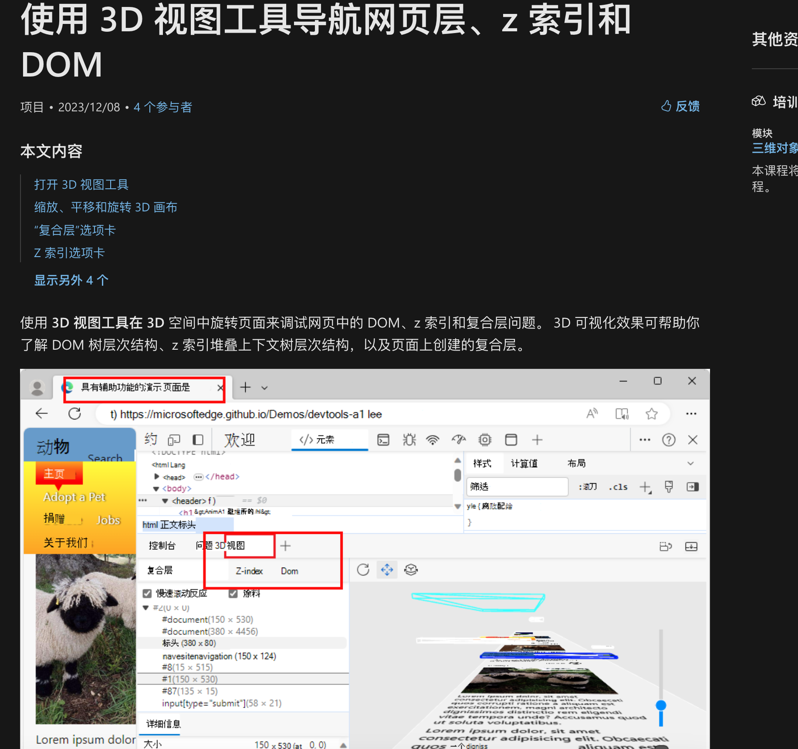
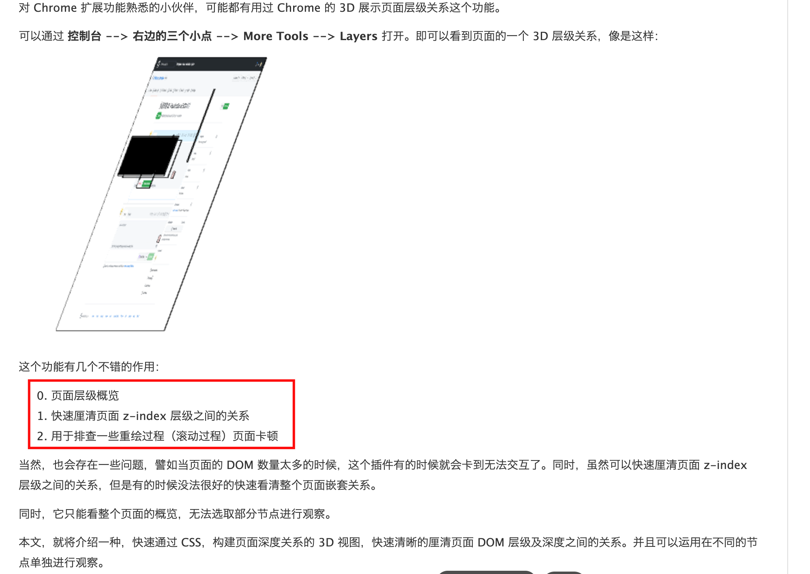

# 渲染层、复合层、层叠上下文对比

`#浏览器` 


## 目录
<!-- toc -->
 ## 1. 渲染层（Paint Layer） 

渲染层是浏览器渲染过程中的基本单位，主要用于**管理元素的绘制顺序**。

**触发条件**：

```css
/* 以下属性会创建新的渲染层 */
.paint-layer {
    /* 1. position 定位 */
    position: fixed;
    position: absolute;
    position: relative;

    /* 2. 透明度 */
    opacity: 1;

    /* 3. 溢出 */
    overflow: scroll;
    overflow: auto;

    /* 4. CSS 滤镜 */
    filter: blur(5px);

    /* 5. CSS mix-blend-mode 属性 */
    mix-blend-mode: multiply;

    /* 6. transform */
    transform: scale(1);
}
```

## 2. 合成层（Compositing Layer）

合成层是一种特殊的渲染层，会被单独绘制并由 GPU 合成。

**触发条件**：

```css hl:10
.compositing-layer {
    /* 1. 3D 或透视变换 */
    transform: translate3d(0, 0, 0);
    transform: translateZ(0);

    /* 2. will-change */
    will-change: transform;
    will-change: opacity;

    /* 3. opacity 小于 1 */
    opacity: 0.9;

    /* 4. position: fixed */
    position: fixed;

    /* 5. filter */
    filter: blur(5px);

    /* 6. backdrop-filter */
    backdrop-filter: blur(5px);
}

/* 7. <video>, <canvas>, <iframe> 等元素 */
```

## 3. 层叠上下文（Stacking Context）

**层叠上下文是 HTML 元素在三维空间中的概念，决定了元素在 z 轴上的显示顺序**。

**触发条件**：

```css
.stacking-context {
    /* 1. 文档根元素 <html> */
    
    /* 2. position + z-index */
    position: relative;
    z-index: 1;

    /* 3. flex 子项设置 z-index */
    display: flex;
    z-index: 1;

    /* 4. opacity 小于 1 */
    opacity: 0.9;

    /* 5. transform 不为 none */
    transform: scale(1);

    /* 6. filter 不为 none */
    filter: blur(0);

    /* 7. isolation */
    isolation: isolate;

    /* 8. mix-blend-mode 不为 normal */
    mix-blend-mode: multiply;

    /* 9. will-change */
    will-change: opacity;

    /* 10. contain */
    contain: layout;
}
```

## 4. 三者的关系

### 4.1. **层级关系**：

```
浏览器渲染
└── 层叠上下文（决定 z 轴顺序）
    └── 渲染层（基本绘制单位）
        └── 合成层（GPU 加速）
```

### 4.2. **示例代码**：

```html
<div class="stacking-context">
    <div class="paint-layer">
        <div class="compositing-layer">
            内容
        </div>
    </div>
</div>
```

```css
.stacking-context {
    position: relative;
    z-index: 1;
}

.paint-layer {
    position: relative;
    background: `#fff;`
}

.compositing-layer {
    transform: translateZ(0);
}
```

## 5. 性能影响

### 5.1. **渲染层**：

```css
/* 渲染层的改变会导致重绘 */
.paint-layer {
    background: red;  /* 改变会触发重绘 */
}
```

### 5.2. **合成层**：

```css
/* 合成层的改变通常只需要 GPU 重新合成 */
.compositing-layer {
    transform: translateX(100px);  /* 只需要 GPU 合成 */
}
```

### 5.3. **层叠上下文**：

```css
/* 层叠上下文的改变可能影响大量子元素 */
.stacking-context {
    z-index: 2;  /* 可能影响整个子树的渲染 */
}
```

## 6. 调试方法

### 6.1. **Chrome DevTools**：

```javascript hl:2
// 1. 查看层叠上下文
// - Elements 面板中的 3D View

// 2. 查看渲染层和合成层
// - Layers 面板
// - 在 Rendering 中启用 Layer borders
```

#### 6.1.1. edge



#### 6.1.2. chrome



## 7. 最佳实践

1. **合理使用合成层**：
```css
/* 对于频繁动画的元素 */
.animated {
    will-change: transform;
    transform: translateZ(0);
}
```

2. **避免层爆炸**：
```css
/* 不要在大量元素上使用触发合成层的属性 */
.many-items {
    transform: translateZ(0); /* 避免 */
}
```

3. **优化层叠上下文**：
```css
/* 使用 isolation 创建新的层叠上下文 */
.new-context {
    isolation: isolate;
}
```

4. **性能优化**：
```css
/* 对于静态内容，尽量使用渲染层 */
.static-content {
    /* 普通样式即可 */
}

/* 对于动画内容，考虑使用合成层 */
.animated-content {
    will-change: transform;
}
```

