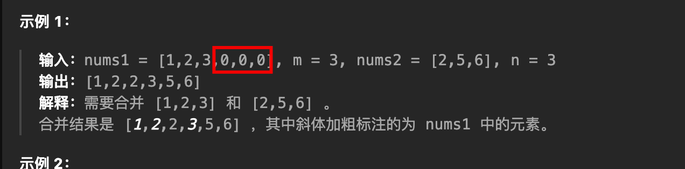

# 合并两个有序数组

`#数组/双指针`


## 目录
<!-- toc -->
 ## 1. 总结 

- 三个变量&指针：p1 p2 p 
- 注意： `nums1` 后面是空，所以需要==倒着遍历==
- 只往 `num1` 里放元素
- `while (p1 >= 0 && p2 >= 0) {`
- `while (p2 >= 0) {`
	- 因为我们本身就是在往 `nums1` 中放元素
		- 所以==只需考虑 nums2 是否剩元素即可==


> https://leetcode.cn/problems/merge-sorted-array/description/

## 2. 倒着遍历

> 注意： `nums1` 后面是空，所以需要倒着遍历啊





```javascript hl:6,11
/**
 * @param {number[]} nums1
 * @param {number} m
 * @param {number[]} nums2
 * @param {number} n
 * @return {void} Do not return anything, modify nums1 in-place instead.
 */
var merge = function (nums1, m, nums2, n) {
  let p1 = m - 1;
  let p2 = n - 1;
  let p = nums1.length - 1; // 或者 m + n - 1

  while (p1 >= 0 && p2 >= 0) {
    if (nums1[p1] > nums2[p2]) {
      nums1[p] = nums1[p1];
      p1--;
    } else {
      nums1[p] = nums2[p2];
      p2--;
    }
    p--;
  }

  // 可能其中一个数组的指针走到尽头了，而另一个还没走完
  // 因为我们本身就是在往 nums1 中放元素，所以只需考虑 nums2 是否剩元素即可
  while (p2 >= 0) {
    nums1[p] = nums2[p2];
    p2--;
    p--;
  }
};

```

## 3. 之前的解法

> 但有问题，需要==原地修改==
> 并且 

```javascript
/**
 * @param {number[]} nums1
 * @param {number} m
 * @param {number[]} nums2
 * @param {number} n
 * @return {void} Do not return anything, modify nums1 in-place instead.
 */
var merge = function (nums1, m, nums2, n) {
  let p1 = 0;
  let p2 = 0;
  let res = [];
  while (p1 < m && p2 < n) {
    if (nums1[p1] < nums2[p2]) {
      res.push(nums1[p1]);
      p1++;
    } else {
      res.push(nums2[p2]);
      p2++;
    }
  }
  for (let i = p1; i < m; i++) {
    res.push(nums1[i]);
  }
  for (let i = p2; i < n; i++) {
    res.push(nums2[i]);
  }
  return res;
};
a1 = [1, 2, 3, 0, 0, 0];
a2 = [2, 5, 6];

console.log(merge(a1, 3, a2, 3));
[1, 2, 2, 3, 5, 6]
```
