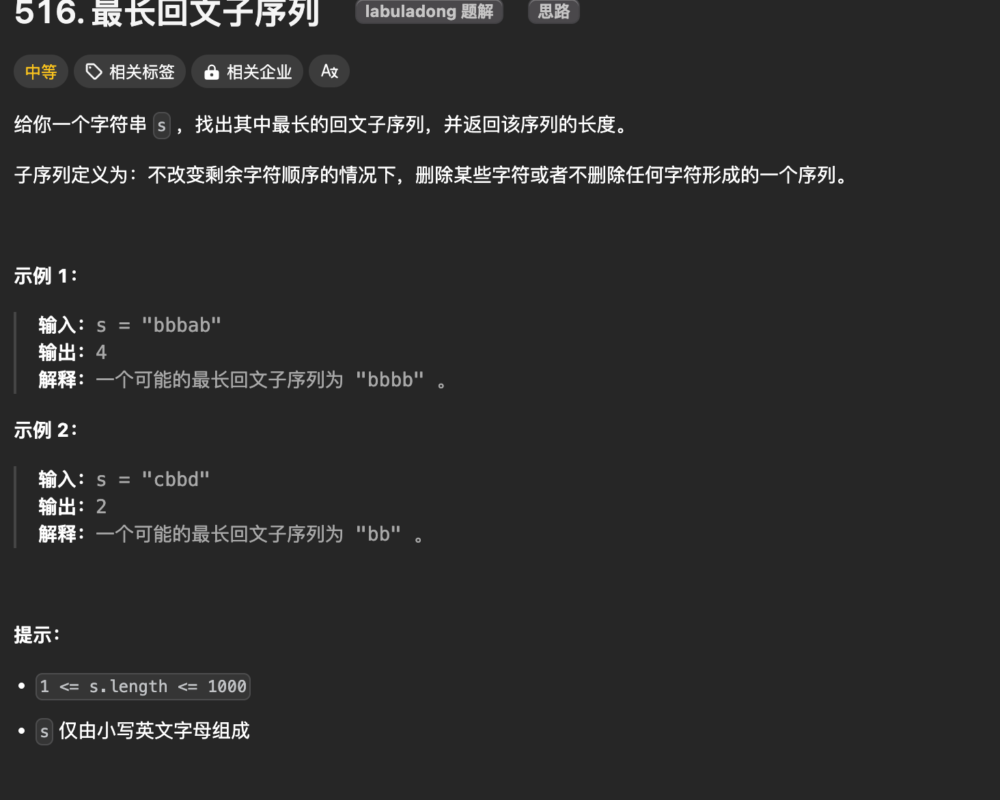
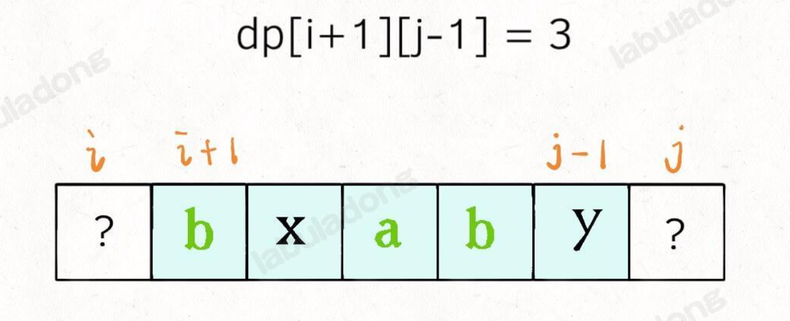
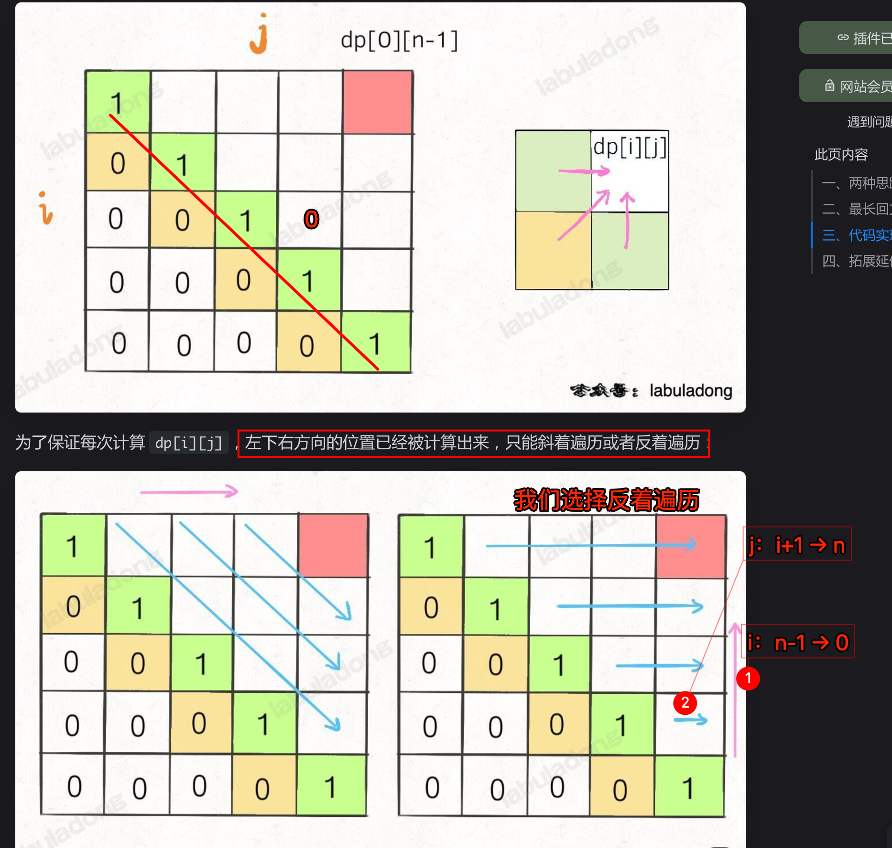
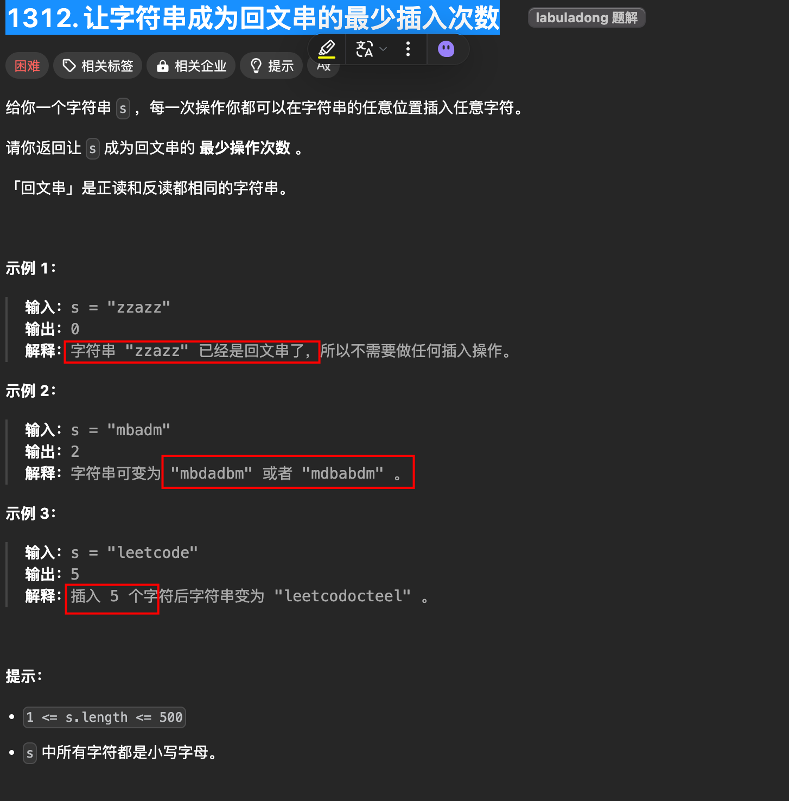

# 子序列： 动态规划之子序列问题解题模板（最长回文子序列）


| LeetCode                                                                                                                                        | 力扣                                                                                                          | 难度  |
| ----------------------------------------------------------------------------------------------------------------------------------------------- | ----------------------------------------------------------------------------------------------------------- | --- |
| [1312. Minimum Insertion Steps to Make a String Palindrome](https://leetcode.com/problems/minimum-insertion-steps-to-make-a-string-palindrome/) | [1312. 让字符串成为回文串的最少插入次数](https://leetcode.cn/problems/minimum-insertion-steps-to-make-a-string-palindrome/) | 🔴  |
| [516. Longest Palindromic Subsequence](https://leetcode.com/problems/longest-palindromic-subsequence/)                                          | [516. 最长回文子序列](https://leetcode.cn/problems/longest-palindromic-subsequence/)                               | 🟠  |

## 目录
<!-- toc -->
 ## 1. 子序列不好解决 

- 子序列问题本身就相对子串、子数组更困难一些
	- 因为序子序列是不连续的

## 2. 两种解题模板

### 2.1. 一维 dp 数组

定义：在子数组 `arr[0..i]` 中，以 `arr[i]` **结尾**的子序列的长度是 `dp[i]`

这样符合**归纳法**，可以找到**状态转移**的关系

```javascript hl:5
int n = array.length;
int[] dp = new int[n];

for (int i = 1; i < n; i++) {
    for (int j = 0; j < i; j++) {
        dp[i] = 最值(dp[i], dp[j] + ...)
    }
}
```

> 注意是上面标注的 `j < i`

### 2.2. 二维的 `dp` 数组

这种思路运用相对更多一些
- 尤其是涉及**两个字符串/数组的子序列**时
	- 在子数组 `arr1[0..i]` 和子数组 `arr2[0..j]` 中，我们要求的子序列长度为 `dp[i][j]`
		- 注意上面的 `i 和 j` 分别代表什么？
- 也可以用于只涉及**一个字符串/数组**的情景，比如回文子序列问题
	- 在子数组 `array[i..j]` 中，我们要求的子序列的长度为 `dp[i][j]`
		- 注意上面的 `i 和 j` 分别代表什么？

## 3. 最长回文子序列



比如说输入 `s = "aecda"`，算法返回 3，因为最长回文子序列是 `"aca"`，长度为 3。
### 3.1. dp 数组定义

 `dp` 数组的定义是：
 - 在子串 `s[i..j]` 中，最长回文子序列的长度为 `dp[i][j]`

```javascript
if (s[i] == s[j])
    // 它俩一定在最长回文子序列中
    dp[i][j] = dp[i + 1][j - 1] + 2;
else
    // s[i+1..j] 和 s[i..j-1] 谁的回文子序列更长？
    dp[i][j] = max(
	    dp[i + 1][j], 
	    dp[i][j - 1]
    );
```

### 3.2. 为什么是 `dp[i][j] = dp[i + 1][j - 1]` 



如上图，如果 `i=j` ，那么就可以
- i 指针向右移动，i + 1
- j 指针向左移动，j - 1

### 3.3. 遍历顺序


### 3.4. 最终代码

```javascript
var longestPalindromeSubseq = function (s) {
  var n = s.length;
  // dp 数组全部初始化为 0
  var dp = Array.from({ length: n }, () => Array(n).fill(0));
  // base case：i 和 j 相等的话 dp[i][j] 必然等于 1
  // 为什么：因为此时 s[i..j] 只有一个字符，那就是它自己
  for (var i = 0; i < n; i++) {
    dp[i][i] = 1;
  }
  // 反着遍历保证正确的状态转移
  // 因为 dp[i][j] 依赖 dp[i + 1][j - 1]，需要知道 dp[i + 1][j - 1] 才能算出 dp[i][j]
  for (var i = n - 1; i >= 0; i--) {
    // j 从 i + 1 开始,因为 dp[i][j] 是从 dp[i + 1][j - 1] 转移过来的
    for (var j = i + 1; j < n; j++) {
      // 状态转移方程
      if (s.charAt(i) == s.charAt(j)) {
        // s[i] 和 s[j] 必然在最长回文子序列中，直接 +2
        dp[i][j] = dp[i + 1][j - 1] + 2;
      } else {
        dp[i][j] = Math.max(
          dp[i + 1][j], // s[i] 不在最长回文子序列中
          dp[i][j - 1], // s[j] 不在最长回文子序列中
        );
      }
    }
  }
  // 整个 s 的最长回文子串长度
  return dp[0][n - 1];
};
```

## 4. 让字符串成为回文串的最少插入次数



- 比如说输入 `s = "abcea"`，算法返回 2，因为可以给 `s` 插入 2 个字符 `ba` 变成回文串 `"abeceba"` 或者 `"aebcbea"`。
- 如果输入 `s = "aba"`，则算法返回 0，因为 `s` 已经是回文串，不用插入任何字符

### 4.1. dp 定义

对字符串 `s[i..j]`，最少需要进行 `dp[i][j]` 次插入才能变成回文串

```javascript hl:3
if (s[i] == s[j]) {
    // 不需要插入任何字符
    dp[i][j] = dp[i + 1][j - 1];
} else {
    // 把 s[i+1..j] 和 s[i..j-1] 变成回文串，选插入次数较少的
    // 然后还要再插入一个 s[i] 或 s[j]，使 s[i..j] 配成回文串
    dp[i][j] = min(
	    dp[i + 1][j],  // 再插入一个 s[i]
	    dp[i][j - 1]   // 再插入一个 s[j]
	) + 1;
}
```

### 4.2. 最终代码

```javascript
var minInsertions = function (s) {
  var n = s.length;
  // dp[i][j] 表示把字符串 s[i..j] 变成回文串的最少插入次数
  // dp 数组全部初始化为 0
  var dp = Array.from(Array(n), () => Array(n).fill(0));
  // 反着遍历保证正确的状态转移
  for (var i = n - 1; i >= 0; i--) {
    for (var j = i + 1; j < n; j++) {
      // 状态转移方程
      // 如果 s[i] == s[j]，说明不用插入，dp[i][j] = dp[i + 1][j - 1]
      if (s.charAt(i) === s.charAt(j)) {
        dp[i][j] = dp[i + 1][j - 1];
      } else {
        dp[i][j] =
          Math.min(
            dp[i + 1][j], // 插入 s[i]，使得 s[i,j] 变成回文串
            dp[i][j - 1], // 插入 s[j]，使得 s[i,j] 变成回文串
          ) + 1;
      }
    }
  }
  // 整个 s 的最少插入次数
  return dp[0][n - 1];
};

```

### 4.3. 复用最长回文子序列的代码

```javascript hl:2
var minInsertions = function(s) {
    return s.length - longestPalindromeSubseq(s);
};

// 计算 s 中的最长回文子序列长度
var longestPalindromeSubseq = function(s) {
    // 见上文
};
```

