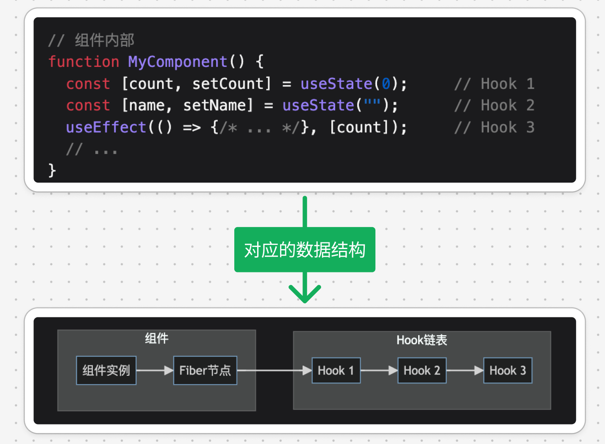
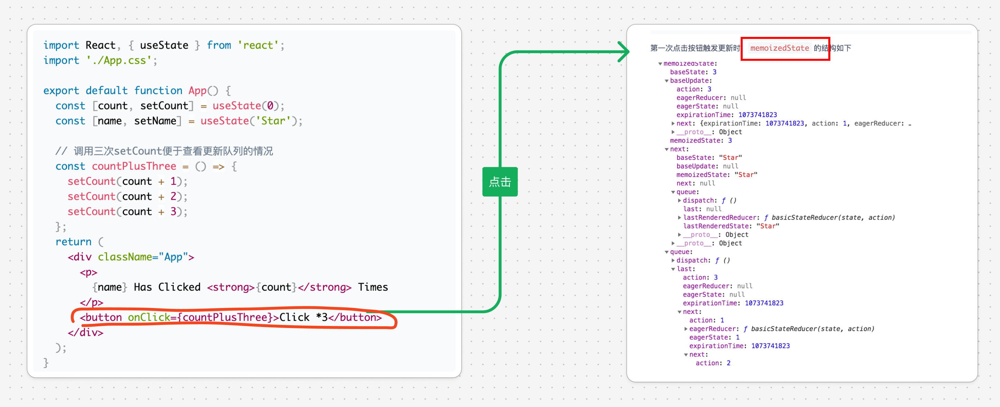

# React Hooks 的原理

`#react` 


## 目录
<!-- toc -->
 ## 1. 数据结构 

- Hooks 的状态存储在 `Fiber 节`点的 `memoizedState` 属性中
- React 使用`链表`结构来存储 Hooks 状态：
- 每个 Hook 节点包含：
    - 当前状态：`state`
    - 更新队列: `queue` ，存储多次更新行为
    - 依赖项（对于 useEffect 等）
    - next：指向下一个 Hook 的指针

### 1.1. 示例



- Hooks 状态存储在 Fiber 节点上
- 通过 Fiber 实现时间切片和优先级调度
- 支持并发模式下的状态管理

## 2. Hooks 规则

1. **只在顶层调用 Hooks**
    - 不能在循环、条件或嵌套函数中调用
    - 确保 Hooks 的调用顺序保持一致
2. **只在 React 函数组件中调用 Hooks**
    - 不能在普通 JavaScript 函数中调用
    - 不能在类组件中调用

## 3. useState 的源码分析

### 3.1. 入口

所有的 Hooks 在 React.js 中被引入，挂载在 React 对象中，如下：

```javascript hl:12
// React.js
import {
  useCallback,
  useContext,
  useEffect,
  useImperativeHandle,
  useDebugValue,
  useLayoutEffect,
  useMemo,
  useReducer,
  useRef,
  useState,
} from './ReactHooks';
```

### 3.2. Hook 对象的结构

```ts
// ReactFiberHooks.js
export type Hook = {
  memoizedState: any,

  baseState: any,
  baseUpdate: Update<any, any> | null,
  queue: UpdateQueue<any, any> | null,

  next: Hook | null,
};
```

### 3.3. 一个示例



## 4. 简化版的 useState 实现

### 4.1. 先给出一个架子

```javascript
function useState(initialValue) {
    let state = initialValue;
    const setState = (newValue) => {
        state = newValue;
        // 这里可以触发组件重新渲染
    };
    return [state, setState];
}

```

React useState 的核心原理：
1. 通过`闭包`保存状态
2. 使用`游标`确保 hooks 的调用顺序
3. 触发重新渲染来更新视图
4. 维护状态的一致性

```javascript hl:29,34,35,14
// 保存状态的数组
let states = [];
// 当前处理的 hook 索引
let cursor = 0;

// 简单的 useState 实现
function useState(initialState) {
  // 获取当前 hook 的索引
  const currentCursor = cursor;

  // 初始化状态
  states[currentCursor] = states[currentCursor] || initialState;

  // 更新函数
  const setState = (newState) => {
    // 支持函数式更新
    states[currentCursor] =
      typeof newState === "function"
        ? newState(states[currentCursor])
        : newState;

    // 触发重新渲染
    render();
  };

  // 移动游标到下一个位置
  cursor++;

  return [states[currentCursor], setState];
}

// 示例组件
function Component() {
  const [count, setCount] = useState(0);
  const [text, setText] = useState("hello");

  return {
    render: () => {
      console.log("State:", { count, text });
    },
    click: () => setCount(count + 1),
    type: (newText) => setText(newText),
  };
}

// 模拟 React 的渲染过程
function render() {
  // 重置游标
  cursor = 0;
  // 渲染组件
  const component = Component();
  component.render();
  return component;
}

// 测试代码
console.log("Initial render:");
const component = render();

console.log("\nAfter clicking:");
component.click();

console.log("\nAfter typing:");
component.type("world");

```

在实际的 React 实现中，还包含了更多的特性和优化，比如：

- Fiber 架构的集成
- 批量更新的处理
- 优先级调度
- 内存优化
- 开发环境的调试支持

## 5. 极简 React Hooks 实现

```javascript hl:9,15,31
// 存储 hooks 状态
let hooks = [];
let currentHook = 0;

// 模拟 React 的工作原理
function createReactLike() {
  // 重置 hooks 游标
  const render = (Component) => {
    currentHook = 0;
    const app = Component();
    app.render();
    return app;
  }

  // useState 实现
  const useState = (initialValue) => {
    const hookId = currentHook;
    hooks[hookId] = hooks[hookId] || initialValue;

    const setState = (newValue) => {
      hooks[hookId] = typeof newValue === 'function' 
        ? newValue(hooks[hookId]) 
        : newValue;
      reRender(); // 触发重新渲染
    };

    currentHook++;
    return [hooks[hookId], setState];
  }

  // useEffect 实现
  const useEffect = (callback, deps) => {
    const hookId = currentHook;
    const oldDeps = hooks[hookId];
    
    // 检查依赖是否变化
    const hasChanged = !oldDeps || 
      !deps || 
      deps.some((dep, i) => !Object.is(dep, oldDeps[i]));

    if (hasChanged) {
      // 执行清理函数
      if (hooks[hookId]?.cleanup) {
        hooks[hookId].cleanup();
      }
      
      // 执行 effect 并保存清理函数
      hooks[hookId] = {
        deps,
        cleanup: callback()
      };
    }

    currentHook++;
  }

  return {
    useState,
    useEffect,
    render
  }
}

// 创建 React 实例
const React = createReactLike();
let reRender;

// 示例组件
function Counter() {
  const [count, setCount] = React.useState(0);
  const [text, setText] = React.useState('hello');

  React.useEffect(() => {
    console.log(`Count changed to: ${count}`);
    // 返回清理函数
    return () => console.log(`Cleaning up count: ${count}`);
  }, [count]);

  React.useEffect(() => {
    console.log(`Text changed to: ${text}`);
    // 返回清理函数
    return () => console.log(`Cleaning up text: ${text}`);
  }, [text]);

  return {
    render: () => {
      console.log('Render:', { count, text });
    },
    increment: () => setCount(c => c + 1),
    decrement: () => setCount(c => c - 1),
    updateText: (newText) => setText(newText)
  };
}

// 初始渲染
console.log('=== Initial Render ===');
const component = React.render(Counter);
// 保存重新渲染函数
reRender = () => React.render(Counter);

// 测试状态更新
console.log('\n=== After Increment ===');
component.increment();

console.log('\n=== After Text Update ===');
component.updateText('world');

console.log('\n=== After Decrement ===');
component.decrement();
```

