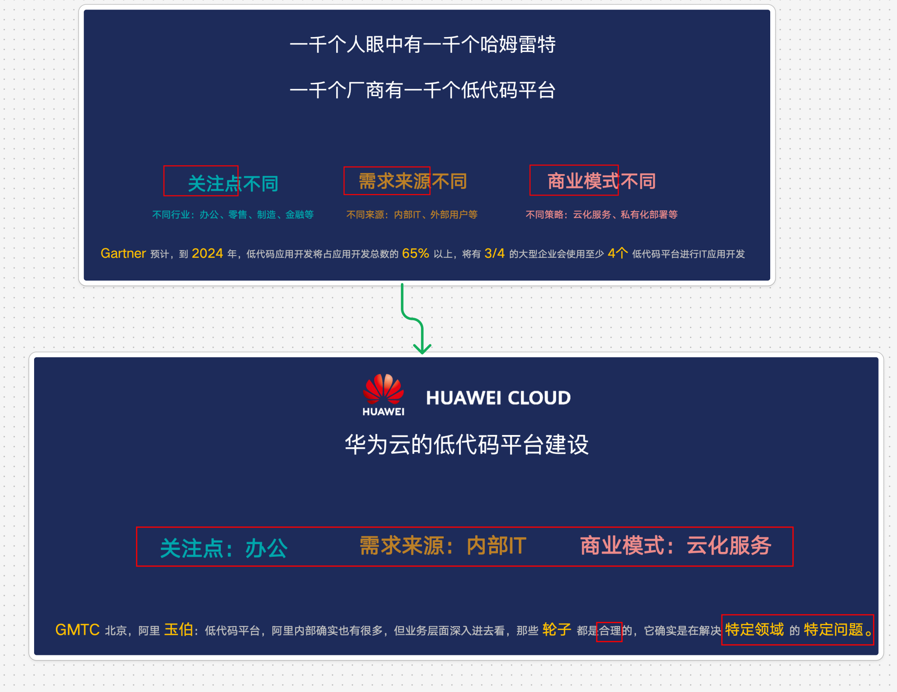
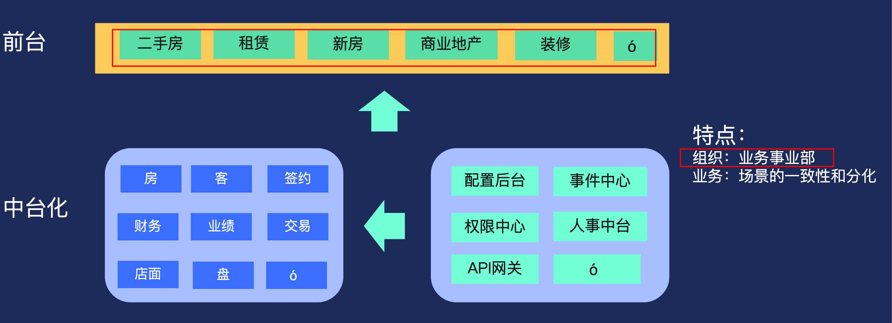
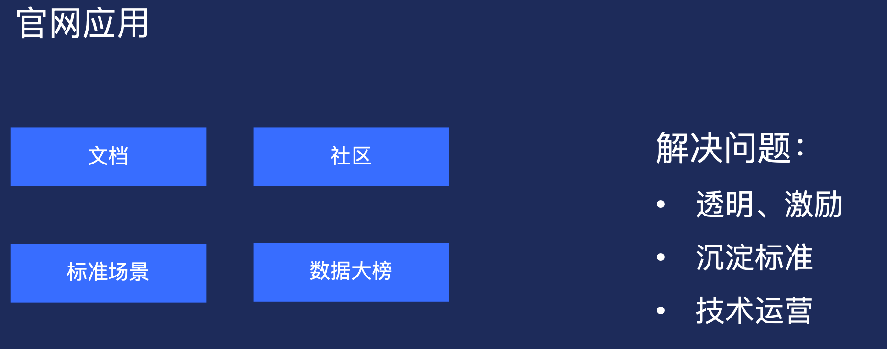

# 调研：各类大会对低代码的分享

`#lowcode` 

## 目录
<!-- toc -->
 ## 1. 多技术栈及高低代码混合开发（华为云低代码平台架构探讨） 

### 1.1. 低代码源于需求

### 1.2. 低代码如何考虑存量业务

如何在画布里展现不同技术栈的 UI 组件?

- 答案是：利用 `Web Component` 在画布展现不同技术栈的组件
	- 三大主流前端框架都提供官方 `Web Component` 转换工具
	- UI 组件都用 `Web Component` 包裹后再显示到画布上生成的代码引用原始 UI 组件，而非 Web Component

## 2. 贝壳中台化建设下的前端体系探索

### 2.1. 贝壳的业务和组织背景

### 2.2. 重点

- 搜集组件使用数据，**评价和回归**
	- 
- 接入灵活，随写随用，开发、测试、上线流畅
	- 比如可以写个插件，只要引用了组件库，可以**随时调用评价，录屏或者报错**，使用文档等等
	- 提报 Bug 等

## 3. 阿里低代码引擎和生态建设实战及思考

> 更多参考：[8. 好文：阿里低代码引擎和生态建设实战及思考](/post/oBQNnDIT.html)

## 4. 低代码平台架构深度剖析

> 更多参考 [23. 【精读】低代码平台架构深度剖析@832](#)

