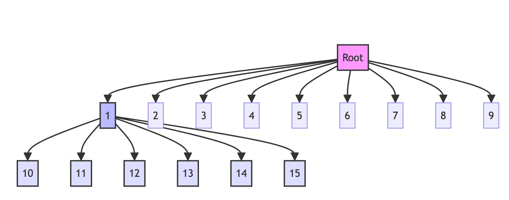

# 字典序排数


>  [386. 字典序排数](https://leetcode.cn/problems/lexicographical-numbers/)


## 目录
<!-- toc -->
 ## 题目 

### n = 13 时

```javascript
输入：n = 13
输出：[1,10,11,12,13,2,3,4,5,6,7,8,9]
```

### n = 15 时

```javascript
1
  -> 10
  -> 11
  -> 12
  -> 13
  -> 14
  -> 15
2
3
4
5
6
7
8
9
```

## 代码

- 1 可以生出二位数 10, 11, 12...
- 10 又可以生出 100, 101, 102...
- 11 又可以生出 110, 111, 112...



遍历顺序如下：

```javascript
0
├──1
├──── 10
├──── 11
├──── 12
├──── 13
├──── 14
├──── 15
├──2
├──3
├──4
├──5
├──6
├──7
├──8
├──9
```

## 把 0 当做根节点 → 需要把 `根节点 0` 排除掉

```javascript hl:7
var lexicalOrder = function (n) {
    const res = [];
    function traverse(root) {
        // 如果当前数字大于 n，就返回
        if (root > n) return;
        // 根节点 0 不需要加入
        if (root !== 0) {
            res.push(root);
        }
        // 根节点 0，从 1 开始，其他从 0 开始
        let start = root === 0 ? 1 : 0;
        for (let i = start; i <= 9; i++) {
            traverse(root * 10 + i);
        }
    }
    traverse(0);
    return res;
};

```