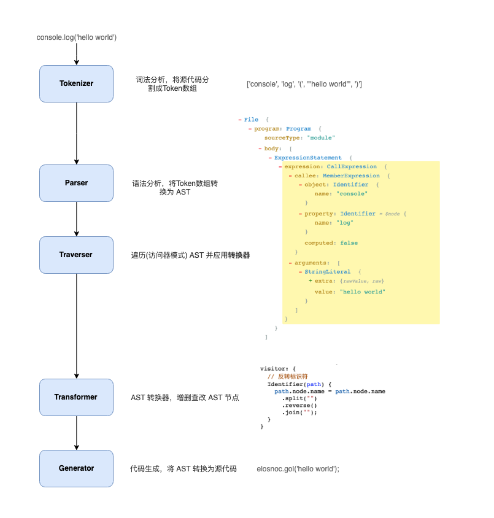
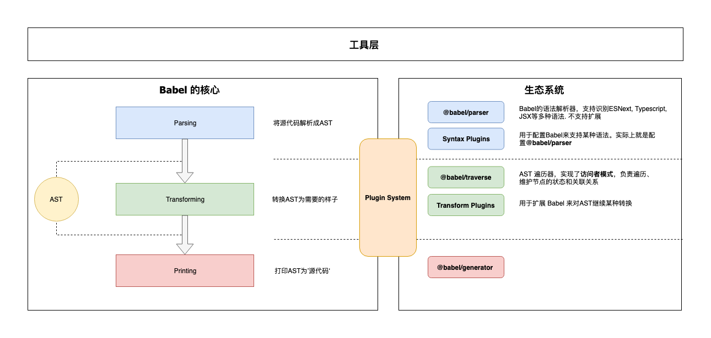

# Babel  的原理（篇二）

`#babel` 

## 目录
<!-- toc -->
 ## 1. 总结 

- 本质是**多叉树的深度遍历**
	- 需要注意在**进入节点或者离开节点**时调用相应的钩子
		- 钩子 `return` 返回
	- 为了能够拿到其他节点的信息，所以会单独维护 `context`
 -  常用包
	 - @babel/core
	 - @babel/parser
	 - @babel/traverse
	 - @babel/generator

## 2. console.log("hello world") 为例

## 3. Babel 架构

- @babel/core
	- 加载和处理配置(config)
	- 加载插件
	- 调用 `Parser` 进行语法解析，生成 `AST`
	- 调用 `Traverser` 遍历AST，并使用`访问者模式`应用’插件’对 AST 进行转换
	- 生成代码，包括SourceMap转换和源代码生成
- **Parser(`@babel/parser`)**： 将源代码解析为 AST 就靠它了。 它已经内置支持很多语法. 
	- 例如 JSX、Typescript、Flow、以及最新的ECMAScript规范。
	- 目前为了执行效率，parser是[不支持扩展的](https://babeljs.io/docs/en/babel-parser#faq)，由官方进行维护。如果你要支持自定义语法，可以 fork 它，不过这种场景非常少。
- **Traverser(`@babel/traverse`)**： 
	- 实现了`访问者模式`，对 AST 进行遍历，`转换插件`会通过它**获取感兴趣的AST节点**，对节点继续操作, 下文会详细介绍`访问器模式`。
- **Generator(`@babel/generator`)**： 将 AST 转换为源代码，支持 SourceMap

## 4. 访问者模式与上下文

本质是深度遍历，需要注意在进入节点或者离开节点时调用相应的钩子，为了能够拿到其他节点的信息，所以会单独维护 `context`

