# 常见面试题：篇一


`#前端面试` 


## 目录
<!-- toc -->
 ## 1. 打印出 1 - 10000 之间的所有对称数 例如 121、1331 等 

```javascript hl:4
let a1 = [...Array(10000).keys()].filter((i) => {
  return (
    String(i).length > 1 &&
    String(i) === i.toString().split("").reverse().join("")
  );
});
```

## 2. 如何快速从一个巨大的数组中随机获取部分元素(不能重复获取)

- 思路
	- 生成随机数：`Math.floor(Math.random() * (arr.length - i))`
	- 每次都把抽到的数据放到**最后一位**去了，那么下次再抽取时就可能再抽到了

```javascript
/**
 * 洗牌算法：
    1.  生成一个 0 ~ arr.length 的随机数
    2.  交换该随机数位置元素和数组的最后一个元素，并把该随机位置的元素放入结果数组
    3.  生成一个 0 ~ arr.length - 1 的随机数  →   生成一个 0 ~ arr.length - 2 的随机数 ...
    4.  交换该随机数位置元素和数组的倒数第二个元素，并把该随机位置的元素放入结果数组
        依次类推，直至取完所需的100个元素
*/

function shuffle(arr, size) {
  let result = [];
  for (let i = 0; i < size; i++) {
    // 1、生成一个 0 ~ arr.length 的随机数
    const randomIndex = Math.floor(Math.random() * (arr.length - i));
    // 2、 交换该随机数位置元素和数组的最后一个元素，并把该随机位置的元素放入结果数组
    const item = arr[randomIndex];
    arr[randomIndex] = arr[arr.length - 1 - i];
    arr[arr.length - 1 - i] = item;
    result.push(item);
  }
  return result;
}

```

## 3. 数组洗牌

-  从最后一个元素开始
	- 0 - len 之间的随机数 random
		- random 和 最后一位交换
	- len-- 
	- 继续交换，直至到第一个元素
		- 从数组中随机选出一个位置，交换，直到第一个元素
	* 关键：`random = Math.floor(length * Math.random());`

```javascript hl:6,7,9,10
let a = [1, 2, 3, 4, 5];
function fn1(arr) {
  let len = arr.length - 1;
  // 倒着遍历
  // 这里是大于 -1
  while (len > -1) {
    let random = Math.floor(Math.random() * len);
    // 和最后一个位置，交互
    [arr[random], arr[len]] = [arr[len], arr[random]];
    len--;
  }
  console.log(arr);
  return arr;
}
fn1(a);
fn1(a);
fn1(a);
fn1(a);
fn1(a);
```

## 4. 统计 1 ~ n 整数中出现 1 的次数

- 思路1：正常`split('')` 转成数组遍历计数
- 思路2：直接使用 `match` 匹配正则， `"11112111".match(/1/g).length`

## 5. 数组扁平化

- 方法1： 原生方法：`arr.flat(Infinity)`
- 方法2： 数组
	- `toString` 
	-  `split(',')`
	- 然后 `.map(Number)`
- 方法3：
	-  遍历的方法，之前还写错了，这个都写错了，一定要用一个全局变量放在闭包函数里

## 6. 实现一个千分位

- **方法1：** 正则 `'10000000000'.replace(/(\d)(?=(\d{3})+$)/g, '$1,')`
- 方法2：`Number(12121323232323).toLocaleString()`
- 方法3：使用遍历，转成数组，再两次`reverse` 做不同的事情

## 7. rgb 转成 16 进制

- 从 rgb(255, 255, 255) 中提取出 r=255 、 g=255 、 b=255
- 将 r 、 g 、 b 转换为十六进制，不足两位则补零
	- 转十六进制 ：`toString(16)`
	- 不足两位补 `0` 

## 8. 层树结构处理转成一维树结构：回溯算法，第二个参数是 `keys`

```javascript
var entry = {
  a: {
    b: {
      c: {
        dd: "abcdd",
      },
    },
    d: {
      xx: "adxx",
    },
    e: "ae",
  },
};

// 要求转换成如下对象
var output = {
  "a.b.c.dd": "abcdd",
  "a.d.xx": "adxx",
  "a.e": "ae",
};

function fn(obj) {
  let res = {}; 
  function backtrack(obj, keys) {
    // base case
    if (typeof obj === "string") {
      res[keys.join(".")] = obj;
      return;
    }
    // 遍历
    Object.entries(obj).forEach(([k, v]) => {
      // 做选择
      keys.push(k);
      backtrack(v, keys);
      // 撤销选择
      keys.pop();
    });
  }
  // [] 这里代表路径，需要决策的路径
  backtrack(obj, []);
  return res;
}
console.log(fn(entry));

```

## 9. 接上题：打平的对象，组装成对象

```javascript
var obj = {
  "a.b.c.dd": "abcdd",
  "a.d.xx": "adxx",
  "a.e": "ae",
};
var res = {
  a: {
    b: {
      c: {
        dd: "abcdd",
      },
    },
    d: {
      xx: "adxx",
    },
    e: "ae",
  },
};

function flattenToNested(entry) {
  const output = {};
  for (const [key, value] of Object.entries(entry)) {
    const keys = key.split(".");
    let current = output;
    for (let i = 0; i < keys.length - 1; i++) {
      const k = keys[i];
      current[k] = current[k] || {};
      current = current[k];
    }
    current[keys[keys.length - 1]] = value;
  }
  return output;
}
console.log(flattenToNested(output));
```

## 10. opacity:0 的 注意事项

- `opacity:0` **并不等于之前理解的** `display:none`，搞错了亲
- `opacity:0`  时也能**点击**

## 11. 实现map、filter、push等方法

- map 写成 `fn(this,i,this)`

## 12. 查找频率出现最高的单词

- 先通过 `s.match(/[a-z]+/g)`  匹配出所有的单词数组 `wordlist`
-  `wordlist` 中找出现次数最多的单词

## 13. 循环打印红绿灯

- 使用 `promise`
	- 使用递归
- 使用 async/await
	- 记得要**递归**

## 14. 解析URL参数为对象

- 正常字符串解析 
	- `?` `=` `&` 等
- `new URLSearchParams('s=1&b=1').get('s')`

## 15. 类数组转成数组

- `[].slice.call(arr)`
- `Array.from(arr)`

## 16. base64 转换：window.atob/btoa 

```javascript
// btoa ==》 b to a ; base64 to a 反着理解就对了
// b 代表base64反过来理解，就记住了
// a 代表ascii码，反过来理解就记住了

let encodedData = window.btoa("this is a example");
console.log(encodedData); // dGhpcyBpcyBhIGV4YW1wbGU=

let decodeData = window.atob(encodedData);
console.log(decodeData); // this is a example

// node 端： toBase64:
Buffer.from('123').toString('base64')
Buffer.from('MTIz', 'base64').toString()

```

## 17. 如何判断一个正常表达式是合法的

- new URL(url)
- 正则

## 18. 不用加减乘除运算符，求整数的7倍

```javascript
const times7 = x => '1'.repeat(x).repeat(7).length
```

## 19. js bridge 交互

### 19.1. js 调用 native 的东西

- 拦截 Scheme：比较类似于`jsonp`的思路
	- js层：`a.herf=` / `locacation.href` / `iframe`
	- ios 和 Android 侧：分别做拦截即可，就类比于 `jsonp` 的思路
- 这种方法的`缺点`
	- 连续续调用 `location.href` 会出现消息丢失
	- `url`长度有限制
- 弹窗方式：
	- 安卓测：onJsAlert、onJsConfirm、onJsPrompt
	- ios侧：WKWebView支持，但UIWebView 不支持
- 注入上下文的方式：
	- 即注入到 js 环境中的 `window`对象上，直接调用

### 19.2. native 调用 js 中的东西

- **就是再native中执行window上的方法等，如安卓中** `webView.loadUrl("javascript:foo()");`

## 20. 怎么判断一个元素在可视区域内

- `el.offsetTop - document.documentElement.scrollTop <= viewPortHeight`
- `getBoundingClientRect`，相对于视口的距离，计算w/h/top/left/bottom/right ，会引起重排，不建议，以下条件就在可视区域内。
	- top 大于等于 0
	- left 大于等于 0
	- bottom 小于等于视窗高度
	- right 小于等于视窗宽度
- 新 API ：
	- 判断元素是否进入可视区域内，`IntersectionObserver`的实现，应该采用`requestIdleCallback()`

## 21. 高并发场景，高技术要求场景的方法论？

- 选用成熟框架，经受过高压场景验证过得，比如`egg.js`
- 做好压测
- 做好线上预警，具体快速扩容能力

## 22. while 和 for 中使用 return 终止循环

```javascript hl:4,2
function test() {
  // 或者使用while一样的效果
  for (let i = 1; i < 10; i++) {
    if (i === 5) return;
    console.log(i);
  }
}
test();
```

## 23. 大文件上传思路

- 1、使用 FileReader 读文件流 ，blob.slice分割，md5 文件唯一标识，hash.1.png
* 2、试试监听xhr  ononpress 实时获取上传进度
* 3、都上传完后，需要再发一个请求告诉服务器做合并处理

## 24. 图片懒加载的时机

- `img[i].offsetTop < 可视区域视图高度 + scrollTop`
- 所以 `offsetTop` 是相对于整个文档的距离

## 25. 找出字符串中连续出现最多的字符和个数：`/(\w)\1*/g`

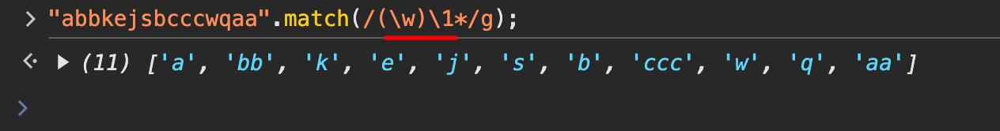

## 26. js 和 css 压缩的原理

### 26.1. js

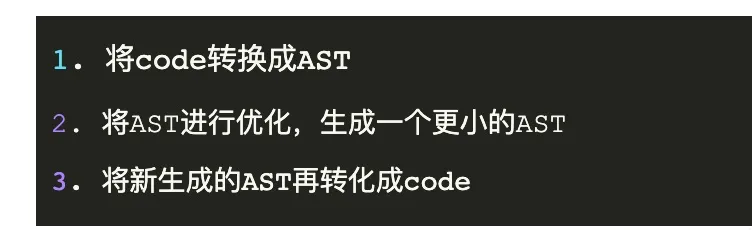

### 26.2. css

`CSS` 压缩比较简单，就是将多余的回车`换行符`与`注释` 去掉

## 27. flex:1

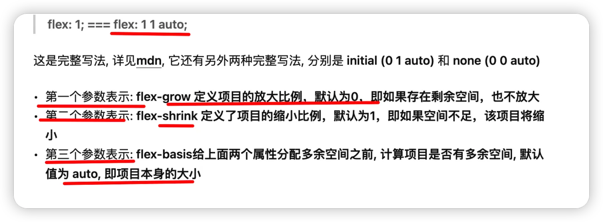

### 27.1. new 关键字

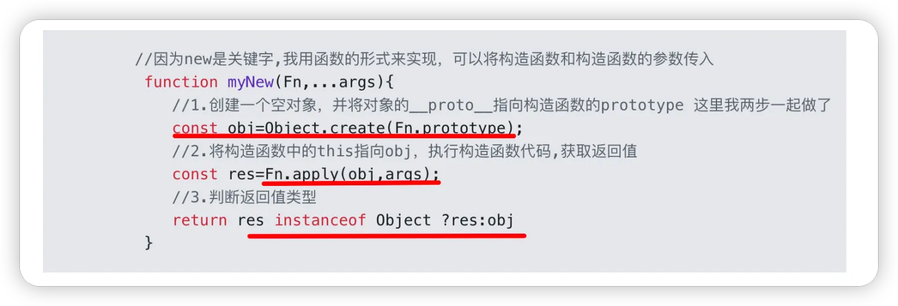

## 28. class中箭头函数与普通函数的 `this` 指向问题


```javascript
class Animal {
  constructor() {
    this.name = "cat";
  }
  // 普通函数方法,直接挂载在原型上
  speak() {
    // 当然，this都指向实例对象
    console.log(this.name);
  }
  // 箭头函数方法，直接挂载在 Animal 上
  eat = () => {
    // 当然，this都指向实例对象
    console.log(this.name);
  };
}
const n = new Animal();
const a = n.speak;
const b = n.eat;

// 箭头函数方法： this依然指向创建的实例对象，即，箭头函数中的this始终是该箭头函数所在作用域中的this
b(); // cat
// 普通方法，报错，因为 方法中的this 会指向undefined ，即普通函数中的 this 是动态绑定的，始终指向函数的执行环境，
a(); // 报错

```

## 29. typescript 中 unknown、any、void 的区别

### 29.1. **类型安全性**

- `any`: 完全不安全，跳过类型检查
- `unknown`: 类型安全，需要类型检查才能使用
- `void`: 类型安全，只能赋值 undefined 或 null
	- `void`其实可以理解为`null`和`undefined`的`联合类型`，它表示空值
### 29.2. **使用场景**

- `any`: 当你不确定类型，或者需要快速迁移 JavaScript 代码时使用
- `unknown`: 当你不确定输入类型，但想保持类型安全时使用
- `void`: 主要用于表示函数没有返回值
### 29.3. **操作限制**

- `any`: 没有任何限制
- `unknown`: 必须先进行类型检查或断言
- `void`: 只能赋值 undefined 或 null
### 29.4. **最佳实践**

- 尽量避免使用 `any`，因为它会失去 TypeScript 的类型检查优势
- 如果不确定类型，优先使用 `unknown` 而不是 `any`
- `void` 主要用于函数返回类型声明

## 30. ts 的类型保护

类型保护主要的想法是尝试检测属性、方法或原型，以弄清楚如何处理一个值。有四种使用类型保护的主要方法，分别是 `in`，`typeof`，`instanceof`，`类型谓词is`

- `typeof` 类比于 js 的`typeof`
- `instanceof` 类比于 js 的`instanceof`
- `in` 如下检查某个对象上是否存在某个属性
	- 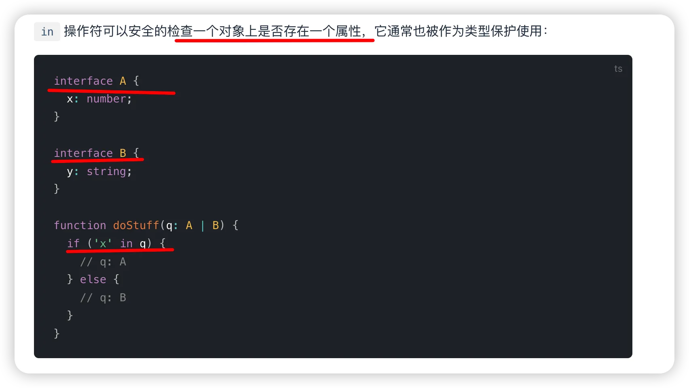
- is 
	- 

## 31. implements 与 extends 的区别

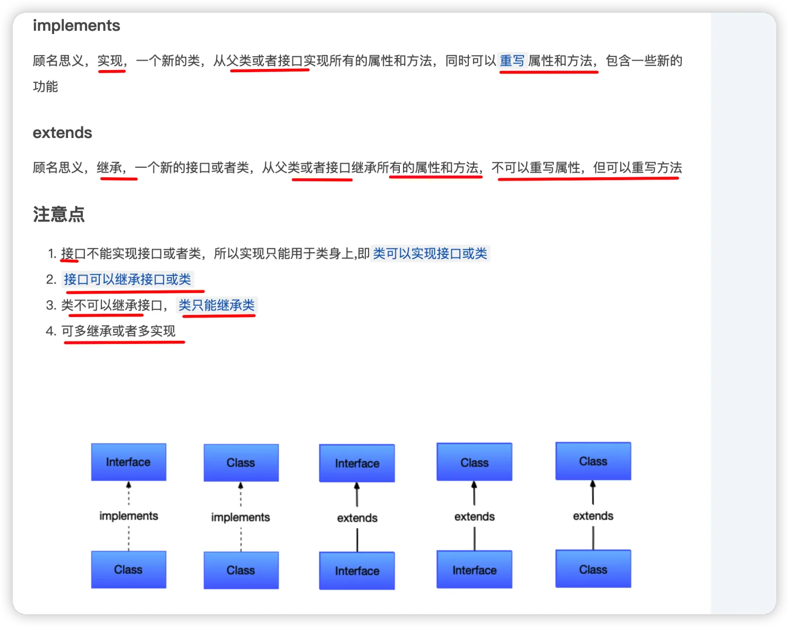

## 32. TypeScript 中 Interface 与 Type 的区别

- `interface` 只能定义`对象类型`
- `type` 声明可以声明任何类型。
- `interface` 能够声明 **合并**，两个相同接口会 **合并**。`Type`声明合并会报错
- `type`可以`类型推导`
	- 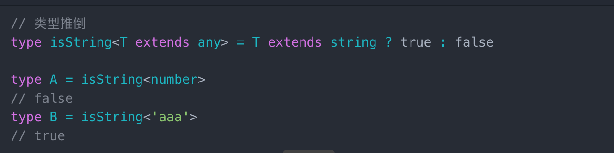

## 33. ts 中的 const 、 readonly 的区别

- 一个用于变量，一个用于属性
- `readonly` 修饰的**属性**能确保自身不能修改属性，

## 34. Http 状态码 301 和 302 的应用场景分别是什么

- **301: 永久重定向**
- **302: 临时重定向**
	- **搜索引擎会抓取新的内容而**`保留旧的地址`
- **304 Not Modified ，即**`协商缓存`

## 35. async会隐式返回一个Promise

```javascript hl:21
async function name([param[, param[, ... param]]]) {
    statements 
}

// async 函数一定会返回一个 promise 对象。
// 如果一个 async 函数的返回值看起来不是 promise，那么它将会被隐式地包装在一个 promise 中。

// 例如，如下代码：

async function foo() {
   return 1
}

// 等价于：===> 

function foo() {
   return Promise.resolve(1)
}

// async会隐式返回一个Promise
// 所以下面代码会可能会有坑哦，因为useEffect返回销毁函数，可能会导致组件销毁时执行
useEffect(async () => {
  const response = await fetch('...');
  // ...
}, []);
```

## 36. 如何监控网页崩溃？

- 使用`sw`来监控，轮询去看检测心跳！

## 37. 一句话总结Web worker，Service worker和worklet

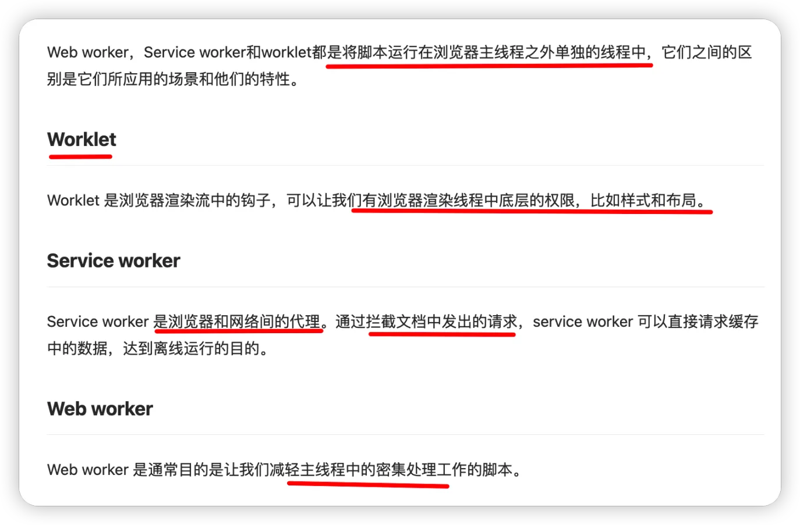

## 38. `indexOf` 与 `findIndex` 区别（总结）

- `indexOf` ：
	- 查找值作为第一个参数，采用 `===` 比较，更多的是`用于查找基本类型`，如果是对象类型，则是判断是否是`同一个对象的引用`
- `findIndex` ：
	- 比较函数作为第一个参数，多用于`非基本类型(例如对象)的数组索引查找`，或查找条件`很复杂`

## 39. 讲下 V8 sort 的大概思路，并手写一个 sort 的实现

- 最早以前v8引擎
	- 当数组排序区间长度在`10`之内时，实际的排序方法是 `插入排序`
	- 其余时候使用 `快速排序`
		- 但后面最新的`es`规范中`要求稳定`，所以舍弃了
- 现在改用混合排序的算法：`TimSort`
	- `Timsort` 是一种混合、稳定高效的排序算法，源自`合并排序`和`插入排序`
		- `其实在现实中，给定的大部分数组中通常是有部分已经排好序的（无论是升序还是降序 `
## 40. 遍历数组的快慢比较

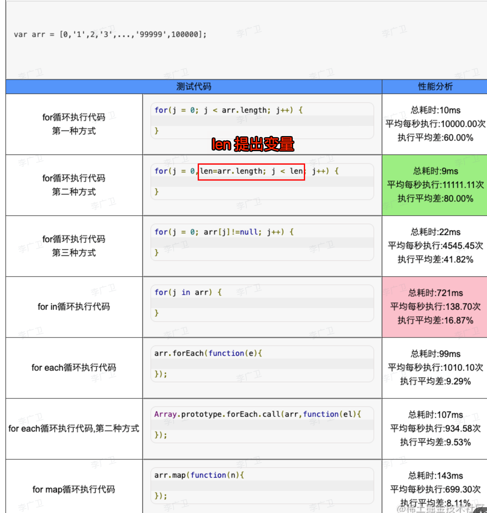

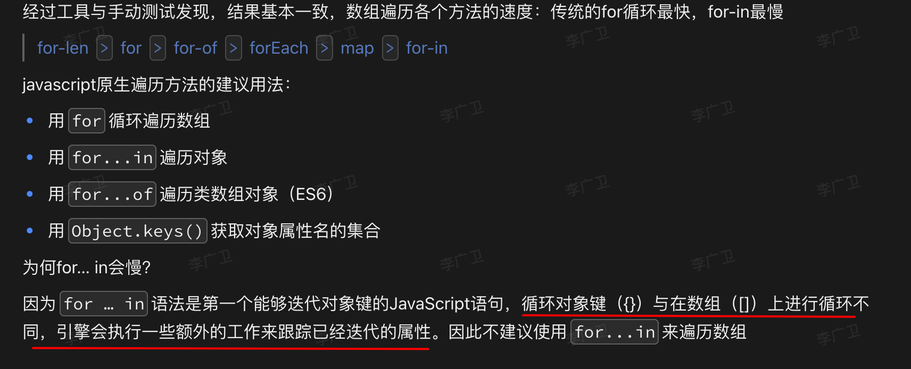

## 41. 使用 setTimeout(fn,0) 的场景有？

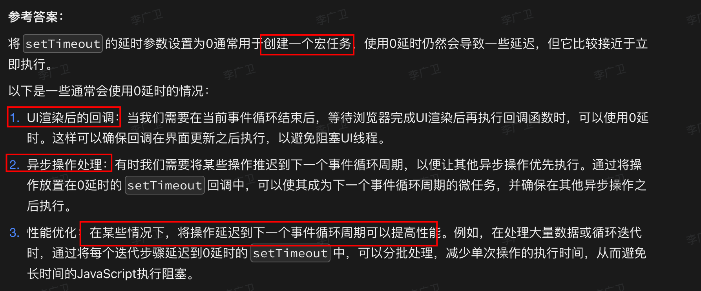

## 42. resolve 或者 return 一个 promise 对象时，会产生一个新的微任务

```javascript  hl:5,7
Promise.resolve()
  .then(() => {
    console.log(0);
    // 会产生一个新的 Promise，即产生一个新的微任务
    return Promise.resolve(1); // 等价于下面注释中
  })
  // 等价于
  // .then(() => {})
  // .then(() => {})
  .then((res) => {
    console.log(res);
  });

Promise.resolve()
  .then(() => {
    console.log(2);
  })
  .then(() => {
    console.log(3);
  })
  .then(() => {
    console.log(4);
  })
  .then(() => {
    console.log(5);
  })
  .then(() => {
    console.log(6);
  });

```

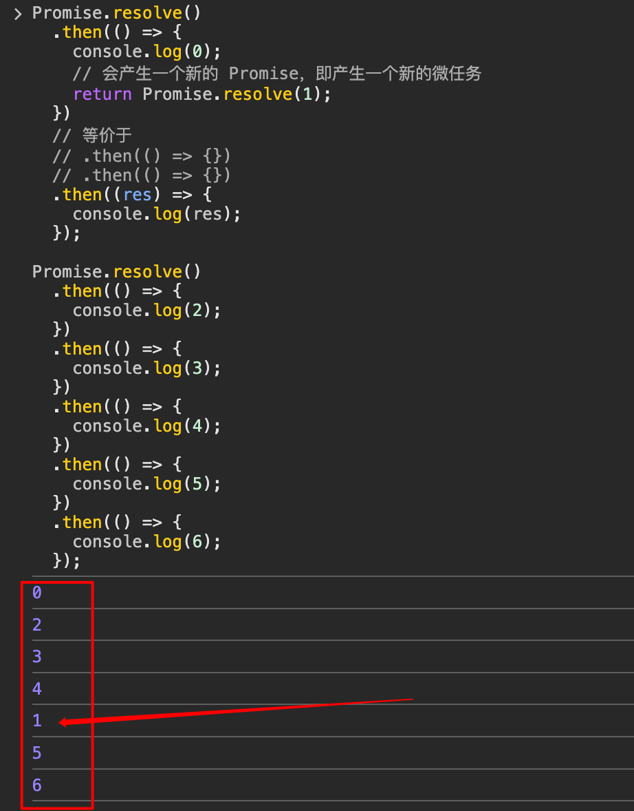

### 42.1. 重点

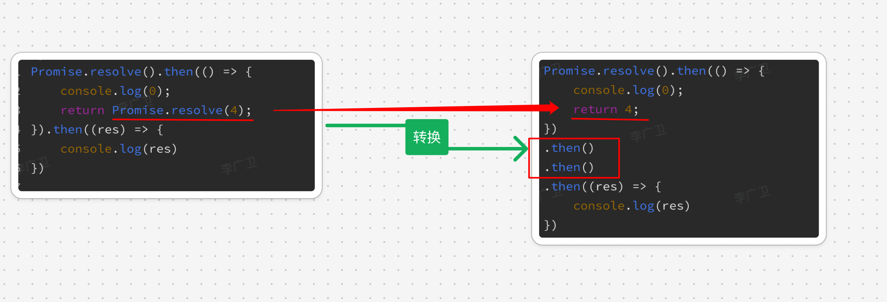

## 43. 如何实现大文件上传

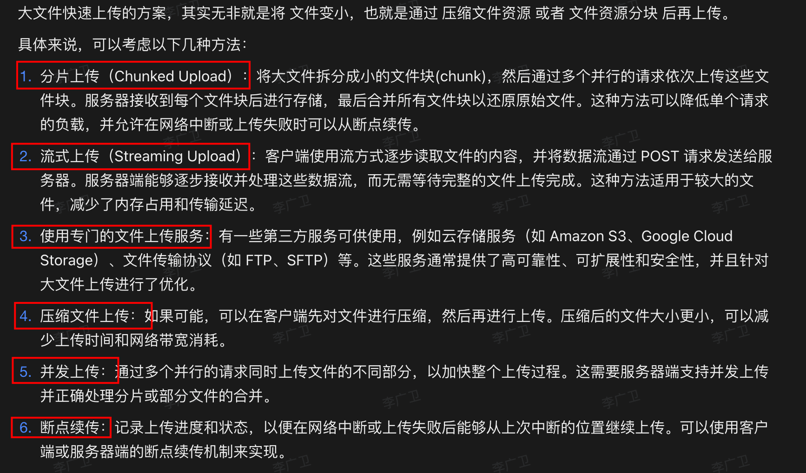

### 43.1. 其他注意点

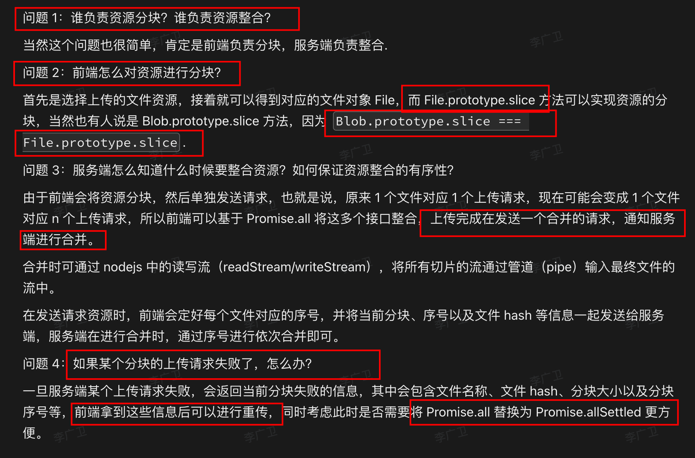

## 44. 列举 ES6（ES2015） 到 ES2024 的主要特性，按重要性排序

具体哪个是那年记不清，因为很多东西虽然在提案阶段，但**已经被 babel 之类的工具提请给实现**了

### 44.1. ES6 (ES2015) - 最重要的版本

```javascript
// 1. let 和 const
let x = 1;
const y = 2;

// 2. 箭头函数
const fn = () => {};

// 3. 解构赋值
const [a, b] = [1, 2];
const {name} = {name: 'test'};

// 4. 模板字符串
const str = `Hello ${name}`;

// 5. Class 语法
class Person {
    constructor() {}
}

// 6. Promise
new Promise((resolve, reject) => {});

// 7. 模块化
import/export

// 8. 默认参数
function fn(x = 1) {}

// 9. 展开运算符
[...array]
```

### 44.2. ES2016

```javascript
// 1. 指数运算符
2 ** 3

// 2. Array.includes()
[1,2].includes(1)
```

### 44.3. ES2017

```javascript
// 1. async/await
async function fn() {
    await promise;
}

// 2. Object.values/entries
Object.values({a: 1})
Object.entries({a: 1})

// 3. String padding
'1'.padStart(2, '0')
```


### 44.4. ES2018

```javascript
// 1. Rest/Spread 属性
const {a, ...rest} = obj;

// 2. 异步迭代 for-of
for await (const x of array) {}

// 3. Promise.finally()
promise.finally()
```

### 44.5. ES2019
```javascript
// 1. Array.flat/flatMap
[1, [2]].flat()
array.flatMap()

// 2. Object.fromEntries
Object.fromEntries(['a', 1](/post/pzcDahon.html#'a',-1))

// 3. String.trimStart/trimEnd
str.trimStart()
```

### 44.6. ES2020

```javascript
// 1. 可选链操作符
obj?.prop

// 2. 空值合并操作符
null ?? 'default'

// 3. BigInt
const big = 9007199254740991n

// 4. Promise.allSettled
Promise.allSettled([p1, p2])
```


### 44.7. ES2021

```javascript
// 1. 逻辑赋值运算符
x ||= y
x &&= y
x ??= y

// 2. String.replaceAll
'abc'.replaceAll('a', 'b')

// 3. Promise.any
Promise.any([p1, p2])
```


### 44.8. ES2022

```javascript
// 1. Class 字段
class A {
    x = 1;
    `#private` = 2;
    static y = 3;
}

// 2. Top-level await
await promise;

// 3. Array.at()
array.at(-1)
```

### 44.9. ES2023

```javascript
// 1. Array 查找从后向前
array.findLast()
array.findLastIndex()

// 2. Hashbang Grammar
`#!/usr/bin/env` node

// 3. WeakMap 支持 Symbol 键
```

### 44.10. ES2024 (提案阶段)

```javascript
// 1. Promise.withResolvers
const {promise, resolve, reject} = Promise.withResolvers()

// 2. 新增 RegExp v flag
/foo/v.test('foo')

// 3. String.prototype.isWellFormed
str.isWellFormed()
str.toWellFormed()
```

### 44.11. 重要性排序（TOP 10）

1. let/const
2. 箭头函数
3. async/await
4. 解构赋值
5. Promise
6. 模块化(import/export)
7. Class语法
8. 可选链(`?.`)
9. 展开运算符(`...`)
10. 模板字符串

## 45. WeakRef 

WeakRef（弱引用）是 ECMAScript 2021 (ES12) 引入的一个新特性。它的主要作用是**允许你保持对对象的引用，而不阻止该对象被垃圾回收器回收**。这在某些特定场景下非常有用。让我详细解释一下 WeakRef 的作用和使用场景：

### 45.1. 主要作用

WeakRef 的主要作用是创建对对象的弱引用。这意味着：
- 如果一个对象只被 WeakRef 引用，它可以被垃圾回收。
- WeakRef 不会阻止其引用的对象被垃圾回收。

### 45.2. 使用方法

```javascript hl:2,9
let obj = { data: "some data" };
let weakRef = new WeakRef(obj);

// 稍后使用
let objAgain = weakRef.deref();
if (objAgain) {
    console.log(objAgain.data);
} else {
    console.log("Object has been garbage collected");
}
```

```javascript hl:1,8
大型对象的临时引用
function processLargeObject(obj) {
    let weakRef = new WeakRef(obj);
    
    // 做一些其他操作...
    
    // 当需要时再次访问对象
    let objAgain = weakRef.deref();
    if (objAgain) {
        // 使用对象
    }
}
```

### 45.3. 优点

- 内存效率：允**许垃圾回收器回收不再需要的对象，防止内存泄漏**。
- 灵活性：可以保持对对象的引用，同时允许该对象在必要时被回收。

### 45.4. 注意事项

- 不确定性：**无法预测对象何时会被回收**。
- 性能开销：频繁检查对象是否仍然存在可能会影响性能。
- 复杂性：增加了代码的复杂性，使用时需要额外的检查。

### 45.5. 与 WeakMap 和 WeakSet 的关系

- WeakRef 与 WeakMap 和 WeakSet 类似，都是处理对象的弱引用。
- 但 WeakRef 更加灵活，允许你直接操作弱引用。

### 45.6. 最佳实践

- 仅在真正需要时使用 WeakRef。
- 总是检查 `deref()` 的结果是否为 `null`。
- 考虑使用 `FinalizationRegistry` 来清理相关资源。

```javascript
const registry = new FinalizationRegistry(heldValue => {
    console.log(`Object with ${heldValue} has been garbage collected.`);
});

let obj = { data: "important data" };
let weakRef = new WeakRef(obj);
registry.register(obj, "my object");

// 使用完毕后
obj = null; // 允许对象被回收
```

## 46. FinalizationRegistry 概述

`FinalizationRegistry 对象`可以让你**在对象被垃圾回收时请求一个回调**。这个机制提供了一种方式来为那些不再被使用的对象执行一些清理操作。

```javascript
const registry = new FinalizationRegistry(heldValue => {
  console.log('对象被回收了，关联值为:', heldValue);
});

let obj = {};
registry.register(obj, "自定义数据");

// 当 obj 被垃圾回收时，回调函数会被调用
```

### 46.1. FinalizationRegistry 不能主动触发垃圾回收

虽然 FinalizationRegistry 确实与垃圾回收（GC）密切相关，但它并**不能直接触发垃圾回收**

FinalizationRegistry 主要用于在对象被垃圾回收后执行一些清理操作。它允许你注册一个**回调函数**，这个函数会在某个对象被垃圾回收后被调用。

FinalizationRegistry 是一个**被动机制**。它依赖于 JavaScript 引擎的垃圾回收器来触发回调，而不是主动触发垃圾回收

## 47. IndexedDB 严格遵循同源策略（Same-Origin Policy）

## 48. 能够像 storage 一样监听到 indexDB 的数据变化了吗？

不同于 localStorage 和 sessionStorage，IndexedDB 并没有内置的事件机制来直接监听数据变化。然而，我们可以通过一些技术和模式来实现类似的功能。让我为您详细解释几种方法：

### 48.1. 使用事务（Transaction）和对象存储（Object Store）事件

IndexedDB 提供了一些事件，可以在事务级别监听变化：

```javascript
function openDatabase() {
    return new Promise((resolve, reject) => {
        const request = indexedDB.open('MyDatabase', 1);
        request.onerror = (event) => reject(event.target.error);
        request.onsuccess = (event) => resolve(event.target.result);
        request.onupgradeneeded = (event) => {
            const db = event.target.result;
            db.createObjectStore('MyStore', { keyPath: 'id' });
        };
    });
}

async function monitorChanges() {
    const db = await openDatabase();
    const transaction = db.transaction(['MyStore'], 'readwrite');
    const store = transaction.objectStore('MyStore');

    store.addEventListener('add', (event) => {
        console.log('数据添加:', event);
    });

    store.addEventListener('put', (event) => {
        console.log('数据更新:', event);
    });

    store.addEventListener('delete', (event) => {
        console.log('数据删除:', event);
    });

    // 使用
    store.add({ id: 1, value: 'test' });
}

monitorChanges();
```

这种方法的局限性在于它只能监听当前事务中的变化。

### 48.2. 使用自定义事件和发布-订阅模式

我们可以创建一个包装器来发出自定义事件：

```javascript
class IndexedDBWrapper {
    constructor(dbName, version) {
        this.dbName = dbName;
        this.version = version;
        this.db = null;
        this.listeners = {};
    }

    async open() {
        return new Promise((resolve, reject) => {
            const request = indexedDB.open(this.dbName, this.version);
            request.onerror = (event) => reject(event.target.error);
            request.onsuccess = (event) => {
                this.db = event.target.result;
                resolve(this.db);
            };
            // 处理 onupgradeneeded...
        });
    }

    async put(storeName, data) {
        const transaction = this.db.transaction([storeName], 'readwrite');
        const store = transaction.objectStore(storeName);
        await store.put(data);
        this.emit('change', { type: 'put', storeName, data });
    }

    async delete(storeName, key) {
        const transaction = this.db.transaction([storeName], 'readwrite');
        const store = transaction.objectStore(storeName);
        await store.delete(key);
        this.emit('change', { type: 'delete', storeName, key });
    }

    on(eventName, callback) {
        if (!this.listeners[eventName]) {
            this.listeners[eventName] = [];
        }
        this.listeners[eventName].push(callback);
    }

    emit(eventName, data) {
        if (this.listeners[eventName]) {
            this.listeners[eventName].forEach(callback => callback(data));
        }
    }
}

// 使用示例
async function useIndexedDBWrapper() {
    const dbWrapper = new IndexedDBWrapper('MyDatabase', 1);
    await dbWrapper.open();

    dbWrapper.on('change', (event) => {
        console.log('数据变化:', event);
    });

    await dbWrapper.put('MyStore', { id: 1, value: 'test' });
    await dbWrapper.delete('MyStore', 1);
}

useIndexedDBWrapper();
```

### 48.3. 使用 Proxy 或 Observable 模式

我们可以使用 Proxy 来包装 IndexedDB 操作，从而实现自动监听：

```javascript
function createObservableStore(db, storeName) {
    return new Proxy({}, {
        get: (target, prop) => {
            if (prop === 'get') {
                return async (key) => {
                    const transaction = db.transaction([storeName], 'readonly');
                    const store = transaction.objectStore(storeName);
                    return await store.get(key);
                };
            }
            if (prop === 'put') {
                return async (data) => {
                    const transaction = db.transaction([storeName], 'readwrite');
                    const store = transaction.objectStore(storeName);
                    await store.put(data);
                    console.log('数据更新:', data);
                };
            }
            if (prop === 'delete') {
                return async (key) => {
                    const transaction = db.transaction([storeName], 'readwrite');
                    const store = transaction.objectStore(storeName);
                    await store.delete(key);
                    console.log('数据删除:', key);
                };
            }
        }
    });
}

async function useObservableStore() {
    const db = await openDatabase(); // 假设这个函数已经定义
    const store = createObservableStore(db, 'MyStore');

    await store.put({ id: 1, value: 'test' });
    const data = await store.get(1);
    console.log('获取的数据:', data);
    await store.delete(1);
}

useObservableStore();
```

### 48.4. 使用 Service Worker 进行跨标签页通信

如果需要在多个标签页之间同步 IndexedDB 的变化，可以使用 Service Worker：

```javascript
// service-worker.js
self.addEventListener('message', (event) => {
    if (event.data && event.data.type === 'DB_CHANGE') {
        self.clients.matchAll().then(clients => {
            clients.forEach(client => {
                if (client.id !== event.source.id) {
                    client.postMessage(event.data);
                }
            });
        });
    }
});

// main.js
if ('serviceWorker' in navigator) {
    navigator.serviceWorker.register('/service-worker.js');
}

function notifyDBChange(change) {
    if (navigator.serviceWorker.controller) {
        navigator.serviceWorker.controller.postMessage({
            type: 'DB_CHANGE',
            change: change
        });
    }
}

navigator.serviceWorker.addEventListener('message', (event) => {
    if (event.data && event.data.type === 'DB_CHANGE') {
        console.log('其他标签页的 IndexedDB 变化:', event.data.change);
    }
});

// 在 IndexedDB 操作后调用
notifyDBChange({ type: 'put', key: 1, value: 'new data' });
```

### 48.5. 总结

虽然 IndexedDB 没有像 localStorage 那样的内置事件监听机制，但我们可以通过上述方法来实现类似的功能：

1. 使用事务和对象存储事件（局限于单个事务）
2. 实现自定义的发布-订阅模式
3. 使用 Proxy 或 Observable 模式包装 IndexedDB 操作
4. 利用 Service Worker 实现跨标签页的数据变化通知

## 49. map 和 foreach 的区别

### 49.1. 快慢

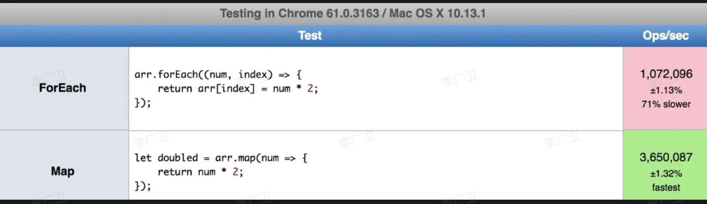

### 49.2. 是否修改原数组

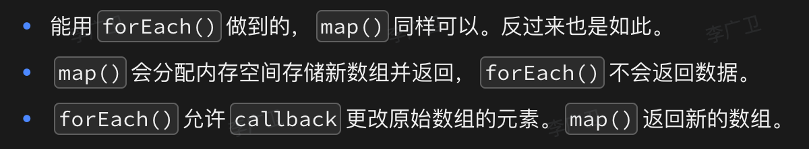

## 50. 阿拉伯计数转成中文：101 → 一百零一

思路：直接数组对应先匹配出来，再处理特殊情况

```javascript hl:1,14
const numberMap = {
  0: "零",
  1: "一",
  2: "二",
  3: "三",
  4: "四",
  5: "五",
  6: "六",
  7: "七",
  8: "八",
  9: "九",
};

const unitMap = {
  0: "", // 个位
  1: "十", // 十位
  2: "百", // 百位
  3: "千", // 千位
  4: "万", // 万位
  5: "十", // 十万位
  6: "百", // 百万位
  7: "千", // 千万位
  8: "亿", // 亿位
};

function numberToChinese(num) {
  // 转换为字符串
  const numStr = num.toString();
  // 结果数组
  const result = [];
  // 数字长度
  const length = numStr.length;

  // 处理零的特殊情况
  if (num === 0) return numberMap[0];

  for (let i = 0; i < length; i++) {
    const digit = parseInt(numStr[i]);
    const position = length - 1 - i; // 位置（从右往左）
    // 跳过零的处理
    if (digit === 0) {
      // 当前数字是0，且不是最后一位，且后面的数字不是0
      if (i < length - 1 && numStr[i + 1] !== "0") {
        result.push(numberMap[digit]);
      }
      continue;
    }
    // 处理十位数的特殊情况（如：一十 => 十）
    if (position === 1 && digit === 1 && i === 0) {
      result.push(unitMap[position]);
    } else {
      result.push(numberMap[digit]);
      result.push(unitMap[position]);
    }
  }
  return result.join("");
}

// 测试
console.log(numberToChinese(0)); // 零
console.log(numberToChinese(10)); // 十
console.log(numberToChinese(11)); // 十一
console.log(numberToChinese(111)); // 一百一十一
console.log(numberToChinese(1001)); // 一千零一
console.log(numberToChinese(10001)); // 一万零一
console.log(numberToChinese(10101)); // 一万零一百零一
console.log(numberToChinese(100000)); // 十万
console.log(numberToChinese(1000001)); // 一百万零一

```

## 51. 将类数组对象转成真正数组的 4 种方法

- 最后一种 ④ 挺有意思，使用 `...扩展` ，在函数里作为参数传入，然后再 return 
	- 所以**扩展符，就是可以转数组**

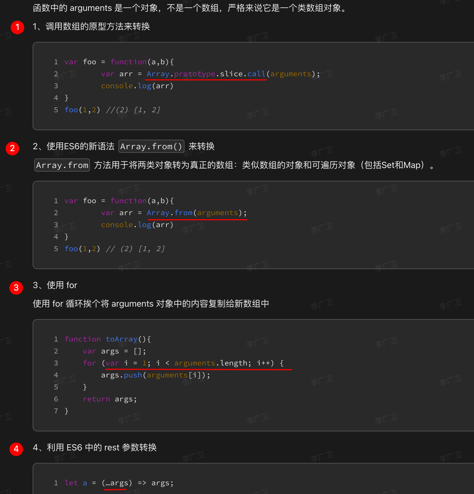

## 52. 虚拟 DOM 渲染到页面时，框架会做那些处理？

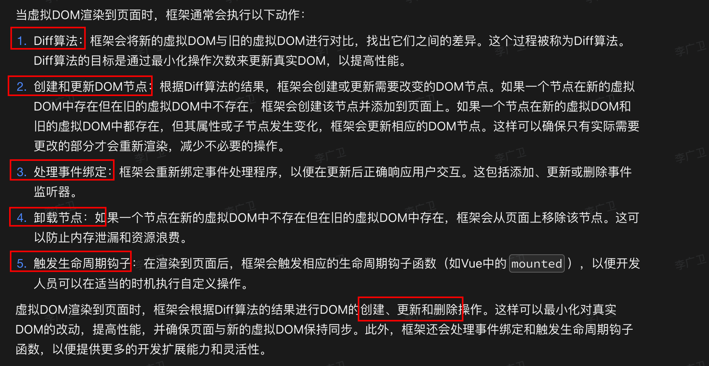

## 53. `reduce` 方法及其常见的使用场景

### 53.1. reduce 方法基本语法

```javascript
array.reduce(callback(accumulator, currentValue[, index[, array]])[, initialValue])
```

- `callback`: 执行数组中每个值的函数，包含四个参数：
	- `accumulator`: 累加器，**累加回调的返回值**
	- `currentValue`: 数组中**正在处理的元素**
	- `index`（可选）: 数组中正在处理的当前元素的**索引**
	- `array`（可选）: 调用 `reduce()` 的数组
- `initialValue`（可选）: 作为第一次调用 `callback` 函数时的第一个参数的值
	- ==注意：如果不传时，调用空数组会报错==

### 53.2. 使用场景

#### 53.2.1. 数组求和

```javascript
const numbers = [1, 2, 3, 4, 5];
const sum = numbers.reduce((acc, cur) => acc + cur, 0);
console.log(sum); // 输出: 15
```

#### 53.2.2. 数组中最大值

```javascript
const numbers = [5, 2, 8, 1, 9];
const max = numbers.reduce((acc, cur) => Math.max(acc, cur));
console.log(max); // 输出: 9
```

#### 53.2.3. 数组扁平化

```javascript
const nestedArray = [1, 2], [3, 4], [5, 6](/post/pzcDahon.html#1,-2],-[3,-4],-[5,-6);
const flatArray = nestedArray.reduce((acc, cur) => acc.concat(cur), []);
console.log(flatArray); // 输出: [1, 2, 3, 4, 5, 6]
```

#### 53.2.4. 计算数组中元素出现的次数

```javascript
const fruits = ['apple', 'banana', 'apple', 'orange', 'banana', 'apple'];
const count = fruits.reduce((acc, cur) => {
    acc[cur] = (acc[cur] || 0) + 1;
    return acc;
}, {});
console.log(count); // 输出: { apple: 3, banana: 2, orange: 1 }
```

#### 53.2.5. 按条件分组

```javascript
const people = [
    { name: 'Alice', age: 25 },
    { name: 'Bob', age: 30 },
    { name: 'Charlie', age: 25 },
    { name: 'David', age: 30 }
];

const groupedByAge = people.reduce((acc, person) => {
    (acc[person.age] = acc[person.age] || []).push(person);
    return acc;
}, {});

console.log(groupedByAge);
// 输出: { 
//   25: [{ name: 'Alice', age: 25 }, { name: 'Charlie', age: 25 }],
//   30: [{ name: 'Bob', age: 30 }, { name: 'David', age: 30 }]
// }
```

#### 53.2.6. 串联 Promise

```javascript
const asyncTasks = [
    () => new Promise(resolve => setTimeout(() => resolve('Task 1'), 1000)),
    () => new Promise(resolve => setTimeout(() => resolve('Task 2'), 500)),
    () => new Promise(resolve => setTimeout(() => resolve('Task 3'), 800))
];

asyncTasks.reduce((acc, task) => 
    acc.then(results => 
        task().then(result => [...results, result])
    ), 
    Promise.resolve([])
).then(console.log);
// 输出: ['Task 1', 'Task 2', 'Task 3']
```

#### 53.2.7. 实现 pipe 或 compose 函数

```javascript
const pipe = (...fns) => (x) => fns.reduce((v, f) => f(v), x);

const addOne = (x) => x + 1;
const double = (x) => x * 2;
const square = (x) => x * x;

const compute = pipe(addOne, double, square);
console.log(compute(3)); // 输出: 64 ((3 + 1) * 2)^2
```

#### 53.2.8. 提取对象中的特定字段

```javascript
const users = [
    { id: 1, name: 'Alice', age: 25 },
    { id: 2, name: 'Bob', age: 30 },
    { id: 3, name: 'Charlie', age: 35 }
];

const names = users.reduce((acc, user) => [...acc, user.name], []);
console.log(names); // 输出: ['Alice', 'Bob', 'Charlie']
```

## 54. 绑定 this 指向的的方法都有哪些？

- bind
- 箭头函数：指向定义时的上下文
- apply/call

## 55. addEventListenser 的三个参数

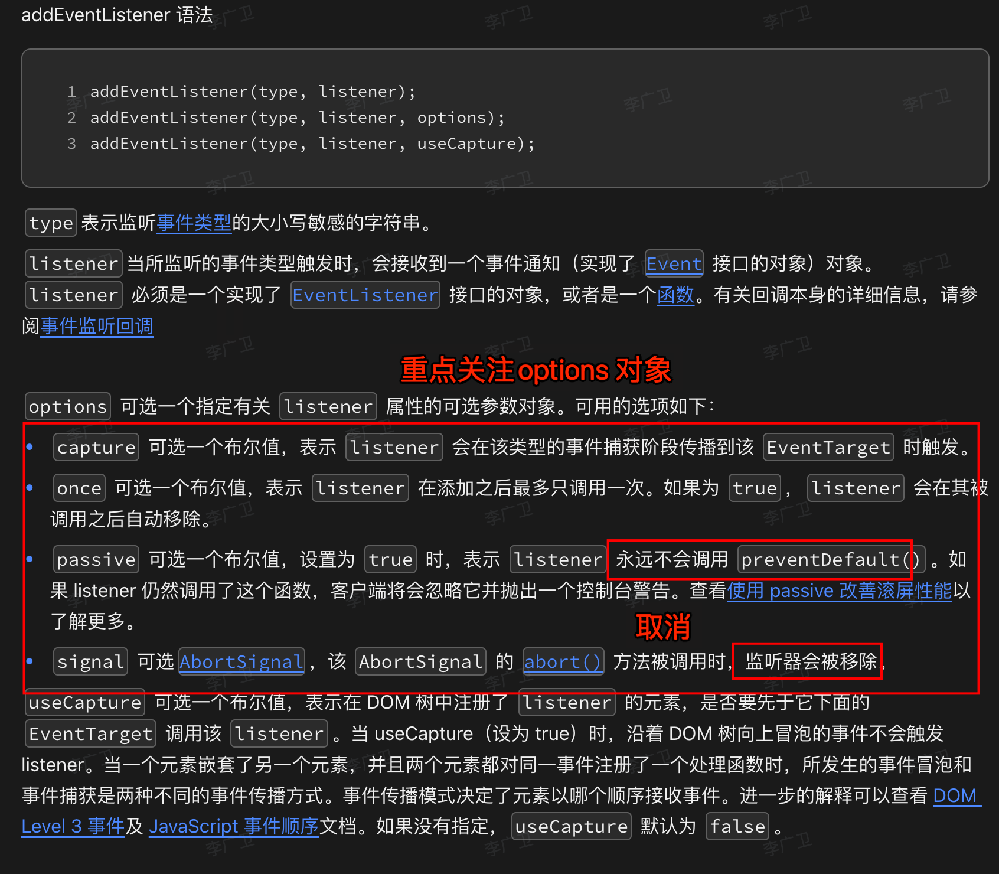
