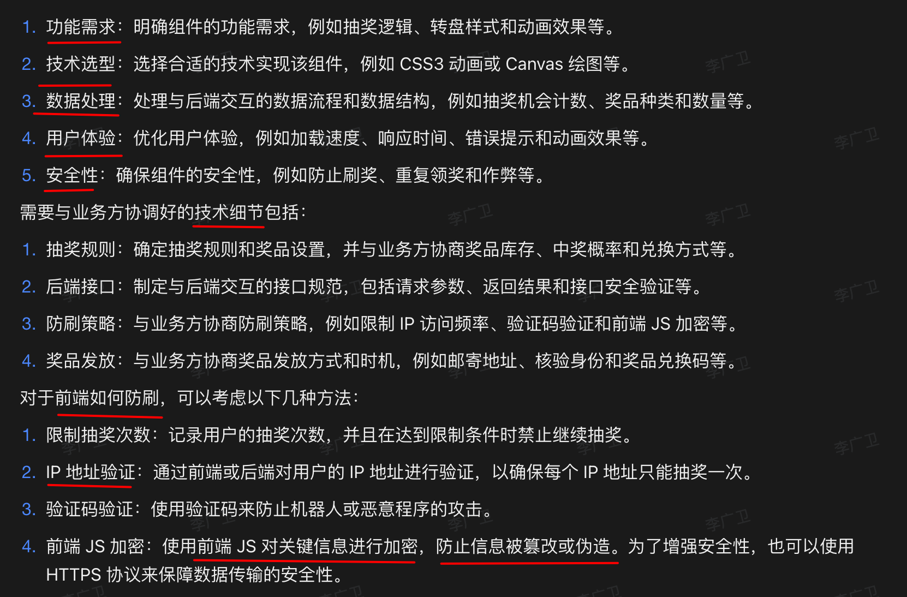

# 如何设计一个转盘组件，需要考虑哪些方面？


## 目录
<!-- toc -->
 ## 1. 业务需求细节 

首先，当然需要和各方对其业务需求细节

## 2. 技术实现考虑

### 2.1. 渲染方式选择

#### 2.1.1. **Canvas 方案**

```typescript
class WheelCanvas {
    private canvas: HTMLCanvasElement;
    private ctx: CanvasRenderingContext2D;
    
    constructor(config: WheelConfig) {
        this.canvas = document.createElement('canvas');
        this.ctx = this.canvas.getContext('2d')!;
        this.initCanvas(config);
    }
    
    private drawSector(startAngle: number, endAngle: number, color: string) {
        this.ctx.beginPath();
        this.ctx.moveTo(this.centerX, this.centerY);
        this.ctx.arc(this.centerX, this.centerY, this.radius, startAngle, endAngle);
        this.ctx.fillStyle = color;
        this.ctx.fill();
    }
    
    private drawPrizes() {
        // 绘制奖品文字和图片
    }
}
```

#### 2.1.2. **CSS Transform 方案**

```typescript
class WheelCSS {
    private container: HTMLElement;
    
    constructor(config: WheelConfig) {
        this.container = document.createElement('div');
        this.initWheel(config);
    }
    
    private rotate(degree: number) {
        this.container.style.transform = `rotate(${degree}deg)`;
    }
}
```

### 2.2. 动画实现

```typescript
class WheelAnimation {
    private currentRotation: number = 0;
    private isSpinning: boolean = false;
    
    spin(targetDegree: number) {
        if (this.isSpinning) return;
        
        this.isSpinning = true;
        const startTime = performance.now();
        const duration = 5000; // 5秒
        
        const animate = (currentTime: number) => {
            const elapsed = currentTime - startTime;
            const progress = Math.min(elapsed / duration, 1);
            
            // 使用缓动函数
            const easeProgress = this.easeInOutQuad(progress);
            const currentDegree = this.currentRotation + (targetDegree * easeProgress);
            
            this.rotate(currentDegree);
            
            if (progress < 1) {
                requestAnimationFrame(animate);
            } else {
                this.isSpinning = false;
                this.currentRotation = targetDegree % 360;
            }
        };
        
        requestAnimationFrame(animate);
    }
    
    private easeInOutQuad(t: number): number {
        return t < 0.5 ? 2 * t * t : -1 + (4 - 2 * t) * t;
    }
}
```

## 3. 交互体验优化&性能

- 性能保证
- 弱网环境
- loading 
- 设备兼容性
- 如果 在 APP 中需要原生 APP 能力的一些支持
- 添加音效
- 动画性能保证
- 主题设置等
- 单元测试
- 容错及异常情况能力

## 4. API 设计

```typescript
class LuckyWheel {
    constructor(config: WheelConfig) {
        this.init(config);
    }
    
    // 公共方法
    public spin(targetIndex?: number): Promise<Prize> {
        return new Promise((resolve, reject) => {
            // 实现转盘旋转逻辑
        });
    }
    
    public stop() {
        // 停止转盘
    }
    
    public updatePrizes(prizes: Prize[]) {
        // 更新奖品配置
    }
    
    // 事件监听
    public on(event: WheelEvent, callback: Function) {
        // 添加事件监听
    }
}

// 使用示例
const wheel = new LuckyWheel({
    prizes: [...],
    size: 400,
    duration: 5000,
    rotations: 6,
    easing: 'easeInOutQuad'
});

wheel.on('spinStart', () => console.log('开始旋转'));
wheel.on('spinEnd', (prize) => console.log('停止旋转，中奖：', prize));

wheel.spin().then(prize => {
    console.log('恭喜获得：', prize.name);
});
```

## 5. 后端交互设计

### 5.1. API 设计

```typescript
interface SpinResult {
    prizeId: string;
    angle: number;
    message: string;
}

class WheelBackendInteraction {
    private apiUrl: string;

    constructor(apiUrl: string) {
        this.apiUrl = apiUrl;
    }

    async requestSpin(): Promise<SpinResult> {
        try {
            const response = await fetch(`${this.apiUrl}/spin`, {
                method: 'POST',
                headers: {
                    'Content-Type': 'application/json',
                    'Authorization': `Bearer ${this.getToken()}`
                },
                body: JSON.stringify({
                    userId: this.getUserId(),
                    timestamp: Date.now()
                })
            });

            if (!response.ok) {
                throw new Error('Spin request failed');
            }

            return await response.json();
        } catch (error) {
            console.error('Spin request error:', error);
            throw error;
        }
    }

    private getToken(): string {
        // 获取用户认证token
        return localStorage.getItem('authToken') || '';
    }

    private getUserId(): string {
        // 获取用户ID
        return localStorage.getItem('userId') || '';
    }
}
```

### 5.2. 结果验证

```typescript
class ResultVerification {
    verifyResult(clientResult: SpinResult, serverResult: SpinResult): boolean {
        return clientResult.prizeId === serverResult.prizeId &&
               Math.abs(clientResult.angle - serverResult.angle) < 1; // 允许小误差
    }
}
```

## 6. 安全措施

- 请求签名
- 检查用户权限和资格
- 请求限流
- 防刷和作弊预防
	- 前端防刷
	- 设备指纹
	- 数据加密
- 错误处理和日志
- 实施 IP 封禁或账户冻结机制
- 中奖算法
- 实施实时监控系统，对异常行为进行快速响应。

## 7. 其他


