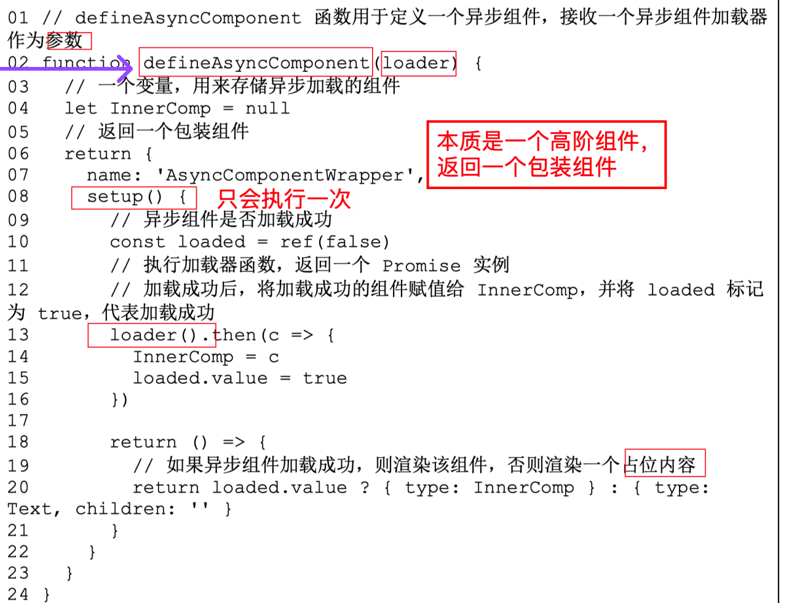
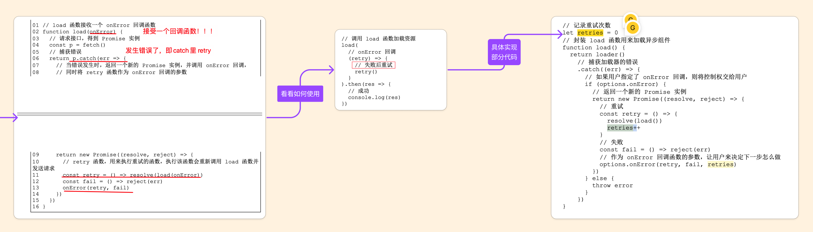

# 异步组件和函数式组件的实现原理

`#vue` 


## 目录
<!-- toc -->
 ## 1. 总结 

- 使用 `defineAsyncComponent` 定义异步组件
	- loader → import 
	- loadingComponent
	- errorComponent
	- onError
		- retry
	- 等等
- 异步组件使用场景
	- 页面性能、代码分割、服务端下发组件等场景
- 异步组件默认是"挂起的"，需要配合 `Suspense 组件`使用才能显示加载状态
- 在服务器端渲染（SSR）中使用时需要特别注意，确保组件能够正确地在服务器端渲染
- 异步组件最好用于`较大的组件`或不是`立即需要的组件`
- Vue 3.5 新特性 - ==水合控制时机==
	- 当指定的==媒体查询==匹配时进行激活
	- ==交互时==激活
	- 仅在==元素可见时==开始加载，且在元素进入视口100px之前开始加载
- 配合 `is` 使用：
	- `<component is = "AsyncCmpt">` 
- 一个函数式组件
	- **本质上**就是一个==普通函数==，该函数的**返回值**是`虚拟 DOM` 
	- 函数式组件**没有自身状态** ，需要通过 `props` 的方式传入
- Loading 组件组件 与 delay 选项
	- 说说==避免闪烁的原理==？ →  之前理解有误

## 2. 异步组件的概念

即，以异步的方式加载并渲染一个组件。 这在`页面性能` 、 `代码分割`、`服务端下发组件`等场景中尤为重要

## 3. 先看定义和使用指南

### 3.1. 定义 defineAsyncComponent 

```ts
function defineAsyncComponent(
  source: AsyncComponentLoader | AsyncComponentOptions
): Component

type AsyncComponentLoader = () => Promise<Component>

interface AsyncComponentOptions {
  loader: AsyncComponentLoader
  loadingComponent?: Component
  errorComponent?: Component
  delay?: number
  timeout?: number
  suspensible?: boolean
  onError?: (
    error: Error,
    retry: () => void,
    fail: () => void,
    attempts: number
  ) => any
}

import { defineAsyncComponent } from 'vue'

const AsyncComp = defineAsyncComponent(() => {
  return new Promise((resolve, reject) => {
    // ...从服务器获取组件
    resolve(/* 获取到的组件 */)
  })
  // or
  return import('./components/MyComponent.vue')
})
// ... 像使用其他一般组件一样使用 `AsyncComp`
```

### 3.2. 使用示例

#### 3.2.1. 最基础的用法

```js
import { defineAsyncComponent } from 'vue'

// 异步加载组件
const AsyncComponent = defineAsyncComponent(() =>
  import('./components/MyComponent.vue')
)

// 在组件中使用
export default {
  components: {
    AsyncComponent
  }
}
```

#### 3.2.2. 带加载和错误状态的完整配置

```js
const AsyncComponent = defineAsyncComponent({
  // 加载函数
  loader: () => import('./components/MyComponent.vue'),
  
  // 加载时显示的组件
  loadingComponent: LoadingSpinner,
  
  // 展示加载组件前的延迟时间，默认为 200ms
  delay: 200,
  
  // 错误时显示的组件
  errorComponent: ErrorComponent,
  
  // 如果提供了 timeout，并且加载时间超过了设定值，将显示错误组件
  timeout: 3000,
  
  // 加载失败时的回调
  onError(error, retry, fail, attempts) {
    if (attempts <= 3) {
      // 重试
      retry()
    } else {
      // 失败
      fail()
    }
  }
})
```

#### 3.2.3. 在 setup 函数中使用

```js
import { defineAsyncComponent } from 'vue'

export default {
  setup() {
    const DynamicComponent = defineAsyncComponent(() =>
      import(`./components/${someCondition ? 'A' : 'B'}.vue`)
    )

    return {
      DynamicComponent
    }
  }
}
```

#### 3.2.4. 结合 Suspense 使用

```vue
<template>
  <Suspense>
    <template `#default>`
      <AsyncComponent />
    </template>
    <template `#fallback>`
      <div>Loading...</div>
    </template>
  </Suspense>
</template>

<script>
import { defineAsyncComponent } from 'vue'

export default {
  components: {
    AsyncComponent: defineAsyncComponent(() =>
      import('./components/HeavyComponent.vue')
    )
  }
}
</script>
```

#### 3.2.5. 处理动态路径的组件

```js
const AsyncComponent = defineAsyncComponent({
  loader: () => {
    const componentName = computed(() => store.state.currentComponent)
    return import(`./components/${componentName.value}.vue`)
  },
  loadingComponent: LoadingComponent,
  errorComponent: ErrorComponent
})
```

#### 3.2.6. 带有缓存的异步组件

```js
const cache = new Map()

const AsyncComponent = defineAsyncComponent({
  loader: async () => {
    const componentPath = './components/MyComponent.vue'
    
    if (!cache.has(componentPath)) {
      const component = await import(componentPath)
      cache.set(componentPath, component)
    }
    
    return cache.get(componentPath)
  }
})
```

#### 3.2.7. 配合路由

```javascript
// 路由中使用
import { createRouter } from 'vue-router'

const router = createRouter({
  routes: [
    {
      path: '/dashboard',
      component: defineAsyncComponent(() => 
        import('./views/Dashboard.vue')
      )
    }
  ]
})
```

### 3.3. Vue 3.5 新特性 - 水合控制

在 Vue 3.5+ 中，异步组件可以通过提供`激活策略`来控制何时进行激活

```javascript hl:13,15,17
import {
    defineAsyncComponent,
    hydrateOnIdle,
    hydrateOnVisible,
    hydrateOnInteraction,
    hydrateOnMediaQuery,
} from "vue";

const AsyncComp = defineAsyncComponent({
    loader: () => import("./Comp.vue"),
    hydrate: hydrateOnIdle(/* 传递可选的最大超时 */),
    hydrate: hydrateOnVisible(), // 仅在元素可见时开始加载
    // 仅在元素可见时开始加载，且在元素进入视口100px之前开始加载
    hydrate: hydrateOnVisible({ rootMargin: "100px" }),
    //当指定的媒体查询匹配时进行激活。
    hydrate: hydrateOnMediaQuery("(max-width:500px)"),
    // 交互时激活
    hydrate: hydrateOnInteraction("click"),
});
```

### 3.4. 需要注意的是

- `defineAsyncComponent` 返回的是一个**高阶组件**，它仅在需要时才会加载实际的组件
- 异步组件默认是"挂起的"，需要配合 `Suspense 组件`使用才能显示加载状态
- 在服务器端渲染（SSR）中使用时需要特别注意，确保组件能够正确地在服务器端渲染
- 异步组件最好用于`较大的组件`或不是`立即需要的组件`

## 4. 异步组件的简易实现

同步渲染，如下面的代码就是同步渲染的


最简单的`异步组`件加载渲染实现：使用 `import()` 


### 4.1. 只异步渲染页面的某一部分


> 关于 `is`，是`vue`内置的特殊 **Attributes** （其他的如 `key` 和 `ref`）, 用于**绑定动态组件**。 更多参考 [https://cn.vuejs.org/api/built-in-special-attributes.html#is](https://cn.vuejs.org/api/built-in-special-attributes.html#is)

> 关于 `is`参考 [4. Vue3 中 is 属性的使用方法和应用场景](/post/IHZZXlen.html)
> 关于 `import` 参考，[32. vite 之 import 关键词](/post/agzrl0fB.html)

### 4.2. 待完善的点

- 如果组件加载失败或加载超时，是否要渲染 ==Error 组件==？
- 组件在加载时，是否要展示==占位==的内容？例如渲染一个 `Loading` 组件。
- 组件加载的速度可能很快，也可能很慢，是否要设置一个延迟展示 Loading 组件的时间？
	- ==如果组件在 200ms 内没有加载成功才展示 Loading 组件==，这样可以避免由组件加载过快所导致的`闪烁`。 
- 组件加载失败后，是否需要==重试==？

> [!abstract]
从根本上来说，异步组件的实现可以完全在**用户层面**实现，而无须框架支持。但一个完善的异步组件仍需要考虑诸多问题

## 5. 异步组件的实现原理

异步组件**本质上**是通过封装手段来实现友好的用户接口，从而降低**用户层面**的使用复杂度

### 5.1. 封装 defineAsyncComponent 函数

`defineAsyncComponent` 的`本质`是一个高阶组件，返回一个`包装组件`



### 5.2. 一个 Loading 的场景的优化

> [!question]
如果加载需要 `201ms` , `delay = 200` , 那么 loading 组件就展示 `1ms` ？

这个解决方案的核心思路是：
1. 设置 `delay`（`延迟显示时间`）：在短时间加载完成的情况下，完全不显示 loading
2. 设置 `minDuration`（最小显示时间）：**一旦显示了 loading，确保它至少显示一定时间**

这样可以避免两种情况：
- 对于特别快的加载（< delay），完全不显示 loading 
- 对于接近 delay 的加载，确保 loading 显示足够长的时间，避免闪烁
在上面的例子中：
- 如果加载时间 < 200ms，完全不会显示 loading
- 如果加载时间 > 200ms，loading 会显示至少 300ms

上面提的问题，还是会导致`闪烁` ，所以应该再加一个参数，标识至少展示 `loading` 多久 ，所以参数应该如下：


>  具体代码参考： [https://github.com/yued-fe/fetch-with-loading/blob/main/fetch-with-loading.js](https://github.com/yued-fe/fetch-with-loading/blob/main/fetch-with-loading.js)

#### 5.2.1. 其他思路

- 考虑使用骨架屏（Skeleton）代替传统的 loading
- 使用 CSS 过渡动画

### 5.3. 重试机制



#### 5.3.1. 延伸

如何重现发起请求，并控制次数

```javascript hl:7
Promise.retry = function (fn, times = 3) {
    return new Promise(async (resolve, reject) => {
        while (times--) {
            try {
                let ret = await fn();
                resolve(ret);
                // 如果成功了，就直接break了
                break;
            } catch (error) {
                if (!times) reject(error);
            }
        }
    });
};
```

> [!tip]
 `while` 里直接使用 `break` 跳出循环，平时使用相对少

## 6. 函数式组件 与 有状态的组件

一个函数式组件**本质上**就是一个普通函数，该函数的**返回值**是`虚拟 DOM` ， 
- 函数式组件**没有自身状态** ，需要通过 `props` 的方式传入。

下面是一个 函数式组件的示例：

```javascript
function MyFuncComp(props) {
    return {type: 'h1', children: props.title}
}

MyFuncComp.props = {
    title: 'default title'
}
```

函数式组件**无需初始化**`data`**以及生命周期钩子**。
- 从这一点可以看出，函数式组件的初始化性能消耗**小于有状态组件**
- 但其实在 Vue.js 3 中，即使是**有状态组件**，其**初始化性能消耗也非常小**，

下面是一个具体的代码实现：


## 7. 总结

- 异步组件在页面性能、拆包以及服务端下发组件等场景中尤为重要。
- 从根本上来说，异步组件的实现可以完全在`用户层面`实现，而`无须框架支持`。
- 但一个完善的异步组件仍需要考虑诸多问题，例如: 
	- 允许用户指定加载出错时要渲染的组件;  
	- 允许用户指定 Loading 组件，以及展示该组件的`延迟`时间; 
		- ==注意：这是延迟展示 Loading 的时间==
	- 允许用户设置加载组件的`超时`时长
	- 组件加载失败时，为用户提供重试的能力。
	- 因此，框架有必要内建异步组件的实现。
- Vue.js 3 提供了 `defineAsyncComponent` 函数，用来定义`异步组件`
	- 异步组件的加载超时问题，以及当加载错误发生时，如何指定 Error 组件
	- 通过为 `defineAsyncComponent` 函数指定选项参数，允许用户通过 timeout 选项设置超时时长。
	- 当加载超时后，会触发加载错误，这时会渲染用户通过 errorComponent 选 项指定的 Error 组件。
- Loading 组件组件 与 delay 选项
	- 为了避免 Loading 组件导致的闪烁问题，我们还需要设计一个接口，让用户能指定==延迟展示 Loading 组件==的时间，即 delay 选项。
- 组件加载发生错误后的重试机制
- 我们讨论了==函数式组件==。它本质上是一个函数，其内部实现逻辑可以复用有状态组件的实现逻辑。
	- 为了给函数式组件**定义 props**，我们允许开发者在函数式组件的主函数上添加**静态的 props 属性**。
	- 出于更加严谨的考虑，函数式组件没有自身状态，也没有生命周期的概念。
	- 所以，在初始化函数式组件时，需要选择性地复用有状态组件的**初始化逻辑**。

## 8. 参考

《vue.js 设计与实现》
