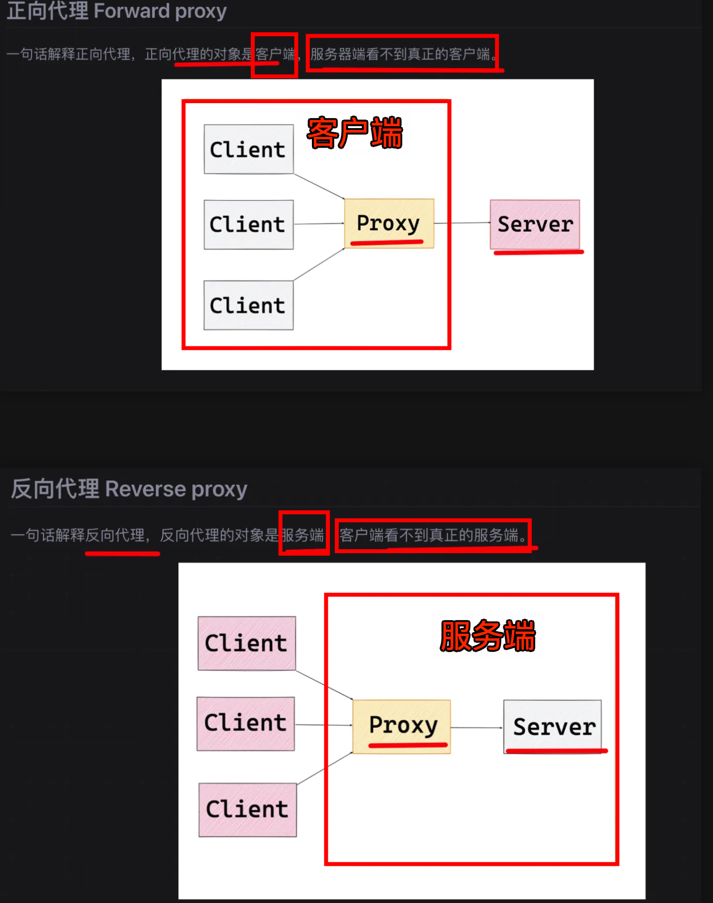
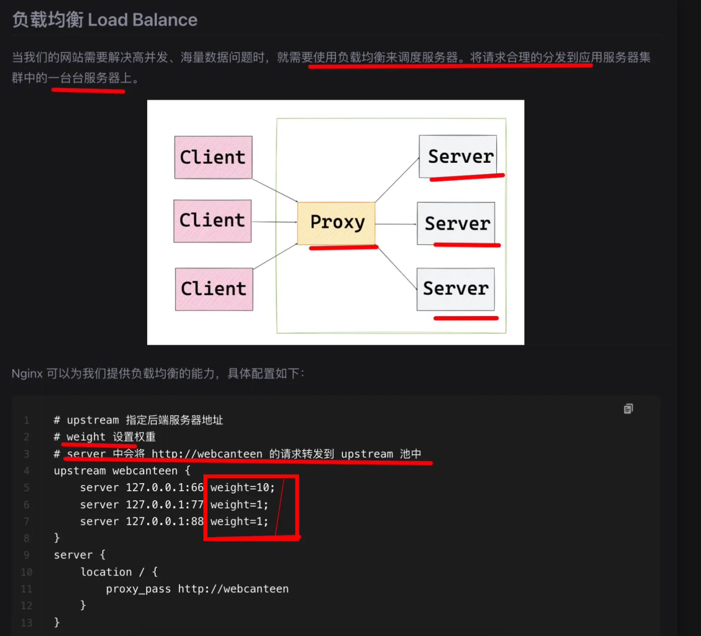

# Nginx 介绍

`#nodejs` 

## 目录
<!-- toc -->
 ## 1. 正向代理与反向代理 

- 总结：
	- 正向代理：
		- 服务器看不到真正的客户端
	- 反向代理：
		- 客户端看不到真正的服务器

详细如下图：

## 2. 一些基本设置

- 针对特定路径，特定文件后缀，开启 `gzip on`
- 请求限制：对 `同一 ip` 的连接数 和 并发数进行限制
	- imit_conn_module `连接频率`限制
	- limit_req_module `请求频率`限制
- 针对特定路径，特定文件后缀，检查 referer 来源，开启**防盗链**

## 3. 负载均衡

