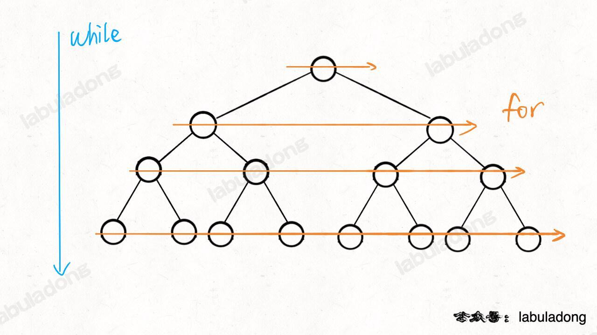

# BFS 算法框架

`#BFS` 


## 目录
<!-- toc -->
 ## BFS 算法框架 

BFS 的核心思想：
- 就是把一些问题抽象成`图`，从一个点开始，向四周开始扩散
- 一般来说，我们写 BFS 算法都是用「`队列`」这种数据结构，每次将一个节点周围的所有节点加入队列
 - BFS 算法的==本质==就是==二叉树的层序遍历==

BFS 相对 DFS 的最主要的区别是：
- BFS 找到的路径一定是**最短的**，但代价就是==空间复杂度==可能比 DFS 大很多


```javascript hl:12,14,20
var BFS = function (start, target) {
  // 核心数据结构
  var q = [];
  // 避免走回头路
  var visited = new Set();
  var step = 0;

  // 将起点加入队列
  q.push(start);
  visited.add(start);

  while (q.length > 0) {
    var sz = q.length;
    // 将当前队列中的所有节点向四周扩散
    for (var i = 0; i < sz; i++) {
      var cur = q.shift();
      // 划重点：这里判断是否到达终点
      if (cur == target) return step;
      // 将 cur 的相邻节点加入队列
      var adj = cur.adj();
      for (var j = 0; j < adj.length; j++) {
        var x = adj[j];
        if (!visited.has(x)) {
          q.push(x);
          visited.add(x);
        }
      }
    }
    step++;
  }
  // 如果走到这里，说明在图中没有找到目标节点
};

```

## 示例一：二叉树最小深度

> 力扣第 111 题「[二叉树的最小深度](https://leetcode.cn/problems/minimum-depth-of-binary-tree)」



```javascript
var minDepth = function (root) {
  if (root == null) return 0;
  let queue = [];
  queue.push(root);
  // root 本身就是一层，depth 初始化为 1
  let depth = 1;

  while (queue.length != 0) {
    let size = queue.length;
    // 将当前队列中的所有节点向四周扩散
    for (let i = 0; i < size; i++) {
      let cur = queue.shift();
      // 判断是否到达终点
      if (cur.left == null && cur.right == null) return depth;
      // 将 cur 的相邻节点加入队列
      if (cur.left != null) queue.push(cur.left);
      if (cur.right != null) queue.push(cur.right);
    }
    // 这里增加步数
    depth++;
  }
  return depth;
};
```

## 示例二：解开密码最少次数

- [752. 打开转盘锁](/post/UivWHKD7.html)


